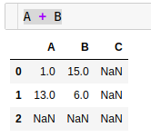
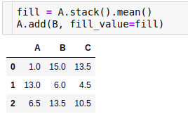
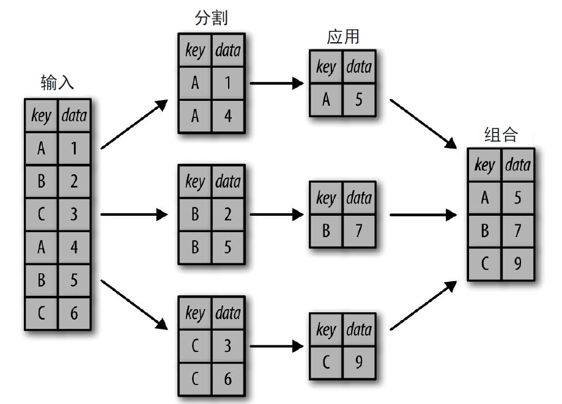
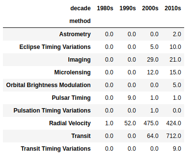
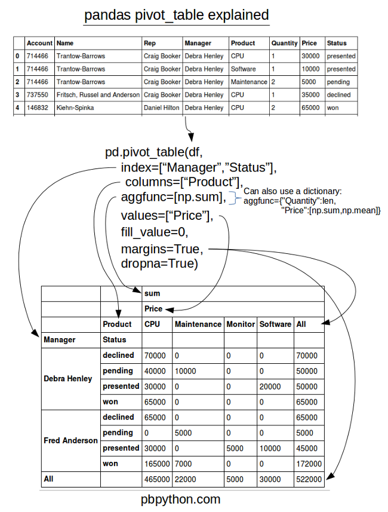

# pandas总结

[toc]

## pandas三种基本的数据结构
NumPy 的ndarray 数据结构为数值计算任务中常见的干净整 齐、组织良好的数据提供了许多不可或缺的功能。虽然它在这方面做得很好，但是当我们 需要处理更灵活的数据任务（如为数据添加标签、处理缺失值等），或者需要做一些不是 对每个元素都进行广播映射的计算（如分组、透视表等）时，NumPy 的限制就非常明显 了，而这些都是分析各种非结构化数据时很重要的一部分。建立在NumPy 数组结构上的 Pandas，尤其是它的Series 和DataFrame 对象，为数据科学家们处理那些消耗大量时间的 “数据清理”（data munging）任务提供了捷径。

如果从底层视角观察Pandas 对象，可以把它们看成增强版的NumPy 结构化数组，行列都 不再只是简单的整数索引，还可以带上标签。

先来看看Pandas 的三个基本数据结构：Series、DataFrame 和Index。

### Series
Series 对象将一组数据和一组索引绑定在一起，我们可以通过 values 属性和index 属性获取数据。
**values 属性返回的结果与就是 NumPy 数组**。
index 属性返回的结果是一个类型为pd.Index 的类数组对象

Serise是通用的NumPy数组: Pandas 的 Series 对象用一种显式定义的索引与数值关联。
把Pandas 的Series 对象看成一种特殊的Python 字典。

创建Series对象:
```py
pd.Series(data, index=index)

# data 可以是列表或NumPy 数组，这时index 默认值为整数序列：
pd.Series([2, 4, 6])

# data 也可以是一个标量，创建Series 对象时会重复填充到每个索引上：
pd.Series(5, index=[100, 200, 300])

# data 还可以是一个字典，index 默认是排序的字典键
pd.Series({2: 'a', 1: 'b', 3: 'c'})

# 每一种形式都可以通过显式指定索引筛选需要的结果：
pd.Series({2: 'a', 1: 'b', 3: 'c'}, index=[3, 2])
```
**这里需要注意的是，Series 对象只会保留显式定义的键值对。**


另一种看待series的方法，它是一个长度固定，有顺序的dict，从index映射到value。在很多场景下，可以当做dict来用：
```py
obj2 = pd.Series([4, 7, -5, 3], index=['d', 'b', 'a', 'c'])
'b' in obj2
1 in obj2  # 隐式索引不行
```

serice自身和它的index都有一个叫name的属性，这个能和其他pandas的函数进行整合：
```py
obj4.name = 'population'
obj4.index.name = 'state'
```

series的index能被直接更改(长度必须一致，不然会报错)：
```py
obj4.index = ['d', 'b', 'a', 'c']
```

### DataFrame

DataFrame是通用的NumPy数组。如果将Series 类比为带灵活索引的一维数组，那么DataFrame 就可以看作是一种既有灵活 的行索引，又有灵活列名的二维数组。就像你可以把二维数组看成是有序排列的一维数组 一样，你也可以把DataFrame 看成是有序排列的若干Series 对象。这里的“排列”指的是 它们拥有共同的索引。

DataFrame是特殊的字典。与Series 类似，我们也可以把DataFrame 看成一种特殊的字典。字典是一个键映射一个值，而**DataFrame 是一列映射一个Series 的数据**。

和Series 对象一样，DataFrame 也有一个index 属性可以获取索引标签。另外，DataFrame 还有一个columns 属性，是存放列标签的Index 对象

创建DataFrame对象:
```py
# 通过单个Series 对象创建。DataFrame 是一组Series 对象的集合，可以用单个Series 创建一个单列的DataFrame：
pd.DataFrame(population, columns=['population'])

#  通过字典列表创建。任何元素是字典的列表都可以变成DataFrame。用一个简单的列表 综合来创建一些数据：
data = [{'a': i, 'b': 2 * i} for i in range(3)]
pd.DataFrame(data)

# 即使字典中有些键不存在，Pandas 也会用缺失值NaN（不是数字，not a number）来表示：
pd.DataFrame([{'a': 1, 'b': 2}, {'b': 3, 'c': 4}])

# 通过Series 对象字典创建。就像之前见过的那样，DataFrame 也可以用一个由Series 对象构成的字典创建：
pd.DataFrame({'population': population, 'area': area})

# 通过NumPy 二维数组创建。假如有一个二维数组，就可以创建一个可以指定行列索引 值的DataFrame。如果不指定行列索引值，那么行列默认都是整数索引值：
pd.DataFrame(np.random.rand(3, 2),
             columns=['foo', 'bar'],
             index=['a', 'b', 'c'])
```

如果列不存在，赋值会创建一个新列。而del也能像删除字典关键字一样，删除列：
```py
# 创建新列
frame2['eastern'] = frame2.state == 'Ohio'

# 删除一列
del frame2['eastern']
```

**values属性会返回numpy二维数组，如果column有不同的类型，dtype会适应所有的列(dtype=object)。**

### Index
我们已经发现，Series 和DataFrame 对象都使用便于引用和调整的显式索引。Pandas 的 Index 对象是一个很有趣的数据结构，可以将它看作是一个**不可变**数组或有序集合（实际 上是一个多集，因为Index 对象可能会包含重复值）。这两种观点使得Index 对象能呈现一 些有趣的功能。

Index 对象与NumPy 数组之间的不同在于，Index 对象的索引是不可变的，也就是说不能 通过通常的方式进行调整：
```py
ind[1] = 0   #会报错
```

Index 对象的不可变特征使得多个DataFrame 和数组之间进行索引共享时更加安全，尤其是 可以避免因修改索引时粗心大意而导致的副作用。

Pandas 对象被设计用于实现许多操作，如连接（join）数据集，其中会涉及许多集合操作（当然pandas的index允许重复）。 Index 对象遵循Python 标准库的集合（set）数据结构的许多习惯用法，包括并集、交集、 差集等：
```py
indA = pd.Index([1, 3, 5, 7, 9])
indB = pd.Index([2, 3, 5, 7, 11])

indA & indB # 交集
# Int64Index([3, 5, 7], dtype='int64')

indA | indB # 并集
# Int64Index([1, 2, 3, 5, 7, 9, 11], dtype='int64')

indA ^ indB # 异或
# Int64Index([1, 2, 9, 11], dtype='int64')
```
这些操作还可以通过调用对象方法来实现，例如indA.intersection(indB)。

## Series和DataFrame的索引使用

### Series数据选择方法
#### 将Series看作字典
将Series看作字典
```py
# 选择值
data['b']

# 我们还可以用Python 字典的表达式和方法来检测键/ 索引和值：
'a' in data

# 返回true
data.index is data.keys()

# 返回元祖的可迭代对象
list(data.items())
# [('a', 0.25), ('b', 0.5), ('c', 0.75), ('d', 1.0)]
```

Series 对象还可以用字典语法调整数据。就像你可以通过增加新的键扩展字典一样，你也 可以通过增加新的索引值扩展Series：
```py
data['e'] = 1.25
data.index
# Index(['a', 'b', 'c', 'd', 'e'], dtype='object')
```
Series 对象的可变性是一个非常方便的特性：Pandas 在底层已经为可能发生的内存布局和 数据复制自动决策，用户不需要担心这些问题。

#### 将Series看作一维数组
**将Series看作一维数组**

Series 不仅有着和字典一样的接口，而且还具备和NumPy 数组一样的数组数据选择功能， 包括索引、掩码、花式索引等操作，具体示例如下所示：
```py
# 将显式索引作为切片
data['a':'c']

# 将隐式整数索引作为切片
data[0:2]

# 掩码
data[(data > 0.3) & (data < 0.8)]

# 花式索引
data[['a', 'e']]
```
在以上示例中， **切片是绝大部分混乱之源。需要注意的是， 当使用显式索引（ 即 data['a':'c']）作切片时，结果包含最后一个索引；而当使用隐式索引（即data[0:2]） 作切片时，结果不包含最后一个索引。**

#### 索引器：loc、iloc和ix
这些切片和取值的习惯用法经常会造成混乱。例如，如果你的Series 是显式整数索引，那 么data[1] 这样的取值操作会使用显式索引，而data[1:3] 这样的切片操作却会使用隐式 索引。

由于整数索引很容易造成混淆，所以Pandas 提供了一些索引器（indexer）属性来作为取值 的方法。它们不是Series 对象的函数方法，而是暴露切片接口的属性。

* 第一种索引器是loc 属性，表示取值和切片都是显式的。    
* 第二种是iloc 属性，表示取值和切片都是Python 形式的隐式索引。    
* 第三种取值属性是ix，它是前两种索引器的混合形式，在Series 对象中ix 等价于标准的 []（Python 列表）取值方式。ix 索引器主要用于DataFrame 对象，不过这个属性已经显示废弃了，不建议使用。  

**Python 代码的设计原则之一是“显式优于隐式”。使用loc 和iloc 可以让代码更容易维护， 可读性更高。特别是在处理整数索引的对象时，我强烈推荐使用这两种索引器。它们既可 以让代码阅读和理解起来更容易，也能避免因误用索引/ 切片而产生的小bug。**

### DataFrame数据选择

#### 将DataFrame看作字典

```py
# 选择一列，返回Series
data['area']

# 选择多列，返回DataFrame
data[['area', 'pop']]

# 对同一个对象进行属性形式与字典形式的列数据，结果是相同的
data.area is data['area']
```
虽然属性形式的数据选择方法很方便，但是它并不是通用的。如果列名不是纯字符串，或 者列名与DataFrame 的方法同名，那么就不能用属性索引。应该避免对用属性形式选择的列直接赋值（即可以用data['pop'] = z，但不要用 data.pop = z）。

和前面介绍的Series 对象一样，还可以用字典形式的语法调整对象，如果要增加一列可以 这样做：
```py
data['density'] = data['pop'] / data['area']
```

#### 将DataFrame看作二维数组
```py
# 前面曾提到，可以把DataFrame 看成是一个增强版的二维数组，用values 属性按行查看数 组数据：
data.values

# 理解了这一点，就可以把许多数组操作方式用在DataFrame 上。例如，可以对DataFrame进行行列转置：
data.T
```

通过字典形式对列进行取值显然会限制我们把DataFrame 作为NumPy 数组可以获得的能 力，尤其是当我们在DataFrame 数组中使用单个行索引获取一行数据时。

因此，在进行数组形式的取值时，我们就需要用另一种方法——前面介绍过的Pandas 索引 器**loc、iloc** 和ix 了。

任何用于处理NumPy 形式数据的方法都可以用于这些索引器。例如，可以在loc 索引器 中结合使用掩码与花式索引方法：
```py
data.loc[data.density > 100, ['pop', 'density']]
```

任何一种取值方法都可以用于调整数据，这一点和NumPy 的常用方法是相同的：
```py
# 原地修改数据
data.iloc[0, 2] = 90
```

#### 其他取值方法
还有一些取值方法和前面介绍过的方法不太一样。它们虽然看着有点奇怪，但是在实践中
还是很好用的。

**首先，如果对单个标签取值就选择列，而对多个标签用切片就选择行**
```py
data['Florida':'Illinois']
```

切片也可以不用索引值，而直接用行数来实现：
```py
data[1:3]
```

与之类似，掩码操作也可以直接对每一行进行过滤，而不需要使用loc 索引器：
```py
data[data.density > 100]
```

**这两种操作方法其实与NumPy 数组的语法类似，虽然它们与Pandas 的操作习惯不太一致， 但是在实践中非常好用。**

## Pandas数值运算方式
NumPy 的基本能力之一是快速对每个元素进行运算，既包括基本算术运算（加、减、乘、 除），也包括更复杂的运算（三角函数、指数函数和对数函数等）。Pandas 继承了NumPy 的功能，介绍过的通用函数是关键。

但是Pandas 也实现了一些高效技巧：对于一元运算（像函数与三角函数），这些通用函 数将在输出结果中保留索引和列标签；而对于二元运算（如加法和乘法），Pandas 在传递 通用函数时会自动对齐索引进行计算。这就意味着，保存数据内容与组合不同来源的数 据——两处在NumPy 数组中都容易出错的地方——变成了Pandas 的杀手锏。后面还会介 绍一些关于一维Series 和二维DataFrame 的便捷运算方法。

### 通用函数：保留索引
下面这些一元运算都是返回Series和DataFrame对象，并且保留索引和列信息。
```py
np.exp(ser)
np.sin(df * np.pi / 4)
```

### 通用函数：索引对齐
当在两个Series 或DataFrame 对象上进行二元计算时，Pandas 会在计算过程中对齐两个对 象的索引。当你处理不完整的数据时，这一点非常方便。

当两个对象的索引不一样时会在缺失的地方补上NaN，可以使用方法的方式运算，通过fill_value参数设置用0代替缺失的值(先填充后运算)。

Series的索引对齐

```py
A = pd.Series([2, 4, 6], index=[0, 1, 2])
B = pd.Series([1, 3, 5], index=[1, 2, 3])
A + B
```
```
0    NaN
1    5.0
2    9.0
3    NaN
dtype: float64
```
如果用NaN 值不是我们想要的结果，那么可以用适当的对象方法代替运算符。例如， A.add(B) 等价于A + B，也可以设置参数自定义A 或B 缺失的数据：
```py
A.add(B, fill_value=0)
```

DataFrame的索引对齐也是类似的。

注意fill_value参数作用于Series让人有种填充缺失值的错觉，但对DataFrame来说不是计算后把NaN替换，而是计算的时候替换某个DataFrame缺失位置的值。

通过计算后的最后一列和最后一行，可以看到，fill_value的填充是在计算之前完成的。



### 通用函数：DataFrame与Series的运算
我们经常需要对一个DataFrame 和一个Series 进行计算，行列对齐方式与之前类似。也就是说，DataFrame 和Series 的运算规则，与NumPy 中二维数组与一维数组的运算规则是一样的。

根据NumPy 的广播规则，让二维数组减自身的一行数据会按行计算。在Pandas 里默认也是按行运算的：
```py
df = pd.DataFrame(A, columns=list('QRST'))
df - df.iloc[0]
```

如果你想按列计算，那么就需要利用前面介绍过的运算符方法，通过axis 参数设置：
```py
df.subtract(df['R'], axis=0)
```

DataFrame / Series 的运算与前面介绍的运算一样，结果的索引都会自动对齐，这些行列索引的保留与对齐方法说明Pandas 在运算时会一直保存这些数据内容，从而避免在处理数据类型有差异和/ 或维度不一致的NumPy 数组时可能遇到的问题。

## 处理缺失值

### Pandas的缺失值

#### None：Python对象类型的缺失值
None被NumPy认为是object类型，**None在NumPy中不能参与计算，会报错**。在Python 中没有定义整数与None 之间的加法运算。

#### NaN：数值类型的缺失值
另一种缺失值的标签是NaN（全称Not a Number，不是一个数字），是一种按照IEEE 浮点 数标准设计、在任何系统中都兼容的特殊浮点数：
```py
vals2 = np.array([1, np.nan, 3, 4])
vals2.dtype
# dtype('float64')

1 + np.nan
# nan
```

虽然这些累计操作的结果定义是合理的（即不会抛出异常），但是并非总是有效的：
```py
vals2.sum(), vals2.min(), vals2.max()
# (nan, nan, nan)
```

**NumPy 也提供了一些特殊的累计函数，它们可以忽略缺失值的影响**：
```py
np.nansum(vals2), np.nanmin(vals2), np.nanmax(vals2)
# (8.0, 1.0, 4.0)
```

**谨记，NaN 是一种特殊的浮点数，不是整数、字符串以及其他数据类型。**

#### Pandas中NaN与None的差异
虽然NaN 与None 各有各的用处，但是Pandas 把它们看成是可以等价交换的，在适当的时候会将两者进行替换：
```py
pd.Series([1, np.nan, 2, None])
0    1.0
1    NaN
2    2.0
3    NaN
dtype: float64

x = pd.Series(range(2), dtype=int)
0    0
1    1
dtype: int32

x[0] = None
dtype: float64
```
**请注意，除了将整型数组的缺失值强制转换为浮点数，Pandas 还会自动将None 转换为NaN。**

Pandas对不同类型缺失值的转换规则

| 类型     | 缺失值转换规则 | NA标签值     |
| -------- | -------------- | ------------ |
| floating | No change      | np.nan       |
| object   | No change      | None or np.nan |
| integer  | Cast tofloat64 | np.nan       |
| boolean  | Cast toobject  | None or np.nan |

**需要注意的是，Pandas 中字符串类型的数据通常是用object 类型存储的。**

### 处理缺失值
我们已经知道，Pandas 基本上把None 和NaN 看成是可以等价交换的缺失值形式。为了完成这种交换过程，Pandas 提供了一些方法来发现、剔除、替换数据结构中的缺失值，主要包括以下几种。

* isnull()创建一个布尔类型的掩码标签缺失值。    
* notnull()与isnull() 操作相反。    
* dropna()返回一个剔除缺失值的数据。    
* fillna()返回一个填充了缺失值的数据副本。  

#### 发现缺失值
Pandas 数据结构有两种有效的方法可以发现缺失值：isnull() 和notnull()。每种方法都返回布尔类型的掩码数据
```py
data = pd.Series([1, np.nan, 'hello', None])
data.isnull()
0    False
1     True
2    False
3     True
dtype: bool

# 就像前面介绍的，布尔类型掩码数组可以直接作为Series 或DataFrame 的索引使用：
data[data.notnull()]
0        1
2    hello
dtype: object
```
在Series 里使用的isnull() 和notnull() 同样适用于DataFrame，产生的结果同样是布尔类型。

#### 剔除缺失值
除了前面介绍的掩码方法，还有两种很好用的缺失值处理方法，分别是dropna()（剔除缺失值）和fillna()（填充缺失值）。

我们没法从DataFrame 中单独剔除一个值，要么是剔除缺失值所在的整行，要么是整列。根据实际需求，有时你需要剔除整行，有时可能是整列，DataFrame 中的dropna() 会有一些参数可以配置。

**默认情况下，dropna() 会剔除任何包含缺失值的整行数据**

可以设置按不同的坐标轴剔除缺失值，比如**axis=1（或axis='columns'）会剔除任何包含缺失值的整列数据**

但是这么做也会把非缺失值一并剔除，因为可能有时候只需要剔除全部是缺失值的行或列，或者绝大多数是缺失值的行或列。这些需求可以通过设置how 或thresh 参数来满足，它们可以设置剔除行或列缺失值的数量阈值。

默认设置是how='any'，也就是说只要有缺失值就剔除整行或整列（通过axis 设置坐标轴）。你还可以设置how='all'，这样就只会剔除全部是缺失值的行或列了。

还可以通过thresh 参数设置行或列中非缺失值的最小数量，从而实现更加个性化的配置：
```py
# 第1 行与第3 行被剔除了，因为它们只包含两个非缺失值。
df.dropna(axis='rows', thresh=3)
```

#### 填充缺失值
有时候你可能并不想移除缺失值，而是想把它们替换成有效的数值。有效的值可能是像0、1、2 那样单独的值，也可能是经过填充（imputation）或转换（interpolation）得到的。虽然你可以通过isnull() 方法建立掩码来填充缺失值，但是Pandas 为此专门提供了一个fillna() 方法，它将返回填充了缺失值后的数组副本。

用下面的Series 演示：
```py
data = pd.Series([1, np.nan, 2, None, 3], index=list('abcde'))

# 我们将用一个单独的值来填充缺失值，例如用0：
data.fillna(0)

# 可以用缺失值前面的有效值来从前往后填充（forward-fill）：
# 从前往后填充
data.fillna(method='ffill')

# 也可以用缺失值后面的有效值来从后往前填充（back-fill）：
# 从后往前填充
data.fillna(method='bfill')
```

DataFrame 的操作方法与Series 类似，只是在填充时需要设置坐标轴参数axis：
```py
# 沿着列的方向填充
df.fillna(method='ffill', axis=1)
```

## apply、applymap、map方法
在pandas中， apply() 方法使用是非常灵活的，他比 agg() 方法使用更自由。数据分析师日常使用最多的就是 apply() 方法了，而与之类似的还有 applymap() 和 map() 方法，因此本文将详细介绍下这三种方法的使用和区别：

* apply：应用在**DataFrame**的行或列中；  
* applymap：应用在**DataFrame**的每个元素中；  
* map：应用在单独一列（**Series**）的每个元素中。  

**apply方法最复杂，功能也比较多**

### apply()方法
apply方法是一般性的“拆分-应用-合并”方法。它既可以得到一个经过广播的标量值，也可以得到一个相同大小的结果数组。我们先来看下函数形式：
```python
df.apply(func, axis=0, broadcast=None, raw=False, reduce=None, result_type=None, args=(), **kwds)
```
broadcast参数和reduce将在将来的版本中删除，替换为result_type ='broadcast'和result_type='reduce'。

#### apply基本使用
可以直接使用NumPy的函数：
```py
df = pd.DataFrame(np.random.randint(10,size=(3,2)), columns=list('AB'))
A	B
0	2	7
1	5	5
2	5	7

#注意apply作用的是Series objects对象，不要被函数的返回结果给迷惑了，因为numpy和pandas都支持矢量化运算
#这个函数相当于在每一列的Series调用sqrt函数
df.apply(np.sqrt)
A	B
0	1.414214	2.645751
1	2.236068	2.236068
2	2.236068	2.645751

# 默认为行运算(沿着行方向reduce)
df.apply(np.sum)
A    12
B    19
dtype: int64

# axis=1列运算(沿着列方向reduce)
df.apply(np.sum, axis=1)
0     9
1    10
2    12
dtype: int64
```

使用 lambda 函数做简单的运算：
```py
df.apply(lambda x: x + 1)
```

这里需要注意：对第一列/行应用会两次调用func，以决定它是可以采用快速还是慢速的代码路径。如果func有副作用，这可能会导致意外的行为，因为它们将对第一列/第一行生效两次。

apply的使用是很灵活的，再举一个例子，配合 loc 方法我们能够在最后一行得到一个总和：
```py
df.loc[3] = df.apply(np.sum)
A	B
0	2	7
1	5	5
2	5	7
3	24	38
```

#### apply自定义函数传递参数
在这里我们先定义了一个 cal_result 函数，它的作用是计算 A,B 列和的 x 倍和 y 倍添加到 C,D 列中。这里有三种方式可以完成参数的赋值，第一种方式直接通过关键字参数赋值，指定参数的值；第二种方式是使用 args 关键字参数传入一个包含参数的元组；第三种方式传入通过 ** 传入包含参数和值的字典。
```py
#自定义函数，df传入的是Series
def cal_result(df, x, y):
    df['C'] = (df['A'] + df['B']) * x
    df['D'] = (df['A'] + df['B']) * y
    return df
    
df.apply(cal_result, x=3, y=8, axis=1)            # 第一种方式

df.apply(cal_result, args=(3, 8), axis=1)         # 第二种方式

df.apply(cal_result, **{'x': 3, 'y': 8}, axis=1)  # 第三种方式
```

#### expand参数
直接引用官网的例子吧
```py
df.apply(lambda x: [1, 2], axis=1)
0    [1, 2]
1    [1, 2]
2    [1, 2]
3    [1, 2]
dtype: object

#Passing result_type=’expand’ will expand list-like results to columns of a Dataframe
df.apply(lambda x: [1, 2], axis=1, result_type='expand')
0	1
0	1	2
1	1	2
2	1	2
3	1	2

#Returning a Series inside the function is similar to passing result_type='expand'. 
#The resulting column names will be the Series index.
#返回Series就不需要expand参数了
df.apply(lambda x: pd.Series([1, 2], index=['foo', 'bar']), axis=1)
foo	bar
0	1	2
1	1	2
2	1	2
3	1	2
```

#### broadcast参数
传递结果result_type='broadcast”将确保相同的形状结果，无论函数返回的是类似列表的结果还是标量的结果，并沿轴进行广播。生成的列名称将是原始列名称。
```py
df.apply(lambda x: [1,2], axis=1)
0    [1, 2]
1    [1, 2]
2    [1, 2]
3    [1, 2]
dtype: object

df.apply(lambda x: 1, axis=1, result_type='broadcast')
A	B
0	1	1
1	1	1
2	1	1
3	1	1

df.apply(lambda x: [1,2], axis=1, result_type='broadcast')
A	B
0	1	2
1	1	2
2	1	2
3	1	2
```

### applymap()方法
该方法针对DataFrame中的每个元素进行操作，还是使用这个数据：
```py
df = pd.DataFrame(np.random.randint(10,size=(3,2)), columns=list('AB'))
A	B
0	0	1
1	1	5
2	6	6

df.applymap(np.sqrt)
A	B
0	0.00000	1.000000
1	1.00000	2.236068
2	2.44949	2.449490

df.applymap(lambda x : x + 1)
A	B
0	1	2
1	2	6
2	7	7

df.applymap(lambda x : [x,1])
A	B
0	[0, 1]	[1, 1]
1	[1, 1]	[5, 1]
2	[6, 1]	[6, 1]
```

### map()方法
map方法是应用在Series中的每个元素进行操作
```py
df['A'].map(lambda x: x + 1)
0    1
1    2
2    7
Name: A, dtype: int64

df['A'].map(lambda x: '%.2f'%x)
0    0.00
1    1.00
2    6.00
Name: A, dtype: object
```

## 合并数据集：Concat与Append操作
concat是pandas的函数，append是Series 和DataFrame 类的 方 法。

### NumPy数组的合并
合并Series 与DataFrame 与合并NumPy 数组基本相同， 后者通过之前介绍的np.concatenate 函数即可完成。你可以用这个函数将两个或两个以上的数组合并成一个数组。
```py
x = [1, 2, 3]
y = [4, 5, 6]
z = [7, 8, 9]
np.concatenate([x, y, z])

array([1, 2, 3, 4, 5, 6, 7, 8, 9])
```

第一个参数是需要合并的数组列表或元组。还有一个axis 参数可以设置合并的坐标轴方向：
```py
x = [[1, 2],
     [3, 4]]
np.concatenate([x, x], axis=1)

array([[1, 2, 1, 2],
       [3, 4, 3, 4]])
```

### 通过pd.concat实现简易合并
Pandas 有一个pd.concat() 函数与np.concatenate 语法类似，但是配置参数更多，功能也更强大：
```python
# Signature in Pandas v0.18
pd.concat(objs, axis=0, join='outer', join_axes=None, ignore_index=False,
          keys=None, levels=None, names=None, verify_integrity=False,
          copy=True)
```
默认情况下，DataFrame 的合并都是逐行进行的（默认设置是axis=0）。与np.concatenate()一样，pd.concat 也可以设置合并坐标轴。

#### 索引重复
np.concatenate 与pd.concat 最主要的差异之一就是Pandas 在合并时会保留索引，即使索引是重复的！结果并不是我们想要的。pd.concat() 提供了一些解决这个问题的方法。

##### 捕捉索引重复的错误。
如果你想要检测pd.concat() 合并的结果中是否出现了重复的索 引，可以设置verify_integrity 参数。将参数设置为True，合并时若有索引重复就会 触发异常。

##### 忽略索引。
有时索引无关紧要，那么合并时就可以忽略它们，可以通过设置ignore_index 参数来实现。如果将参数设置为True，那么合并时将会创建一个新的整数索引。

##### 增加多级索引。
另一种处理索引重复的方法是通过keys 参数为数据源设置多级索引标签，这样结果数据就会带上多级索引：
```py
pd.concat([x, y], keys=['x', 'y'])
        A	B
x	0	A0	B0
1	A1	B1
y	0	A2	B2
1	A3	B3
```

#### 类似join的合并
前面介绍的简单示例都有一个共同特点，那就是合并的DataFrame 都是同样的列名。而在实际工作中，需要合并的数据往往带有不同的列名，而pd.concat 提供了一些选项来解决这类合并问题。看下面两个DataFrame，它们的列名部分相同，却又不完全相同：
```py
df5 = make_df('ABC', [1, 2])
df6 = make_df('BCD', [3, 4])
pd.concat([df5, df6])
    A	B	C	D
1	A1	B1	C1	NaN
2	A2	B2	C2	NaN
3	NaN	B3	C3	D3
4	NaN	B4	C4	D4
```
默认情况下，某个位置上缺失的数据会用NaN 表示。如果不想这样，可以用join 和join_ axes 参数设置合并方式。默认的合并方式是对所有输入列进行并集合并（join='outer'）， 当然也可以用join='inner' 实现对输入列的交集合并：
```py
pd.concat([df5, df6], join='inner')
```
另一种合并方式是直接确定结果使用的列名，设置join_axes 参数，里面是索引对象构成的列表（是列表的列表）。如下面示例所示，将结果的列名设置为第一个输入的列名：
```py
pd.concat([df5, df6], join_axes=[df5.columns])
    A	B	C
1	A1	B1	C1
2	A2	B2	C2
3	NaN	B3	C3
4	NaN	B4	C4
```

#### append()方法
因为直接进行数组合并的需求非常普遍，所以Series 和DataFrame 对象都支持append 方 法，让你通过最少的代码实现合并功能。例如，你可以使用df1.append(df2)，效果与 pd.concat([df1, df2]) 一样：
```py
df1.append(df2)
    A	B
1	A1	B1
2	A2	B2
3	A3	B3
4	A4	B4
```
需要注意的是，与Python 列表中的append() 和extend() 方法不同，Pandas 的append() 不 直接更新原有对象的值，而是为合并后的数据创建一个新对象。因此，它不能被称之为一 个非常高效的解决方案，因为每次合并都需要重新创建索引和数据缓存。总之，如果你需 要进行多个append 操作，还是**建议先创建一个DataFrame 列表，然后用concat() 函数一次 性解决所有合并任务**。

## 合并数据集：Merge 和 Join
**merge是Pandas的函数，join是DataFrame类的方法(按照索引进行join)，和数据库sql的join类似。**

### 数据连接的类型
pd.merge() 函数实现了三种数据连接的类型：一对一、多对一和多对多。这三种数据连接类型都通过pd.merge() 接口进行调用，根据不同的数据连接需求进行不同的操作。

一对一连接可能是最简单的数据合并类型了，与之前介绍的按列合并十分相似。如下面示例所示，有两个包含同一所公司员工不同信息的DataFrame：
```py
df1 = pd.DataFrame({'employee': ['Bob', 'Jake', 'Lisa', 'Sue'],
                    'group': ['Accounting', 'Engineering', 'Engineering', 'HR']})
df2 = pd.DataFrame({'employee': ['Lisa', 'Bob', 'Jake', 'Sue'],
                    'hire_date': [2004, 2008, 2012, 2014]})
display('df1', 'df2')
df1
employee	group
0	Bob	Accounting
1	Jake	Engineering
2	Lisa	Engineering
3	Sue	HR

df2
employee	hire_date
0	Lisa	2004
1	Bob	2008
2	Jake	2012
3	Sue	2014
```

若想将这两个DataFrame 合并成一个DataFrame，可以用pd.merge() 函数实现：
```py
pd.merge(df1, df2)
    employee	group	hire_date
0	Bob	Accounting	2008
1	Jake	Engineering	2012
2	Lisa	Engineering	2004
3	Sue	HR	2014
```

**pd.merge() 方法会发现两个DataFrame 都有“employee”列，并会自动以这列作为键进行 连接。另外还需要注意的是，pd.merge() 会默认丢弃原 来的行索引，不过也可以自定义。**

多对一连接和多对多连接和数据库的join连接类似。

### 设置数据合并的键
我们已经见过pd.merge() 的默认行为：**它会将两个输入的一个或多个共同列作为键进行合并**。但由于两个输入要合并的列通常都不是同名的，因此pd.merge() 提供了一些参数处理这个问题。

#### 参数on的用法
最简单的方法就是直接将参数on 设置为一个列名字符串或者一个包含多列名称的列表：
```py
pd.merge(df1, df2, on='employee')
```
这个参数只能在两个DataFrame 有共同列名的时候才可以使用。

####  left_on与right_on参数
有时你也需要合并两个列名不同的数据集，例如前面的员工信息表中有一个字段不是“employee”而是“name”。在这种情况下，就可以用left_on 和right_on 参数来指定列名：
```py
pd.merge(df1, df3, left_on="employee", right_on="name")
employee	group	name	salary
0	Bob	Accounting	Bob	70000
1	Jake	Engineering	Jake	80000
2	Lisa	Engineering	Lisa	120000
3	Sue	HR	Sue	90000
```
获取的结果中会有一个多余的列，可以通过DataFrame 的drop() 方法将这列去掉：
```py
pd.merge(df1, df3, left_on="employee", right_on="name").drop('name', axis=1)
```

#### left_index与right_index参数
除了合并列之外，你可能还需要合并索引。可以通过设置pd.merge() 中的left_index 和/ 或right_index 参数将索引设置为键来实现合并。
```py
# 合并后索引保留
pd.merge(df1a, df2a, left_index=True, right_index=True)
```

为了方便考虑，DataFrame 实现了join() 方法，它可以按照索引进行数据合并。
```py
df1a.join(df2a)
```

如果想将索引与列混合使用，那么可以通过结合left_index 与right_on，或者结合left_on 与right_index 来实现：
```py
# 左边的索引和右边的name列join，合并后索引会重置
pd.merge(df1a, df3, left_index=True, right_on='name')
```

#### how参数设置inner、outer、left、right
默认情况下，结果中只会包含两个输入集合的交集，这种连接方式被称为内连接（inner join）。我们可以用how 参数设置连接方式，默认值为'inner'。

how 参数支持的数据连接方式还有'outer'、'left' 和'right'。外连接（outer join）返回两个输入列的并集，所有缺失值都用NaN 填充。

左连接（left join）和右连接（right join）返回的结果分别只包含左列和右列。

#### 重复列名：suffixes参数
最后，你可能会遇到两个输入DataFrame 有重名列的情况。
```py
f8
    name	rank
0	Bob	1
1	Jake	2
2	Lisa	3
3	Sue	4

df9
    name	rank
0	Bob	3
1	Jake	1
2	Lisa	4
3	Sue	2

pd.merge(df8, df9, on="name")
    name	rank_x	rank_y
0	Bob	1	3
1	Jake	2	1
2	Lisa	3	4
3	Sue	4	2
```
由于输出结果中有两个重复的列名，因此pd.merge() 函数会自动为它们增加后缀x 或y，当然也可以通过suffixes 参数自定义后缀名：
```py
pd.merge(df8, df9, on="name", suffixes=["_L", "_R"])
    name	rank_L	rank_R
0	Bob	1	3
1	Jake	2	1
2	Lisa	3	4
3	Sue	4	2
```

## 重塑(stack)和轴向旋转(pivot)
pandas中重新排列表格型数据的操作称为重塑（reshape）和轴向旋转（pivot）。可以将一个高维的数据按照想要的方式二维平铺展开。

### 重塑
重塑操作方法有两个：

* stack:将数据的列索引旋转为行索引  
* unstack:将数据的行索引旋转为列索引

默认stack将列索引转为行索引后，放在最内层。而通过unstack可以逆操作，将行转为列。

默认unstack也是转换最内层(level=-1)，或者我们可以传入分层级别的编号或名称显式指定要转换的行。分层级别编号从外到内依次0,1…，或者指定该行的name值也可以

### 轴向旋转(pivot)
pivot(index,columns,values)：将index指定为行索引，columns是列索引，values则是DataFrame中的值
```py
#假如有这样一个数据：
df3 = pd.DataFrame({'date':['2018-11-22','2018-11-22','2018-11-23','2018-11-23','2018-11-24'],                    
                    'item':['a','b','b','c','c'],
                    'values':[5,3,2,6,1]})
    date	item	values
0	2018-11-22	a	5
1	2018-11-22	b	3
2	2018-11-23	b	2
3	2018-11-23	c	6
4	2018-11-24	c	1
```
事实上在数据库中，很多数据都是这样存储的。然而我们更希望将date当做索引，不同的item形成一列。因此就可以通过pivot()方法实现：
```py
df3.pivot('date', 'item', 'values')
item	a	b	c
date			
2018-11-22	5.0	3.0	NaN
2018-11-23	NaN	2.0	6.0
2018-11-24	NaN	NaN	1.0
```

前两个参数分别当做行和列，最后的参数来填充数据列。如果忽略最后一个参数，就会得到一个层次化索引.

本质上pivot()方法是set_index和unstack结合使用的快捷方式.
```py
# 这两种操作的结果效果一样
df3.set_index(['date', 'item']).unstack('item')
df3.pivot('date', 'item')
```

## 分组与聚合

### Pandas的简单累计功能
**DataFrame 的累计函数(sum、mean等)默认对每列进行统计**

**设置axis 参数，你就可以对每一行进行统计了**：
```py
df.mean(axis='columns')
```

有一个非常方便的**describe**() 方法可以计算每一列的若干常用统计值。

Pandas 内置的一些累计方法如表所示。

| 指标             | 描述                                    |
| ---------------- | --------------------------------------- |
| count()          | 计数项                                  |
| first()、last()  | 第一项与最后一项                        |
| mean()、median() | 均值与中位数                            |
| min()、max()     | 最小值与最大值                          |
| std()、var()     | 标准差与方差                            |
| mad()            | 均值绝对偏差（mean absolute deviation） |
| prod()           | 所有项乘积                              |
| sum()            | 所有项求和                              |

DataFrame 和Series 对象支持以上所有方法。

但若想深入理解数据，仅仅依靠累计函数是远远不够的。数据累计的下一级别是groupby操作，它可以让你快速、有效地计算数据各子集的累计值。

###  GroupBy：分割、应用和组合
GroupBy：分割、应用和组合(GroupBy: Split, Apply, Combine)

简单的累计方法可以让我们对数据集有一个笼统的认识，但是我们经常还需要对某些标签或索引的局部进行累计分析，这时就需要用到groupby 了。虽然“分组”（group by）这个名字是借用SQL 数据库语言的命令，但其理念引用发明R 语言frame 的Hadley Wickham的观点可能更合适：分割（split）、应用（apply）和组合（combine）。

"分组"我们指的是涉及一个或多个以下步骤的过程(官网上的话)

* Splitting：根据一些标准将数据分组  
* Applying：将功能独立应用于每个组  
* Combining：将结果合并成数据结构  

#### 分割、应用和组合
一个经典分割- 应用- 组合操作示例如下图所示，其中“apply”的是一个求和函数。

下图清晰地描述了GroupBy 的过程：  
* 分割步骤将DataFrame 按照指定的键分割成若干组。  
* 应用步骤对每个组应用函数，通常是累计、转换或过滤函数。  
* 组合步骤将每一组的结果合并成一个输出数组。  



虽然我们也可以通过前面介绍的一系列的掩码、累计与合并操作来实现，但是意识到中间分割过程不需要显式地暴露出来这一点十分重要。而且GroupBy（经常）只需要一行代码，就可以计算每组的和、均值、计数、最小值以及其他累计值。GroupBy 的用处就是将这些步骤进行抽象：用户不需要知道在底层如何计算，只要把操作看成一个整体就够了。

我们可以用DataFrame 的groupby() 方法进行绝大多数常见的分割- 应用- 组合操作，将需要分组的列名传进去即可：
```py
df.groupby('key')
<pandas.core.groupby.generic.DataFrameGroupBy object at 0x0000027B99334940>
```
需要注意的是，这里的返回值不是一个DataFrame 对象，而是一个DataFrameGroupBy 对象。这个对象的魔力在于，你可以将它看成是一种特殊形式的DataFrame，里面隐藏着若干组数据，但是在没有应用累计函数之前不会计算。这种“延迟计算”（lazy evaluation）的方法使得大多数常见的累计操作可以通过一种对用户而言几乎是透明的（感觉操作仿佛不存在）方式非常高效地实现。

为了得到这个结果，可以对DataFrameGroupBy 对象应用累计函数，它会完成相应的应用/组合步骤并生成结果：
```py
df.groupby('key').sum()
```

sum() 只是众多可用方法中的一个。你可以用Pandas 或NumPy 的任意一种累计函数，也可以用任意有效的DataFrame 对象。下面就会介绍。

#### GroupBy对象
GroupBy 对象是一种非常灵活的抽象类型。在大多数场景中，你可以将它看成是DataFrame的集合，在底层解决所有难题。让我们用行星数据来做一些演示。

GroupBy 中最重要的操作可能就是aggregate、filter、transform 和apply（累计、过滤、转换、应用）了，后文将详细介绍这些内容，现在先来介绍一些GroupBy 的基本操作方法。

##### 按列取值
GroupBy 对象与DataFrame 一样，也支持按列取值，并返回一个修改过的GroupBy 对象，例如：
```py
planets.groupby('method')
<pandas.core.groupby.generic.DataFrameGroupBy object at 0x0000027B9933C898>

planets.groupby('method')['orbital_period']
<pandas.core.groupby.generic.SeriesGroupBy object at 0x0000027B9933CCC0>
```

这里从原来的DataFrame 中取某个列名作为一个Series 组。与GroupBy 对象一样，直到我们运行累计函数，才会开始计算：
```py
# 不按列取值返回的是DataFrame，按列取值返回的是Series
planets.groupby('method')['orbital_period'].median()
```
这样就可以获得不同方法下所有行星公转周期（按天计算）的中位数。

##### 按组迭代
GroupBy 对象支持直接按组进行迭代，返回的每一组都是Series 或DataFrame：
```py
for (method, group) in planets.groupby('method'):
    print("{0:30s} shape={1}".format(method, group.shape))
Astrometry                     shape=(2, 6)
Eclipse Timing Variations      shape=(9, 6)
Imaging                        shape=(38, 6)
Microlensing                   shape=(23, 6)
Orbital Brightness Modulation  shape=(3, 6)
Pulsar Timing                  shape=(5, 6)
Pulsation Timing Variations    shape=(1, 6)
Radial Velocity                shape=(553, 6)
Transit                        shape=(397, 6)
Transit Timing Variations      shape=(4, 6)
```
尽管通常还是使用内置的apply 功能速度更快，但这种方式在手动处理某些问题时非常有用，后面会详细介绍。

##### 调用方法
借助Python 类的魔力（@classmethod），可以让任何不由GroupBy 对象直接实现的方法直接应用到每一组，无论是DataFrame 还是Series 对象都同样适用。

例如，你可以用DataFrame 的describe() 方法进行累计，对每一组数据进行描述性统计：
```py
planets.groupby('method')['year'].describe()

    count	mean	std	min	25%	50%	75%	max
method								
Astrometry	2.0	2011.500000	2.121320	2010.0	2010.75	2011.5	2012.25	2013.0
Eclipse Timing Variations	9.0	2010.000000	1.414214	2008.0	2009.00	2010.0	2011.00	2012.0
Imaging	38.0	2009.131579	2.781901	2004.0	2008.00	2009.0	2011.00	2013.0
Microlensing	23.0	2009.782609	2.859697	2004.0	2008.00	2010.0	2012.00	2013.0
Orbital Brightness Modulation	3.0	2011.666667	1.154701	2011.0	2011.00	2011.0	2012.00	2013.0
Pulsar Timing	5.0	1998.400000	8.384510	1992.0	1992.00	1994.0	2003.00	2011.0
Pulsation Timing Variations	1.0	2007.000000	NaN	2007.0	2007.00	2007.0	2007.00	2007.0
Radial Velocity	553.0	2007.518987	4.249052	1989.0	2005.00	2009.0	2011.00	2014.0
Transit	397.0	2011.236776	2.077867	2002.0	2010.00	2012.0	2013.00	2014.0
Transit Timing Variations	4.0	2012.500000	1.290994	2011.0	2011.75	2012.5	2013.25	2014.0
```
这张表可以帮助我们对数据有更深刻的认识，例如大多数行星都是通过Radial Velocity和Transit 方法发现的，而且后者在近十年变得越来越普遍（得益于更新、更精确的望远镜）。最新的Transit Timing Variation 和Orbital Brightness Modulation 方法在2011 年之后才有新的发现。

这只是演示Pandas 调用方法的示例之一。方法首先会应用到每组数据上，然后结果由GroupBy 组合后返回。另外，任意DataFrame / Series 的方法都可以由GroupBy 方法调用，从而实现非常灵活强大的操作。

#### 累计、过滤、转换和应用(Aggregate, filter, transform, apply)
虽然前面的章节只重点介绍了组合操作，但是还有许多操作没有介绍，尤其是GroupBy 对象的aggregate()、filter()、transform() 和apply() 方法，在数据组合之前实现了大量高效的操作。

为了方便后面内容的演示，使用下面这个DataFrame：
```py
rng = np.random.RandomState(0)
df = pd.DataFrame({'key': ['A', 'B', 'C', 'A', 'B', 'C'],
                   'data1': range(6),
                   'data2': rng.randint(0, 10, 6)},
                   columns = ['key', 'data1', 'data2'])
    key	data1	data2
0	A	0	5
1	B	1	0
2	C	2	3
3	A	3	3
4	B	4	7
5	C	5	9
```

##### 累计。
我们目前比较熟悉的GroupBy 累计方法只有sum() 和median() 之类的简单函数，但是aggregate() 其实可以支持更复杂的操作，比如字符串、函数或者函数列表，并且能一次性计算所有累计值。

下面来快速演示一个例子：
```py
df.groupby('key').aggregate(['min', np.median, max])
    data1	      data2
    min	median	max	min	median	max
key						
A	0	1.5	3	3	4.0	5
B	1	2.5	4	0	3.5	7
C	2	3.5	5	3	6.0	9
```

另一种用法就是通过Python 字典指定不同列需要累计的函数：
```py
df.groupby('key').aggregate({'data1': 'min',
                             'data2': 'max'})
data1	data2
key		
A	0	5
B	1	7
C	2	9
```

##### 过滤。
**过滤操作可以让你按照分组的属性丢弃若干数据**。这个是在原dateframe的基础上过滤不符合相应分组属性的数据。这个功能还是挺强大的。

例如，我们可能只需要保留标准差超过某个阈值的组：
```py
def filter_func(x):
    return x['data2'].std() > 4

# filter() 函数会返回一个布尔值，表示每个组是否通过过滤。由于A 组'data2' 列的标准差不大于4，所以被丢弃了。
df.groupby('key').filter(filter_func)
key	data1	data2
1	B	1	0
2	C	2	3
4	B	4	7
5	C	5	9
```

##### 转换。
累计操作返回的是对组内全量数据缩减过的结果，而转换操作会返回一个新的全量数据。数据经过转换之后，其形状与原来的输入数据是一样的。常见的例子就是将每一组的样本数据减去各组的均值，实现数据标准化：
```py
df.groupby('key').transform(lambda x: x - x.mean())
```

##### apply() 方法
apply() 方法让你可以在每个组上应用任意方法。这个函数输入一个DataFrame，返回一个Pandas 对象（DataFrame 或Series）或一个标量（scalar，单个数值）。组合操作会适应返回结果类型。

下面的例子就是用apply() 方法将第一列数据以第二列的和为基数进行标准化：
```py
def norm_by_data2(x):
    # x是一个分组数据的DataFrame
    # x is a DataFrame of group values
    x['data1'] /= x['data2'].sum()
    return x

display('df', "df.groupby('key').apply(norm_by_data2)")
```
GroupBy 里的apply() 方法非常灵活，唯一需要注意的地方是它总是输入分组数据的DataFrame，返回Pandas 对象或标量。具体如何选择需要视情况而定。

#### 设置分割的键
前面的简单例子一直在用列名分割DataFrame。这只是众多分组操作中的一种，下面将继续介绍更多的分组方法。

##### 将列表、数组、Series 或索引作为分组键
分组键可以是长度与DataFrame 匹配的任意Series 或列表，例如：
```py
L = [0, 1, 0, 1, 2, 0]
df.groupby(L).sum()
data1	data2
key		
A	3	8
B	5	7
C	7	12
```

因此，还有一种比前面直接用列名更啰嗦的表示方法df.groupby('key')：
```py
df.groupby(df['key']).sum()
```

##### 用字典或Series 将索引映射到分组名称
另一种方法是提供一个字典，将索引映射到分组键：
```py
df2 = df.set_index('key')
mapping = {'A': 'vowel', 'B': 'consonant', 'C': 'consonant'}
df2.groupby(mapping).sum()

data1	data2
consonant	12	19
vowel	3	8
```

##### 任意Python 函数。
与前面的字典映射类似，你可以将任意Python 函数传入groupby，函数映射到索引，然后新的分组输出：
```py
df2.groupby(str.lower).mean()

    data1	data2
a	1.5	4.0
b	2.5	3.5
c	3.5	6.0
```

##### 多个有效键构成的列表。
此外，任意之前有效的键都可以组合起来进行分组，从而返回一个多级索引的分组结果：
```py
df2.groupby([str.lower, mapping]).mean()
            data1	data2
a	vowel	1.5	4.0
b	consonant	2.5	3.5
c	consonant	3.5	6.0
```

#### 分组案例
通过下例中的几行Python 代码，我们就可以运用上述知识，获取不同方法和不同年份发现的行星数量：
```py
decade = 10 * (planets['year'] // 10)
decade = decade.astype(str) + 's'
decade.name = 'decade'
planets.groupby(['method', decade])['number'].sum().unstack().fillna(0)
```


```py
planets.groupby(['method', decade])['number'].sum()
method                         decade
Astrometry                     2010s       2
Eclipse Timing Variations      2000s       5
                               2010s      10
Imaging                        2000s      29
                               2010s      21
Microlensing                   2000s      12
                               2010s      15
Orbital Brightness Modulation  2010s       5
Pulsar Timing                  1990s       9
                               2000s       1
                               2010s       1
Pulsation Timing Variations    2000s       1
Radial Velocity                1980s       1
                               1990s      52
                               2000s     475
                               2010s     424
Transit                        2000s      64
                               2010s     712
Transit Timing Variations      2010s       9
Name: number, dtype: int64
```
此例足以展现GroupBy 在探索真实数据集时快速组合多种操作的能力——只用寥寥几行代码，就可以让我们立即对过去几十年里不同年代的行星发现方法有一个大概的了解。

我建议你花点时间分析这几行代码，确保自己真正理解了每一行代码对结果产生了怎样的影响。虽然这个例子的确有点儿复杂，但是理解这几行代码的含义可以帮你掌握分析类似数据的方法。

## 数据透视表(Pivot Tables)
### pivot_table 函数签名
```python
def pivot_table(data, values=None, index=None, columns=None, aggfunc='mean',
                fill_value=None, margins=False, dropna=True,
                margins_name='All'):
                

class DataFrame(NDFrame):
    def pivot_table(self, values=None, index=None, columns=None,
                    aggfunc='mean', fill_value=None, margins=False,
                    dropna=True, margins_name='All'):
        from pandas.core.reshape.pivot import pivot_table
        return pivot_table(self, values=values, index=index, columns=columns,
                           aggfunc=aggfunc, fill_value=fill_value,
                           margins=margins, dropna=dropna,
                           margins_name=margins_name)
```
参数：

* data : 创建透视表的dataframe    
* values : 要聚合的值, 是要进行汇总、统计等运算的列，可以是多个（list格式）；    
* index : 在数据透视表索引上分组的键，是作为新表的索引名，可以是多个（list格式）；    
* columns : 在数据透视表列上分组的键，是作为新表的列名，可以是多个（list格式）；    
* aggfunc :聚合的方式, **default numpy.mean**，是做汇总的统计运算方法，常用的简单运算都可以，也可以是多种方法（每个不同的列指定一种方法），这样就可以免去了多次使用透视表在进行合并的麻烦。    
* fill_value : 用来替换透视表的缺失值, default None    
* margins : 添加所有行，列，例如在后面加个“总和”boolean, default False    
* dropna : 不要包含条目都是NaN的列boolean, default True，是跳过整行都是空缺值的行。

### 数据透视表产生的原因
```py
titanic.groupby(['sex', 'class'])['survived'].aggregate('mean').unstack()

class	First	Second	Third
sex			
female	0.968085	0.921053	0.500000
male	0.368852	0.157407	0.135447
```

虽然这样就可以更清晰地观察乘客性别、船舱等级对其是否生还的影响，但是代码看上去 有点复杂。尽管这个管道命令的每一步都是前面介绍过的，但是要理解这个长长的语句可 不是那么容易的事。由于二维的GroupBy 应用场景非常普遍，因此Pandas 提供了一个快捷 方式pivot_table 来快速解决多维的累计分析任务。

用DataFrame 的pivot_table 实现的效果等同于上面的管道命令的代码：
```py
titanic.pivot_table('survived', index='sex', columns='class')
class	First	Second	Third
sex			
female	0.968085	0.921053	0.500000
male	0.368852	0.157407	0.135447
```
与GroupBy 方法相比，这行代码可读性更强，而且取得的结果也一样。可能与你对20 世纪 初的那场灾难的猜想一致，生还率最高的是船舱等级高的女性。一等舱的女性乘客基本全 部生还（露丝自然得救），而三等舱男性乘客的生还率仅为十分之一（杰克为爱牺牲）。

### 透视表详解
透视表的参数较多，例子就不举了，详细的可以去看透析表单独的笔记。这里放一张图。


### 交叉表(crossTab)
**交叉表是用于统计分组频率的特殊透视表**

pandas中交叉表和透视表的区别与意义:  
* 区别：交叉表是一种特殊的透视表。  
* 意义：交叉表是寻找两列之间的关系，按第一列的分组的同时，继续按 第2列分组，并统计个数。  
* 透视表可以通过设置index，columns，aggfunc=len来达到同样的效果。  

**不需要使用crossTab，使用pivotTab什么都能解决**

## query-字符串表达式查询

### ## 函数
```python
df.query（expr，inplace = False，** kwargs ）
```
参数：
```
# expr：str要评估的查询字符串。你可以在环境中引用变量，在它们前面添加一个'@'字符 。@a + b
# inplace=False：是否修改数据或返回副本
# kwargs：dict关键字参数
```

返回：DataFrame
 
注意：
```
# 默认修改Python语法'&'/'and'和'|'/'or'位运算符优先级高于布尔表达式，不同于Python
# 关键字参数parser='python'执行Python评估。
# engine='python' 用Python本身作为后端来传递评估表达式。不建议效率低。
 
# 默认实例df.index和 df.columns属性 DataFrame放在查询命名空间中，
# 这允许您将框架的索引和列视为框架中的列。标识符index用于帧索引; 
# 您还可以使用索引的名称在查询中标识它。
```

性能：
```
    # 涉及NumPy数组或Pandas DataFrames的复合表达式都会导致隐式创建临时数组
    # eval/query用在数据（df.values.nbytes>1万）性能提升明显；传统方法在小数组时运行得更快；
    # eval/query好处主要时节省内存，以及有时候简洁得语法
    # 可用指定不同解析器和引擎来运行这些查询；参见"Enhancing Performance" 。
```

### 访问列和索引
```py
df = pd.DataFrame(np.random.rand(n, 3), columns=list('abc'))
```

您可以获取列的值，例如，查询列b具有列值a和值c之间的值：
```py
df[(df.a < df.b) & (df.b < df.c)]  # pure python
df.query('(a < b) & (b < c)')  # query
```

如果没有名称的列，则访问命名索引。
```py
df = pd.DataFrame(np.random.randint(n / 2, size=(n, 2)), columns=list('bc'))
df.index.name = 'a'
df.query('a < b and b < c')
```
’
如果您不希望或不能命名索引，则可以index访问索引：
```py
df = pd.DataFrame(np.random.randint(n, size=(n, 2)), columns=list('bc'))
df.query('index < b < c')
```

注意 如果索引的名称与列名称重叠，则列名称优先。例如，
```py
df = pd.DataFrame({'a': np.random.randint(5, size=6)})
df.index.name = 'a'
df.query('a > 2')  # uses the column 'a', not the index
```

您仍然可以使用特殊标识符'index'在查询表达式中使用索引：
```py
df.query('index > 2')
```

如果由于某种原因你有一个名为列的列index，那么你也可以引用索引ilevel_0，但是此时你应该考虑将列重命名为不那么模糊的列。

### MultiIndex query()语法
如果索引有名称，当成列访问即可。
```py
# color是索引列
df.query('color == "red"')
```

如果MultiIndex未命名，您可以使用特殊名称引用它们：
```py
df.index.names = [None, None]
df.query('ilevel_0 == "red"')
```
约定是ilevel_0，这意味着第0级的“索引级别0” index。

### query()Python与pandas语法比较
```py
df = pd.DataFrame(np.random.randint(n, size=(n, 3)), columns=list('abc'))
df.query('(a < b) & (b < c)')

df[(df.a < df.b) & (df.b < df.c)]
```

通过删除括号略微更好
```py
df.query('a < b & b < c')
```

Use English instead of symbols:
```py
df.query('a < b and b < c')
```

Pretty close to how you might write it on paper:
```py
df.query('a < b < c')
```

### 使用in 和 not in
```py
df.query('a in b')
# How you'd do it in pure Python
df[df.a.isin(df.b)]

df.query('a not in b')
# pure Python
df[~df.a.isin(df.b)]
```

您可以将此与其他表达式结合使用，以获得非常简洁的查询：
```py
df.query('a in b and c < d')
# pure Python
df[df.a.isin(df.b) & (df.c < df.d)]
```

### ==运算符与list对象的特殊用法
比较一个list值的使用列==/ !=，以类似in/ not in

这个相当于简化了很多or操作。
```py
df.query('b == ["a", "b", "c"]')
# pure Python
df[df.b.isin(["a", "b", "c"])]

df.query('c == [1, 2]')
df.query('c != [1, 2]')
```

### 布尔运算符
您可以使用单词not或~运算符否定布尔表达式。
```py
df.query('~bools')
df.query('not bools')
```

### 引用本地变量
使用@符号引用本地变量
```py
# @符号来标记本地变量
Cmean = df['C'].mean() #6.0
result1 = df[(df.A < Cmean) & (df.B < Cmean)]
result1 = df.query('A < @Cmean and B < @Cmean')#等价
```


```py

```