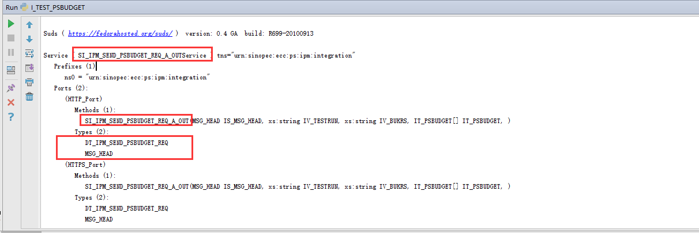

python调用webservice接口，这里我们使用suds包（轻量级的webservice客户端），suds似乎对应的是python2，python3使用suds-jurko

## 安装suds-jurko 或者 suds
python3
```sh
pip3 install suds-jurko
```
python2
```sh
pip install suds
```

## suds的例子
我没有测试suds，不过我测试suds-jurko仿照的是网上suds的例子，下面摘抄网上两个事例。

### 例子1
`https://blog.csdn.net/ruixue2016/article/details/80102020` 
```python
from suds.client import Client

url = "http://218.90.174.179:50038/JmYfjzService/clientRegisterService?WSDL"
test = Client(url)
print(test)
m=test.service.clientListen()
print(m)
```
首先导入包

先查看一下webservice提供哪些类型及方法，之后我们才知道怎么调用，传哪些参数。
```python
from suds.client import Client
from suds.transport.https import HttpAuthenticated #webservice需要安全难证
 
t = HttpAuthenticated(username='RFCATUSER',password='q123456') #安全验证所需用户，密码
url = "http://hqxt1.sinopec.com:50000/dir/wsdl?p=sa/65bd52bd76de381daf15736a37d13ab1"
test = Client(url,transport=t)
print test
```


下面开始调用传参：
```python
#coding=utf-8
 
#导入包
from suds.client import Client
from suds.transport.https import HttpAuthenticated #webservice需要安全难证
 
  
 
#安全验证，获取service服务
 
t = HttpAuthenticated(username='RFCATUSER',password='q123456') #安全验证所需用户，密码
 
url = "http://hqxt1.sinopec.com:50000/dir/wsdl?p=sa/65bd52bd76de381daf15736a37d13ab1"
test = Client(url,transport=t)
print test
 
  
 
#用test.factory.create创建实例
 
request=test.factory.create('DT_IPM_SEND_PSBUDGET_REQ')
 
IPM_MSG_HEAD = test.factory.create('MSG_HEAD')
 
request.IS_MSG_HEAD = IPM_MSG_HEAD
 
IPM_MSG_HEAD.SENDTIME = '20170421102908'
IPM_MSG_HEAD.RECIVER = 'ECC'
IPM_MSG_HEAD.SENDER = 'IPM'
IPM_MSG_HEAD.INTERFACE_ID = 'PROJECT_CREATE'
IPM_MSG_HEAD.SPRAS = None
IPM_MSG_HEAD.OPERATOR = None
IPM_MSG_HEAD.SYSTEM_ID = None
IPM_MSG_HEAD.PROXY_ID = None
IPM_MSG_HEAD.GUID = None
IPM_MSG_HEAD.MANDT = None
request.IV_BUKRS = "X060"
request.IV_TESTRUN = "X"
 
request.IT_PSBUDGET=[]
 
#用test.service.XXXXX去调用方法
m=test.service.SI_IPM_SEND_PSBUDGET_REQ_A_OUT(request)
print IPM_MSG_HEAD
print request
```

### 例子2
`https://blog.csdn.net/wangquan2596489/article/details/42025399`
```python
url="http://example.com/test.asmx?wsdl"

client=Client(url)

#查看远程方法
print client

#简单调用
client.service.hello()

#传递对象参数（方法1）
#假定我做了一个myc的class,有p1,p2两个属性
m=client.factory.create('myc')
m.p1="my name is "
m.p2="walker"
result=client.service.ClassIn(m)
print result


#传递对象参数（方法2）
m={"p1":"my name is ","p2":"walker"}
client=Client(url)
result=client.service.ClassIn(m)
print result
 
#返回对象  
result=client.service.ClassOut()
print result.p1 #可见返回的对象是可以直接用的

#    演示suds把异常包装成元组送出
client=Client(url,faults=False)
result=client.service.ClassIn("fadlskfjsdafjk")
print result
```

## suds-jurko的使用
总结一下，十分简单，通过print(client)可以看到接口的定义，通过client.factory.create(paramTypeName)可以知道自定义类型的结构。

基本数据类型直接传入，非基本数据类型传入dict或者通过client.factory.create(paramTypeName)构造。

### 测试调用工作中编写的webservice接口
就测试一下工作中编写的umc上下级调用指点的接口吧
```java
public interface DacOrgGradeManageInterface
{
	/*增加组织
	 * 返回新加的组织的id
	 */
	public DacOrgOperationData masterPartAdd(int parentid, String partname);
	
	/*组织修改名称
	 * 返回操作1成功0失败
	 */
	public DacOrgOperationData masterPartRename(int partid, String partname);
	
	/*删除组织
	 * 返回删除组织的父组织id
	 */
	public DacOrgOperationData masterPartDel(int partid,int ignoreself);
	
	/*为下级umc指定根组织
	 * 返回操作1成功0失败
	 */
	public DacOrgOperationData slaveSetRootPart(int masterid,int slaveid,int partid, String partname);
	
	//查询下级的组织ip段
	public List<DacOrgIpAddDisplayData> slaveOrgIpAddrList(int partid,int showsub);	
	
	/*
	 * type:1同步组织结构信息
	 */
	public void masterReportJsonData(int type,int slaveid,String data);
	
	//向上级上报分级首页的数据
	public void masterReportOverallData(List<DacSlaveReportOverallData> slaveDataList,List<DacSlaveReportLogData> slaveLogList);
	
	//向上级上报同步资产库（终端列表）
	public void masterReportTermInfoList(List<DacSlaveReportTermInfoData> slaveDataList,int slaveid);
	
	//向上级上报同步终端列扫描表
	public void masterReportTermScanList(List<DacSlaveReportTermScanData> slaveDataList,int slaveid);
	
	//返回下级ip资源管理（组织）页面左边的树，slaveids：下级ids，最后一个id为最终所查询umc的id
	public String slaveOrgIpResourceTreeData(int[] slaveids);
	
	//返回下级ip资源管理（组织）页面右边的数据，slaveids：下级ids，最后一个id为最终所查询umc的id
	public String slaveOrgIpResourceListData(int[] slaveids,int partid,int subid,int suSubid);
	
	//返回下级ip资源管理（子网）页面左边的树，slaveids：下级ids，最后一个id为最终所查询umc的id
	public String slaveIpResourceTreeData(int[] slaveids);
	
	//返回下级ip资源管理（子网）页面右边的数据，slaveids：下级ids，最后一个id为最终所查询umc的id
	public String slaveIpResourceListData(int[] slaveids,int partid,int subid);
	
	//返回：0：连接失败，1：成功
	public int slaveNotifyHandleLog(int[] slaveids,int logType,int logid,long logTimeLongValue
			,String sourceIp,String destIp,String sourcePort,String destPort,int protocol,long queryTimeStart,long queryTimeEnd);
	
	public List<DacGradeQueryResult> slaveGradeQuery(DacGradeQueryParam queryParam);
}
```
我就测试两个接口的调用：
```java
/*增加组织
 * 返回新加的组织的id
 */
public DacOrgOperationData masterPartAdd(int parentid, String partname);

//向上级上报同步资产库（终端列表）
public void masterReportTermInfoList(List<DacSlaveReportTermInfoData> slaveDataList,int slaveid);
```


```python
In [1]: from suds.client import Client

In [2]: url = "http://10.24.41.50/UMC/service/DacOrgGradeManageService?wsdl"

In [3]: client = Client(url)

#这里可以打印所有的接口和参数类型，和java里自动生成javabean的方式有异曲同工之妙
In [4]: print(client)

Suds ( https://fedorahosted.org/suds/ )  version: 0.6

Service ( DacOrgGradeManageService ) tns="http://service.dac.dp.com"
   Prefixes (3)
      ns0 = "http://data.dac.dp.com"
      ns3 = "http://grademanage.dac.dp.com"
      ns4 = "http://service.dac.dp.com"
   Ports (1):
      (DacOrgGradeManageServiceHttpPort)
         Methods (15):
            masterPartAdd(xs:int parentid, xs:string partname)
            masterPartDel(xs:int partid, xs:int ignoreself)
            masterPartRename(xs:int partid, xs:string partname)
            masterReportJsonData(xs:int type, xs:int slaveid, xs:string data)
            masterReportOverallData(ns0:ArrayOfDacSlaveReportOverallData slaveDataList, ns0:ArrayOfDacSlaveReportLogData slaveLogList)
            masterReportTermInfoList(ns0:ArrayOfDacSlaveReportTermInfoData slaveDataList, xs:int slaveid)
            masterReportTermScanList(ns0:ArrayOfDacSlaveReportTermScanData slaveDataList, xs:int slaveid)
            slaveGradeQuery(ns3:DacGradeQueryParam queryParam)
            slaveIpResourceListData(ArrayOfInt slaveids, xs:int partid, xs:int subid)
            slaveIpResourceTreeData(ArrayOfInt slaveids)
            slaveNotifyHandleLog(ArrayOfInt slaveids, xs:int logType, xs:int logid, xs:long logTimeLongValue, xs:string sourceIp, xs:string destIp, xs:string sourcePort, xs:string destPort, xs:int protocol, xs:long queryTimeStart, xs:long queryTimeEnd)
            slaveOrgIpAddrList(xs:int partid, xs:int showsub)
            slaveOrgIpResourceListData(ArrayOfInt slaveids, xs:int partid, xs:int subid, xs:int suSubid)
            slaveOrgIpResourceTreeData(ArrayOfInt slaveids)
            slaveSetRootPart(xs:int masterid, xs:int slaveid, xs:int partid, xs:string partname)
         Types (21):
            ns3:ArrayOfDacGradeQueryData
            ns3:ArrayOfDacGradeQueryFieldData
            ns3:ArrayOfDacGradeQueryFieldParam
            ns3:ArrayOfDacGradeQueryResult
            ns0:ArrayOfDacOrgIpAddDisplayData
            ns0:ArrayOfDacSlaveReportLogData
            ns0:ArrayOfDacSlaveReportOverallData
            ns0:ArrayOfDacSlaveReportTermInfoData
            ns0:ArrayOfDacSlaveReportTermScanData
            ArrayOfInt
            ns3:DacGradeQueryData
            ns3:DacGradeQueryFieldData
            ns3:DacGradeQueryFieldParam
            ns3:DacGradeQueryParam
            ns3:DacGradeQueryResult
            ns0:DacOrgIpAddDisplayData
            ns0:DacOrgOperationData
            ns0:DacSlaveReportLogData
            ns0:DacSlaveReportOverallData
            ns0:DacSlaveReportTermInfoData
            ns0:DacSlaveReportTermScanData


#调用接口传入基本数据类型
In [5]: ret = client.service.masterPartAdd(18776064,"2")

In [6]: ret
Out[6]: 
(DacOrgOperationData){
   errmsg = None
   parentid = 18776064
   partid = 18776105
   partname = "2"
   rstType = 1
 }

#返回的数据可以当做dict
In [7]: ret.partid
Out[7]: 18776105

#client.factory.create可以构造自定义非基本数据类型，可以根据提示赋值
In [8]: client.factory.create("ns0:ArrayOfDacSlaveReportTermInfoData")
Out[8]: 
(ArrayOfDacSlaveReportTermInfoData){
   DacSlaveReportTermInfoData[] = <empty>
 }

In [9]: terms = client.factory.create("ns0:ArrayOfDacSlaveReportTermInfoData")

In [10]: terms.DacSlaveReportTermInfoData
Out[10]: []

In [11]:  t = client.factory.create("ns0:DacSlaveReportTermInfoData")

In [12]: t
Out[12]: 
(DacSlaveReportTermInfoData){
   delayTime = None
   deviceIp = None
   factory = None
   id = None
   idInSlave = None
   lat = None
   linkDetectTime = None
   linkstate = None
   lng = None
   location = None
   loseRate = None
   nodeid = None
   partid = None
   reportid = None
   sessionData = None
   sessionRate = None
   state = None
   termIpLong = None
   termModel = None
   type = None
 }

In [13]: t.termIpLong = 1

In [14]: terms.DacSlaveReportTermInfoData.append(t)

In [15]: terms.DacSlaveReportTermInfoData
Out[15]: 
[(DacSlaveReportTermInfoData){
    delayTime = None
    deviceIp = None
    factory = None
    id = None
    idInSlave = None
    lat = None
    linkDetectTime = None
    linkstate = None
    lng = None
    location = None
    loseRate = None
    nodeid = None
    partid = None
    reportid = None
    sessionData = None
    sessionRate = None
    state = None
    termIpLong = 1
    termModel = None
    type = None
  }]

#java viod对应Python None
In [16]: rst = client.service.masterReportTermInfoList(terms,3)

In [17]: rst is None
Out[17]: True

#其实知道了参数类型的结构完全可以传入dict或list，这样简单一些
In [18]: rst = client.service.masterReportTermInfoList({"DacSlaveReportTermInfoData":[{"termIpLong":3,"idInSlave":2,"partid":4}]},3)

In [19]: client.service.masterReportTermInfoList?
Signature:      client.service.masterReportTermInfoList(*args, **kwargs)
Type:           Method
String form:    <suds.client.Method object at 0x7f8cadac30b8>
File:           /usr/local/lib/python3.6/dist-packages/suds/client.py
Docstring:     
The I{method} (namespace) object.
@ivar client: A client object.
@type client: L{Client}
@ivar method: A I{wsdl} method.
@type I{wsdl} Method.
Init docstring:
@param client: A client object.
@type client: L{Client}
@param method: A I{raw} method.
@type I{raw} Method.
Call docstring: Invoke the method.

#通过关键字的方式传递参数
In [20]: client.service.masterReportTermInfoList(slaveDataList=terms,slaveid=3)
```


