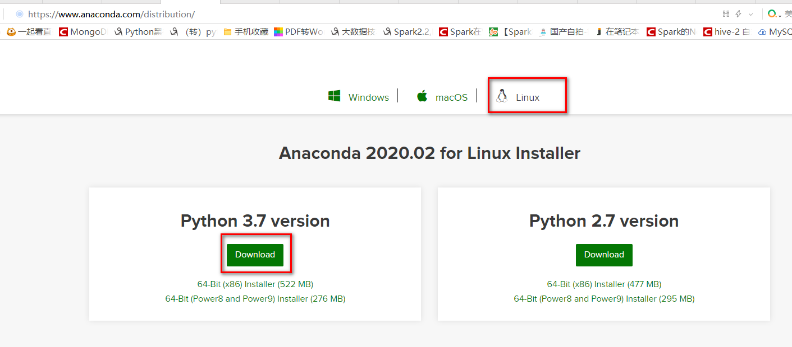

# centos6安装anaconda3
之前只linux中编译安装python真是折磨的要死，用anaconda就方便的多，而且anaconda能方便地管理python版本，十分好用。

## 安装anaconda
下载anaconda：直接百度到官网下载即可，选择linux版本的。

下载的页面：https://www.anaconda.com/distribution/


安装我是参考的这个页面：`https://www.cnblogs.com/haoyiyang/p/11309701.html`和`https://blog.csdn.net/u013537471/article/details/103446700`

安装相关环境(我没安装，应该是我的电脑已经有这两个工具了)
```
yum -y install bzip2 tar
```

安装十分简单，直接执行下载的.sh文件即可，按照提示安装就行。

执行安装文件，选择的安装路径是`/usr/local/anaconda3`，所有切到了root用户，中间有个阅读协议的一直按着enter键即可，之后提示输入yes或者no输入no，之后可以选择安装路径。
```
[hadoop@hadoop01 software]$ ll
total 556712
-rwxrwxrwx 1 hadoop hadoop 546910666 Apr  6 16:20 Anaconda3-2020.02-Linux-x86_64.sh
-rw-rw-r-- 1 hadoop hadoop  11157302 Aug  3  2019 azkaban-executor-server-2.5.0.tar.gz
-rw-rw-r-- 1 hadoop hadoop      1928 Aug  3  2019 azkaban-sql-script-2.5.0.tar.gz
-rw-rw-r-- 1 hadoop hadoop  11989669 Aug  3  2019 azkaban-web-server-2.5.0.tar.gz
[hadoop@hadoop01 software]$ ./Anaconda3-2020.02-Linux-x86_64.sh 

Please answer 'yes' or 'no':'
>>> 
Please answer 'yes' or 'no':'
>>> yes

Anaconda3 will now be installed into this location:
/root/anaconda3

  - Press ENTER to confirm the location
  - Press CTRL-C to abort the installation
  - Or specify a different location below

[/root/anaconda3] >>> /usr/local/anaconda3
```

安装完成后，在/tec/profile中配置环境变量，输入python3,ipython3都是可以的。

安装一个虚拟环境，使用Python3.6.7版本。
```
[root@hadoop01 software]#conda create -n py_367  python=3.6.7

#
# To activate this environment, use
#
#     $ conda activate py_367
#
# To deactivate an active environment, use
#
#     $ conda deactivate
```

通过提示可以看到，激活环境用
```
conda activate py_367
```
离开环境用
```
conda deactivate
```
激活环境也可以用
```
source activate py_367
```

安装对应版本的ipython
```
conda install -n py_367 ipython
```

## anaconda下虚拟环境的创建
### 创建虚拟环境
```
conda create -n you_evn_name python==3.7
```

### 查看虚拟环境
输入 conda env list可查看到之前创建的虚拟环境
```
conda env list
```

### 进入虚拟环境
```
source activate you_evn_name
```
此时输入python -V可查看到当前python版本为3.7

### 删除虚拟环境
```
conda remove -n your_env_name --all
```


```

```