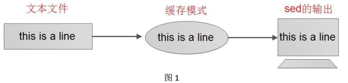

# inux sed命令详解
```
https://www.jb51.net/article/111306.htm
https://www.cnblogs.com/ginvip/p/6376049.html
https://www.cnblogs.com/ggjucheng/archive/2013/01/13/2856901.html
```
[toc]

## 简介
sed命令是一个面向字符流的非交互式编辑器，也就是说sed不允许用户与它进行交互操作。sed是按行来处理文本内容的。在shell中，使用sed来批量修改文本内容是非常方便的。

sed 是一种在线编辑器，它一次处理一行内容。处理时，把当前处理的行存储在临时缓冲区中，称为“模式空间”（pattern space），接着用sed命令处理缓冲区中的内容，处理完成后，把缓冲区的内容送往屏幕。接着处理下一行，这样不断重复，直到文件末尾。文件内容并没有 改变，除非你使用重定向存储输出。Sed主要用来自动编辑一个或多个文件；简化对文件的反复操作；编写转换程序等。

## sed 工作过程
sed 编辑器逐行处理文件（或输入），并将输出结果发送到屏幕。 sed 的命令就是在 vi和 ed/ex 编辑器中见到的那些。 sed 把当前正在处理的行保存在一个临时缓存区中，这个缓存区称为模式空间或临时缓冲。sed 处理完模式空间中的行后（即在该行上执行 sed 命令后），就把改行发送到屏幕上（除非之前有命令删除这一行或取消打印操作）。 sed 每处理完输入文件的最后一行后， sed 便结束运行。 sed 把每一行都存在临时缓存区中，对这个副本进行编辑，所以不会修改或破坏源文件。如图 1： sed 处理过程。 

从上图可以看出 sed 不是破坏性的，它不会修改正在编辑的文件。 

## Sed 命令格式
sed 命令行格式为： 
```
sed [选项] ‘ command’ 输入文本
```

**选项**：

* -n ：使用安静(silent)模式。在一般 sed 的用法中，所有来自 STDIN 的数据一般都会被列出到终端上。但如果加上 -n 参数后，则只有经过sed 特殊处理的那一行(或者动作)才会被列出来。    
* -e ：直接在命令列模式上进行 sed 的动作编辑；    
* -f ：直接将 sed 的动作写在一个文件内， -f filename 则可以运行 filename 内的 sed 动作；    
* -r ：sed 的动作支持的是延伸型正规表示法的语法。(默认是基础正规表示法语法)    
* -i ：直接修改读取的文件内容，而不是输出到终端。  


**function**：

* a ：新增行， a 的后面可以是字串，而这些字串会在新的一行出现(目前的下一行)    
* c ：取代行， c 的后面可以接字串，这些字串可以取代 n1,n2 之间的行    
* d ：删除行，因为是删除，所以 d 后面通常不接任何参数，直接删除地址表示的行；    
* i ：插入行， i 的后面可以接字串，而这些字串会在新的一行出现(目前的上一行)；    
* p ：列印，亦即将某个选择的数据印出。通常 p 会与参数 sed -n 一起运行    
* s ：替换，可以直接进行替换的工作,通常这个 s 的动作可以搭配正规表示法，例如 1,20s/old/new/g 一般是替换符合条件的字符串而不是整行  


**一般function的前面会有一个地址的限制，例如 [地址]function，表示我们的动作要操作的行。**

## Sed 定位
Sed 命令在没有给定的位置时，默认会处理所有行；

Sed 支持一下几种地址类型：
```
1、 first~step
这两个单词的意思： first 指起始匹配行， step 指步长，例如： sed -n 2~5p 含义：从第二行开始匹配，隔 5 行匹配一次，即 2,7,12.......。
2、 $
这个$符表示匹配最后一行。
3、 /REGEXP/
这个是表示匹配正则那一行，通过//之间的正则来匹配。
4、 \cREGEXPc
这个是表示匹配正则那一行，通过\c 和 c 之间的正则来匹配,c 可以是任一字符
5、 addr1， add2 
定址 addr1， add2 决定用于对哪些行进行编辑。地址的形式可以是数字、正则表达式或二者的结合。如果没有指定地址， sed 将处理输入文件中的所有行。如果定址是一个数字，则这个数字代表行号，如果是逗号分隔的两个行号，那么需要处理的定址就是两行之间的范围（包括两行在内）。范围可以是数字，正则或二者组合。

6、 addr1， +N

从 addr1 这行到往下 N 行匹配，总共匹配 N+1 行
7、 addr1， ~N
Will match addr1 and the lines following addr1 until the next line whose input line number is a multiple of N.【没有看懂是什么意思】
```

## Sed 的正则表达式


## Sed命令举例说明

### 删除行(d)

```
~/codes$ nl order.txt
     1  jack 2015-01-01 10
     2  tony 2015-01-02 15
     3  jack 2015-02-03 23
     4  tony 2015-01-04 29
     5  jack 2015-01-05 46
     6  jack 2015-04-06 42
     7  tony 2015-01-07 50
     8  jack 2015-01-08 55
     9  mart 2015-04-08 62
    10  mart 2015-04-09 68
    11  neil 2015-05-10 12
    12  mart 2015-04-11 75
    13  neil 2015-06-12 80
    14  mart 2015-04-13 94
```

删除前两行的数据(行号从1开始)：
```
~/codes$ nl order.txt | sed '1,2d'
     3  jack 2015-02-03 23
     4  tony 2015-01-04 29
     5  jack 2015-01-05 46
     6  jack 2015-04-06 42
     7  tony 2015-01-07 50
     8  jack 2015-01-08 55
     9  mart 2015-04-08 62
    10  mart 2015-04-09 68
    11  neil 2015-05-10 12
    12  mart 2015-04-11 75
    13  neil 2015-06-12 80
    14  mart 2015-04-13 94
```

只删除第2行：
```
~/codes$ nl order.txt | sed '2d'
     1  jack 2015-01-01 10
     3  jack 2015-02-03 23
     4  tony 2015-01-04 29
     5  jack 2015-01-05 46
     6  jack 2015-04-06 42
     7  tony 2015-01-07 50
     8  jack 2015-01-08 55
     9  mart 2015-04-08 62
    10  mart 2015-04-09 68
    11  neil 2015-05-10 12
    12  mart 2015-04-11 75
    13  neil 2015-06-12 80
    14  mart 2015-04-13 94
```

删除第2行到最后最后一行：
```
~/codes$ nl order.txt | sed '2,$d'
     1  jack 2015-01-01 10
```

使用正则删除包含Jack的行：
```
~/codes$ sed '/jack/d' order.txt 
tony 2015-01-02 15
tony 2015-01-04 29
tony 2015-01-07 50
mart 2015-04-08 62
mart 2015-04-09 68
neil 2015-05-10 12
mart 2015-04-11 75
neil 2015-06-12 80
mart 2015-04-13 94
```

删除包含2015-01的行：
```
~/codes$ sed '/2015-01/d' order.txt 
jack 2015-02-03 23
jack 2015-04-06 42
mart 2015-04-08 62
mart 2015-04-09 68
neil 2015-05-10 12
mart 2015-04-11 75
neil 2015-06-12 80
mart 2015-04-13 94
```


删除包含2015-01和2015-04的行：
```
~/codes$ sed '/2015-0[14]/d' order.txt 
jack 2015-02-03 23
neil 2015-05-10 12
neil 2015-06-12 80
```

### 新增行(a)
在所有行的后面新增一行内容：
```
~/codes$ head -4 order.txt | sed 'a append line'
jack 2015-01-01 10
append line
tony 2015-01-02 15
append line
jack 2015-02-03 23
append line
tony 2015-01-04 29
append line
```

在第二行后面新增：
```
~/codes$ head -4 order.txt | sed '2a append line'
jack 2015-01-01 10
tony 2015-01-02 15
append line
jack 2015-02-03 23
tony 2015-01-04 29
```

在1到3行后面新增：
```
~/codes$ head -4 order.txt | sed '1,3a append line'
jack 2015-01-01 10
append line
tony 2015-01-02 15
append line
jack 2015-02-03 23
append line
tony 2015-01-04 29
```

在包含jack的行后新增(同样可以使用正则)：
```
~/codes$ head -4 order.txt | sed '/jack/a append line'
jack 2015-01-01 10
append line
tony 2015-01-02 15
jack 2015-02-03 23
append line
tony 2015-01-04 29
```

### 插入行(i)
在后面追加行使用a，在前面插入行使用i

在所有行的前面插入一行内容：
```
~/codes$ head -4 order.txt | sed 'i insert line'
insert line
jack 2015-01-01 10
insert line
tony 2015-01-02 15
insert line
jack 2015-02-03 23
insert line
tony 2015-01-04 29
```

在第二行前面插入：
```
~/codes$ head -4 order.txt | sed '2i insert line'
jack 2015-01-01 10
insert line
tony 2015-01-02 15
jack 2015-02-03 23
tony 2015-01-04 29
```

在1到3行前面插入：
```
~/codes$ head -4 order.txt | sed '1,3i insert line'
insert line
jack 2015-01-01 10
insert line
tony 2015-01-02 15
insert line
jack 2015-02-03 23
tony 2015-01-04 29
```

在包含jack的行前插入(同样可以使用正则)：
```
~/codes$ head -4 order.txt | sed '/jack/i insert line'
insert line
jack 2015-01-01 10
tony 2015-01-02 15
insert line
jack 2015-02-03 23
tony 2015-01-04 29
```

### 替换行(c)
替换行使用c。

```
~/codes$ head -4 order.txt | sed '1c replace line'
replace line
tony 2015-01-02 15
jack 2015-02-03 23
tony 2015-01-04 29
```

命令c会替换指定的行的所有内容，替换成其后面的字符串，所有的新增、插入、删除、替换行，这些命令前面的地址修饰都可以指定地址空间，也都可以使用正则表达式，命令会应用在选出的符合地址条件的所有行。


```
~/codes$ head -4 order.txt | sed '/jack/c replace line'
replace line
tony 2015-01-02 15
replace line
tony 2015-01-04 29
```

**使用行数匹配替换连续的行时，会把多行替换成一行**：
```
~/codes$ head -4 order.txt | sed '1,3c replace line'
replace line
tony 2015-01-04 29
```

别的替换连续的行就没问题：
```
~/codes$ head -4 order.txt | sed 'c replace line'
replace line
replace line
replace line
replace line

~/codes$ head -4 order.txt | sed '/^[jt]/c replace line'
replace line
replace line
replace line
replace line
```

### 替换部分字符串而不是整行(s)
sed中除了上面的命令是针对整行进行操作的之外，还提供一个替换命令，该命令对某一行中的部分字符串进行操作。

```
~/codes$ head -4 order.txt | sed 's/2015/replaced/'
jack replaced-01-01 10
tony replaced-01-02 15
jack replaced-02-03 23
tony replaced-01-04 29
```
s命令后面接的是3个斜杠分隔的两串字符串，其含义是  `s/待替换的字符串/新字符串/` 也就是说使用后面的 replaced 替换文件中出现的前面的 2015 。**这里的替换仅仅替换每一行遇到的第一个匹配的字符串**。

```
~/codes$ head -4 order.txt | sed 's/0/r/'
jack 2r15-01-01 10
tony 2r15-01-02 15
jack 2r15-02-03 23
tony 2r15-01-04 29
```

如果要对一行里面的所有的符合条件的字符串都做替换操作，可以**使用参数g**：
```
~/codes$ head -4 order.txt | sed 's/0/r/g'
jack 2r15-r1-r1 1r
tony 2r15-r1-r2 15
jack 2r15-r2-r3 23
tony 2r15-r1-r4 29
```

在最后一个斜杠后面加上g选项之后，表示进行全局替换，也就是说一行中所有符合条件的旧字符串都会被替换成新字符串，而不仅仅是第一个。与其他针对行的操作一样，s命令也可以进行地址选择，其地址使用方法与我们之前的一样，也就是在s的前面加上地址空间限定，例如：
```
~/codes$ head -4 order.txt | sed '1s/0/r/g'
jack 2r15-r1-r1 1r
tony 2015-01-02 15
jack 2015-02-03 23
tony 2015-01-04 29
```

限定1到3行替换：
```
~/codes$ head -4 order.txt | sed '1,3s/0/r/g'
jack 2r15-r1-r1 1r
tony 2r15-r1-r2 15
jack 2r15-r2-r3 23
tony 2015-01-04 29
```

限定包含jack的行替换：
```
~/codes$ head -4 order.txt | sed '/jack/s/0/r/g'
jack 2r15-r1-r1 1r
tony 2015-01-02 15
jack 2r15-r2-r3 23
tony 2015-01-04 29
```

**替换是可以使用正则的**：
```
~/codes$ head -4 order.txt | sed 's/[0-9][0-9]*/r/'
jack r-01-01 10
tony r-01-02 15
jack r-02-03 23
tony r-01-04 29
```

**注意：这里的正则并不支持普通代码里的正则，应该只是支持liunx命令里的正则，功能比较少**
```
:~/codes$ head -4 order.txt | sed 's/[0-9]+/r/'
jack 2015-01-01 10
tony 2015-01-02 15
jack 2015-02-03 23
tony 2015-01-04 29

~/codes$ head -4 order.txt | sed 's/\d/r/'
jack 2015-01-01 10
tony 2015-01-02 15
jack 2015-02-03 23
tony 2015-01-04 29

~/codes$ head -4 order.txt | sed 's/\\d/r/'
jack 2015-01-01 10
tony 2015-01-02 15
jack 2015-02-03 23
tony 2015-01-04 29
```

### sed正则中的元字符
我们知道sed中的命令前面可以使用地址范围进行限制，表示对文件的某些符合条件的行执行相应的操作，其中我们可以使用正则表达式选出要操作的行，而sed中正则的语法可能与我们其他命令的正则语法有一些不同，这里我们有必要列出sed中常用的正则元字符：

```
$ 表示行尾 
^ 表示行首
[a-z0-9]表示字符范围
[^]表示除了字符集中的字符以外的字符

sed的正则中  \(\)  和 \{m,n\} 需要转义

. 表示任意字符  
* 表示零个或者多个  
\+ 一次或多次　　
\? 零次或一次    
\| 表示或语法
```

测试一下：

```
~/codes$ head -4 order.txt | sed 's/[0-9]\{4\}/r/'
jack r-01-01 10
tony r-01-02 15
jack r-02-03 23
tony r-01-04 29

~/codes$ head -4 order.txt | sed 's/[0-9]\{1,4\}/r/'
jack r-01-01 10
tony r-01-02 15
jack r-02-03 23
tony r-01-04 29

~/codes$ head -4 order.txt | sed 's/[0-9]\+/r/g'
jack r-r-r r
tony r-r-r r
jack r-r-r r
tony r-r-r r
```

### 搜索并输出行内容(p)
sed还提供一个p命令用于搜索符合条件的行，并输出该行的内容，而不做其他的任何修改。


```
~/codes$ head -4 order.txt | nl | sed '2p'
     1  jack 2015-01-01 10
     2  tony 2015-01-02 15
     2  tony 2015-01-02 15
     3  jack 2015-02-03 23
     4  tony 2015-01-04 29
```

可以看到第二行被输出来了，但是sed好像将文件的所有内容输出了一遍，而第2行则多输出了一次，实际上sed默认情况下是会将所有标准输入的数据又重新输出到标准输出的，我们可以加上 -n 选项让sed仅仅是输出经过处理之后的那些行，而不是输出之前从标准输入中获取到的所有行内容，例如：
```
~/codes$ head -4 order.txt | nl | sed -n '2p'
     2  tony 2015-01-02 15

~/codes$ head -4 order.txt | nl | sed -n '1,3p'
     1  jack 2015-01-01 10
     2  tony 2015-01-02 15
     3  jack 2015-02-03 23
```

这样仅仅会输出p命令的处理结果了，**-n 选项一般是与p命令联合使用的，其他的增加，删除，替换行的命令是不需要 -n 选项的**


使用正则搜索输出特定行：
```
$ sed -n '/jack/p' order.txt 
jack 2015-01-01 10
jack 2015-02-03 23
jack 2015-01-05 46
jack 2015-04-06 42
jack 2015-01-08 55
```

### 将修改应用到文件中(i)(危险动作)
sed 可以直接修改文件的内容，不必使用管道命令或数据流重导向！ 不过，由於这个动作会直接修改到原始的文件，所以请你千万不要随便拿系统配置来测试！

我们之前做的所有实验，实际上都没有修改test.txt文件的内容，也就是说我们看到的修改结果仅仅输出到控制台上，而文件test.txt的内容是没有修改的，我们可以使用 -i 选项告诉sed直接修改文件的内容，而不是将修改结果输出到终端上，例如：
```
sed -i '2d' test.txt
```
命令运行之后，我们发现test.txt的第2行没有了

## 生产环境案例
在实际生产中，在修改配置文件的时候，有一些空格、空行、带“ #”开头的注释都要删除或替换，下面为大家介绍几个实用的例子

```sh
[root@Gin scripts]# cat sed.txt
 today is nice day
 you can walk out on the street
 it will be import to you
##每行的前面都有空格
```

```sh
[root@Gin scripts]# sed 's/^[ ]*//' sed.txt
today is nice day
you can walk out on the street
it will be import to you
## 注：[ ]里面有个空格
或者：
[root@Gin scripts]# sed 's/^[[:space:]]*//' sed.txt
today is nice day
you can walk out on the street
it will be import to you
```

从 Google 上下载下来的配置文件往往都带有数字，现在需要删除所有行的首数字。
```sh
[root@Gin scripts]# cat sed.txt
1today is nice day
2you can walk out on the street
3it will be import to you
[root@Gin scripts]# sed 's/^[0-9][0-9]*//g' sed.txt
today is nice day
you can walk out on the street
it will be import to you
```


