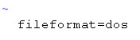
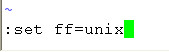
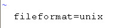

一、问题描述

在notepad++里面编辑修改了shell脚本，再上传到服务器执行，出现“-bash: ./test.sh: /bin/bash^M: bad interpreter: No such file or directory”的报错：
```sh
[root@test102 ~]# ./test.sh 
-bash: ./test.sh: /bin/bash^M:  bad interpreter: No such file or directory
[root@test102 ~]# 
```

二、原因

1）.sh脚本在windows系统下编写的，所以可能有不可见字符，从上图错误提示来看，很有可能脚本文件是DOS格式的，即每一行的行尾以\r\n来标识, 其ASCII码分别是0x0D, 0x0A。

三、解决方法

1）通过vim filename 或者vi filename 进入编辑，即我这是vim startup_heartbeat.sh


2)然后通过shift+：进入命令模式。接着通过命令set ff 或者 set fileformat 查看文件格式，即我这如下图：从中可以看到我这文件格式是dos。



3）修改文件格式dos为unix。通过命令set ff=unix 或 set fileformat=unix修改，然后再执行set ff 或者 set fileformat，查看是否修改成功。即如下图所示：



4）启动命令，发现正常启动，至此完毕。