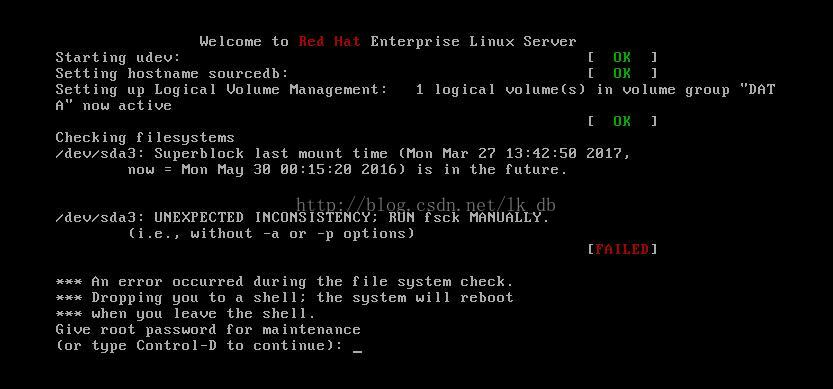
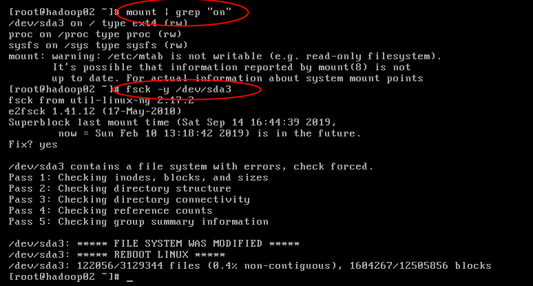

有两种解决办法
1、修改虚拟机为本地电脑时间，reboot
2、按照启动提示unexpected inconsistency;RUN fsck MANUALLY解决

我本来打算按照第二种方法解决，但是修复一个分区后，提示还要提示第二个分区，然后我就选择了第一种方法


## 修改系统时间
date -s "2019-09-15 09:22:00"


## 启动提示unexpected inconsistency;RUN fsck MANUALLY解决
```
CentOS启动提示unexpected inconsistency;RUN fsck MANUALLY解决
 
CentOS服务器出了问题了，提示如下： 
 
unexpected inconsistency;RUN fsck MANUALLY 
 
An error occurred during the filesystem check 
 
Propping you to shell the system will reboot 
 
when you leave the shell 
 
Give root password for mantennance 
 
从网上找了一些教程，立马就解决了，过程如下： 
 
按照系统提示，输入root用户的密码，进入命令行， 
 
1。 输入命令，查找root所在分区是多少： 
 
mount |grep “on” 
 
根据结果找到root所在分区，我的是/dev/sda2 
 
2. 然后用命令fsck修复 
 
fsck -y /dev/sda2 
 
注：-y 选项指定检测每个文件是自动输入yes 
 
3。reboot重启ok 
```

