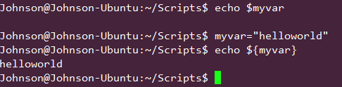
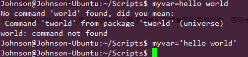
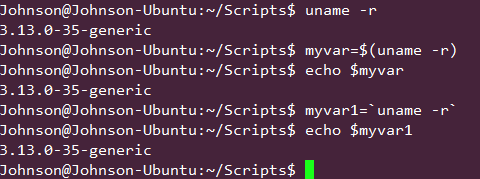
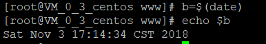

## linux中单引号' ,双引号", 反引号 `, $, $(), ${}与变量

### 一、linux中的变量
变量是一个很重要的概念，无论是bash脚本还是其他语言，都是如此。在bash中，创建变量很简单，给变量一个名称即可。默认情况下，变量的值为空。我们可以通过等号为变量赋值。需要注意的是，**变量** 和 **变量的值**不是一个概念。当给定变量一个名称后，例如myvar，我们需要通过`$`取得变量的值，即`$myvar`。使用`echo`输出变量的值。

输出变量的值的格式为：`echo $myvar 或者 echo ${myvar}`



**使用变量的时候，需要注意以下几点**：

* 1. 给变量赋值的时候，**如果值包含空格，需要用单引号或者双引号包起来，否则会引起错误** 

* 2. 给变量赋值的时候，**如果使用单引号，那么单引号里面的变量就不会解析成真正的值。使用双引号则可以**
  
* 3. 可以**将一个命令执行的结果赋给一个变量**。格式为：`myvar=$(command)` 或者 `'comand'`。值得注意的是，务必要将$()和${}的用途分开  



### 二、单引号''和双引号""
两者都是解决变量中间有空格的问题。

在bash中“空格”是一种很特殊的字符，比如在bash中这样定义str=this is String，这样就会报错，为了避免出错就得使用单引号''和双引号""。

单引号''，双引号""的区别是：
```
单引号''剥夺了所有字符的特殊含义，单引号''内就变成了单纯的字符，。
双引号""则对于双引号""内的参数替换($)和命令替换(``)是个例外。
```

```sh
hadoop@LAPTOP-721GSBLU:~$ n=3
hadoop@LAPTOP-721GSBLU:~$ echo '$n'
$n
hadoop@LAPTOP-721GSBLU:~$ echo "$n"
3
```

### 三、反引号``与$()
```
反引号``是命令替换，命令替换是指Shell可以先执行``中的命令，将输出结果暂时保存，在适当的地方输出。语法:`command`
$()也有命令替换的作用
```



### 四、`${}与$`
```
${ }中放的是变量，例如echo ${hello}取hello变量的值并打印，也可以不加括号比如$hello。
$的作用相当于引用某变量的值，例如变量myvar，我们需要通过$取得变量的值，即$myvar
```

