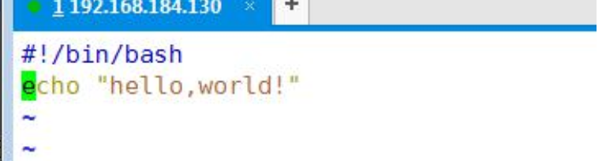
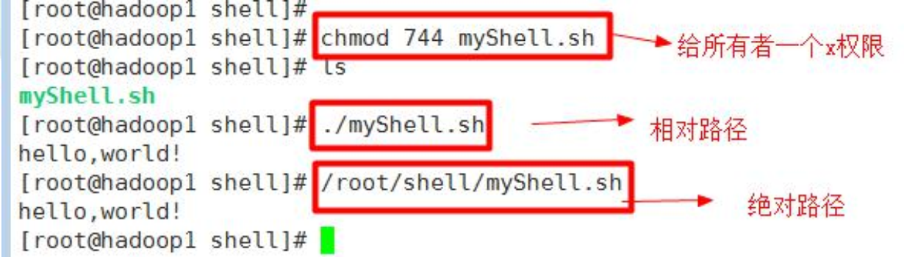
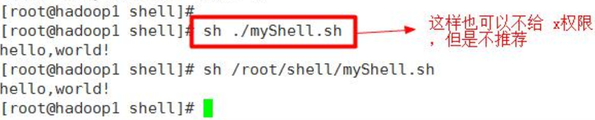
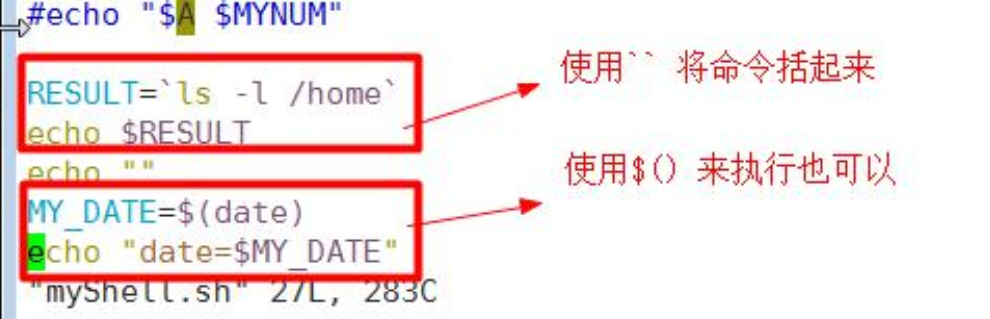
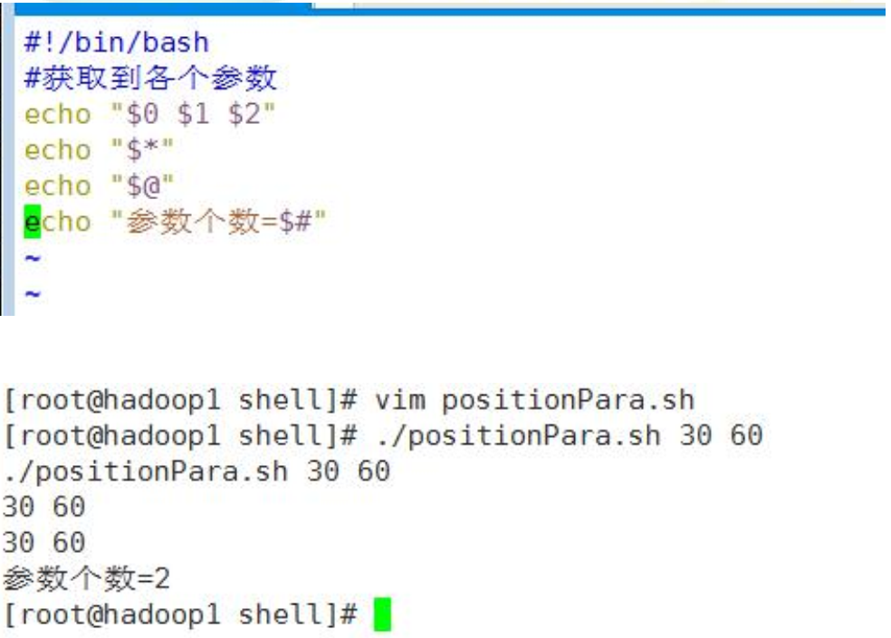
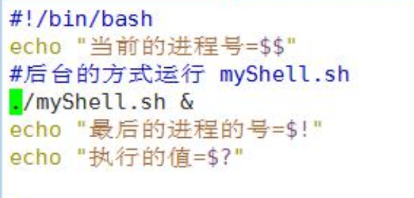
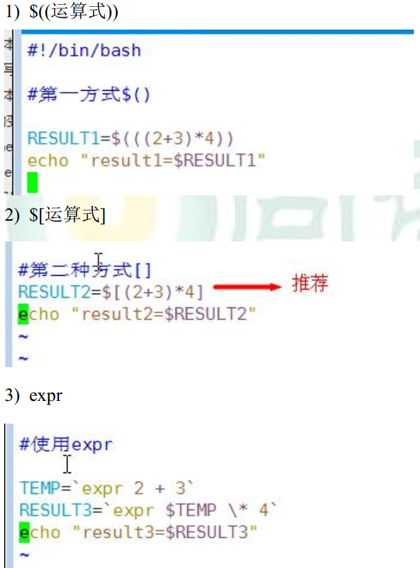
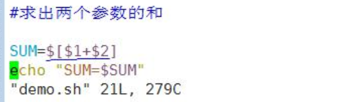
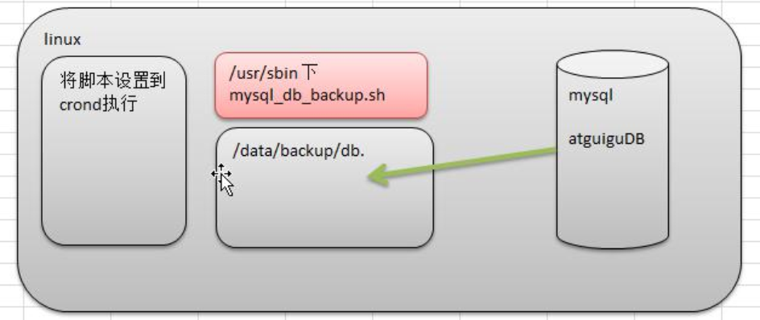

## 一、shell是什么
Shell 是一个命令行解释器,它为用户提供了一个向 Linux 内核发送请求以便运行程序的界面系统级程序,用户可以用 Shell 来启动、挂起、停止甚至是编写一些程序。


Shell 还是一个功能相当强大的编程语言,易编写、易调试、灵活性强。Shell 是解释执行的脚本语言,在 Shell 中可以调用 Linux 系统命令。
## 二、Shell 脚本的执行方式
### 脚本格式:  
* (1)脚本以#! /bin/bash 开头  
* (2)脚本必须有可执行权限  

### 编写第一个 Shell 脚本
需求说明：创建一个 Shell 脚本， 输出 hello world!

看案例：


### 脚本的常用执行方式:
* 第一种:输入脚本的绝对路径或相对路径  
```
(1)首先要赋予helloworld.sh 脚本的+x权限
$ chmod 777 helloworld.sh
2)执行脚本
/root/helloWorld.sh
./helloWorld.sh
```


* 第二种:bash或sh+脚本(不用赋予脚本+x权限)， 不推荐   
```
sh /root/helloWorld.sh
sh helloWorld.sh
```


## 三、Shell 中的变量
### Shell 的变量的介绍
1)Linux Shell 中的变量分为,**系统变量**和**用户自定义变量**。
2)系统变量:`$HOME、$PWD、$SHELL、$USER` 等等
3)显示当前 shell 中所有变量:set

### 定义变量
基本语法:  
* (1)定义变量:变量=值  
* (2)撤销变量:unset 变量  
* (3)声明静态变量:readonly 变量,注意:不能 unset  

**变量定义规则:**  
* (1)变量名称可以由字母、数字和下划线组成,但是不能以数字开头。  
* **(2)等号两侧不能有空格**  
* (3)变量名称一般习惯为大写  

例子：
```
(1)定义变量 A
    A=8
(2)撤销变量A
    unset A
(3)声明静态的变量B=2,不能unset
    readonly B=2
(4)可把变量提升为全局环境变量,可供其他shell程序使用
    export 变量名
```

### 将命令的返回值赋给变量（重点）：`或 $()
```
1)A=`ls -la` 反引号,运行里面的命令,并把结果返回给变量 A
2)A=$(ls -la) 等价于反引号
```


### 设置环境变量
基本语法:  
* (1)export 变量名=变量值 (功能描述:将 shell 变量输出为环境变量)  
* (2)source 配置文件 (功能描述:让修改后的配置信息立即生效)  
* (3)echo $变量名 (功能描述:查询环境变量的值)  

例子:  
```shell
#(1)在/etc/profile 文件中定义 JAVA_HOME 环境变量
export JAVA_HOME=/opt/module/jdk1.8.0_144
export PATH=$PATH:$JAVA_HOME/bin
#(2)查看环境变量 JAVA_HOME 的值
$ echo $JAVA_HOME
/opt/module/jdk1.8.0_144
```

### 位置参数变量
基本语法:  
* `$n (功能描述:n 为数字,$0 代表命令本身,$1-$9 代表第一到第九个参数,十以上的参数,十以上的参数需要用大括号包含,如${10})`  
* `$* (功能描述:这个变量代表命令行中所有的参数,$*把所有的参数看成一个整体)`  
* `$@ (功能描述:这个变量也代表命令行中所有的参数,不过$@把每个参数区分对待)`  
* `$# (功能描述:这个变量代表命令行中所有参数的个数)`  

`$*与$@的区别`:
```
a)$*和$@都表示传递给函数或脚本的所有参数,不被双引号“”包含时,都以$1$2 ...$n的形式输出所有参数
b)当它们被双引号“”包含时,“$*”会将所有的参数作为一个整体,以“$1 $2 ...$n”的形式输出所有参数;“$@”会将各个参数分开,以“$1” “$2”...”$n”的形式输出所有参数
```

例子:  
(1)输出输入的的参数 1,参数 2,所有参数,参数个数
```sh
#!/bin/bash
#获取到各个参数
echo "$0 $1 $2"
echo "$*"
echo "$@"
echo "参数个数=$#"
```


(2)`$*`与`$@`的区别
```sh
#!/bin/bash
for i in "$*"
#$*中的所有参数看成是一个整体,所以这个 for 循环只会循环一次
    do
        echo "The parameters is: $i"
    done
x=1
for y in "$@"
#$@中的每个参数都看成是独立的,所以“$@”中有几个参数,就会循环几次
    do
        echo "The parameter$x is: $y"
        x=$(( $x +1 ))
    done
```

### 预定义变量
基本介绍:
就是 shell 设计者事先已经定义好的变量， 可以直接在 shell 脚本中使用

基本语法:
* `$?  (功能描述:最后一次执行的命令的返回状态。如果这个变量的值为0,证明上一个命令正确执行;如果这个变量的值为非0(具体是哪个数,由命令自己来决定),则证明上一个命令执行不正确了。)`  
* `$$  (功能描述:当前进程的进程号(PID))`  
* `$!  (功能描述:后台运行的最后一个进程的进程号(PID))`  

例子:  
```sh
#!/bin/bash
#输出当前进程的PID,这个PID就是当前这个脚本执行时,生成的进程的PID
echo "The current process is $$"
#使用find命令在root目录下查找hello.sh文件,符号&的意思是把命令放入后台执行
find /root -name hello.sh &
echo "The last one Daemon process is $!"
echo "执行的值=$?"
```


## 四、运算符
**算术计算，`$(())`中的Shell变量取值将转换成整数，同样含义的`$[]`等价**  

**推荐使用`$[]`**

基本语法:
```
(1)“$((运算式))”或“$[运算式]”
(2)expr m + n
注意 expr 运算符间要有空格
(3)expr m - n
(4)expr \*, /, %    乘,除,取余
```

例子:  
案例 1： 计算（2+3） X4 的值
```sh
#(1)采用$[运算式]方式
S=$[(2+3)*4]
echo $S
#(2)expr 分布计算
S=`expr 2 + 3`
expr $S \* 4
#(3)expr 一步完成计算
expr `expr 2 + 3` \* 4
```


案例 2： 请求出命令行的两个参数[整数]的和
```sh
#求出两个参数的和
SUM=$[$1+$2]
echo "SUM=$SUM" 
```


## 五、条件判断
### 判断语句
基本语法:  
* [ condition ]   (**注意 condition 前后要有空格**)  
非空返回 true,**可使用$?验证**(0 为 true,>1 为 false)  

### 常用判断条件
1)两个整数之间比较
```
= 字符串比较
-lt 小于
-le 小于等于
-eq 等于
-gt 大于
-ge 大于等于
-ne 不等于
```

2)按照文件权限进行判断
```
-r 有读的权限 [ -r 文件 ]
-w 有写的权限
-x 有执行的权限
```

3)按照文件类型进行判断
```
-f 文件存在并且是一个常规的文件
-e 文件存在
-d 文件存在并是一个目录
```

例子:  
```sh
#!/bin/bash

#案例1："ok"是否等于"ok"

if [ "ok100" = "ok" ]
then
	echo "equal"
fi

#案例2：23是否大于等于22

if [ 23 -gt 22 ]
then
	echo "大于"
fi 

#案例3：/root/shell/aaa.txt 目录中的文件是否存在
if [ -e /root/shell/aaa.txt ]
then
	echo "存在 "
fi
```

## 六、流程控制
### if 判断
基本语法:  
```sh
if [ 条件判断式 ];then
    程序
fi
```
或者:
```sh
if [ 条件判断式 ]
    then
        程序
fi

if [ 条件判断式 ]
then
    程序
elif [条件判断式]
then
    程序
fi
```

注意事项:
**[ 条件判断式 ],中括号和条件判断式之间必须有空格**  
**推荐使用第二种方式**

例子:  
```sh
#!/bin/bash
read –p “please input your name:” NAME
#printf ‘%s\n’ $NAME
if[ $NAME = root ]
    then
        echo “hello ${NAME}, welcome !”
elif [ $NAME = atguigu]
    then
        echo “hello ${NAME}, welcome !”
else
    echo “sorry ”
fi
```

案例： 请编写一个 shell 程序， 如果输入的参数， 大于等于 60， 则输出 "及格了"， 如果小于 60,
则输出 "不及格"
```sh
#!/bin/bash
#案例：请编写一个shell程序，如果输入的参数，大于等于60，则输出 "及格了"，如果小于60,则输出 "不及格"

if [ $1 -ge 60 ]
then
	echo "及格了"
elif [ $1 -lt 60 ]
then
	echo "不及格"
fi
```


### case 语句
基本语法
```sh
case $变量名 in
"值 1"）
    如果变量的值等于值 1， 则执行程序 1
;;
"值 2"）
    如果变量的值等于值 2， 则执行程序 2
;;
…省略其他分支…
*）
    如果变量的值都不是以上的值， 则执行此程序
;;
esac
```

案例 1 ： 当命令行参数是 1 时， 输出 "周一", 是 2 时， 就输出"周二"， 其它情况输出 "other"
```sh
#!/bin/bash
#案例1 ：当命令行参数是 1 时，输出 "周一", 是2 时，就输出"周二"， 其它情况输出  "other"

case $1 in
"1")
    echo "周一"
;;
"2")
    echo "周二"
;;
*)
    echo "other"
;;
esac
```

```sh
!/bin/bash
case $1 in
    "1")
        echo "1"
    ;;
    "2")
        echo "2"
    ;;
    *)
        echo "other"
    ;;
esac
```

### for 循环
第一种：
```sh
for N in 1 2 3
do
	echo $N
done
或
for N in 1 2 3; do echo $N; done
或
for N in {1..3}; do echo $N; done
```

案例 1 ： 打印命令行输入的参数 【会使用到$* $@】
```sh
#!/bin/bash
#案例1 ：打印命令行输入的参数

#使用 $*
for i in "$*"
do
	echo "the num is $i"
done
echo "==============================="

#使用 $*
for i in $*
do
	echo "the num is $i"
done
echo "==============================="

#使用 $@
for j in "$@"
do
	echo "the num is $j"
done
```


第二种：
```sh
for ((i = 0; i <= 5; i++))
do
	echo "welcome $i times"
done
或
for ((i = 0; i <= 5; i++)); do echo "welcome $i times"; done
```

案例 1 ： 从 1 加到 100 的值输出显示
```sh
#!/bin/bash

#案例1 ：从1加到100的值输出显示 

#定义一个变量
SUM=0
for((i=1;i<=100;i++))
do
	SUM=$[$SUM+$i]	
done
echo "sum=$SUM"
```

### while 循环
基本语法 1
```sh
while [ 条件判断式 ]
do
    程序
done
```

案例 1 ： 从命令行输入一个数 n， 统计从 1+..+ n 的值是多少？

第一种：
```sh
s=0
i=1
while [ $i -le $1 ]
do
    s=$[$s+$i]
    i=$[$i+1]
done
echo $s
```

第二种：
```sh
s=0
i=1
while ((i<=$1))
do
  s=$[$s+$i]
  let i++
done
echo $s
```

## 七、read 读取控制台输入
基本语法:
```
read(选项)(参数)

选项:
    -p:指定读取值时的提示符;
    -t:指定读取值时等待的时间(秒)。
参数:
    变量:指定读取值的变量名
```

案例 1： 读取控制台输入一个 num 值
案例 2： 读取控制台输入一个 num 值， 在 10 秒内输入。
```sh
#!/bin/bash

#案例1：读取控制台输入一个num值

read -p "请输入一个数num1=" NUM1
echo "你输入的值是num1=$NUM1"

#案例2：读取控制台输入一个num值，在10秒内输入

read -t 10 -p "请输入一个数num2=" NUM2
echo "你输入的值是num2=$NUM2"
```

## 八、函数
函数介绍:
shell 编程和其它编程语言一样， 有系统函数， 也可以自定义函数。 系统函数中， 我们这里就介绍
两个
### 系统函数
#### basename
basename 命令会删掉所有的前缀包括最后一个(‘/’)字符,然后将字符串显示出来， 常用于获取文件名。  
基本语法：
```  
basename [pathname] [suffix]  
basename [string] [suffix]  
```
选项:  
suffix 为后缀,如果 suffix 被指定了,basename 会将 pathname 或 string 中的 suffix 去掉。

例子：
```  
$ basename /opt/test.txt
test.txt
$ basename /opt/test.txt .txt
test  
```
#### dirname
从给定的包含绝对路径的文件名中去除文件名(非目录的部分),然后返回剩下的路径(目录的部分)。  
基本语法：
```  
dirname 文件绝对路径 
```
例子：
```  
$ dirname /opt/test.txt
/opt
```

### 自定义函数
语法：
```
[ function ] funname [()]
{
    action;
    [return int;]
}

调用直接写函数名： funname [值]
```

注意：  
* 1.必须在调用函数地方之前，先声明函数，shell脚本是逐行运行。不会像其它语言一样先预编译
* 2.函数返回值，只能通过`$?` 系统变量获得，可以显示加 return 返回，如果不加，将以最后一条命令运行结果，作为返回值。 return后跟数值n(0-255)

例子：  
(1)计算输入参数的和
```sh
#!/bin/bash
function sum()
{
    s=0
    s=$[ $1 + $2 ]
    echo "$s"
}
read -p "Please input the number1: " n1;
read -p "Please input the number2: " n2;
sum $n1 $n2;
```

(2)打印出比你输入小的所有数
```sh
function LoopPrint()
{
    count=0;
    while [ $count -lt $1 ] ;
    do
        echo $count;
        expr ++count;
        sleep 1;
    done
    return 0;
}
read -p "Please input the number: " n;
LoopPrint $n;
```

## 九、Shell 编程综合案例
需求分析
1)每天凌晨 2:10 备份 数据库 atguiguDB 到 /data/backup/db
2)备份开始和备份结束能够给出相应的提示信息
3)备份后的文件要求以备份时间为文件名， 并打包成 .tar.gz 的形式， 比如：
2018-03-12_230201.tar.gz
4) 在备份的同时， 检查是否有 10 天前备份的数据库文件， 如果有就将其删除。

思路分析：


代码实现：
```sh
#!/bin/bash

#完成数据库的定时备份。
#备份的路径
BACKUP=/data/backup/db
#当前的时间作为文件名
DATETIME=$(date +%Y_%m_%d_%H%M%S)
#可以输出变量调试
#echo ${DATETIME}

echo "=======开始备份========"
echo "=======备份的路径是 $BACKUP/$DATETIME.tar.gz"

#主机
HOST=localhost
#用户名
DB_USER=root
#密码
DB_PWD=root
#备份数据库名
DATABASE=atguiguDB
#创建备份的路径
#如果备份的路径文件夹存在，就使用，否则就创建
[ ! -d "$BACKUP/$DATETIME" ] && mkdir -p "$BACKUP/$DATETIME"
#执行mysql的备份数据库的指令
mysqldump -u${DB_USER} -p${DB_PWD} --host=$HOST  $DATABASE | gzip > $BACKUP/$DATETIME/$DATETIME.sql.gz
#打包备份文件
cd $BACKUP
tar -zcvf $DATETIME.tar.gz $DATETIME
#删除临时目录
rm -rf $BACKUP/$DATETIME

#删除10天前的备份文件
find $BACKUP -mtime +10 -name "*.tar.gz" -exec rm -rf {} \;
echo "=====备份文件成功==========="
```


