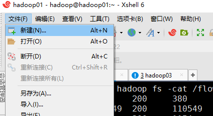
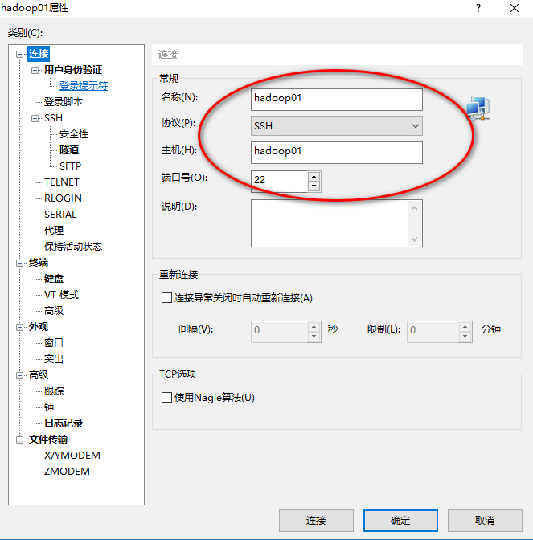
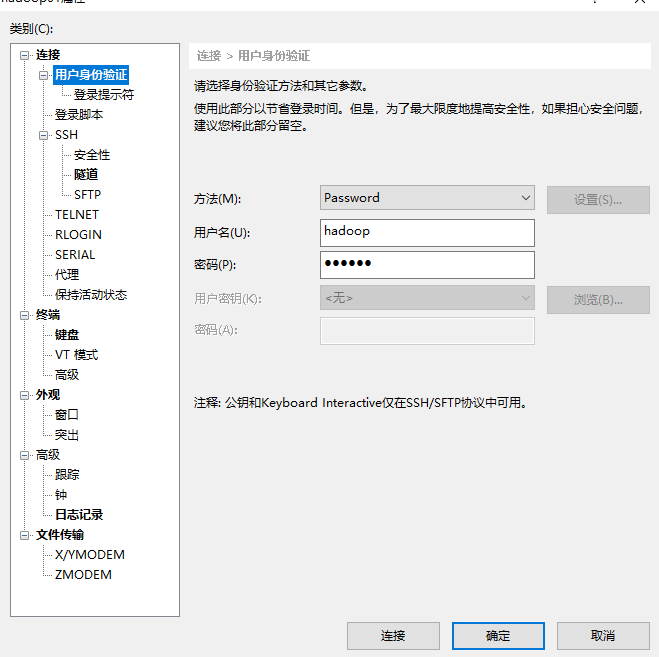
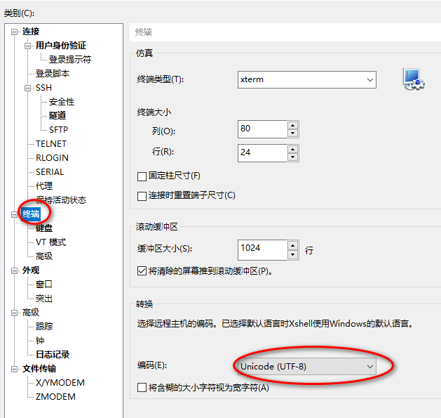
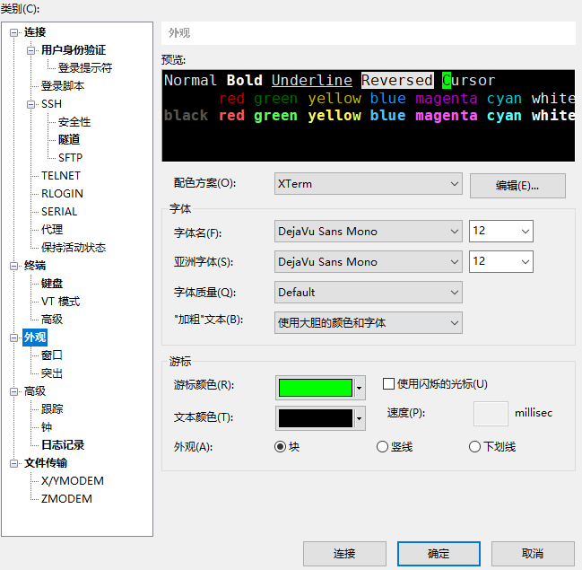
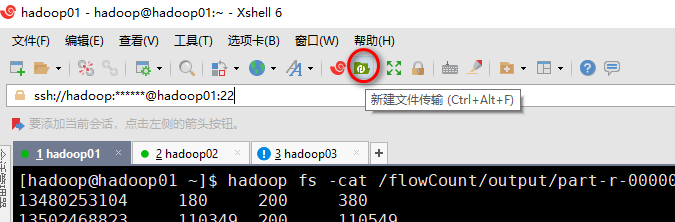
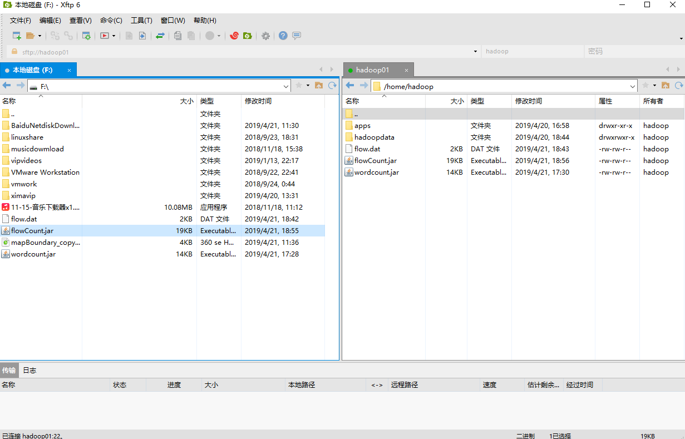

#  xshell与xftp的使用
## 使用xshell连接linux
#### 安装
正常安装即可

#### xshell连接linux配置
新建连接

配置协议、主机IP、端口

配置用户名密码

编码配置，防止乱码

颜色字体设置

打开xftp

## 使用xftpl与linux传输文件
#### 安装
正常安装即可

#### 与linux传输文件
非常简单，直接拖拽即可。

