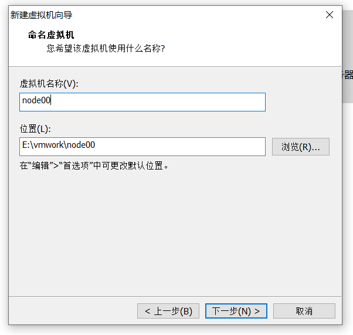
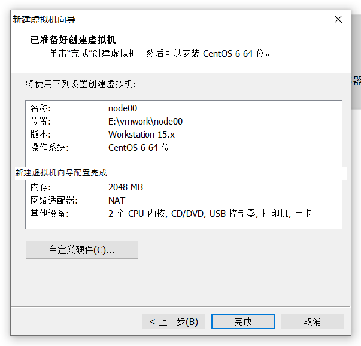

## 创建空壳虚拟机

新建虚拟机


下一步


选稍后


安装Linux系统对应的CentOS版，应该是vm15版本的原因没有CentOS 64的选项。


虚拟机命名和定位磁盘位置


处理器配置，看自己是否是双核、多核


设置内存为2GB


网络设置NAT


默认下一步


默认下一步


新建虚拟磁盘


设置磁盘容量


默认下一步，你在哪里存储这个磁盘文件


新建虚拟机向导配置完成


没必要使用声卡、打印机等


点完成。

## 连接镜像
右键设置


加载ISO


下面就可以开机安装系统了


## 安装系统


初始化欢迎进入页面，回车选择第一个开始安装配置，此外，在Ctrl+Alt可以实现Windows主机和VM之间窗口的切换


是否对CD媒体进行测试，直接跳过Skip


CentOS欢迎页面，直接点击Next


选择英文，工作中都是英文


默认美式键盘


默认


默认，格式化硬盘


主机名


选择时区，可以点击图形选择


设置root密码 （一定记住），123456就行了


硬盘分区，选自定义


根分区新建


创建Boot（引导）分区


创建swap分区


根目录所有的数据的分区(使用剩余大小)


下一步


格式化设备


下一步，安装引导程序


reboot(用的是最小化的安装包，比一般的少好几步)


## 开机配置
reboot后登录


查看ip配置


mac地址是由vm分配的(克隆的时候需要修改和这个一样)


配置ip


service network restart


ping一下百度和外面的本机，试试


外面的本机ping虚拟机试试


vm的网络配置(之前就配好了)


关闭防火墙&Selinux
```
service iptables stop
chkconfig iptables off

vi /etc/selinux/config
#修改这一行禁用
SELINUX=disabled
```


删除/etc/udev/rules.d/70-persistent-net.rules
```
rm -fr /etc/udev/rules.d/70-persistent-net.rules
```


poweroff关机

### 为什么要删除70-persistent-net.rules
VM：默认维护，每一台克隆，或，新建的虚拟机，MAC地址不重复

如果虚拟机保留 /etc/udev/rules.d/70-persistent-net.rules这个文件，在通过该虚拟机克隆的时候:
```
1，文件被带到新的虚拟机中
2，vm变更了新的虚拟机的mac地址
so：新机器不能使用eth0接口
你配置的/etc/sysconfig/network-scripts/ifcfg-eth0就不能应用
```

也可以保留这个文件，不过克隆后需要修改这个文件。删除这个文件简单方便一点。

## 对克隆模板拍摄快照


## 克隆节点
在最干净的快照克隆


使用完整的克隆


继续克隆node02、node03


## 配置克隆的节点
ip配置


配置主机名
vi /etc/sysconfig/network


hosts配置映射
vi /etc/hosts


每个节点都一样，主机名修改重启才生效。


还需要创建一个普通的用户，不能老是使用root用户。


配置 hadoop 用户 sudoer 权限
```
在 root 账号下，命令终端输入：vi /etc/sudoers

找到 root ALL=(ALL) ALL 这一行，

然后在他下面添加一行(yy复制行，p粘贴，i修改用户名)：

hadoop ALL=(ALL) ALL

保存，退出
```

 

poweroff关机，拍快照，方便以后环境清零测试。


重启之后在外面的Windows配置虚拟机的主机映射：
```
c:/windows/system32/drivers/etc/hosts   
```

```
192.168.216.31 node01
192.168.216.32 node02
192.168.216.33 node03
```


