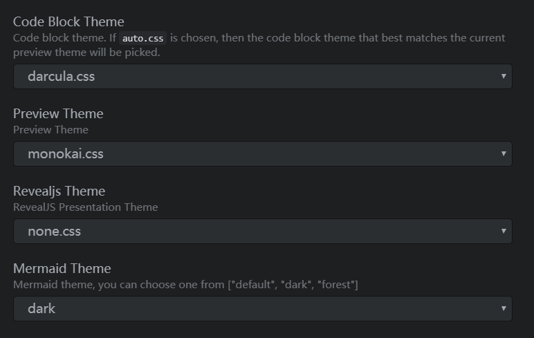

### 下载安装Atom
下载安装Atom：https://atom.io/

    下载zip的解压：直接安装exe无法选择安装路径

### 常用插件
| 插件                      | 作用             |
| ------------------------- | ---------------- |
| simplified-chinese-menu   | 中文补丁         |
| markdown-preview-enhanced | 实时预览增强插件 |
| Markdown-preview-plus     | 实时预览增强插件 |
| Markdown-table-editor     | 表格编辑插件     |
| Markdown-img-paste        | 图片粘贴插件     |
| language-markdown         | 代码增强         |
| markdown-scroll-sync      | 同步滚动         |

##### Markdown-img-paste
使用 ‘ctrl+shift+v’复制剪切板的图片到markdown

### 配置参考网址
https://sspai.com/post/40460
https://www.cnblogs.com/libin-1/p/6638165.html

### 使用主题
使用markdown-preview-enhanced可以选择主题：
一个黑色主题



### 自定义css
使用markdown-preview-enhanced可以自定义css，这个插件的文档有中文，修改`C:\Users\lenovo\.mume\style.less`文件即可。
```css
/* Please visit the URL below for more information: */
/*   https://shd101wyy.github.io/markdown-preview-enhanced/#/customize-css */ 

.markdown-preview.markdown-preview {
  // modify your style here
  // eg: background-color: blue;
	background-color: #434643;
	maggin:0px;
	padding:0px;
	h1,h2,h3,h4,h5,h6 {
		maggin:0px;
		color: #03A5FA;
		background-color: #293136;
		padding-top:5px;
		padding-bottom:5px;
		padding-left:5px;
  }
}
```

### 一些问题
##### 1、atom自动删除了我行末的空格？每次一保存就会自动删除空格
解决方法：   
【Edit】->【Preferences】->【Packages】->【whitespace】->【Settings】勾选掉 Ensure Single Trailing Newline 与 Remove Trailing Whitespace
