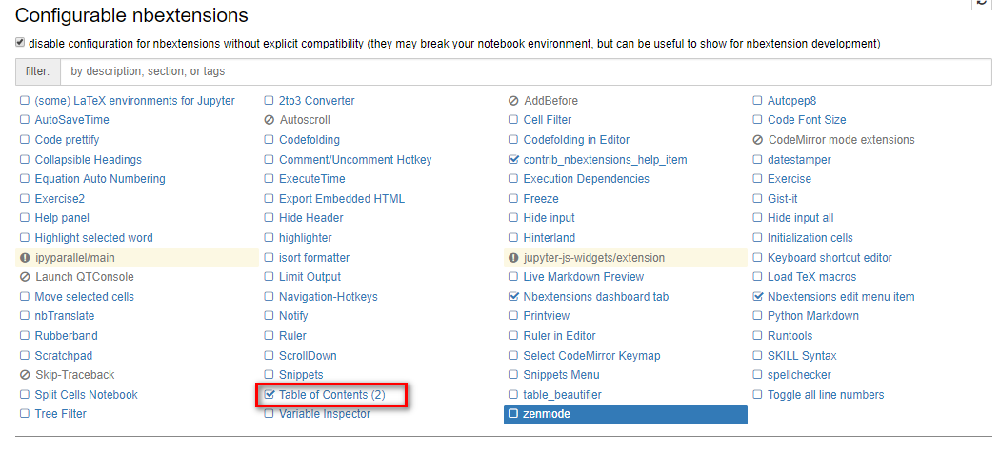
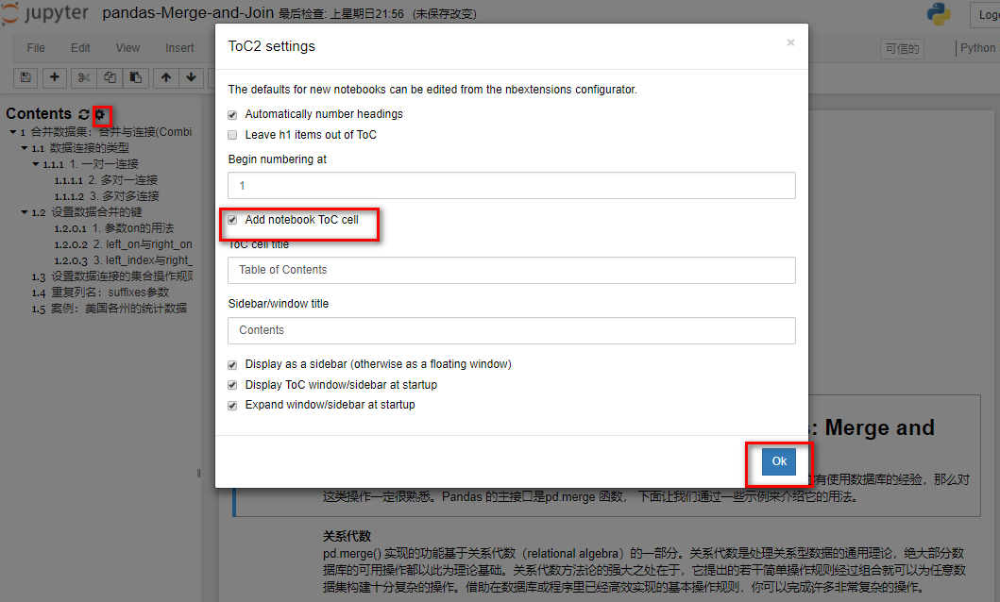

## 安装jupyter_contrib_nbextensions
输入`pip install jupyter_contrib_nbextensions`然后回车运行，来安装`jupyter_contrib_nbextensions`模块。
```
pip install jupyter_contrib_nbextensions
```

输入jupyter contrib nbextension install --user然后回车,初始化
```
jupyter contrib nbextension install --user
```

## jupyter_contrib_nbextensions配置与使用
启动`jupyter notebook`，会看到界面多了下面`Nbextensions`选项。
···
jupyter notebook
···


点击`Nbextensions`进来，把`Table of Contents(2)`进行勾选。



这个时候随便打开一个已经带有目录的.ipynb文件，这个时候主界面会多了一个红框内的一个按钮，但是仍然没有目录。


把红框内的按钮点击一下，这个时候目录就会显示出来了。


在notebook的开头添加目录跳转链接。



