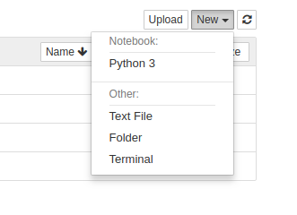

## Jupyter-Notebook 删除指定 kernel
`https://www.cnblogs.com/dotnetcrazy/p/9739118.html`

原来是Python3+C#

查看列表`jupyter kernelspec list`

删除指定kernel：`jupyter kernelspec remove icsharpkernel`

删除成功：（刷新一下）

**不同编程语言对应Kernel的下载地址**：https://github.com/jupyter/jupyter/wiki/Jupyter-kernels
