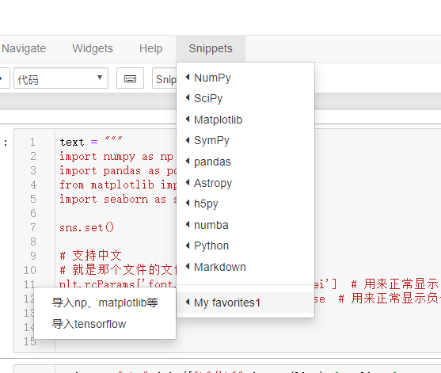

## 使用 Snippets Menu

### Windows
格式都在这`D:\Python37\Lib\site-packages\jupyter_contrib_nbextensions\nbextensions\snippets_menu`，直接修改这里的文件不行，不知道在哪缓存的文件。

可以加载自定义js文件，创建`C:\Users\lenovo\.jupyter\custom\custom.js`文件，添加下面的内容：
```js
require(["nbextensions/snippets_menu/main"], function (snippets_menu) {
    console.log('Loading `snippets_menu` customizations from `custom.js`');
    var horizontal_line = '---';
    var my_favorites = {
        "name" : "My favorites1",
        "sub-menu" : [
            {
                "name" : "导入np、matplotlib等",
                "snippet" : [
                            "import numpy as np",
                            "import pandas as pd",
                            "from matplotlib import pyplot as plt",
                            "import seaborn as sns",
                            "",
                            "sns.set()",
                            "",
                            "# 支持中文",
                            "# 就是那个文件的文件名，记得对照大小写",
                            "plt.rcParams['font.sans-serif'] = ['SimHei']  # 用来正常显示中文标签",
                            "plt.rcParams['axes.unicode_minus'] = False  # 用来正常显示负号",
                            "",
                            "%matplotlib inline"
                            ]
            },
            {
                "name" : "导入tensorflow",
                "snippet" : [
                            "import tensorflow as tf",
                            "from tensorflow import keras"
                            ]
            }
        ]
    };
    snippets_menu.options['menus'] = snippets_menu.default_menus;
    //debugger
	snippets_menu.options['menus'][0]['sub-menu'].push(horizontal_line);
    snippets_menu.options['menus'][0]['sub-menu'].push(my_favorites);
    console.log('Loaded `snippets_menu` customizations from `custom.js`');
});
```

效果：


生成这些语句(就是把每行的代码放到js数组中)：
```python
text = """
import numpy as np
import pandas as pd
from matplotlib import pyplot as plt
import seaborn as sns

sns.set()

# 支持中文
# 就是那个文件的文件名，记得对照大小写
plt.rcParams['font.sans-serif'] = ['SimHei']  # 用来正常显示中文标签
plt.rcParams['axes.unicode_minus'] = False  # 用来正常显示负号

%matplotlib inline
"""

codes =  ",\n".join(["\"{}\"".format(line) for line in text.strip().split("\n")])
print(codes)
```
