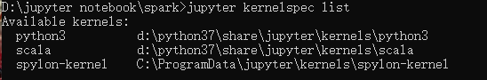
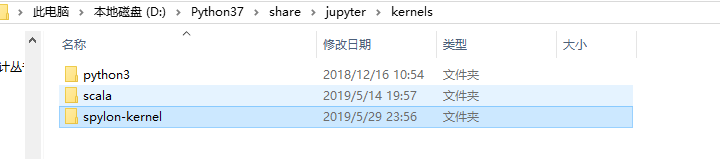
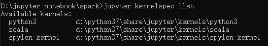
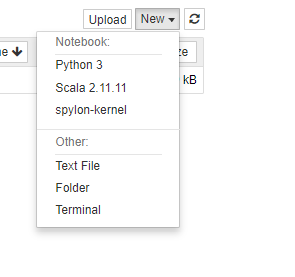
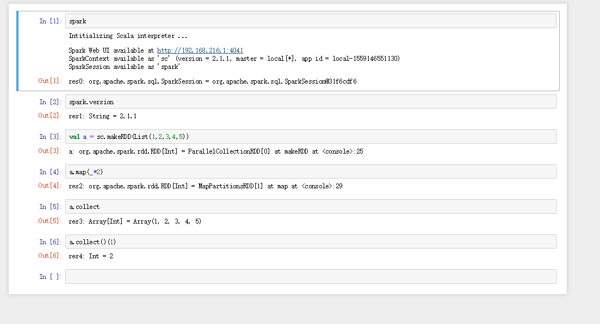

## 在 Windows上安装 jupyter notebook 的 spark核心
### 需要安装spylon-kernel
这个玩意，就是能在jupyter下使用spark核的关键了。之前也试过toree，但是怎么弄都不成功，后来在coding的建议下，使用这个spylon-kernel就成功了。 

安装也特别简单，cmd后，只要敲这2条命令就可以了： 

```
pip install spylon-kernel 
python -m spylon_kernel install
```

这个时候，CMD下，敲jupyter kernelspec list，应该就能看到，有3个核心


把这个核心复制到d盘



似乎据说：
这个spylon-kernel要求：
```
Apache Spark 2.1.1 compiled for Scala 2.11 
Jupyter Notebook 
Python 3.5+ 
```
所以这3个条件应该是必须满足的。

### 测试使用spylon-kernel




还是可以的，哈哈！

### 修改spylon-kernel改DataFrame显示类pandas
修改spylon-kernel的scala_magic.py的eval（执行scala代码）函数
```python
    def eval(self, code, raw):
        """Evaluates Scala code.

        Parameters
        ----------
        code: str
            Code to execute
        raw: bool
            True to return the raw result of the evalution, False to wrap it with
            MetaKernel classes

        Returns
        -------
        metakernel.process_metakernel.TextOutput or metakernel.ExceptionWrapper or
        the raw result of the evaluation
        """
        from IPython.display import HTML 
        
        intp = self._get_scala_interpreter()
        try:
            res = intp.interpret(code.strip())
            if raw:
                self.res = intp.last_result()
                return self.res
            else:
                if res:
                    if("<table border=" in res):
                        self.res = intp.last_result()
                        return HTML(self.res)
                    else:
                        return TextOutput(res)
        except ScalaException as ex:
            # Get the kernel response so far
            resp = self.kernel.kernel_resp
            # Wrap the exception for MetaKernel use
            resp['status'] = 'error'
            tb = ex.scala_message.split('\n')
            first = tb[0]
            assert isinstance(first, str)
            eclass, _, emessage = first.partition(':')
            return ExceptionWrapper(eclass, emessage, tb)
```
主要就是增加了
```python
                    if("<table border=" in res):
                        self.res = intp.last_result()
                        return HTML(self.res)
```


## spylon-kernel的使用
看官网地址
https://pypi.org/project/spylon-kernel/0.1.5/

github地址
https://github.com/Valassis-Digital-Media/spylon-kernel

配置例子：
```
%%init_spark
launcher.jars = ["file://some/jar.jar"]
launcher.master = "local[4]"
launcher.conf.spark.executor.cores = 8
```

```
%%init_spark
launcher.num_executors = 4
launcher.executor_cores = 2
launcher.driver_memory = '4g'
launcher.conf.set("spark.sql.catalogImplementation", "hive")
```

官方的一个例子，似乎可以在同一个文件中使用scala和python
[basic_example.ipynb](examples/basic_example.ipynb "basic_example.ipynb")
