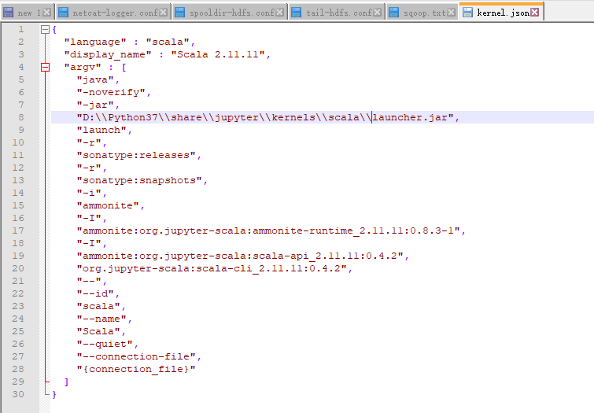
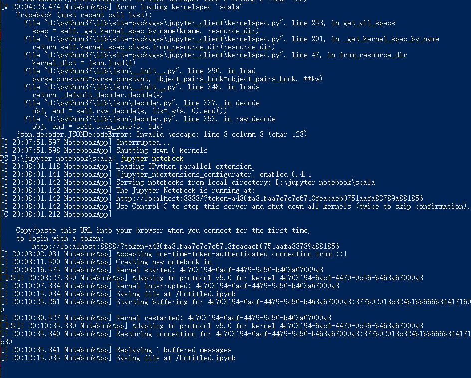
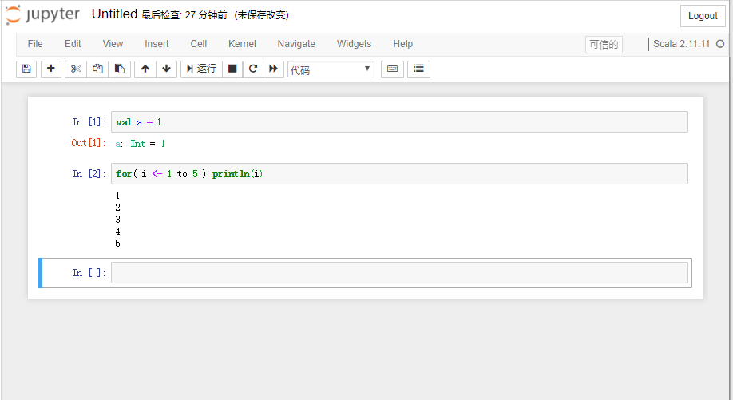

## 在 Windows上安装 jupyter notebook 的 scala kernel
1、下载 scala kernel 文件
https://github.com/rvilla87/Big-Data/raw/master/other/jupyter-Scala_2.11.11_kernel_Windows.zip

2、解压缩，查看readme.txt，里面的详细步骤如下： 
复制 coursier文件夹到 %USERPROFILE%目录下（windows+r 输入 %USERPROFILE% 然后回车 就可以直接进入该目录了）
复制 scala文件夹到你的jupyter kernel 目录，可能是： 
C:\Python\share\jupyter\kernels
C:\ProgramData\jupyter\kernels
编辑你刚刚复制的scala文件夹下的kernel.json文件，修改第八行，和之前类似，可能是： 
C:\Python\share\jupyter\kernels\scala\launcher.jar
C:\ProgramData\jupyter\kernels\scala\launcher.jar
然后就可以运行jupyter notebook 命令，选择scala kernel了

## 我的安装过程
复制 coursier文件夹到 %USERPROFILE%目录下

复制 scala文件夹到你的jupyter kernel 目录，可能是： 

编辑你刚刚复制的scala文件夹下的kernel.json文件，修改第八行：

cmd运行jupyter notebook

**刚开始的报错是由于路径里的一个反斜杠解析出错，改成两个反斜杠转义就好了**

效果：

## 在linux上安装 jupyter notebook 的 scala kernel
事实上，经过测试这个在linux中也是可用的  
* 复制 .coursier文件夹到`/home/hadoop`目录下  
* 复制 scala文件夹到`/usr/local/share/jupyter/kernels`目录下  
* 编辑你刚刚复制的scala文件夹下的kernel.json文件，修改第八行：`/usr/local/share/jupyter/kernels/scala/launcher.jar`

