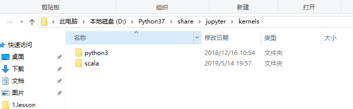

## 在 Windows上安装 jupyter notebook 的 scala kernel
1、下载 scala kernel 文件
https://github.com/rvilla87/Big-Data/raw/master/other/jupyter-Scala_2.11.11_kernel_Windows.zip

2、解压缩，查看readme.txt，里面的详细步骤如下： 
复制 coursier文件夹到 %USERPROFILE%目录下（windows+r 输入 %USERPROFILE% 然后回车 就可以直接进入该目录了）
复制 scala文件夹到你的jupyter kernel 目录，可能是： 
C:\Python\share\jupyter\kernels
C:\ProgramData\jupyter\kernels
编辑你刚刚复制的scala文件夹下的kernel.json文件，修改第八行，和之前类似，可能是： 
C:\Python\share\jupyter\kernels\scala\launcher.jar
C:\ProgramData\jupyter\kernels\scala\launcher.jar
然后就可以运行jupyter notebook 命令，选择scala kernel了

## 我的安装过程
复制 coursier文件夹到 %USERPROFILE%目录下


复制 scala文件夹到你的jupyter kernel 目录，可能是： 


编辑你刚刚复制的scala文件夹下的kernel.json文件，修改第八行：


cmd运行jupyter notebook


**刚开始的报错是由于路径里的一个反斜杠解析出错，改成两个反斜杠转义就好了**

效果：


## 自定义一些配置
### 修改coursier文件夹的路径
修改launcher.jar中的bootstrap.properties文件
```
#
#Sat Apr 08 18:18:27 CEST 2017
bootstrap.jarDir=${user.home}/.coursier/bootstrap/1.0.0-RC1
bootstrap.mainClass=coursier.cli.Coursier
```
改为
```
#
#Sat Apr 08 18:18:27 CEST 2017
bootstrap.jarDir=D:/java-apps/coursier/bootstrap/1.0.0-RC1
bootstrap.mainClass=coursier.cli.Coursier

```
然后就可以把coursier文件夹放到对应的位置了，


### 加载额外的jar包
他的代码经过反编译之后都是a、b、c、d等应该是经过处理了，找不到在呢设置classpath了，而且在他的maven中加入其它的依赖也不会加载。

于是就想到替换他本来的jar包，把其它的依赖也加进去，方便测试。

直接把jar改革名字替换上去是不行的，因为他对文件做了校验，把替换jar的校验文件也修改了修好了。使用的是`sha1` 加密，把文件的加密值算出来，把校验文件也修改了就行了。这样java的一些库也可以用notebook测试了(当然使用scala的语法)。

```xml
<dependency>
    <groupId>commons-codec</groupId>
    <artifactId>commons-codec</artifactId>
    <version>1.14</version>
    <scope>test</scope>
</dependency>
```

```java
package com;

import org.apache.commons.codec.digest.DigestUtils;

import java.io.File;

import static org.apache.commons.codec.digest.MessageDigestAlgorithms.SHA_1;

public class TestSha1 {
    public static void main(String[] args) throws Exception {
        File file = new File("D:\\java-apps\\coursier\\cache\\v1\\https\\repo1.maven.org\\maven2\\org\\jsoup\\jsoup\\1.10.2\\jsoup-1.10.2.jar");
        String hex = new DigestUtils(SHA_1).digestAsHex(file);
        System.out.println(hex);
    }
}
```

修改的文件：


## 在linux上安装 jupyter notebook 的 scala kernel
事实上，经过测试这个在linux中也是可用的  
* 复制 .coursier文件夹到`/home/hadoop`目录下  
* 复制 scala文件夹到`/usr/local/share/jupyter/kernels`目录下  
* 编辑你刚刚复制的scala文件夹下的kernel.json文件，修改第八行：`/usr/local/share/jupyter/kernels/scala/launcher.jar`


