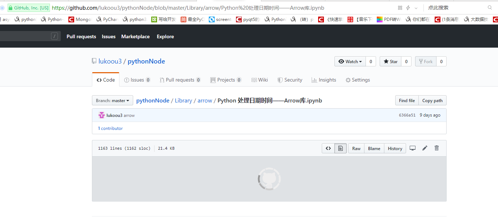
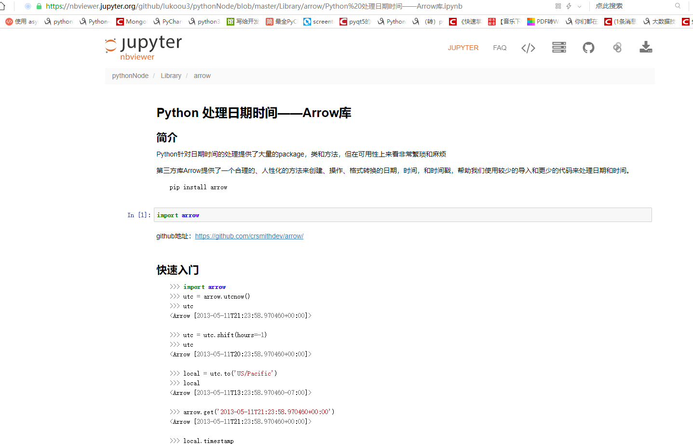
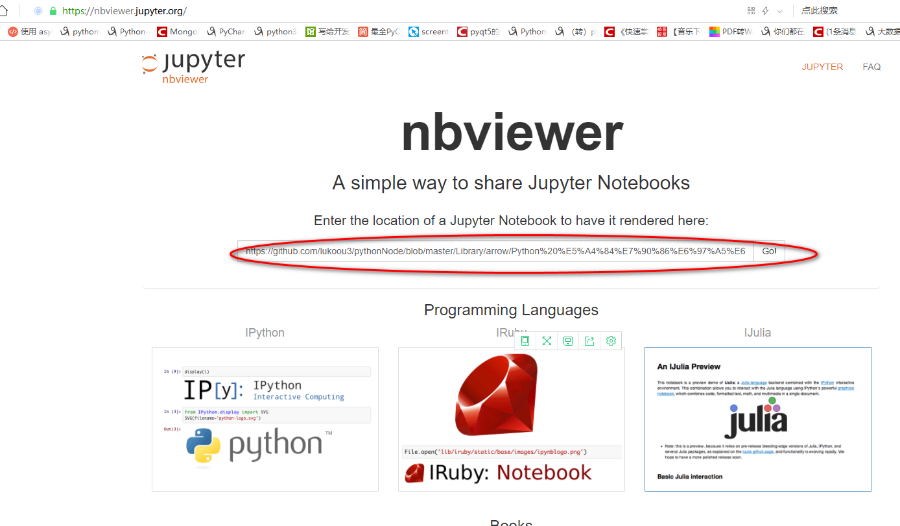

## 如何用浏览器在线查看.ipynb文件
当我们用jupyter notebook编辑好.ipynb文件后，肯定会想不用运行jupyter notebook也能方便得查看.ipynb的文件，如果直接打开.ipynb的文件，我们会发现这是一种类似于json格式的文件，需要解析器解析之后才便于人眼阅读。那怎么办呢，难道非得运行jupyter notebook不可？当然不用。github现在已支持渲染.ipynb的文件，所以可以在github上专门建一个repo，然后把.ipynb的文件上传到这个repo中，这样以后你就可以在任何联网的机器上浏览你上传的.ipynb文件了。其实jupyter团队也为我们提供了专门的渲染服务，如果你想以jupyter的渲染风格查看你上传到github上的.ipynb文件，可以加上http://nbviewer.ipython.org的前缀。下面举例说明：

step1: 我上传了一个.ipynb文件到我的github上，得到其URL：https://github.com/tracy-talent/Notes/blob/master/blogs/Untitled.ipynb

step2: 截取上面URL中github.com之后的部分，然后与http://nbviewer.ipython.org拼接并且加上github标识得到新的URL：https://nbviewer.jupyter.org/github/tracy-talent/Notes/blob/master/blogs/Untitled.ipynb, 也可以与https://colab.research.google.com/github拼接得到新的URL:https://colab.research.google.com/github/tracy-talent/Notes/blob/master/blogs/Untitled.ipynb

#### 测试
我的ipynb文件：
https://github.com/lukoou3/pythonNode/blob/master/Library/arrow/Python%20%E5%A4%84%E7%90%86%E6%97%A5%E6%9C%9F%E6%97%B6%E9%97%B4%E2%80%94%E2%80%94Arrow%E5%BA%93.ipynb

在github上打开太慢：

打开这个url：
https://nbviewer.jupyter.org/github/lukoou3/pythonNode/blob/master/Library/arrow/Python%20处理日期时间——Arrow库.ipynb

或者直接在https://nbviewer.jupyter.org网站的首页输入ipynb文件的地址也可以：

