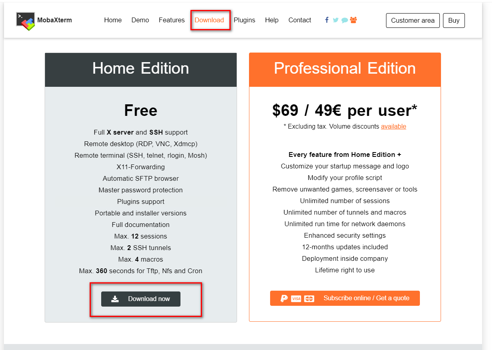
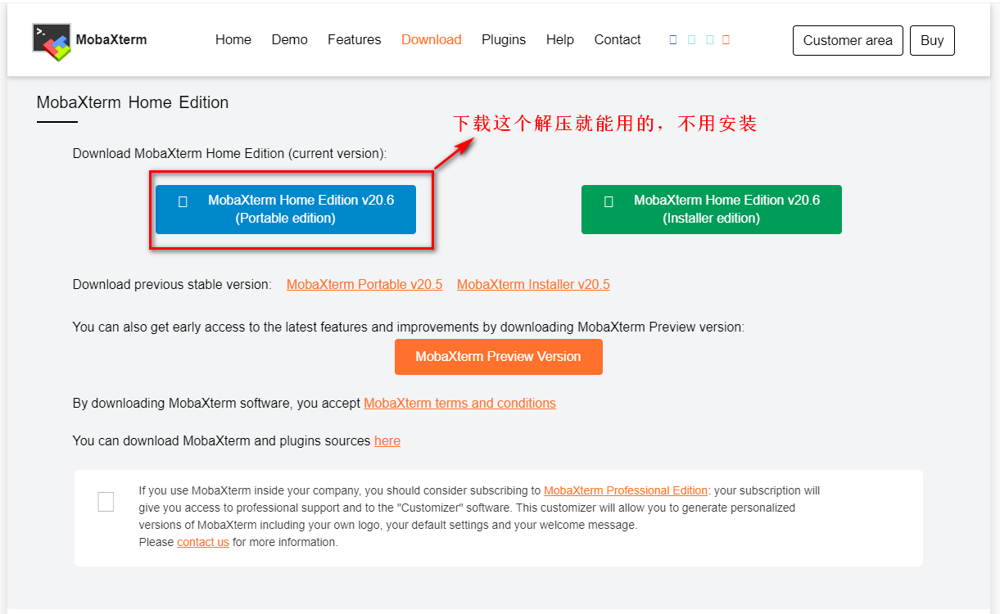
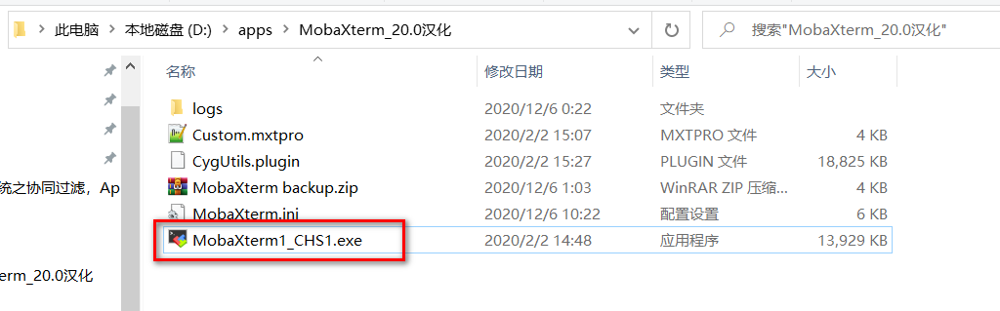
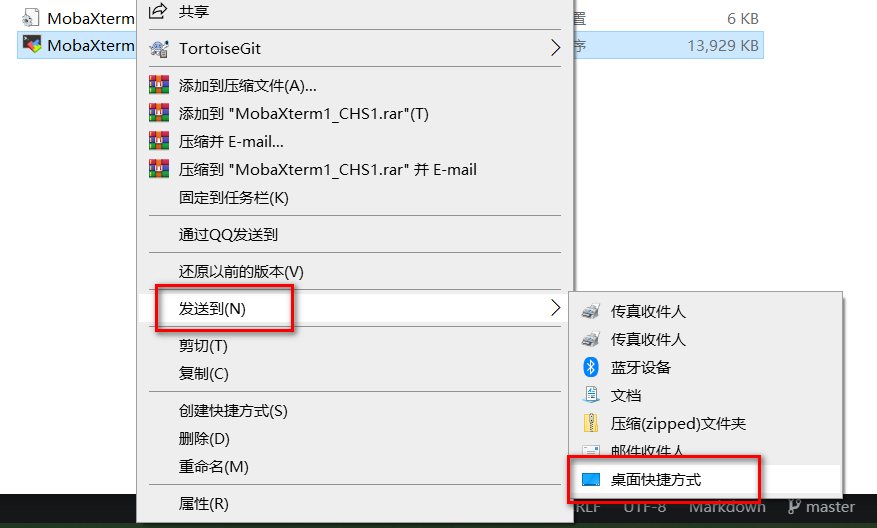

# 01-MobaXterm简介安装

**MobaXterm 分免费开源版和收费专业版**。官网提供 MobaXterm 的免费开源版 "Home Edition" 下载, 免费开源版又分便捷版(解压即用)和安装版(需要一步步安装)。MobaXterm 免费版(persional)和专业版(Professional)除了 sessions 数、SSH tunnels 数和其他一些定制化配置外限制外，免费版在终端底部还多了一个 "UNREGISTERED VERSION" 提示。

**MobaXterm主要功能**：

* 支持各种连接 SSH，X11，RDP，VNC，FTP，MOSH  
* 支持 Unix 命令(bash，ls，cat，sed，grep，awk，rsync，…)  
* 连接 SSH 终端后支持 SFTP 传输文件  
* 各种丰富的插件(git/dig/aria2…)  
* 可运行 Windows 或软件  

## 下载

### 官网原版
直接去官网的Download页面，下载免费开源即可。

### 汉化版的
MobaXterm官方免费开源原版为英文版，不过网上有网友提供的MobaXterm 中文汉化版，找到下载即可。

## 安装
解压版的直接解压双击exe运行即可。

向桌面发送快捷方式：
