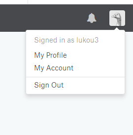
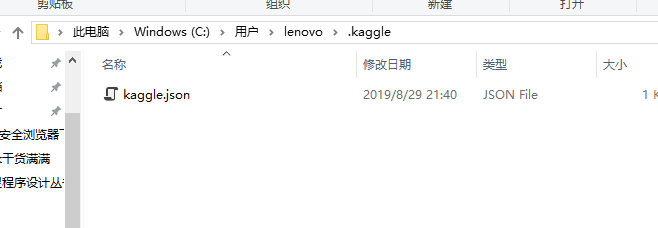
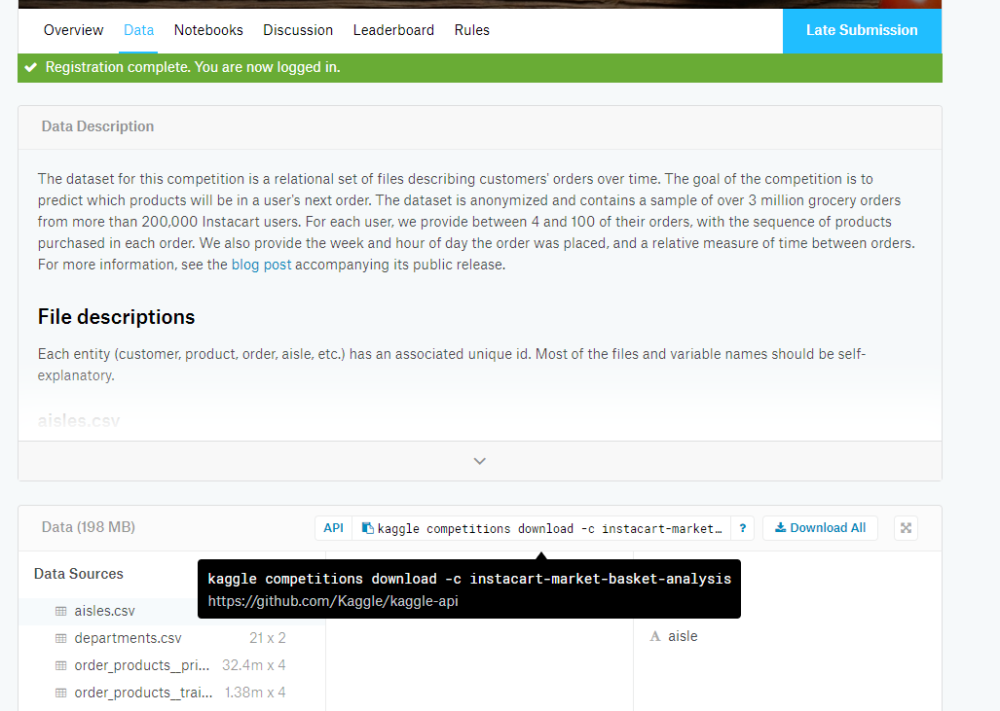
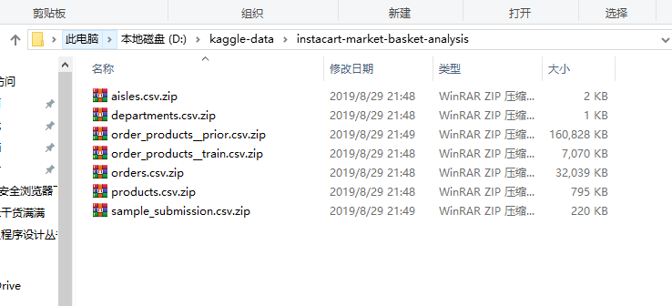

假设我们现在需要下载kaggle上面的一个图像数据集instacart-market-basket-analysis，首先需要accept rules。然后才能下载，其具体下载过程为：

（1）安装python中的kaggle库（常用anaconda安装：pip install kaggle）

（2）登录自己的kaggle账号，并打开My Account：

（3）选择create NEW API Token，下载一个json文件

（4）将这个文件移动到C:\Users\lenovo\.kaggle文件夹中

5）命令行下载数据集，命令直接在页面上复制即可：
kaggle competitions download -c instacart-market-basket-analysis

（6）查看下载后的结果：
