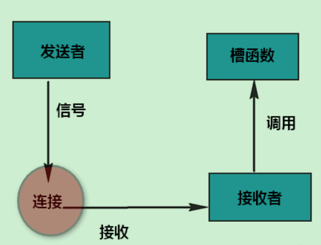
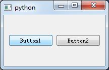
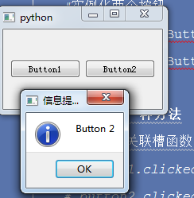
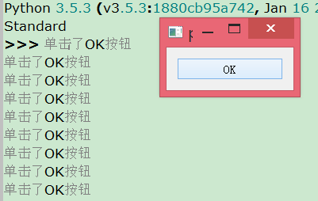
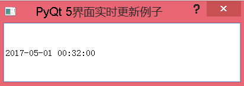
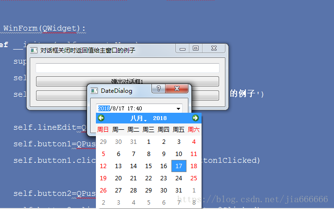
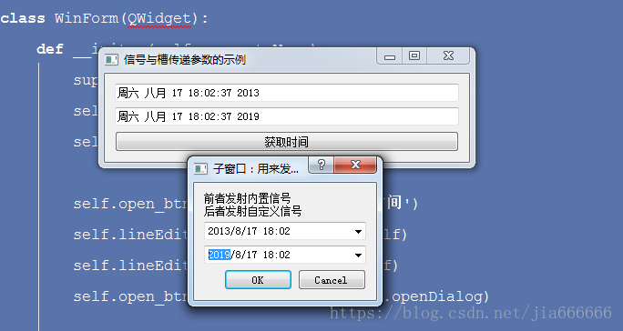
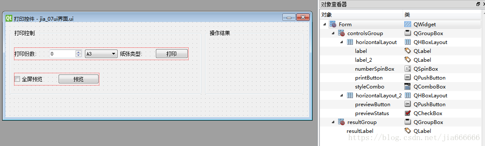
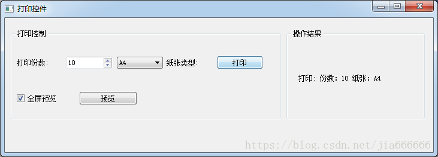

# 事件与信号处理
GUI应用程序是事件驱动的。 事件主要由应用程序的用户生成。 但它们也可以通过其他手段产生，例如：网络连接，窗口管理器或定时器。 当我们调用应用程序的exec_（）方法时，应用程序进入主循环。 主循环获取事件并将其发送到对象。

在事件模型中，有三个参与者：  
* 事件来源  
* 事件对象  
* 事件目标  

事件源是其状态更改的对象。 它会生成事件。 事件对象（event）将状态更改封装在事件源中。 事件目标是要通知的对象。 事件源对象将处理事件的任务委托给事件目标。  

PyQt5具有独特的信号和插槽机制来处理事件。 信号和槽用于对象之间的通信。 发生特定事件时发出信号。 槽可以是任何Python可调用的函数。 当发射连接的信号时会调用一个槽。

## 一、信号和槽基本用法
信号和槽是一种高级接口，应用于对象之间的通信，它是 QT 的核心特性，也是 QT 区别于其它工具包的重要地方。它为高层次的事件处理自动生成所需要的附加代码。在我们所熟知的很多 GUI 工具包中，窗口小部件 (widget) 都有一个回调函数用于响应它们能触发的每个动作，这个回调函数通常是一个指向某个函数的指针。但是，在 QT 中信号和槽取代了这些凌乱的函数指针，使得我们编写这些通信程序更为简洁明了。

所有从 QObject 或其子类 ( 例如 Qwidget) 派生的类都能够包含信号和槽。当对象改变其状态时，信号就由该对象发射 (emit) 出去，这就是对象所要做的全部事情，它不知道另一端是谁在接收这个信号。这就是真正的信息封装，它确保对象被当作一个真正的软件组件来使用。槽用于接收信号，但它们是普通的对象成员函数。一个槽并不知道是否有任何信号与自己相连接。而且，对象并不了解具体的通信机制。

你可以将很多信号与单个的槽进行连接，也可以将单个的信号与很多的槽进行连接，甚至于将一个信号与另外一个信号相连接也是可能的，这时无论第一个信号什么时候发射系统都将立刻发射第二个信号。总之，信号与槽构造了一个强大的部件编程机制。


说实话对于像我这样的新手来说看着就蛋疼，想学会它没办法，我们还是简化一下概念吧：  
```
所有QObject类都可以使用信号槽，换句话来说继承自pyqt中的类基本上都可以使用信号槽机制。当然非QObject也是可以通过其他一些办法来使用信号槽的。
仅仅有了信号和槽是不行的，我们还需要了解：  
信号(Signal)、槽(slot)、连接(connect)、动作事件(action)、发射(emit)、发送者、接受者等等一些列的知识。
```

### 简单的信号与槽示例
代码：
```python
import sys
from PyQt5.QtCore import Qt
from PyQt5.QtWidgets import (QWidget, QLCDNumber, QDial, QApplication)

class Example(QWidget):
    def __init__(self):
        super().__init__()
        self.initUi()

    def initUi(self):
        lcd = QLCDNumber(self)
        dial = QDial(self)

        self.setGeometry(300, 300, 350, 250)
        self.setWindowTitle('学点编程吧')

        lcd.setGeometry(100,50,150,60)
        dial.setGeometry(120,120,100,100)

        dial.valueChanged.connect(lcd.display)

        self.show()

if __name__ == '__main__':
    app = QApplication(sys.argv)
    ex = Example()
    sys.exit(app.exec_())
```
这个例子的执行结果如下：


绑定槽函数的代码：
```python
dial.valueChanged.connect(lcd.display)
```

### 继承重载pyqt对象的事件函数来处理信号
重写QWidget的keyPressEvent函数来控制按下按钮后要如何处理
```python
import sys
from PyQt5.QtCore import Qt
from PyQt5.QtWidgets import (QWidget, QApplication, QLabel)
class Example(QWidget):
    def __init__(self):
        super().__init__()
        self.initUi()
    def initUi(self):
        self.setGeometry(300, 300, 350, 250)
        self.setWindowTitle('学点编程吧')
        self.lab = QLabel('方向',self)
        self.lab.setGeometry(150,100,50,50)
        self.show()
    def keyPressEvent(self, e):
        if e.key() == Qt.Key_Up:
            self.lab.setText('↑')
        elif e.key() == Qt.Key_Down:
            self.lab.setText('↓')
        elif e.key() == Qt.Key_Left:
            self.lab.setText('←')
        else:
            self.lab.setText('→')
if __name__ == '__main__':
    app = QApplication(sys.argv)
    ex = Example()
    sys.exit(app.exec_())
```
这个例子的执行结果如下：


### 获取信号的发送者
有时，知道哪个窗口小部件是信号的发送者非常有用。 为此，PyQt5具有sender()方法。例如下面这个例子，我们实现了简单的石头、剪刀、布的小游戏。
```python
import sys
from PyQt5.QtWidgets import (QApplication, QMessageBox, QWidget, QPushButton)
from random import randint
class Example(QWidget):
    def __init__(self):
        super().__init__()
        self.initUI()
    def initUI(self):
        self.setGeometry(200, 200, 300, 300)
        self.setWindowTitle('学点编程吧')
        bt1 = QPushButton('剪刀',self)
        bt1.setGeometry(30,180,50,50)
        bt2 = QPushButton('石头',self)
        bt2.setGeometry(100,180,50,50)
        bt3 = QPushButton('布',self)
        bt3.setGeometry(170,180,50,50)
        bt1.clicked.connect(self.buttonclicked)
        bt2.clicked.connect(self.buttonclicked)
        bt3.clicked.connect(self.buttonclicked)
        self.show()
    def buttonclicked(self):
        computer = randint(1,3)
        player = 0
        sender = self.sender()
        if sender.text() == '剪刀':
            player = 1
        elif sender.text() == '石头':
            player = 2
        else:
            player = 3
        if player == computer:
            QMessageBox.about(self, '结果', '平手')
        elif player == 1 and computer == 2:
            QMessageBox.about(self, '结果', '电脑：石头，电脑赢了！')
        elif player == 2 and computer == 3:
            QMessageBox.about(self, '结果', '电脑：布，电脑赢了！')
        elif player == 3 and computer == 1:
            QMessageBox.about(self,'结果','电脑：剪刀，电脑赢了！')
        elif computer == 1 and player == 2:
            QMessageBox.about(self,'结果','电脑：剪刀，玩家赢了！')
        elif computer == 2 and player == 3:
            QMessageBox.about(self,'结果','电脑：石头，玩家赢了！')
        elif computer == 3 and player == 1:
            QMessageBox.about(self,'结果','电脑：布，玩家赢了！')
if __name__ == '__main__':
    app = QApplication(sys.argv)
    ex = Example()
    sys.exit(app.exec_())
```
这个例子的执行结果如下：


### 自定义信号
#### 用pyqtSignal定义新信号
PyQt5自动定义所有Qt内置信号的信号。可以使用pyqtSignal工厂将新信号定义为类属性。新信号只应在QObject的子类中定义 。它们必须是类定义的一部分，并且在定义类之后不能作为类属性动态添加。
```python 
PyQt5.QtCore.pyqtSignal（types [，name [，revision = 0 [，arguments = [] ] ] ] ）
```
创建一个或多个重载的未绑定信号作为类属性。  
参数：	
* types - 定义信号的C ++签名的类型。每种类型可以是Python类型对象，也可以是C ++类型名称的字符串。或者，每个可以是一系列类型参数。在这种情况下，每个序列定义不同信号过载的签名。第一个重载将是默认值。  
* name - 信号的名称。如果省略，则使用class属性的名称。这可能只作为关键字参数给出。  
* revision - 导出到QML的信号的修订版。这可能只作为关键字参数给出。  
* arguments - 导出到QML的信号参数名称的序列。这可能只作为关键字参数给出。  

返回类型：  	 
* 一个未绑定的信号  


以下示例显示了许多新信号的定义：
```python 
from PyQt5.QtCore import QObject, pyqtSignal

class Foo(QObject):

    # This defines a signal called 'closed' that takes no arguments.
    closed = pyqtSignal()

    # This defines a signal called 'rangeChanged' that takes two
    # integer arguments.
    range_changed = pyqtSignal(int, int, name='rangeChanged')

    # This defines a signal called 'valueChanged' that has two overloads,
    # one that takes an integer argument and one that takes a QString
    # argument.  Note that because we use a string to specify the type of
    # the QString argument then this code will run under Python v2 and v3.
    valueChanged = pyqtSignal([int], ['QString'])
```

以下代码演示了不带参数的信号的定义，连接和发出：
```python 
from PyQt5.QtCore import QObject, pyqtSignal

class Foo(QObject):

    # Define a new signal called 'trigger' that has no arguments.
    trigger = pyqtSignal()

    def connect_and_emit_trigger(self):
        # Connect the trigger signal to a slot.
        self.trigger.connect(self.handle_trigger)

        # Emit the signal.
        self.trigger.emit()

    def handle_trigger(self):
        # Show that the slot has been called.

        print "trigger signal received"
```

自定义信号例子：
```python 
from PyQt5 import QtWidgets,QtCore
from untitled import Ui_Form
import  time
  
class MyWindow(QtWidgets.QWidget,Ui_Form):
    _signal=QtCore.pyqtSignal(str)                         #定义信号,定义参数为str类型
    def __init__(self):  
        super(MyWindow,self).__init__()
        self.setupUi(self)
        self.myButton.clicked.connect(self.myPrint)
        self._signal.connect(self.mySignal)               #将信号连接到函数mySignal
 
    def myPrint(self):
        self.tb.setText("")
        self.tb.append("正在打印，请稍候")
        self._signal.emit("你妹，打印结束了吗，快回答！")
    def mySignal(self,string):
        print(string)
        self.tb.append("打印结束")
 
if __name__=="__main__":  
    import sys  
  
    app=QtWidgets.QApplication(sys.argv)  
    myshow=MyWindow()
    myshow.show()  
    sys.exit(app.exec_())  

```

## 二、信号与槽的高级用法
在Qt中，每一个QObject对象和PyQt中所有继承自QWidget的控件（这些都是QObject的子对象）都支持信号与槽机制。当信号发射时，连接的槽函数将会自动执行。在PyQt 5中信号与槽通过object.signal.connect()方法连接。

PyQt的窗口控件类中有很多内置信号，开发者也可以添加自定义信号。信号与槽具有如下特点。  
* 一个信号可以连接多个槽。  
* 一个信号可以连接另一个信号。  
* 信号参数可以是任何Python类型。  
* 一个槽可以监听多个信号。  
* 信号与槽的连接方式可以是同步连接，也可以是异步连接。  
* 信号与槽的连接可能会跨线程。  
* 信号可能会断开。  

在GUI编程中，当改变一个控件的状态时（如单击了按钮），通常需要通知另一个控件，也就是实现了对象之间的通信。在早期的GUI编程中使用的是回调机制，在Qt中则使用一种新机制——信号与槽。在编写一个类时，要先定义该类的信号与槽，在类中信号与槽进行连接，实现对象之间的数据传输。信号与槽机制示意图如图所示。 


当事件或者状态发生改变时，就会发出信号。同时，信号会触发所有与这个事件（信号）相关的函数（槽）。信号与槽可以是多对多的关系。一个信号可以连接多个槽，一个槽也可以监听多个信号。

### 1 高级自定义信号与槽
所谓高级自定义信号与槽，指的是我们可以以自己喜欢的方式定义信号与槽函数，并传递参数。自定义信号的一般流程如下：

（1）定义信号。

（2）定义槽函数。

（3）连接信号与槽函数。

（4）发射信号。

##### 1．定义信号
通过类成员变量定义信号对象。
```python 
class MyWidget(QWidget):  
    # 无参数的信号
    Signal_NoParameters = pyqtSignal()     
    # 带一个参数(整数)的信号      
    Signal_OneParameter = pyqtSignal(int)         
    # 带一个参数(整数或者字符串)的重载版本的信号        
    Signal_OneParameter_Overload = pyqtSignal([int],[str])  
    # 带两个参数(整数,字符串)的信号      
        Signal_TwoParameters = pyqtSignal(int,str)    
    # 带两个参数([整数,整数]或者[整数,字符串])的重载版本的信号      
    Signal_TwoParameters_Overload = pyqtSignal([int,int],[int,str]) 
```

##### 2．定义槽函数
定义一个槽函数，它有多个不同的输入参数。
```python 
class MyWidget(QWidget):  
    def setValue_NoParameters(self):   
        '''无参数的槽函数'''  
        pass  

    def setValue_OneParameter(self,nIndex):   
        '''带一个参数(整数)的槽函数'''  
        pass

    def setValue_OneParameter_String(self,szIndex):   
        '''带一个参数(字符串)的槽函数'''  
        pass 

    def setValue_TwoParameters(self,x,y):   
        '''带两个参数(整数,整数)的槽函数'''  
        pass  

    def setValue_TwoParameters_String(self,x,szY):   
        '''带两个参数(整数,字符串)槽函数'''  
        pass
```

##### 3．连接信号与槽函数
通过connect方法连接信号与槽函数或者可调用对象。
```python 
app = QApplication(sys.argv)   
widget = MyWidget()   
# 连接无参数的信号
widget.Signal_NoParameters.connect(self.setValue_NoParameters )                                          

# 连接带一个整数参数的信号
widget.Signal_OneParameter.connect(self.setValue_OneParameter)                                         

# 连接带一个整数参数，经过重载的信号
widget.Signal_OneParameter_Overload[int].
    connect(self.setValue_OneParameter)                              

# 连接带一个整数参数，经过重载的信号
widget.Signal_OneParameter_Overload[str].
    connect(self.setValue_OneParameter_String )                     

# 连接一个信号，它有两个整数参数
widget.Signal_TwoParameters.connect(self.setValue_TwoParameters )                                        

# 连接带两个参数(整数,整数)的重载版本的信号
widget.Signal_TwoParameters_Overload[int,int].
    connect(self.setValue_TwoParameters )                      

# 连接带两个参数(整数,字符串)的重载版本的信号
widget.Signal_TwoParameters_Overload[int,str].
    connect(self.setValue_TwoParameters_String )              
widget.show()  
```

##### 4．发射信号
通过emit方法发射信号。
```python 
class MyWidget(QWidget):  

    def mousePressEvent(self, event):  
        # 发射无参数的信号
        self.Signal_NoParameters.emit() 
        # 发射带一个参数(整数)的信号
        self.Signal_OneParameter.emit(1) 
        # 发射带一个参数(整数)的重载版本的信号
        self.Signal_OneParameter_Overload.emit(1)
        # 发射带一个参数(字符串)的重载版本的信号
        self.Signal_OneParameter_Overload.emit("abc")
        # 发射带两个参数(整数,字符串)的信号
        self.Signal_TwoParameters.emit(1,"abc")
        # 发射带两个参数(整数,整数)的重载版本的信号
        self.Signal_TwoParameters_Overload.emit(1,2)
        # 发射带两个参数(整数,字符串)的重载版本的信号
        self.Signal_TwoParameters_Overload.emit (1,"abc") 
```

##### 5．实例
本例文件名为PyQt5/Chapter07/qt07_signalSlot02.py，其完整代码如下：
```python 
from PyQt5.QtCore import QObject , pyqtSignal

class CustSignal(QObject):

    #声明无参数的信号
    signal1 = pyqtSignal()

    #声明带一个int类型参数的信号
    signal2 = pyqtSignal(int)

    #声明带int和str类型参数的信号
    signal3 = pyqtSignal(int,str)

    #声明带一个列表类型参数的信号
    signal4 = pyqtSignal(list)

    #声明带一个字典类型参数的信号
    signal5 = pyqtSignal(dict)

    #声明一个多重载版本的信号，包括带int和str类型参数的信号和带str类型参数的信号
    signal6 = pyqtSignal([int,str], [str])

    def __init__(self,parent=None):
        super(CustSignal,self).__init__(parent)

        #将信号连接到指定槽函数
        self.signal1.connect(self.signalCall1)
        self.signal2.connect(self.signalCall2)
        self.signal3.connect(self.signalCall3)
        self.signal4.connect(self.signalCall4)
        self.signal5.connect(self.signalCall5)
        self.signal6[int,str].connect(self.signalCall6)
        self.signal6[str].connect(self.signalCall6OverLoad)

        #发射信号
        self.signal1.emit()
        self.signal2.emit(1)
        self.signal3.emit(1,"text")
        self.signal4.emit([1,2,3,4])
        self.signal5.emit({"name":"wangwu","age":"25"})
        self.signal6[int,str].emit(1,"text")
        self.signal6[str].emit("text")

    def signalCall1(self):
        print("signal1 emit")

    def signalCall2(self,val):
        print("signal2 emit,value:",val)

    def signalCall3(self,val,text):
        print("signal3 emit,value:",val,text)

    def signalCall4(self,val):
        print("signal4 emit,value:",val)

    def signalCall5(self,val):
        print("signal5 emit,value:",val)

    def signalCall6(self,val,text):
        print("signal6 emit,value:",val,text)

    def signalCall6OverLoad(self,val):
        print("signal6 overload emit,value:",val)

if __name__ == '__main__':  
    custSignal = CustSignal()
```
运行结果如下：
```python
signal1 emit
signal2 emit,value: 1
signal3 emit,value: 1 text
signal4 emit,value: [1, 2, 3, 4]
signal5 emit,value: {'name': 'wangwu', 'age': '25'}
signal6 emit,value: 1 text
signal6 overload emit,value: text
```

### 2 使用自定义参数
在pyqt编程过程中，经常会遇到给槽函数传递自定义参数的情况，比如有一个信号与槽函数的连接是
```python
button.clicked.connect(show_page)
```
我们知道对于clicked信号，它是没有参数的，对于show_page函数来说，希望他可以接受参数，希望show_page函数如下这样
```python
def show_page(self,name):
    print(name,'点击了')
```
于是就会产生一个问题，信号发出的参数个数与槽函数接受的参数个数不一，那么如何解决这个问题呢，这里提供两种解决方法；   
* 第一种：lamdba表达式   
* 第二种：使用functools中的partial函数   

两种方法，下面均已写上，自己可运行查看，注意注释 ,代码如下：
```python
import sys
from PyQt5.QtWidgets import *
from functools import partial

class WinForm(QMainWindow):
    def __init__(self,parent=None):
        super(WinForm, self).__init__(parent)
        #实例化两个按钮
        button1=QPushButton('Button1')
        button2=QPushButton('Button2')

        #todo 第一种方法
        #单击信号关联槽函数，利用Lanbda表达式传递一个参数
        # button1.clicked.connect(lambda :self.onButtonClick(1))
        # button2.clicked.connect(lambda :self.onButtonClick(2))
        #
        #todo 第二种方法
        button1.clicked.connect(partial(self.onButtonClick, 1))
        button2.clicked.connect(partial(self.onButtonClick, 2))

        #实例化窗口
        main=QWidget()

        #设置窗口的布局，并向其中添加控件
        layout=QHBoxLayout(main)
        layout.addWidget(button1)
        layout.addWidget(button2)

        #设置为中央控件
        self.setCentralWidget(main)
    def onButtonClick( self,n ):

        #弹窗信息提示框，输出被点击的信息
        print("Button {0}".format(n))
        QMessageBox.information(self,'信息提示框','Button {0}'.format(n))
if __name__ == '__main__':
    app=QApplication(sys.argv)
    form=WinForm()
    form.show()
    sys.exit(app.exec_())
```
运行效果如图所示
  

重点代码：  
使用lambda表达式传递按钮数字给槽函数，当然还可以传递其他东西，甚至是按钮本身
```python
button1.clicked.connect(lambda :self.onButtonClick(1))
button2.clicked.connect(lambda :self.onButtonClick(2))
```
另一种方法是使用functools中的partial函数
```python
button1.clicked.connect(partial(self.onButtonClick, 1))
button2.clicked.connect(partial(self.onButtonClick, 2))
```
采用哪种方法好一点呢？这属于风格问题，笔者比较喜欢使用lambda表达式，因为其条理清晰，而且灵活。

### 3 装饰器信号与槽
所谓装饰器信号与槽，就是通过装饰器的方法来定义信号和槽函数。具体的使用方法如下：
```python
@PyQt5.QtCore.pyqtSlot(参数)
def on_发送者对象名称_发射信号名称(self, 参数):
        pass
```
这种方法有效的前提是下面的函数已经执行：
```python
QMetaObject.connectSlotsByName(QObject)
```
在上面代码中，“发送者对象名称”就是使用setObjectName函数设置的名称，因此自定义槽函数的命名规则也可以看成：on + 使用setObjectName设置的名称 + 信号名称。接下来看具体的使用方法。

本例文件名为PyQt5/Chapter07/qt07_connSlotsByName.py，其完整代码如下：
```python
from PyQt5 import QtCore 
from PyQt5.QtWidgets import QApplication  ,QWidget ,QHBoxLayout , QPushButton
import sys    

class CustWidget( QWidget ):

    def __init__(self, parent=None):
        super(CustWidget, self).__init__(parent)

        self.okButton = QPushButton("OK", self)
        #使用setObjectName设置对象名称
        self.okButton.setObjectName("okButton")
        layout = QHBoxLayout()
        layout.addWidget(self.okButton)
        self.setLayout(layout)
        QtCore.QMetaObject.connectSlotsByName(self)

    @QtCore.pyqtSlot()    
    def on_okButton_clicked(self):
        print( "单击了OK按钮")

if __name__ == "__main__":        
    app =  QApplication(sys.argv)
    win = CustWidget()
    win.show()
    app.exec_()
```
效果如图:


```python
QMetaObject.connectSlotsByName(QObject)
```
事实上，它是在PyQt 5中根据信号名称自动连接到槽函数的核心代码。使用pyuic5命令生成的代码中会带有这么一行代码，接下来对其进行解释。

这行代码用来将QObject中的子孙对象的某些信号按照其objectName连接到相应的槽函数。这句话读起来有些拗口，这里举个例子进行简单说明。以上面例子中的代码为例：

假设代码QtCore.QMetaObject.connectSlotsByName(self)已经执行，则下面的代码：
```python
@QtCore.pyqtSlot()    
def on_okButton_clicked(self):
    print( "单击了OK按钮")
```

会被自动识别为下面的代码（注意，函数中去掉了on，因为on会受到connectSlotsByName的影响，加上on运行时会出现问题）：
```python
def __init__(self, parent=None):
        self.okButton.clicked.connect(self.okButton_clicked)
    def okButton_clicked(self):
        print("单击了OK按钮")
```

### 4 信号与槽的断开和连接
有时候基于某些原因，想要临时或永久断开某个信号与槽的连接。这就是本节案例想要达到的目的。

本例文件名为PyQt5/Chapter07/qt07_signalSlot03.py，其完整代码如下：
```python
from PyQt5.QtCore import QObject , pyqtSignal

class SignalClass(QObject):

     # 声明无参数的信号
    signal1 = pyqtSignal()

    # 声明带一个int类型参数的信号
    signal2 = pyqtSignal(int)

    def __init__(self,parent=None):
        super(SignalClass,self).__init__(parent)

        # 将信号signal1连接到sin1Call和sin2Call这两个槽函数
        self.signal1.connect(self.sin1Call)
        self.signal1.connect(self.sin2Call)

        # 将信号signal2连接到信号signal1
        self.signal2.connect(self.signal1)

        # 发射信号
        self.signal1.emit()
        self.signal2.emit(1)

        # 断开signal1、signal2信号与各槽函数的连接
        self.signal1.disconnect(self.sin1Call)
        self.signal1.disconnect(self.sin2Call)
        self.signal2.disconnect(self.signal1)

        # 将信号signal1和signal2连接到同一个槽函数sin1Call
        self.signal1.connect(self.sin1Call)
        self.signal2.connect(self.sin1Call)

        # 再次发射信号
        self.signal1.emit()
        self.signal2.emit(1)

    def sin1Call(self):
        print("signal-1 emit")

    def sin2Call(self):
        print("signal-2 emit")

if __name__ == '__main__':  
    signal = SignalClass()
```
运行结果显示如下 
```python
signal-1 emit
signal-2 emit
signal-1 emit
signal-2 emit
signal-1 emit
signal-1 emit
```

### 5 多线程中信号与槽的使用
最简单的多线程使用方法是利用QThread函数，如下代码（见PyQt5/Chapter07/ qt07_signalSlot04.py）展示了QThread函数和信号与槽简单的结合方法。其完整代码如下：
```python
from PyQt5.QtWidgets import  QApplication ,QWidget
from PyQt5.QtCore import QThread ,  pyqtSignal
import sys

class Main(QWidget):
    def __init__(self, parent = None):
        super(Main,self).__init__(parent)

        # 创建一个线程实例并设置名称、变量、信号与槽
        self.thread = MyThread()
        self.thread.setIdentity("thread1")
        self.thread.sinOut.connect(self.outText)
        self.thread.setVal(6)

    def outText(self,text):
        print(text)

class MyThread(QThread):
    sinOut = pyqtSignal(str)

    def __init__(self,parent=None):
        super(MyThread,self).__init__(parent)
        self.identity = None

    def setIdentity(self,text):
        self.identity = text

    def setVal(self,val):
        self.times = int(val)
        # 执行线程的run方法
        self.start()

    def run(self):
        while self.times > 0 and self.identity:
            # 发射信号
            self.sinOut.emit(self.identity+"==>"+str(self.times))
            self.times -= 1

if __name__ == '__main__':  
    app = QApplication(sys.argv)
    main = Main()
    main.show()
    sys.exit(app.exec_())
```
运行结果如下：
```python
thread1==>6
thread1==>5
thread1==>4
thread1==>3
thread1==>2
thread1==>1
```

**有时在开发程序时经常会执行一些耗时的操作，这样就会导致界面卡顿，这也是多线程的应用范围之一——为了解决这个问题，我们可以创建多线程，使用主线程更新界面，使用子线程实时处理数据，最后将结果显示到界面上。**

下例中，定义了一个后台线程类BackendThread来模拟后台耗时操作，在这个线程类中定义了信号update_date。使用BackendThread线程类在后台处理数据，每秒发射一次自定义信号update_date。

在初始化窗口界面时，定义后台线程类BackendThread，并把线程类的信号update_date连接到槽函数handleDisplay()。这样后台线程每发射一次信号，就可以把最新的时间值实时显示在前台窗口的QLineEdit文本对话框中。

本例文件名为PyQt5/Chapter07/qt07_signalSlotThreaad.py，其完整代码如下：
```python
from PyQt5.QtCore import QThread ,  pyqtSignal,  QDateTime 
from PyQt5.QtWidgets import QApplication,  QDialog,  QLineEdit
import time
import sys

class BackendThread(QThread):
    # 通过类成员对象定义信号
    update_date = pyqtSignal(str)

    # 处理业务逻辑
    def run(self):
        while True:
            data = QDateTime.currentDateTime()
            currTime = data.toString("yyyy-MM-dd hh:mm:ss")
            self.update_date.emit( str(currTime) )
            time.sleep(1)

class Window(QDialog):
    def __init__(self):
        QDialog.__init__(self)
        self.setWindowTitle('PyQt 5界面实时更新例子')
        self.resize(400, 100)
        self.input = QLineEdit(self)
        self.input.resize(400, 100)
        self.initUI()

    def initUI(self):
        # 创建线程
        self.backend = BackendThread()
        # 连接信号
        self.backend.update_date.connect(self.handleDisplay)
        # 开始线程
        self.backend.start()

    # 将当前时间输出到文本框
    def handleDisplay(self, data):
        self.input.setText(data)

if __name__ == '__main__':
    app = QApplication(sys.argv)
    win = Window()
    win.show() 
    sys.exit(app.exec_())
```
运行脚本，显示效果如图所示。


## 三、信号与槽之多窗口数据传递
在pyqt编程过程中，经常会遇到输入或选择多个参数的问题，把多个参数写到一个窗口中，主窗口会显得很臃肿，所以，一般是添加一个按钮，调用对话框，在对话框中进行参数的选择，关闭对话框将参数返回给主窗口 

pyqt提供了一些标准的对话框类，用于输入数据，修改数据，更改应用的设置等，常见的有QFileDialog，QInputDialog，QColorDialog， QFontDialog等，在不同的窗口之间传参数有两种常用的方式，一种在自定义对话框之间通过属性传参，另一种在窗口之间使用信号与槽机制传参，这里主要介绍第一种

### 1 多窗口数据传递：调用属性
新建对话框子窗口属性，我这里的名字为: jia_13多窗口数据传递之调用属性
```python
from PyQt5.QtGui import *
from PyQt5.QtCore import *
from PyQt5.QtWidgets import *

class DateDialog(QDialog):
    def __init__(self,parent=None):
        super(DateDialog, self).__init__(parent)
        self.setWindowTitle('DateDialog')

        #在布局中添加控件
        layout=QVBoxLayout(self)
        self.datetime=QDateTimeEdit(self)
        self.datetime.setCalendarPopup(True)
        self.datetime.setDateTime(QDateTime.currentDateTime())
        layout.addWidget(self.datetime)

        buttons=QDialogButtonBox(QDialogButtonBox.Ok | QDialogButtonBox.Cancel,Qt.Horizontal,self)
        buttons.accepted.connect(self.accept)
        buttons.rejected.connect(self.reject)
        layout.addWidget(buttons)

    def dateTime( self ):
        return self.datetime.dateTime()

    @staticmethod
    def getDateTime(parent=None):
        dialog=DateDialog(parent)
        result=dialog.exec_()
        date=dialog.dateTime()
        return (date.date(),date.time(),result==QDialog.Accepted)
```
再新建一个主窗口文件，用来调用上一个子窗口
```python
import sys
from PyQt5.QtGui import *
from PyQt5.QtCore import *
from PyQt5.QtWidgets import *
from jia_13多窗口数据传递之调用属性 import DateDialog

class WinForm(QWidget):
    def __init__(self,parent=None):
        super(WinForm, self).__init__(parent)
        self.resize(400,90)
        self.setWindowTitle('对话框关闭时返回值给主窗口的例子')

        self.lineEdit=QLineEdit(self)
        self.button1=QPushButton('弹出对话框1')
        self.button1.clicked.connect(self.onButton1Clicked)

        self.button2=QPushButton('弹出对话框2')
        self.button2.clicked.connect(self.onButton2Clicked)

        gridLayout=QGridLayout(self)
        gridLayout.addWidget(self.lineEdit)
        gridLayout.addWidget(self.button1)
        gridLayout.addWidget(self.button2)

    def onButton1Clicked( self ):
        dialog=DateDialog(self)
        result=dialog.exec_()
        date=dialog.dateTime()
        self.lineEdit.setText(date.date().toString())
        print('\n日期对话框的返回值')
        print('date=%s'%str(date.date))
        print('time=%s'%str(date.time()))
        print('result=%s'%result)
    def onButton2Clicked( self ):
        date,time,result=DateDialog.getDateTime()
        self.lineEdit.setText(date.toString())
        print('\n 日期对话框的返回值')
        print('date=%s' %str(date))
        print('time=%s' %str(time))
        print('result=%s' %result)


if __name__ == '__main__':
    app=QApplication(sys.argv)
    form=WinForm()
    form.show()
    sys.exit(app.exec_())
```
运行程序，显示如图


代码分析：

在主窗口调用对话框有两种方法，本例中，这两种方法操作效果是一样的，都需要点击弹出对话框按钮，在对话框的时间日期控件中选择日期，则会把选中的日期返回到主窗口的lineTeXt文本控件中
`第一中方法：直接在主窗口程序中实例化该对话框，然后调用该对话框的函数，来获取返回值，根据对话框的返回值单击确认按钮还是取消按钮来进行下一步的操作，同理，对于上面的DateDialog，主窗口程序代码如下`
```python
 def onButton1Clicked( self ):
        dialog=DateDialog(self)
        result=dialog.exec_()
        date=dialog.dateTime()
        self.lineEdit.setText(date.date().toString())
```
`第二种方法：在主窗口程序中调用子窗口的静态函数，实际上这种方法与第一种方法是一样的，只不过他利用静态函数的特点，在子窗口的静态函数中的创建实例化对象`
```python
 def onButton2Clicked( self ):
        date,time,result=DateDialog.getDateTime()
        self.lineEdit.setText(date.toString())
```
### 2 多窗口数据传递：信号与槽
对于多窗口的数据传递，一般是通过子窗口发射信号的，主窗口通过槽函数捕获这个信号，然后获取信号里面的数据，子窗口发射的信号有两种：一种是发射内置pyqt信号，一种是发射自定义的信号 
发射自定义的信号，好处是它的参数可以自定义，可以为int list dict等各种类型与多个参数

新建一个子对话框文件，这里的名称为：jia_14多窗口信号传递之信号与槽
```python
from PyQt5.QtCore import *
from PyQt5.QtGui import *
from PyQt5.QtWidgets import *


class DateDialog(QDialog):
    Signal_OneParameter = pyqtSignal(str)

    def __init__(self, parent=None):
        super(DateDialog, self).__init__(parent)
        self.setWindowTitle('子窗口：用来发射信号')

        # 在布局中添加部件
        layout = QVBoxLayout(self)

        self.label = QLabel(self)
        self.label.setText('前者发射内置信号\n后者发射自定义信号')

        self.datetime_inner = QDateTimeEdit(self)
        self.datetime_inner.setCalendarPopup(True)
        self.datetime_inner.setDateTime(QDateTime.currentDateTime())

        self.datetime_emit = QDateTimeEdit(self)
        self.datetime_emit.setCalendarPopup(True)
        self.datetime_emit.setDateTime(QDateTime.currentDateTime())

        layout.addWidget(self.label)
        layout.addWidget(self.datetime_inner)
        layout.addWidget(self.datetime_emit)

        # 使用两个button(ok和cancel)分别连接accept()和reject()槽函数
        buttons = QDialogButtonBox(
            QDialogButtonBox.Ok | QDialogButtonBox.Cancel,
            Qt.Horizontal, self)
        buttons.accepted.connect(self.accept)
        buttons.rejected.connect(self.reject)
        layout.addWidget(buttons)

        self.datetime_emit.dateTimeChanged.connect(self.emit_signal)

    def emit_signal(self):
        date_str = self.datetime_emit.dateTime().toString()
        self.Signal_OneParameter.emit(date_str)
```
创建主窗口，调用对话框文件
```python
import sys
from PyQt5.QtCore import *
from PyQt5.QtGui import *
from PyQt5.QtWidgets import *
from jia_14多窗口信号传递之信号与槽 import DateDialog


class WinForm(QWidget):
    def __init__(self, parent=None):
        super(WinForm, self).__init__(parent)
        self.resize(400, 90)
        self.setWindowTitle('信号与槽传递参数的示例')

        self.open_btn = QPushButton('获取时间')
        self.lineEdit_inner = QLineEdit(self)
        self.lineEdit_emit = QLineEdit(self)
        self.open_btn.clicked.connect(self.openDialog)

        self.lineEdit_inner.setText('接收子窗口内置信号的时间')
        self.lineEdit_emit.setText('接收子窗口自定义信号的时间')

        grid = QGridLayout()
        grid.addWidget(self.lineEdit_inner)
        grid.addWidget(self.lineEdit_emit)

        grid.addWidget(self.open_btn)
        self.setLayout(grid)

    def openDialog(self):
        dialog = DateDialog(self)
        '''连接子窗口的内置信号与主窗口的槽函数'''
        dialog.datetime_inner.dateTimeChanged.connect(self.deal_inner_slot)
        '''连接子窗口的自定义信号与主窗口的槽函数'''
        dialog.Signal_OneParameter.connect(self.deal_emit_slot)
        dialog.show()

    def deal_inner_slot(self, date):
        self.lineEdit_inner.setText(date.toString())


    def deal_emit_slot(self, dateStr):
        self.lineEdit_emit.setText(dateStr)


if __name__ == "__main__":
    app = QApplication(sys.argv)
    form = WinForm()
    form.show()
    sys.exit(app.exec_())
```
运行程序，效果如下 


代码分析  
下面代码表示，当空间datetime_emit的时间发生变化时，就会触发，子窗口的槽函数emit_signal，而在这个槽函数中又会发射自定义信号Signal_OneParameter,这个信号函数是为了传递date_str参数给主函数
```python
    def emit_signal(self):
        date_str = self.datetime_emit.dateTime().toString()
        self.Signal_OneParameter.emit(date_str)
```

对于主窗口，关键是获取子窗口的信号，并把它绑定在自己的槽函数上，这样就实现了子窗口的控件与主窗口控件的绑定，核心代码如下
```python
  def openDialog(self):
        dialog = DateDialog(self)
        '''连接子窗口的内置信号与主窗口的槽函数'''
        dialog.datetime_inner.dateTimeChanged.connect(self.deal_inner_slot)
        '''连接子窗口的自定义信号与主窗口的槽函数'''
        dialog.Signal_OneParameter.connect(self.deal_emit_slot)
        dialog.show()
```

## 四、PyQt信号与槽之Qt Designer神助攻
在实战应用中，由于Qt Designer可以很好的实现界面显示与业务逻辑分离，所有能保住我们解决大量的代码，如果能够使用Qt Designer自动创建一些信号与槽机制，那就更好了。通过实例说明。

### 第一步： Qt Designer
首先，使用Qt Designer新建一个模板名为widget的简单窗口，通过将widget box区域的控件拖曳到窗口中，实现如图的界面效果 


这里对窗口控件进行简要说明  
| 控件类型    | 控件名称      | 作用                                                               |
| ----------- | ------------- | ------------------------------------------------------------------ |
| QSpinBox    | numberSpinBox | 显示打印的分数                                                     |
| QComboBox   | styleCombo    | 显示打印的纸张类型，纸张类型包括A3，A4等                           |
| QPushButton | printButton   | 连接emitPrintSiagnal函数的绑定，触发自定义信号printSignal的发射    |
| QCheckBox   | prievewState  | 是否全屏预览                                                       |
| QPushButton | priviewButton | 连接emitPreviewSignal函数的绑定，触发自定义信号previewSignal的发射 |
| QLabel      | resultLabel   | 显示执行结果                                                       |

### 第二步：将界面文件ui转换为py文件
pyuic5 -o xxxxx.py xxxxx.ui 
会在界面文件同级目录下生成一个py文件 
查看所生成的jia_07.py文件，完整代码如下
```python
from PyQt5 import QtCore, QtGui, QtWidgets

class Ui_Form(object):
    def setupUi(self, Form):
        Form.setObjectName("Form")
        Form.resize(715, 225)
        self.controlsGroup = QtWidgets.QGroupBox(Form)
        self.controlsGroup.setGeometry(QtCore.QRect(10, 20, 451, 151))
        self.controlsGroup.setObjectName("controlsGroup")
        self.widget = QtWidgets.QWidget(self.controlsGroup)
        self.widget.setGeometry(QtCore.QRect(10, 40, 411, 30))
        self.widget.setObjectName("widget")
        self.horizontalLayout = QtWidgets.QHBoxLayout(self.widget)
        self.horizontalLayout.setContentsMargins(0, 0, 0, 0)
        self.horizontalLayout.setObjectName("horizontalLayout")
        self.label = QtWidgets.QLabel(self.widget)
        self.label.setObjectName("label")
        self.horizontalLayout.addWidget(self.label)
        self.numberSpinBox = QtWidgets.QSpinBox(self.widget)
        self.numberSpinBox.setObjectName("numberSpinBox")
        self.horizontalLayout.addWidget(self.numberSpinBox)
        self.styleCombo = QtWidgets.QComboBox(self.widget)
        self.styleCombo.setObjectName("styleCombo")
        self.styleCombo.addItem("")
        self.styleCombo.addItem("")
        self.styleCombo.addItem("")
        self.horizontalLayout.addWidget(self.styleCombo)
        self.label_2 = QtWidgets.QLabel(self.widget)
        self.label_2.setObjectName("label_2")
        self.horizontalLayout.addWidget(self.label_2)
        self.printButton = QtWidgets.QPushButton(self.widget)
        self.printButton.setObjectName("printButton")
        self.horizontalLayout.addWidget(self.printButton)
        self.widget1 = QtWidgets.QWidget(self.controlsGroup)
        self.widget1.setGeometry(QtCore.QRect(10, 100, 201, 30))
        self.widget1.setObjectName("widget1")
        self.horizontalLayout_2 = QtWidgets.QHBoxLayout(self.widget1)
        self.horizontalLayout_2.setContentsMargins(0, 0, 0, 0)
        self.horizontalLayout_2.setObjectName("horizontalLayout_2")
        self.previewStatus = QtWidgets.QCheckBox(self.widget1)
        self.previewStatus.setObjectName("previewStatus")
        self.horizontalLayout_2.addWidget(self.previewStatus)
        self.previewButton = QtWidgets.QPushButton(self.widget1)
        self.previewButton.setObjectName("previewButton")
        self.horizontalLayout_2.addWidget(self.previewButton)
        self.resultGroup = QtWidgets.QGroupBox(Form)
        self.resultGroup.setGeometry(QtCore.QRect(470, 20, 231, 151))
        self.resultGroup.setObjectName("resultGroup")
        self.resultLabel = QtWidgets.QLabel(self.resultGroup)
        self.resultLabel.setGeometry(QtCore.QRect(20, 30, 191, 101))
        self.resultLabel.setObjectName("resultLabel")

        self.retranslateUi(Form)
        QtCore.QMetaObject.connectSlotsByName(Form)

    def retranslateUi(self, Form):
        _translate = QtCore.QCoreApplication.translate
        Form.setWindowTitle(_translate("Form", "打印控件"))
        self.controlsGroup.setTitle(_translate("Form", "打印控制"))
        self.label.setText(_translate("Form", "打印份数:"))
        self.styleCombo.setItemText(0, _translate("Form", "A3"))
        self.styleCombo.setItemText(1, _translate("Form", "A4"))
        self.styleCombo.setItemText(2, _translate("Form", "A5"))
        self.label_2.setText(_translate("Form", "纸张类型:"))
        self.printButton.setText(_translate("Form", "打印"))
        self.previewStatus.setText(_translate("Form", "全屏预览"))
        self.previewButton.setText(_translate("Form", "预览"))
        self.resultGroup.setTitle(_translate("Form", "操作结果"))
        self.resultLabel.setText(_translate("Form", "<html><head/><body><p><br/></p></body></html>"))
```

### 第三步：新建调用窗口
为了使窗口的显示与业务逻辑分离，在建一个调用窗口显示的文件，在调用类中添加多个自定义信号，并与槽函数进行绑定，其完整代码如下

```python
import sys
from PyQt5.QtWidgets import QApplication, QMainWindow
from jia_07 import Ui_Form
from PyQt5.QtCore import pyqtSignal, Qt


class MyMainWindow(QMainWindow, Ui_Form):
    helpSignal = pyqtSignal(str)
    printSignal = pyqtSignal(list)
    # 声明一个多重载版本的信号，包括了一个带int和str类型参数的信号，以及带str参数的信号
    previewSignal = pyqtSignal([ int, str ], [ str ])

    def __init__( self, parent=None ):
        super(MyMainWindow, self).__init__(parent)
        self.setupUi(self)
        self.initUI()

    def initUI( self ):
        self.helpSignal.connect(self.showHelpMessage)
        self.printSignal.connect(self.printPaper)
        self.previewSignal[ str ].connect(self.previewPaper)
        self.previewSignal[ int, str ].connect(self.previewPaperWithArgs)

        self.printButton.clicked.connect(self.emitPrintSignal)
        self.previewButton.clicked.connect(self.emitPreviewSignal)

    # 发射预览信号
    def emitPreviewSignal( self ):
        if self.previewStatus.isChecked() == True:
            self.previewSignal[ int, str ].emit(1080, " Full Screen")
        elif self.previewStatus.isChecked() == False:
            self.previewSignal[ str ].emit("Preview")

    # 发射打印信号
    def emitPrintSignal( self ):
        pList = [ ]
        pList.append(self.numberSpinBox.value())
        pList.append(self.styleCombo.currentText())
        self.printSignal.emit(pList)

    def printPaper( self, list ):
        self.resultLabel.setText("打印: " + "份数：" + str(list[ 0 ]) + " 纸张：" + str(list[ 1 ]))

    def previewPaperWithArgs( self, style, text ):
        self.resultLabel.setText(str(style) + text)

    def previewPaper( self, text ):
        self.resultLabel.setText(text)

        # 重载点击键盘事件

    def keyPressEvent( self, event ):
        if event.key() == Qt.Key_F1:
            self.helpSignal.emit("help message")

    # 显示帮助消息
    def showHelpMessage( self, message ):
        self.resultLabel.setText(message)
        self.statusBar().showMessage(message)


if __name__ == "__main__":
    app = QApplication(sys.argv)
    win = MyMainWindow()
    win.show()
    sys.exit(app.exec_())
```
运行程序，显示效果如图 


### 代码分析
在上面的例子中，通过PyQtSignal（）定义了三个信号，一个str参数类型的信号，一个list类型参数类型的信号，一个多重载版本的信号，包括一个int和str类型参数的信号，以及带str类型参数的信号
```python
    helpSignal = pyqtSignal(str)
    printSignal = pyqtSignal(list)
    # 声明一个多重载版本的信号，包括了一个带int和str类型参数的信号，以及带str参数的信号
    previewSignal = pyqtSignal([ int, str ], [ str ])
```
对于绑定信号与槽，这里着重说明多重版本的信号绑定，prieviewSignal有两个版本，即previewSignal（str）和prievewSignal（int ，str），由于两个版本，因此在绑定的时候，需要显示指定信号与槽的绑定
```python
        self.helpSignal.connect(self.showHelpMessage)
        self.printSignal.connect(self.printPaper)
        self.previewSignal[ str ].connect(self.previewPaper)
        self.previewSignal[ int, str ].connect(self.previewPaperWithArgs)
```
在Qt的机制中，根据所传递信号的参数类型和个数，连接到不同的槽函数
```python
    def emitPreviewSignal( self ):
        if self.previewStatus.isChecked() == True:
            self.previewSignal[ int, str ].emit(1080, " Full Screen")
        elif self.previewStatus.isChecked() == False:
            self.previewSignal[ str ].emit("Preview")
```
信号发射可以传递python数据类型的参数，本例中的printSignal信号可以传递list类型的参数plist
```python
 def emitPrintSignal( self ):
        pList = [ ]
        pList.append(self.numberSpinBox.value())
        pList.append(self.styleCombo.currentText())
        self.printSignal.emit(pList)
```
通过复写KeyPressEvent（）方法，对F1键进行功能扩展，这里通过复写keyPressEvent（）方法模拟发射所需的信号，来完成对应的任务
```python
  def keyPressEvent( self, event ):
        if event.key() == Qt.Key_F1:
            self.helpSignal.emit("help message")
```

## 五、PyQt信号与槽之事件处理机制
信号与槽可以说是对事件处理机制的高级封装，如果说事件是用来创建窗口控件的，那么信号与槽就是用来对这个控件进行使用的，比如一个按钮，当我们使用按钮时，只关心clicked信号，至于这个按钮如何接受并处里鼠标点击事件，然后在发射这个信号，则不关心，但是如果要重载一个按钮，这时候就要关心了，比如可以改变它的行为：在鼠标按下时触发clicked信号，而不是释放时

### 常见事件类型
pyqt是对Qt的封装，qt程序是事件驱动的，它的每个动作都有幕后某个事件所触发，Qt事件类型有很多，常见的如下  
* 键盘事件：按键的按下与松开  
* 鼠标事件：鼠标指针的移动，鼠标按键的按下与松开  
* 拖放事件：用鼠标进行拖放  
* 滚轮事件：鼠标滚轮滚动  
* 绘屏事件：重绘制屏幕的某些部分  
* 定时事件：定时器到时  
* 焦点事件：键盘焦点移动  
* 进入和离开事件：鼠标指针移入Widget内，或者移出  
* 移动事件：Widget的位置改变  
* 大小改变事件：widget的大小改变  
* 显示和隐藏事件：widget显示与隐藏  
* 窗口事件：窗口是否为当前窗口  

还有一些常见的qt事件，比如Socket事件，剪切板事件，字体改变事件，布局改变事件  

### 使用事件处理的方法
pyqt提供如下5中事件处理和过滤的方法（有弱到强），其中只有前两种方法使用最频繁

##### 1 重新实现事件函数
比如mousePressEvent（），keyPressEvent（），paintEvent（），这是最常规的事件处理方法

##### 2 重新实现QObject.event（）
一般用在pyqt没有提供该事件的处理函数的情况下，即增加新事件时

##### 3 安装事件过滤器
如果对QObject调用installEventFilter，则相当于为这个QObject安装了一个事件过滤器，对于QObject的全部事件来说，它们都会先传递到事件过滤函数eventFilter中，在这个函数中，我们可以抛弃或者修改这些事件，比如对自己感兴趣的事件使用自定义的处理机制，对其他事件采用默认的事件处理机制，由于这中方法会调用installEventFilter的所有QObject的事件进行过滤，因此如果要过滤的事件比较多，则会降低程序的性能

##### 4 在QApplication中安装事件过滤器
这种方法比上一种更强大，QApplication的事件过滤器将捕获所有的QObject事件，而且第一个获得该事件，也就是说，在将事件发送给其他任何一个事件过滤器之前，都会发送给QApplication的事件过滤器

##### 5 重新实现QApplication的notify（）方法
pyqt使用notify来分发事件，要想在任何事件处理器之前捕获事件，唯一的方法就是重新实现QApplication的notify（），在实践中，在调试才会用这中方法

### 案例
##### 1 重新实现事件函数例子

##### 2 过滤器例子

