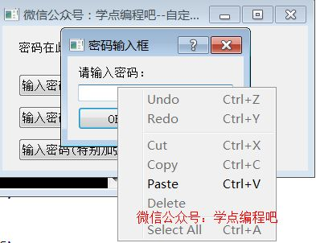
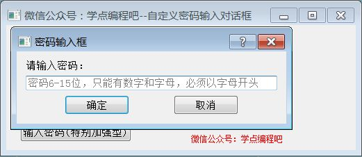
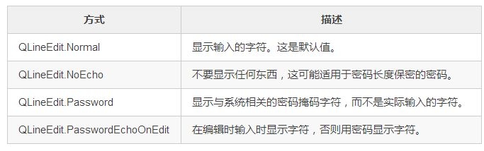

# 对话框QDialog
对话框窗口或对话框是大多数现代GUI应用程序中不可或缺的一部分。在计算机应用程序中，一个对话框是一个用于“与应用程序”通话的窗口。对话框用于输入数据，修改数据，更改应用程序设置等。

## 一、标准输入对话框QInputDialog 
QInputDialog提供了一个简单的便利对话框，可以从用户获取单个值。 输入值可以是列表中的字符串，数字或项目。  
QInputDialog主要个方法：
```python
class QInputDialog(QDialog):
    """ QInputDialog(parent: QWidget = None, flags: Union[Qt.WindowFlags, Qt.WindowType] = Qt.WindowFlags()) """
    ...
    def getDouble(self, QWidget, p_str, p_str_1, value=0, min=-2147483647, max=2147483647, decimals=1, flags, Qt_WindowFlags=None, Qt_WindowType=None, *args, **kwargs): # real signature unknown; NOTE: unreliably restored from __doc__ 
        """ getDouble(QWidget, str, str, value: float = 0, min: float = -2147483647, max: float = 2147483647, decimals: int = 1, flags: Union[Qt.WindowFlags, Qt.WindowType] = Qt.WindowFlags()) -> Tuple[float, bool] """
        pass

    def getInt(self, QWidget, p_str, p_str_1, value=0, min=-2147483647, max=2147483647, step=1, flags, Qt_WindowFlags=None, Qt_WindowType=None, *args, **kwargs): # real signature unknown; NOTE: unreliably restored from __doc__ 
        """ getInt(QWidget, str, str, value: int = 0, min: int = -2147483647, max: int = 2147483647, step: int = 1, flags: Union[Qt.WindowFlags, Qt.WindowType] = Qt.WindowFlags()) -> Tuple[int, bool] """
        pass

    def getItem(self, QWidget, p_str, p_str_1, Iterable, p_str=None, *args, **kwargs): # real signature unknown; NOTE: unreliably restored from __doc__ 
        """ getItem(QWidget, str, str, Iterable[str], current: int = 0, editable: bool = True, flags: Union[Qt.WindowFlags, Qt.WindowType] = Qt.WindowFlags(), inputMethodHints: Union[Qt.InputMethodHints, Qt.InputMethodHint] = Qt.ImhNone) -> Tuple[str, bool] """
        pass

    def getMultiLineText(self, QWidget, p_str, p_str_1, text='', flags, Qt_WindowFlags=None, Qt_WindowType=None, *args, **kwargs): # real signature unknown; NOTE: unreliably restored from __doc__ 
        """ getMultiLineText(QWidget, str, str, text: str = '', flags: Union[Qt.WindowFlags, Qt.WindowType] = Qt.WindowFlags(), inputMethodHints: Union[Qt.InputMethodHints, Qt.InputMethodHint] = Qt.ImhNone) -> Tuple[str, bool] """
        pass

    def getText(self, QWidget, p_str, p_str_1, echo=None, text='', flags, Qt_WindowFlags=None, Qt_WindowType=None, *args, **kwargs): # real signature unknown; NOTE: unreliably restored from __doc__ 
        """ getText(QWidget, str, str, echo: QLineEdit.EchoMode = QLineEdit.Normal, text: str = '', flags: Union[Qt.WindowFlags, Qt.WindowType] = Qt.WindowFlags(), inputMethodHints: Union[Qt.InputMethodHints, Qt.InputMethodHint] = Qt.ImhNone) -> Tuple[str, bool] """
        pass
    ...
```

例子：
```python
from PyQt5.QtWidgets import (QApplication, QWidget, QPushButton, QLabel, QInputDialog, QTextBrowser)
import sys

class Example(QWidget):
    def __init__(self):
        super().__init__()
        self.initUI()

    def initUI(self):
        self.setGeometry(500, 500, 500, 550)
        self.setWindowTitle('关注微信公众号：学点编程吧--标准输入对话框')
        self.lb1 = QLabel('姓名：', self)
        self.lb1.move(20, 20)
        self.lb2 = QLabel('年龄：', self)
        self.lb2.move(20, 80)
        self.lb3 = QLabel('性别：', self)
        self.lb3.move(20, 140)
        self.lb4 = QLabel('身高（cm）：', self)
        self.lb4.move(20, 200)
        self.lb5 = QLabel('基本信息：', self)
        self.lb5.move(20, 260)
        self.lb6 = QLabel('学点编程', self)
        self.lb6.move(80, 20)
        self.lb7 = QLabel('18', self)
        self.lb7.move(80, 80)
        self.lb8 = QLabel('男', self)
        self.lb8.move(80, 140)
        self.lb9 = QLabel('175', self)
        self.lb9.move(120, 200)
        self.tb = QTextBrowser(self)
        self.tb.move(20, 320)
        self.bt1 = QPushButton('修改姓名', self)
        self.bt1.move(200, 20)
        self.bt2 = QPushButton('修改年龄', self)
        self.bt2.move(200, 80)
        self.bt3 = QPushButton('修改性别', self)
        self.bt3.move(200, 140)
        self.bt4 = QPushButton('修改身高', self)
        self.bt4.move(200, 200)
        self.bt5 = QPushButton('修改信息', self)
        self.bt5.move(200, 260)
        self.show()
        self.bt1.clicked.connect(self.showDialog)
        self.bt2.clicked.connect(self.showDialog)
        self.bt3.clicked.connect(self.showDialog)
        self.bt4.clicked.connect(self.showDialog)
        self.bt5.clicked.connect(self.showDialog)

    def showDialog(self):
        sender = self.sender()
        sex = ['男', '女']
        if sender == self.bt1:
            text, ok = QInputDialog.getText(self, '修改姓名', '请输入姓名：')
            if ok:
                self.lb6.setText(text)
        elif sender == self.bt2:
            text, ok = QInputDialog.getInt(self, '修改年龄', '请输入年龄：', min=1)
            if ok:
                self.lb7.setText(str(text))
        elif sender == self.bt3:
            text, ok = QInputDialog.getItem(self, '修改性别', '请选择性别：', sex)
            if ok:
                self.lb8.setText(text)
        elif sender == self.bt4:
            text, ok = QInputDialog.getDouble(self, '修改身高', '请输入身高：', min=1.0)
            if ok:
                self.lb9.setText(str(text))
        elif sender == self.bt5:
            text, ok = QInputDialog.getMultiLineText(self, '修改信息', '请输入个人信息：')
            if ok:
                self.tb.setText(text)

if __name__ == '__main__':
    app = QApplication(sys.argv)
    ex = Example()
    sys.exit(app.exec_())
```
例子效果：


## 二、颜色选择对话框QColorDialog
QColorDialog主要个方法：
```python
class QColorDialog(QDialog):
    """
    QColorDialog(parent: QWidget = None)
    QColorDialog(Union[QColor, Qt.GlobalColor, QGradient], parent: QWidget = None)
    """
    ...
    def getColor(self, initial, QColor=None, Qt_GlobalColor=None, QGradient=None, *args, **kwargs): # real signature unknown; NOTE: unreliably restored from __doc__ 
    """ getColor(initial: Union[QColor, Qt.GlobalColor, QGradient] = Qt.white, parent: QWidget = None, title: str = '', options: Union[QColorDialog.ColorDialogOptions, QColorDialog.ColorDialogOption] = QColorDialog.ColorDialogOptions()) -> QColor """
    pass
    ...
```

## 三、字体选择对话框QFontDialog
QFontDialog主要个方法：
```python
class QFontDialog(QDialog):
    """
    QFontDialog(parent: QWidget = None)
    QFontDialog(QFont, parent: QWidget = None)
    """
    ...
    def getFont(self, *__args): # real signature unknown; restored from __doc__ with multiple overloads
    """
    getFont(QFont, parent: QWidget = None, caption: str = '', options: Union[QFontDialog.FontDialogOptions, QFontDialog.FontDialogOption] = QFontDialog.FontDialogOptions()) -> Tuple[QFont, bool]
    getFont(parent: QWidget = None) -> Tuple[QFont, bool]
    """
    ...
```

例子：
```python
from PyQt5.QtWidgets import QWidget, QApplication, QPushButton, QColorDialog, QFontDialog, QTextEdit, QFileDialog
import sys
class Example(QWidget):
    def __init__(self):
        super().__init__()
        self.initUI()
    def initUI(self):
        self.setGeometry(300, 300, 500, 300)
        self.setWindowTitle('记得好看点')
        self.tx = QTextEdit(self)
        self.tx.setGeometry(20, 20, 300, 270)
        self.bt1 = QPushButton('打开文件',self)
        self.bt1.move(350,20)
        self.bt2 = QPushButton('选择字体',self)
        self.bt2.move(350,70)
        self.bt3 = QPushButton('选择颜色',self)
        self.bt3.move(350,120)
        self.bt4 = QPushButton('选中字体', self)
        self.bt4.move(350, 170)
        self.bt5 = QPushButton('选中颜色', self)
        self.bt5.move(350, 220)
        self.bt1.clicked.connect(self.openfile)
        self.bt2.clicked.connect(self.choicefont)
        self.bt3.clicked.connect(self.choicecolor)
        self.bt4.clicked.connect(self.choicefont_selected)
        self.bt5.clicked.connect(self.choicecolor_selected)
        self.show()
    def openfile(self):
        fname = QFileDialog.getOpenFileName(self, '打开文件','./')
        if fname[0]:
            with open(fname[0], 'r',encoding='utf-8',errors='ignore') as f:
                self.tx.setText(f.read())
    def choicefont(self):
        font, ok = QFontDialog.getFont()
        if ok:
            self.tx.setFont(font)
    def choicecolor(self):
        col = QColorDialog.getColor()
        if col.isValid():
            self.tx.setStyleSheet("color:rgb{}".format(col.getRgb()))
    def choicefont_selected(self):
        font, ok = QFontDialog.getFont()
        if ok:
            self.tx.setCurrentFont(font)
    def choicecolor_selected(self):
        col = QColorDialog.getColor()
        if col.isValid():
            self.tx.setTextColor(col)
if __name__ == '__main__':
    app = QApplication(sys.argv)
    ex = Example()
    sys.exit(app.exec_())
```
例子效果：


## 四、标准文件打开保存框QFileDialog
QFileDialog.getOpenFileName()       单个文件打开   
QFileDialog.getOpenFileNames()      多个文件打开   
QFileDialog.getExistingDirectory()  文件夹选取   
QFileDialog.getSaveFileName()       文件保存          

getOpenFileName参数：  
* caption：对话框标题  
* directory：对话框默认工作目录  
* filter文件过滤，如果增加文件过滤可以使用`"Images (*.png *.xpm *.jpg)" `,`"Text files (*.txt)"` 等

QFileDialog主要个方法：
```python
class QFileDialog(QDialog):
    """
    QFileDialog(QWidget, Union[Qt.WindowFlags, Qt.WindowType])
    QFileDialog(parent: QWidget = None, caption: str = '', directory: str = '', filter: str = '')
    """
    ...
    def getExistingDirectory(self, parent=None, caption='', directory='', options, QFileDialog_Options=None, QFileDialog_Option=None, *args, **kwargs): # real signature unknown; NOTE: unreliably restored from __doc__ 
        """ getExistingDirectory(parent: QWidget = None, caption: str = '', directory: str = '', options: Union[QFileDialog.Options, QFileDialog.Option] = QFileDialog.ShowDirsOnly) -> str """
        pass

    def getExistingDirectoryUrl(self, parent=None, caption='', directory=None, *args, **kwargs): # real signature unknown; NOTE: unreliably restored from __doc__ 
        """ getExistingDirectoryUrl(parent: QWidget = None, caption: str = '', directory: QUrl = QUrl(), options: Union[QFileDialog.Options, QFileDialog.Option] = QFileDialog.ShowDirsOnly, supportedSchemes: Iterable[str] = []) -> QUrl """
        pass

    def getOpenFileName(self, parent=None, caption='', directory='', filter='', initialFilter='', options, QFileDialog_Options=None, QFileDialog_Option=None, *args, **kwargs): # real signature unknown; NOTE: unreliably restored from __doc__ 
        """ getOpenFileName(parent: QWidget = None, caption: str = '', directory: str = '', filter: str = '', initialFilter: str = '', options: Union[QFileDialog.Options, QFileDialog.Option] = 0) -> Tuple[str, str] """
        pass

    def getOpenFileNames(self, parent=None, caption='', directory='', filter='', initialFilter='', options, QFileDialog_Options=None, QFileDialog_Option=None, *args, **kwargs): # real signature unknown; NOTE: unreliably restored from __doc__ 
        """ getOpenFileNames(parent: QWidget = None, caption: str = '', directory: str = '', filter: str = '', initialFilter: str = '', options: Union[QFileDialog.Options, QFileDialog.Option] = 0) -> Tuple[List[str], str] """
        pass

    def getOpenFileUrl(self, parent=None, caption='', directory='', filter='', initialFilter='', options, QFileDialog_Options=None, QFileDialog_Option=None, *args, **kwargs): # real signature unknown; NOTE: unreliably restored from __doc__ 
        """ getOpenFileUrl(parent: QWidget = None, caption: str = '', directory: str = '', filter: str = '', initialFilter: str = '', options: Union[QFileDialog.Options, QFileDialog.Option] = 0, supportedSchemes: Iterable[str] = []) -> Tuple[QUrl, str] """
        pass

    def getOpenFileUrls(self, parent=None, caption='', directory='', filter='', initialFilter='', options, QFileDialog_Options=None, QFileDialog_Option=None, *args, **kwargs): # real signature unknown; NOTE: unreliably restored from __doc__ 
        """ getOpenFileUrls(parent: QWidget = None, caption: str = '', directory: str = '', filter: str = '', initialFilter: str = '', options: Union[QFileDialog.Options, QFileDialog.Option] = 0, supportedSchemes: Iterable[str] = []) -> Tuple[List[QUrl], str] """
        pass

    def getSaveFileName(self, parent=None, caption='', directory='', filter='', initialFilter='', options, QFileDialog_Options=None, QFileDialog_Option=None, *args, **kwargs): # real signature unknown; NOTE: unreliably restored from __doc__ 
        """ getSaveFileName(parent: QWidget = None, caption: str = '', directory: str = '', filter: str = '', initialFilter: str = '', options: Union[QFileDialog.Options, QFileDialog.Option] = 0) -> Tuple[str, str] """
        pass

    def getSaveFileUrl(self, parent=None, caption='', directory='', filter='', initialFilter='', options, QFileDialog_Options=None, QFileDialog_Option=None, *args, **kwargs): # real signature unknown; NOTE: unreliably restored from __doc__ 
        """ getSaveFileUrl(parent: QWidget = None, caption: str = '', directory: str = '', filter: str = '', initialFilter: str = '', options: Union[QFileDialog.Options, QFileDialog.Option] = 0, supportedSchemes: Iterable[str] = []) -> Tuple[QUrl, str] """
        pass
    ...
```

例子：
```python
from PyQt5.QtWidgets import QWidget, QApplication, QPushButton, QTextEdit, QFileDialog, QDialog
from PyQt5.QtPrintSupport import QPageSetupDialog, QPrintDialog, QPrinter
import sys

class Example(QWidget):
    def __init__(self):
        super().__init__()
        self.printer = QPrinter()
        self.initUI()
    def initUI(self):
        self.setGeometry(300, 300, 500, 400)
        self.setWindowTitle('关注微信公众号：学点编程吧--保存、打印文件')
        self.tx = QTextEdit(self)
        self.tx.setGeometry(20, 20, 300, 270)
        self.bt1 = QPushButton('打开文件', self)
        self.bt1.move(350, 20)
        self.bt2 = QPushButton('打开多个文件', self)
        self.bt2.move(350, 70)
        self.bt5 = QPushButton('保存文件', self)
        self.bt5.move(350, 220)
        self.bt6 = QPushButton('页面设置', self)
        self.bt6.move(350, 270)
        self.bt7 = QPushButton('打印文档', self)
        self.bt7.move(350, 320)
        self.bt1.clicked.connect(self.openfile)
        self.bt2.clicked.connect(self.openfiles)
        self.bt5.clicked.connect(self.savefile)
        self.bt6.clicked.connect(self.pagesettings)
        self.bt7.clicked.connect(self.printdialog)
        self.show()
    def openfile(self):
        fname = QFileDialog.getOpenFileName(self, '学点编程吧:打开文件', './')
        if fname[0]:
            with open(fname[0], 'r', encoding='gb18030', errors='ignore') as f:
                self.tx.setText(f.read())
    def openfiles(self):
        fnames = QFileDialog.getOpenFileNames(self, '学点编程吧:打开多个文件', './')
        if fnames[0]:
            for fname in fnames[0]:
                with open(fname, 'r', encoding='gb18030', errors='ignore') as f:
                    self.tx.append(f.read())
    def savefile(self):
        fileName = QFileDialog.getSaveFileName(self, '学点编程吧:保存文件', './', "Text files (*.txt)")
        if fileName[0]:
            with open(fileName[0], 'w', encoding='gb18030', errors='ignore') as f:
                f.write(self.tx.toPlainText())
    def pagesettings(self):
        printsetdialog = QPageSetupDialog(self.printer, self)
        printsetdialog.exec_()

    def printdialog(self):
        printdialog = QPrintDialog(self.printer, self)
        if QDialog.Accepted == printdialog.exec_():
            self.tx.print(self.printer)

if __name__ == '__main__':
    app = QApplication(sys.argv)
    ex = Example()
    sys.exit(app.exec_())
```
例子效果：


上述代码我们可以知晓新增了QPageSetupDialog、QPrintDialog、QPrinter这三个类，它们均在QtPrintSupport模块中。除了这个三个类还包含其他的类。

从类的字面意思我们也可以了解到QPageSetupDialog涉及页面设置的，QPrintDialog涉及打印，而QPrinter呢？QPrinter类是PyQt的打印主要使用，即打印类。大量和打印相关的函数均会涉及到该类。

根据Qt的官方文档的介绍，QPrinter类与其他绘图类（如QWidget和QPixmap）原理几乎完全相同。提供了一组附加功能来管理设备的特定功能，例如方向和分辨率等。

QPrintDialog类提供了一个用于指定打印机配置的对话框。对话框允许用户更改文档相关设置，如纸张尺寸和方向，打印类型（颜色或灰度），页面范围和打印份数。

还提供控制以使用户可以从可用的打印机中进行选择，包括任何配置的网络打印机。通常，QPrintDialog对象使用QPrinter对象构造，并使用exec()函数执行。

由于我本地没有打印机，但是在安装pdf阅读器的时候，给我安装了一个pdf虚拟打印机， 即可以把任何内容打印成pdf文档，所以可以选择这个打印机也能进行测试。当然如果你有打印机的话可以在实际的打印机上测试一下。

## 五、消息对话框QMessageBox
消息对话框分为五种，分别是提示信息、询问、警告、错误、关于，其中关于又分为两种，一种是一般性关于、另一种是关于Qt的介绍，可以明显看见不同。对于前四种，其分别对应的图标如下：


QMessageBox对话框包含类型只是图标不同其他无太大差别:  
* QMessageBox.information 信息框  
* QMessageBox.question 问答框  
* QMessageBox.warning 警告  
* QMessageBox.ctitical危险  
* QMessageBox.about 关于  

这里我们描述了一个信息提示的对话框。它的函数调用格式如下：
```python
class QMessageBox(QDialog):
    """
    QMessageBox(parent: QWidget = None)
    QMessageBox(QMessageBox.Icon, str, str, buttons: Union[QMessageBox.StandardButtons, QMessageBox.StandardButton] = QMessageBox.NoButton, parent: QWidget = None, flags: Union[Qt.WindowFlags, Qt.WindowType] = Qt.Dialog|Qt.MSWindowsFixedSizeDialogHint)
    """
    ...
    def information(self, QWidget, p_str, p_str_1, buttons, QMessageBox_StandardButtons=None, QMessageBox_StandardButton=None, *args, **kwargs): # real signature unknown; NOTE: unreliably restored from __doc__ 
        """ information(QWidget, str, str, buttons: Union[QMessageBox.StandardButtons, QMessageBox.StandardButton] = QMessageBox.Ok, defaultButton: QMessageBox.StandardButton = QMessageBox.NoButton) -> QMessageBox.StandardButton """
        pass
    ...
```
打开包含指定父窗口小部件并给定了标题和文本的信息消息对话框。这句话分别对应了第一、二、三个参数。

第四个参数则是我们要在消息对话框上想要显示的按钮。

第五个参数defaultButton指定按Enter键时使用的按钮。如果defaultButton是QMessageBox.NoButton，QMessageBox会自动选择合适的默认值。

当然还有更多的按钮可以供我们选择，如下图：


例子：
```python
from PyQt5.QtWidgets import QWidget, QApplication, QPushButton, QMessageBox, QLabel, QCheckBox
from PyQt5.QtGui import QPixmap
import sys

class Example(QWidget):
    def __init__(self):
        super().__init__()
        self.initUI()

    def initUI(self):

        self.setGeometry(300, 300, 330, 300)
        self.setWindowTitle('关注微信公众号：学点编程吧--消息对话框')

        self.la = QLabel('这里将会显示我们选择的按钮信息', self)
        self.la.move(20, 20)
        self.bt1 = QPushButton('提示', self)
        self.bt1.move(20, 70)
        self.bt2 = QPushButton('询问', self)
        self.bt2.move(120, 70)
        self.bt3 = QPushButton('警告', self)
        self.bt3.move(220, 70)
        self.bt4 = QPushButton('错误', self)
        self.bt4.move(20, 140)
        self.bt5 = QPushButton('关于', self)
        self.bt5.move(120, 140)
        self.bt6 = QPushButton('关于Qt', self)
        self.bt6.move(220, 140)

        self.bt1.clicked.connect(self.info)
        self.bt2.clicked.connect(self.question)
        self.bt3.clicked.connect(self.warning)
        self.bt4.clicked.connect(self.critical)
        self.bt5.clicked.connect(self.about)
        self.bt6.clicked.connect(self.aboutqt)

        self.show()

    def info(self):
        reply = QMessageBox.information(self, '提示', '这是一个消息提示对话框!', QMessageBox.Ok | QMessageBox.Close,
                                        QMessageBox.Close)
        if reply == QMessageBox.Ok:
            self.la.setText('你选择了Ok！')
        else:
            self.la.setText('你选择了Close！')

    def question(self):
        reply = QMessageBox.question(self, '询问', '这是一个询问消息对话框，默认是No',
                                     QMessageBox.Yes | QMessageBox.No | QMessageBox.Cancel, QMessageBox.No)
        if reply == QMessageBox.Yes:
            self.la.setText('你选择了Yes！')
        elif reply == QMessageBox.No:
            self.la.setText('你选择了No！')
        else:
            self.la.setText('你选择了Cancel！')

    def warning(self):
        # reply = QMessageBox.warning(self,'警告','这是一个警告消息对话框', QMessageBox.Save | QMessageBox.Discard | QMessageBox.Cancel, QMessageBox.Save)
        cb = QCheckBox('所有文档都按此操作')
        msgBox = QMessageBox()
        msgBox.setWindowTitle('警告')
        msgBox.setIcon(QMessageBox.Warning)
        msgBox.setText('这是一个警告消息对话框')
        msgBox.setInformativeText('出现更改愿意保存吗?')
        Save = msgBox.addButton('保存', QMessageBox.AcceptRole)
        NoSave = msgBox.addButton('取消', QMessageBox.RejectRole)
        Cancel = msgBox.addButton('不保存', QMessageBox.DestructiveRole)
        msgBox.setDefaultButton(Save)
        msgBox.setCheckBox(cb)
        cb.stateChanged.connect(self.check)
        reply = msgBox.exec()

        if reply == QMessageBox.AcceptRole:
            self.la.setText('你选择了保存！')
        elif reply == QMessageBox.RejectRole:
            self.la.setText('你选择了取消！')
        else:
            self.la.setText('你选择了不保存！')

    def critical(self):
        # reply = QMessageBox.critical(self,'错误','这是一个错误消息对话框', QMessageBox.Retry | QMessageBox.Abort | QMessageBox.Ignore , QMessageBox.Retry)
        msgBox = QMessageBox()
        msgBox.setWindowTitle('错误')
        msgBox.setIcon(QMessageBox.Critical)
        msgBox.setText("这是一个错误消息对话框")
        msgBox.setStandardButtons(QMessageBox.Retry | QMessageBox.Abort | QMessageBox.Ignore)
        msgBox.setDefaultButton(QMessageBox.Retry)
        msgBox.setDetailedText('这是详细的信息：学点编程吧，我爱你！')
        reply = msgBox.exec()

        if reply == QMessageBox.Retry:
            self.la.setText('你选择了Retry！')
        elif reply == QMessageBox.Abort:
            self.la.setText('你选择了Abort！')
        else:
            self.la.setText('你选择了Ignore！')

    def about(self):
        # QMessageBox.about(self,'关于','这是一个关于消息对话框!')
        msgBox = QMessageBox(QMessageBox.NoIcon, '关于', '不要意淫了，早点洗洗睡吧!')
        msgBox.setIconPixmap(QPixmap("beauty.png"))
        msgBox.exec()

    def aboutqt(self):
        QMessageBox.aboutQt(self, '关于Qt')

    def check(self):
        if self.sender().isChecked():
            self.la.setText('你打勾了哦')
        else:
            self.la.setText('怎么又不打了啊')

if __name__ == '__main__':
    app = QApplication(sys.argv)
    ex = Example()
    sys.exit(app.exec_())
```
例子效果：


**例子说明**：
提供了两个使用QMessageBox的API，基于属性的API和静态函数。 调用静态函数是更简单的方法，但是比使用基于属性的API更不灵活，结果信息较少。 两种方法我们在程序中都使用了。

注意到没有，基于属性自定义实现的按钮里面显示的是中文哦！！！而之前一直都是英文啊（考验大家英语的水平到了）。这就是基于属性的产生消息对话框的好处，虽然繁琐但是贵在牛逼啊！
         

## 六、进度对话框QProgressDialog
例子：
```python
from PyQt5.QtWidgets import (QApplication, QWidget, QPushButton, QLabel, QLineEdit, QMessageBox, QProgressDialog)
from PyQt5.QtCore import Qt
import sys

class Example(QWidget):
    def __init__(self):
        super().__init__()
        self.initUI()

    def initUI(self):
        self.resize(300, 150)
        self.setWindowTitle("微信公众号：学点编程吧--进度对话框")
        self.lb = QLabel("文件数量", self)
        self.lb.move(20, 40)
        self.bt1 = QPushButton('开始', self)
        self.bt1.move(20, 80)
        self.edit = QLineEdit('100000', self)
        self.edit.move(100, 40)
        self.show()
        self.bt1.clicked.connect(self.showDialog)

    def showDialog(self):
        num = int(self.edit.text())
        progress = QProgressDialog(self)
        progress.setWindowTitle("请稍等")
        progress.setLabelText("正在操作...")
        progress.setCancelButtonText("取消")
        progress.setMinimumDuration(5)
        progress.setWindowModality(Qt.WindowModal)
        progress.setRange(0, num)
        for i in range(num):
            progress.setValue(i)
            if progress.wasCanceled():
                QMessageBox.warning(self, "提示", "操作失败")
                break
        else:
            progress.setValue(num)
            QMessageBox.information(self, "提示", "操作成功")

if __name__ == '__main__':
    app = QApplication(sys.argv)
    ex = Example()
    sys.exit(app.exec_())
```
例子效果：


**例子说明**：  
进度对话框隶属于QProgressDialog类，QProgressDialog类提供了有关缓慢操作进度的反馈。

使用进度对话框给用户说明操作需要花费多长时间，并表明应用程序尚未冻结。它也可以给用户一个中止操作的机会。

进度对话的一个常见问题是很难知道何时使用它们；操作在不同的硬件上花费的时间不同。QProgressDialog提供了一个解决这个问题的方法：它估计操作所花费的时间（基于步骤的时间），并且只有当该估计值超出minimumDuration() （默认为4秒）时才显示。

使用setMinimum() 和setMaximum() 或构造函数来设置操作中的“steps”数量，并在操作进行时调用setValue()。步数可任意选择。它可以是复制的文件数，接收到的字节数，迭代次数，或其他合适的单位。进度从setMinimum()设置的值开始，进度对话框显示当您使用setMaximum()设置的值作为参数调用setValue() 时，操作已完成。

对话框自动在操作结束时重置并隐藏自身。使用setAutoReset()和setAutoClose()来更改此行为。请注意，如果设置新的最大值（使用setMaximum()或setRange() ）等于当前value()，对话框将不会关闭。

使用QProgressDialog有两种方式：模态和非模态。

与非模态的QProgressDialog相比，模态的QProgressDialog更容易用于程序员。循环执行操作，间隔调用setValue()，并使用wasCanceled()检查取消。像我们上面的例子就是这种。

非模态进度对话框由于涉及到其它几个知识点，这里暂不做介绍。后面我会和其它几个知识点一起谈。
```python
progress = QProgressDialog(self)
progress.setWindowTitle("请稍等")  
progress.setLabelText("正在操作...")
progress.setCancelButtonText("取消")
progress.setMinimumDuration(5)
progress.setWindowModality(Qt.WindowModal)
progress.setRange(0,num)
```
我们新建了一个QProgressDialog对象progress，设置它的标题、标签、增加取消的按钮。 
```python
progress.setMinimumDuration(5)
```
此属性保留对话框出现之前必须通过的时间。

如果任务的预期持续时间小于minimumDuration，则对话框根本不会出现。这样可以防止弹出对话框，快速完成任务。对于预期超过minimumDuration的任务，对话框将在minimumDuration时间之后或任何进度设置后立即弹出。如果设置为0，则只要设置任何进度，将始终显示对话框。 默认值为4000毫秒,即4秒。

```python
progress.setWindowModality(Qt.WindowModal)
```
此属性保留由模态小部件阻止的窗口。

这个属性只对Windows有意义。 模态小部件防止其他窗口中的小部件获取输入。 该属性的值控制在窗口小部件可见时阻止哪些窗口。 窗口可见时更改此属性无效；您必须首先hide()小部件，然后再次show()。

默认情况下，此属性为Qt.NonModal。其它属性如下：


```python
progress.setRange(0,num)
```
由上面我们知道：使用setMinimum() 和setMaximum() 或构造函数来设置操作中的“steps”数量，并在操作进行时调用setValue()。setRange(0,num)就是设置其最小和最大值，这里最小值0，最大值num，num是根据输入框中的数字确定的。

```python
for i in range(num):
    progress.setValue(i)
    if progress.wasCanceled():
        QMessageBox.warning(self,"提示","操作失败")
        break
else:
    progress.setValue(num)
    QMessageBox.information(self,"提示","操作成功")
```
setValue()该属性持有当前的进度。要使进度对话框按预期的方式工作，您应该首先将此属性设置为QProgressDialog的最大最小值， 您可以在中间调用setValue()任意次数。

通过wasCanceled()判断我们是否按下取消按钮，如果按下则提示失败。若for循环顺利结束，执行else后的语句，表明成功。

## 七、实现自己的对话框
继承QDialog实现自己的对话框，通过例子讲解：
```python
from PyQt5.QtWidgets import QDialog, QApplication,QWidget, QLineEdit, QLabel, QPushButton, QHBoxLayout, QVBoxLayout, QMessageBox,QInputDialog
from PyQt5.QtCore import Qt, QEvent, QRegExp, QObject
from PyQt5.QtGui import QKeyEvent, QKeySequence, QRegExpValidator
import sys

class PasswdDialog(QDialog):
    def __init__(self):
        super().__init__()
        self.initUI()

    def initUI(self):
        self.resize(350, 100)
        self.setWindowTitle("密码输入框")

        self.lb = QLabel("请输入密码：", self)

        self.edit = QLineEdit(self)
        self.edit.installEventFilter(self)

        self.bt1 = QPushButton("确定", self)
        self.bt2 = QPushButton("取消", self)

        hbox = QHBoxLayout()
        hbox.addStretch(1)
        hbox.addWidget(self.bt1)
        hbox.addStretch(1)
        hbox.addWidget(self.bt2)
        hbox.addStretch(1)

        vbox = QVBoxLayout()
        vbox.addWidget(self.lb)
        vbox.addWidget(self.edit)
        vbox.addStretch(1)
        vbox.addLayout(hbox)

        self.setLayout(vbox)

        self.edit.setContextMenuPolicy(Qt.NoContextMenu)
        self.edit.setPlaceholderText("密码不超15位，只能有数字和字母，必须以字母开头")
        self.edit.setEchoMode(QLineEdit.Password)

        regx = QRegExp("^[a-zA-Z][0-9A-Za-z]{14}$")
        validator = QRegExpValidator(regx, self.edit)
        self.edit.setValidator(validator)

        self.bt1.clicked.connect(self.Ok)
        self.bt2.clicked.connect(self.Cancel)

        object = QObject()

    def eventFilter(self, object, event):
        if object == self.edit:
            if event.type() == QEvent.MouseMove or event.type() == QEvent.MouseButtonDblClick:
                return True
            elif event.type() == QEvent.KeyPress:
                key = QKeyEvent(event)
                if key.matches(QKeySequence.SelectAll) or key.matches(QKeySequence.Copy) or key.matches(
                        QKeySequence.Paste):
                    return True
        return QDialog.eventFilter(self, object, event)  # 继续传递该事件到被观察者，由其本身调用相应的事件

    def Ok(self):
        self.text = self.edit.text()
        if len(self.text) == 0:
            QMessageBox.warning(self, "警告", "密码为空")
        elif len(self.text) < 6:
            QMessageBox.warning(self, "警告", "密码长度低于6位")
        else:
            self.done(1)  # 结束对话框返回1

    def Cancel(self):
        self.done(0)  # 结束对话框返回0

class Example(QWidget):
    def __init__(self):
        super().__init__()
        self.initUI()

    def initUI(self):
        self.resize(380, 180)
        self.setWindowTitle('微信公众号：学点编程吧--自定义密码输入对话框')

        self.lb1 = QLabel('密码在此显示...', self)
        self.lb1.move(20, 20)

        self.bt1 = QPushButton('输入密码(普通型)', self)
        self.bt1.move(20, 60)

        self.bt2 = QPushButton('输入密码(普通加强型)', self)
        self.bt2.move(20, 100)

        self.bt3 = QPushButton('输入密码(特别加强型)', self)
        self.bt3.move(20, 140)

        self.show()

        self.bt1.clicked.connect(self.showDialog)
        self.bt2.clicked.connect(self.showDialog)
        self.bt3.clicked.connect(self.showDialog)

    def showDialog(self):
        sender = self.sender()
        if sender == self.bt1:
            text, ok = QInputDialog.getText(self, '密码输入框', '请输入密码：', QLineEdit.Password)
            if ok:
                self.lb1.setText(text)
        elif sender == self.bt2:
            text, ok = QInputDialog.getText(self, '密码输入框', '请输入密码：', QLineEdit.PasswordEchoOnEdit)
            if ok:
                self.lb1.setText(text)
        else:
            pwd = PasswdDialog()
            r = pwd.exec_()
            if r:
                self.lb1.setText(pwd.text)

if __name__ == '__main__':
    app = QApplication(sys.argv)
    ex = Example()
    sys.exit(app.exec_())
```
例子效果：


我们实现了三种密码输入框的方式：

* 输入的密码不可见；  
* 输入的密码可见，但是鼠标点击其他控件后，密码不可见；  
* 输入的密码不可见，同时为了更加的安全，屏蔽了鼠标右键、禁用复制、粘贴快捷键、鼠标在密码框中不可移动，不可全选。就类似我们在输入QQ密码的时候一样。

从这段代码中我们可以看出，本质上就是QDialog的继承，加上自己希望的界面和实现的功能。因此QDialog所有的属性，我们自定义对话框PasswdDialog都会有，这样能够省掉我们不少的时间来。这个也就是面向对象编程的魅力所在了。

这次讲解不全按照代码的顺序，按照难度由浅入深的顺序讲解。
#### 基础部分
```python
self.edit.setContextMenuPolicy(Qt.NoContextMenu)
self.edit.setPlaceholderText("密码6-15位，只能有数字和字母，必须以字母开头")
self.edit.setEchoMode(QLineEdit.Password) 
```
这个三个语句是给密码输入框增加一些属性。

```python
self.edit.setContextMenuPolicy(Qt.NoContextMenu)
```
这个语句设置QLineEdit对象的上下文菜单的策略。如果不写这句话，我们在密码输入框中单击右键是这样的：

大家可以看到出现复制、粘贴等菜单，这样对于密码的输入是不安全的。所以我们在此设置了Qt.NoContextMenu，即不允许出现上下文菜单。
```python
self.edit.setPlaceholderText("密码6-15位，只能有数字和字母，必须以字母开头")
```
只要行编辑为空，设置此属性将使行编辑显示为灰色的占位符文本。默认情况下，此属性包含一个空字符串。效果是这样：

这是非常好的使用方法，可以在用户输入密码前看到一些小提示信息，但是又不影响使用，非常棒这个方法。
```python
self.edit.setEchoMode(QLineEdit.Password)
```
这条语句设置了如何限定输入框中显示其包含信息的方式，这里设置的是：密码方式，即输入的时候呈现出原点出来。 

当然我们还可以设置其他的方式如下：

我们可以根据自己的需要酌情选用合适方式。

#### 正则表达式
```python
regx = QRegExp("^[a-zA-Z][0-9A-Za-z]{14}$")
validator = QRegExpValidator(regx, self.edit)
self.edit.setValidator(validator)
```
这三段代码涉及到的：QRegExp、QRegExpValidator引入方式如下：
```python
from PyQt5.QtCore import QRegExp
from PyQt5.QtGui import QRegExpValidator
```
QRegExp类使用正则表达式提供模式匹配。正则表达式是用于匹配文本中的子字符串的模式。
```python
regx = QRegExp("^[a-zA-Z][0-9A-Za-z]{14}$")
```
为给定的模式字符串构造一个正则表达式对象。

```python
validator = QRegExpValidator(regx, self.edit)
```
构造一个验证器，该父对象接受与正则表达式匹配的所有字符串。这里的父对象就是QLineEdit对象了。匹配是针对整个字符串; 例如：如果正则表达式是`[A-Fa-f0-9]+`将被视为`^[A-Fa-f0-9]+$`。

```python
self.edit.setValidator(validator)
```
将密码输入框设置为仅接受符合验证器条件的输入。 这允许您对可能输入的文本设置任何约束条件。因此我们这里设置的就是符合上面描述的三种约束条件。

#### 事件过滤器
```python
object = QObject()
   def eventFilter(self, object, event):
       if object == self.edit:
           if event.type() == QEvent.MouseMove or event.type() == QEvent.MouseButtonDblClick:
               return True
           elif event.type() == QEvent.KeyPress:
               key = QKeyEvent(event)
               if key.matches(QKeySequence.SelectAll) or key.matches(QKeySequence.Copy) or key.matches(QKeySequence.Paste):
                   return True
       return QDialog.eventFilter(self, object, event)
```
事件过滤器可是一个非常重要的概念。根据Qt的官方文档，如果对象被安装已监视对象的事件过滤器，则过滤事件。如果要过滤事件，需重新实现此函数时，若停止进一步处理，返回true； 否则返回false。

如果一个对象安装多个事件过滤器，那么，最后安装的过滤器首先被激活。

警告：如果在eventFilter()函数中删除接收对象，一定要返回true。如果返回false，Qt给已删除的对象发送事件，程序就会挂了。

注意，过滤器对象必须和被观察者对象处于同一线程。如果过滤器对象在不同的线程，这个函数什么都不做。如果在调用这个函数之后，过滤器对象或被观察者对象被移动到不同的线程，事件过滤器将不会被调用，直到两个对象再处于相同的线程中。

本例中明确需要监测的对象，即对谁进行监测。是密码输入框，或者是这个主窗口，因为它们拥有一些共同的事件，如果不明确，不知道要过滤谁的事件。本例中为其安装事件过滤器如下：
```python
self.edit.installEventFilter(self)
```

然后进行事件判断与转换：鼠标移动对应的事件类型为QEvent.MouseMove，鼠标双击对应的事件类型为QEvent.MouseButtonDblClick，全选、复制、粘贴对应的事件类型为 QEvent.KeyPress，当接收到这些事件时，需要被过滤掉，所以返回true。

注意：return QDialog.eventFilter(self,object,event)这句代码很关键，这里的意思是继续传递该事件到被观察者，由其本身调用相应的事件。

```python
if object == self.edit: 
   if event.type() == QEvent.MouseMove or event.type() == QEvent.MouseButtonDblClick:
       return True
   elif event.type() == QEvent.KeyPress:
       key = QKeyEvent(event)
       if key.matches(QKeySequence.SelectAll) or key.matches(QKeySequence.Copy) or key.matches(QKeySequence.Paste):
           return True
```
这里是对事件的判断。其中QKeyEvent类描述了一个关键事件。当按下或释放按键时，主要事件将发送到具有键盘输入焦点的小部件。然后运用matches方法匹配具体的按键。例如：QKeySequence.SelectAll表示全选，QKeySequence.Copy表示复制，QKeySequence.Paste表示粘贴。当然还有其它的按键组合。详见：[QKeySequence Class](https://doc.qt.io/qt-5/qkeysequence.html#QKeySequence "QKeySequence Class")

#### 其它
```python
def Ok(self):
   self.text = self.edit.text()
   if len(self.text) == 0:
       QMessageBox.warning(self, "警告", "密码为空")
   elif len(self.text) < 6:
       QMessageBox.warning(self, "警告", "密码长度低于6位")
   else:
       self.done(1)          # 结束对话框返回1
def Cancel(self):
   self.done(0)          # 结束对话框返回0
```
这个语句比较简单，就是判断输入框的上用户点了的按钮，是确定还是取消；如果按了确定键看长度是否符合要求否则给予警告。最后使用done语句关闭对话框并将其结果设置为一个整数。如果此对话框显示为exec()，那么done()会导致本地事件循环完成，exec()返回该整数。

