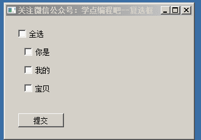
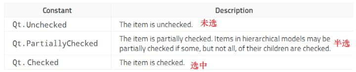
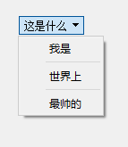
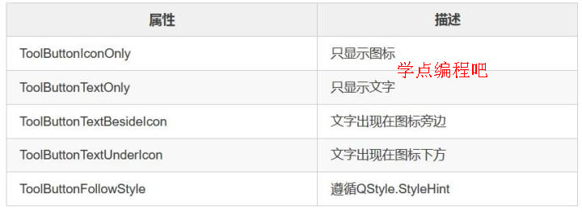
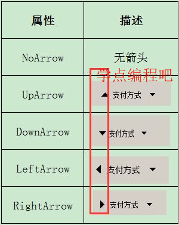
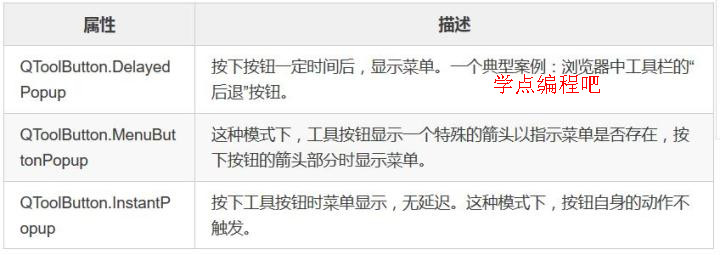

# 按钮系列QCheckBox_QRadioButton_Button
```python
class QAbstractButton(QWidget):
    """ QAbstractButton(parent: QWidget = None) """
    def click(self): # real signature unknown; restored from __doc__
        """ click(self) """
        pass

    def clicked(self, bool=False): # real signature unknown; restored from __doc__
        """ clicked(self, bool = False) [signal] """
        pass
     
    def event(self, QEvent): # real signature unknown; restored from __doc__
        """ event(self, QEvent) -> bool """
        return False 

    def icon(self): # real signature unknown; restored from __doc__
        """ icon(self) -> QIcon """
        pass

    def iconSize(self): # real signature unknown; restored from __doc__
        """ iconSize(self) -> QSize """
        pass 

    def isCheckable(self): # real signature unknown; restored from __doc__
        """ isCheckable(self) -> bool """
        return False

    def isChecked(self): # real signature unknown; restored from __doc__
        """ isChecked(self) -> bool """
        return False

    def isDown(self): # real signature unknown; restored from __doc__
        """ isDown(self) -> bool """
        return False

    def keyPressEvent(self, QKeyEvent): # real signature unknown; restored from __doc__
        """ keyPressEvent(self, QKeyEvent) """
        pass 

    def mouseDoubleClickEvent(self, *args, **kwargs): # real signature unknown
        pass

    def mouseMoveEvent(self, QMouseEvent): # real signature unknown; restored from __doc__
        """ mouseMoveEvent(self, QMouseEvent) """
        pass

    def mousePressEvent(self, QMouseEvent): # real signature unknown; restored from __doc__
        """ mousePressEvent(self, QMouseEvent) """
        pass

    def moveEvent(self, *args, **kwargs): # real signature unknown
        pass  

    def resizeEvent(self, *args, **kwargs): # real signature unknown
        pass

    def sender(self, *args, **kwargs): # real signature unknown
        pass 

    def setCheckable(self, bool): # real signature unknown; restored from __doc__
        """ setCheckable(self, bool) """
        pass

    def setChecked(self, bool): # real signature unknown; restored from __doc__
        """ setChecked(self, bool) """
        pass

    def setDown(self, bool): # real signature unknown; restored from __doc__
        """ setDown(self, bool) """
        pass

    def setIcon(self, QIcon): # real signature unknown; restored from __doc__
        """ setIcon(self, QIcon) """
        pass

    def setIconSize(self, QSize): # real signature unknown; restored from __doc__
        """ setIconSize(self, QSize) """
        pass

    def setText(self, p_str): # real signature unknown; restored from __doc__
        """ setText(self, str) """
        pass   

    def text(self): # real signature unknown; restored from __doc__
        """ text(self) -> str """
        return ""
   
    def toggle(self): # real signature unknown; restored from __doc__
        """ toggle(self) """
        pass

    def toggled(self, bool): # real signature unknown; restored from __doc__
        """ toggled(self, bool) [signal] """
        pass
    def __init__(self, parent=None): # real signature unknown; restored from __doc__
        pass

```
## 一、复选框QCheckBox
正式讲解代码前，我们可以去Qt的官方网站上看看QCheckBox的内容：
[QCheckBox Class | Qt Widgets 5.9](https://doc.qt.io/qt-5/qcheckbox.html#checkState "QCheckBox Class | Qt Widgets 5.9")

尽管里面的内容都是通过C++来描述的，但是基本内容差不多，函数名称也一样。所以要学习官方的文档，特别是英语好的学友，看这个比其它文档好一百倍。英语还是很重要的！

#### 概述 
QCheckBox继承自QAbstractButton，它提供了一个带文本标签的复选框。

QCheckBox（复选框）和QRadioButton（单选框）都是选项按钮。这是因为它们都可以在开（选中）或者关（未选中）之间切换。区别是对用户选择的限制：单选框定义了“多选一”的选择，而复选框提供的是“多选多”的选择。

只要复选框被选中或者清除，都会发射一个stateChanged()信号。如果想在复选框状态改变的时候触发一个行为，请连接这个信号，可以使用 isChecked()来查询复选框是否被选中。

除了常用的选中和未选中两个状态，QCheckBox还可选地提供了第三种状态（半选）。如果需要第三种状态，可以通过setTristate()来使它生效，并使用checkState()来查询当前的切换状态。

```python
class QCheckBox(QAbstractButton):
    """
    QCheckBox(parent: QWidget = None)
    QCheckBox(str, parent: QWidget = None)
    """
    def setCheckState(self, Qt_CheckState): # real signature unknown; restored from __doc__
        """ setCheckState(self, Qt.CheckState) """
        pass
    def setTristate(self, on=True): # real signature unknown; restored from __doc__
        """ setTristate(self, on: bool = True) """
        pass
    def stateChanged(self, p_int): # real signature unknown; restored from __doc__
        """ stateChanged(self, int) [signal] """
        pass
```

#### 例子
实现效果：

```python
from PyQt5.QtWidgets import QWidget, QCheckBox, QApplication, QPushButton, QMessageBox
from PyQt5.QtCore import Qt
import sys

class Example(QWidget):
    def __init__(self):
        super().__init__()
        self.initUI()

    def initUI(self):

        self.cb1 = QCheckBox('全选', self)
        self.cb2 = QCheckBox('你是', self)
        self.cb3 = QCheckBox('我的', self)
        self.cb4 = QCheckBox('宝贝', self)

        bt = QPushButton('提交', self)

        self.resize(300, 200)
        self.setWindowTitle('关注微信公众号：学点编程吧--复选框')

        self.cb1.move(20, 20)
        self.cb2.move(30, 50)
        self.cb3.move(30, 80)
        self.cb4.move(30, 110)

        bt.move(20, 160)

        self.cb1.stateChanged.connect(self.changecb1)
        self.cb2.stateChanged.connect(self.changecb2)
        self.cb3.stateChanged.connect(self.changecb2)
        self.cb4.stateChanged.connect(self.changecb2)
        bt.clicked.connect(self.go)

        self.show()

    def go(self):
        if self.cb2.isChecked() and self.cb3.isChecked() and self.cb4.isChecked():
            QMessageBox.information(self, 'I Love U', '你是我的宝贝！')
        elif self.cb2.isChecked() and self.cb3.isChecked():
            QMessageBox.information(self, 'I Love U', '你是我的！')
        elif self.cb2.isChecked() and self.cb4.isChecked():
            QMessageBox.information(self, 'I Love U', '你是宝贝！')
        elif self.cb3.isChecked() and self.cb4.isChecked():
            QMessageBox.information(self, 'I Love U', '我的宝贝！')
        elif self.cb2.isChecked():
            QMessageBox.information(self, 'I Love U', '你是！')
        elif self.cb3.isChecked():
            QMessageBox.information(self, 'I Love U', '我的！')
        elif self.cb4.isChecked():
            QMessageBox.information(self, 'I Love U', '宝贝！')
        else:
            QMessageBox.information(self, 'I Love U', '貌似你没有勾选啊！')

    def changecb1(self):
        if self.cb1.checkState() == Qt.Checked:
            self.cb2.setChecked(True)
            self.cb3.setChecked(True)
            self.cb4.setChecked(True)
        elif self.cb1.checkState() == Qt.Unchecked:
            self.cb2.setChecked(False)
            self.cb3.setChecked(False)
            self.cb4.setChecked(False)

    def changecb2(self):
        if self.cb2.isChecked() and self.cb3.isChecked() and self.cb4.isChecked():
            self.cb1.setCheckState(Qt.Checked)
        elif self.cb2.isChecked() or self.cb3.isChecked() or self.cb4.isChecked():
            self.cb1.setTristate()
            self.cb1.setCheckState(Qt.PartiallyChecked)
        else:
            self.cb1.setTristate(False)
            self.cb1.setCheckState(Qt.Unchecked)


if __name__ == '__main__':
    app = QApplication(sys.argv)
    ex = Example()
    sys.exit(app.exec_())
```
setCheckState()，用以设置QCheckBox的状态：选中、半选、未选中。具体的值是这样的：


## 二、单选按钮QRadioButton
#### QRadioButton简介
QRadioButton小部件提供了一个带有文本标签的单选按钮（没错，本质上它还是一个按钮）。

QRadioButton是一个选项按钮，可以打开（选中）或关闭（取消选中）。单选按钮通常为用户提供“多选一”操作。在一组单选按钮中，一次只能检查一个单选按钮;如果用户选择另一个按钮，则先前选择的按钮被关闭。

单选按钮默认为autoExclusive（自动互斥）。如果启用了自动互斥功能，则属于同一个父窗口小部件的单选按钮的行为就属于同一个互斥按钮组的一部分。当然加入QButtonGroup中能够实现多组单选按钮互斥。

无论何时打开或关闭按钮，都会发出toggled()信号。如果要在每次按钮更改状态时触发某个操作，请连接到此信号。使用isChecked()来查看是否选择了一个特定的按钮。

就像QPushButton一样，单选按钮显示文本，还可以选择一个小图标。该图标是用setIcon()设置的。文本可以在构造函数中设置，也可以在setText()中设置。快捷键可以通过在文本前面加一个＆符号来指定。

更多详细的说明请见：[QRadioButton Class](https://doc.qt.io/qt-5/qradiobutton.html "QRadioButton Class")

```python
class QRadioButton(QAbstractButton):
    """
    QRadioButton(parent: QWidget = None)
    QRadioButton(str, parent: QWidget = None)
    """
    
class QButtonGroup(__PyQt5_QtCore.QObject):
    """ QButtonGroup(parent: QObject = None) """
    def addButton(self, QAbstractButton, id=-1): # real signature unknown; restored from __doc__
        """ addButton(self, QAbstractButton, id: int = -1) """
        pass

    def button(self, p_int): # real signature unknown; restored from __doc__
        """ button(self, int) -> QAbstractButton """
        return QAbstractButton

    def buttonClicked(self, *__args): # real signature unknown; restored from __doc__ with multiple overloads
        """
        buttonClicked(self, QAbstractButton) [signal]
        buttonClicked(self, int) [signal]
        """
        pass

    def buttonPressed(self, *__args): # real signature unknown; restored from __doc__ with multiple overloads
        """
        buttonPressed(self, QAbstractButton) [signal]
        buttonPressed(self, int) [signal]
        """
        pass
        
    def buttons(self): # real signature unknown; restored from __doc__
    """ buttons(self) -> object """
    return object()

    def buttonToggled(self, *__args): # real signature unknown; restored from __doc__ with multiple overloads
        """
        buttonToggled(self, QAbstractButton, bool) [signal]
        buttonToggled(self, int, bool) [signal]
        """
        pass

    def checkedButton(self): # real signature unknown; restored from __doc__
        """ checkedButton(self) -> QAbstractButton """
        return QAbstractButton

    def checkedId(self): # real signature unknown; restored from __doc__
        """ checkedId(self) -> int """
        return 0
```

#### 例子
实现效果：

```python
from PyQt5.QtWidgets import QWidget, QRadioButton, QApplication, QPushButton, QMessageBox, QButtonGroup
import sys
class Example(QWidget):
    def __init__(self):
        super().__init__()
        self.initUI()
    def initUI(self):
        self.rb11 = QRadioButton('你是',self)
        self.rb12 = QRadioButton('我是',self)
        self.rb13 = QRadioButton('他是',self)
        self.rb21 = QRadioButton('大美女',self)
        self.rb22 = QRadioButton('大帅哥',self)
        self.rb23 = QRadioButton('小屁孩',self)
        bt1 = QPushButton('提交',self)
    
        #为节省行数，部分非重要代码省略...
        self.bg1 = QButtonGroup(self)
        self.bg1.addButton(self.rb11, 11)
        self.bg1.addButton(self.rb12, 12)
        self.bg1.addButton(self.rb13, 13)
        self.bg2 = QButtonGroup(self)
        self.bg2.addButton(self.rb21, 21)
        self.bg2.addButton(self.rb22, 22)
        self.bg2.addButton(self.rb23, 23)
        self.info1 = ''
        self.info2 = ''
        self.bg1.buttonClicked.connect(self.rbclicked)
        self.bg2.buttonClicked.connect(self.rbclicked)
        bt1.clicked.connect(self.submit)
        self.show()
        
    def submit(self):
        if self.info1 == '' or self.info2 == '':
            QMessageBox.information(self,'What?','貌似有没有选的啊，快去选一个吧！')
        else:
            QMessageBox.information(self,'What?',self.info1+self.info2)
        
    def rbclicked(self):
        sender = self.sender()
        if sender == self.bg1:
            if self.bg1.checkedId() == 11:
                self.info1 = '你是'
            elif self.bg1.checkedId() == 12:
                self.info1 = '我是'
            elif self.bg1.checkedId() == 13:
                self.info1 = '他是'            
            else:
                self.info1 = ''
        else:
            if self.bg2.checkedId() == 21:
                self.info2 = '大美女'
            elif self.bg2.checkedId() == 22:
                self.info2 = '大帅哥'
            elif self.bg2.checkedId() == 23:
                self.info2 = '小屁孩'            
            else:
                self.info2 = ''
if __name__ == '__main__':
    #常规代码，省略...
```
这个例子中我们建立了两个单选按钮分组，其中每个分组单选按钮是互斥的，我们在每个分组中分别选择一个单选按钮，然后提交就得到相应的信息了。

新建6个单选按钮。如果不增加分组，这个6个单选按钮是互斥的，因为单选按钮默认为autoExclusive（自动互斥）。

将单选按钮添加到分组中，同时分配一个id号。 这个函数的原型是这样的：
```python
QButtonGroup.addButton(self, QAbstractButton, id: int = -1)
```
函数默认的id是-1， 自动分配的ID保证为负数，从-2开始。 如果您正在分配自己的ID，请使用正值来避免冲突。

我们判断到底是点了哪个分组，怎么判断？使用self.sender()函数将信号的产生对象送过来。然后根据checkedId()去获得这个按钮的id号，通过id号的判断我们到底是点了哪个单选按钮。

## 三、按钮QPushButton
#### QPushButton简介
QPushButton小部件提供了一个命令按钮。

按钮或命令按钮可能是任何图形用户界面中最常用的小部件。按下（或者单击）按钮以命令计算机执行某个操作或回答问题。典型的按钮是确定，应用，取消，关闭，是，否和帮助。

一个命令按钮是矩形的，通常显示一个描述其动作的文本标签。快捷键可以通过在文本前面加一个＆符号来指定。

按钮显示一个文本标签，还可以选择一个小图标。这些可以使用构造函数设置，稍后使用setText()和setIcon()更改。如果该按钮被禁用，文本和图标的外观与GUI风格相关，以使按钮看起来“禁用”。

当按钮被鼠标，空格键或键盘快捷键激活时，按钮发出clicked()信号。连接到这个信号来执行按钮的动作。按钮也提供较少使用的信号，例如pressed()和released()。

对话框中的命令按钮默认为自动默认按钮，当用户在对话框中按下Enter或Return键时，该按钮被激活。你可以用setAutoDefault()来改变它。请注意，自动默认按钮保留一个额外的空间，这是绘制默认按钮指示器所必需的。如果你不想要这个按钮周围的空间，可以调用setAutoDefault（False）。

最重要的模式或状态是：  
* 可用或不可用（变灰，禁用）。  
* 标准按钮，开关按钮或菜单按钮。  
* 打开或关闭（仅用于开关按钮）。  
* 默认或正常。对话框中的默认按钮通常可以使用Enter或Return键“激活”。  
* 自动重复与否。  
* 按下或不按。  

命令按钮的变体是菜单按钮。这些不仅提供了一个命令，而且提供了多个命令，因为当它们被点击时，它们弹出一个选项菜单。使用setMenu()方法将一个弹出菜单与一个按钮相关联。

更多的介绍请见帮助文档：[QPushButton Class](https://doc.qt.io/qt-5/qpushbutton.html "QPushButton Class")

#### 例子
实现效果：

```python
from PyQt5.QtWidgets import QWidget, QApplication, QPushButton, QMenu
from PyQt5.QtCore import QTimer
import sys

class Example(QWidget):
    def __init__(self):
        super().__init__()
        self.initUI()

    def initUI(self):
        
        self.resize(400,300)
        self.setWindowTitle('关注微信公众号：学点编程吧--按钮（QPushButton）')

        bt1 = QPushButton("这是什么",self)
        bt1.move(50,50)
        
        self.bt2 = QPushButton('发送验证码',self)
        self.bt2.move(200,50)
        
        menu = QMenu(self)
        menu.addAction('我是')
        menu.addSeparator()
        menu.addAction('世界上')
        menu.addSeparator()
        menu.addAction('最帅的')
        
        bt1.setMenu(menu)
        
        self.count = 10
        
        self.bt2.clicked.connect(self.Action)
        
        self.time = QTimer(self)
        self.time.setInterval(1000)
        self.time.timeout.connect(self.Refresh)
        
        self.show()
        
    def Action(self):
        if self.bt2.isEnabled():
            self.time.start()
            self.bt2.setEnabled(False)

    def Refresh(self):
        if self.count > 0:
            self.bt2.setText(str(self.count)+'秒后重发')
            self.count -= 1
        else:
            self.time.stop()
            self.bt2.setEnabled(True)
            self.bt2.setText('发送验证码')
            self.count = 10
if __name__ == '__main__':
    #常规代码，省略...
```
上面这个例子中我们实现了两个功能：菜单按钮、带倒计时的按钮（账户注册的时候经常会碰到）。这个例子总体来说并不难，主要是给用来讲解一下按钮的一些简单用法。

设置菜单按钮其实很简单，首先我们新建一个QMenu对象， 这个我们在《界面搭建》一文中介绍过。这里的addSeparator()，其实就是给菜单增加一个分隔符。如下图：


然后将这个菜单添加到QPushButton对象中就行了，很简单是不是。

我们使用到QTimer这个类，我们前面很多次都用到了这个和时间相关的类。后面会专门的讲解的。

* QTimer类提供重复性和单次定时器。QTimer类为定时器提供高级编程接口。要使用它，请创建一个QTimer，将其timeout()信号连接到相应的插槽，然后调用start()。从此以后，它将以固定的时间间隔发出timeout()信号。  
* setInterval()该属性拥有以毫秒为单位的超时时间间隔。此属性的默认值为0。  

## 四、工具按钮QToolButton
#### QPushButton简介
QToolButton类为命令或选项提供快速访问按钮，通常在QToolBar中使用。

工具按钮是一个特殊的按钮，可以快速访问特定的命令或选项。与普通命令按钮相反，工具按钮通常不显示文本标签，而是显示一个图标。

工具按钮通常在使用QToolBar.addAction()创建新的QAction实例时创建，或者使用QToolBar.addAction()将现有的操作添加到工具栏中。也可以像其他任何小部件一样构建工具按钮，并将其与其他小部件一起排列在布局中。

工具按钮的一个经典用途是选择工具；例如绘图程序中的“笔”工具。这将通过使用QToolButton作为切换按钮来实现。

QToolButton支持自动浮起。在自动浮起模式下，只有当鼠标指向该按钮时，该按钮才会绘制一个3D帧。当在QToolBar中使用按钮时，该功能会自动打开。用setAutoRaise()改变它。

工具按钮的图标被设置为QIcon。这使得可以为禁用和活动状态指定不同的像素图。当按钮的功能不可用时使用禁用的pixmap。当鼠标指针悬停在按钮上时，显示活动像素图。

按钮的外观和尺寸可以通过setToolButtonStyle()和setIconSize()来调整。在QMainWindow的QToolBar中使用时，该按钮自动调整为QMainWindow的设置。工具按钮也可以显示箭头符号，而不是一个图标，用arrowType指定。

工具按钮也可以使用弹出按钮。弹出菜单可以使用setMenu()来设置。使用setPopupMode()来配置菜单设置的工具按钮可用的不同模式。默认模式是DelayedPopupMode，它有时与Web浏览器中的“后退”按钮一起使用。按下按钮一会儿，弹出一个菜单，显示可跳转到的页面列表。

更多的介绍请将官网：[QToolButton Class](https://doc.qt.io/qt-5/qtoolbutton.html "QToolButton Class")

#### 例子
实现效果：

```python
from PyQt5.QtWidgets import QWidget, QApplication, QToolButton, QMenu, QAction
from PyQt5.QtCore import Qt, QUrl
from PyQt5.QtGui import QIcon, QDesktopServices
import sys

class Example(QWidget):
    def __init__(self):
        super().__init__()
        self.initUI()

    def initUI(self):
        
        self.resize(400,300)
        self.setWindowTitle('关注微信公众号：学点编程吧--工具按钮（QToolButton）')

        tb = QToolButton(self)
        tb.move(100,100)
        tb.setToolButtonStyle(Qt.ToolButtonTextBesideIcon)
        # tb.setArrowType(Qt.DownArrow)
        tb.setPopupMode(QToolButton.InstantPopup)
        tb.setText('支付方式')
        tb.setIcon(QIcon('icon/bank.ico'))
        tb.setAutoRaise(True)
       
        menu = QMenu(self)
        self.alipayAct = QAction(QIcon('icon/alipay.ico'),'支付宝支付', self)
        self.wechatAct = QAction(QIcon('icon/wechat.ico'),'微信支付', self)
        self.visaAct = QAction(QIcon('icon/visa.ico'),'Visa卡支付', self)
        self.master_cardAct = QAction(QIcon('icon/master_card.ico'),'万事达卡支付', self)
        menu.addAction(self.alipayAct)
        menu.addAction(self.wechatAct)
        menu.addSeparator()
        menu.addAction(self.visaAct)
        menu.addAction(self.master_cardAct)
        
        tb.setMenu(menu)
        self.show()
         
        self.alipayAct.triggered.connect(self.on_click)
        self.wechatAct.triggered.connect(self.on_click)
        self.visaAct.triggered.connect(self.on_click)
        self.master_cardAct.triggered.connect(self.on_click)

    def on_click(self):
        if self.sender() == self.alipayAct:
            QDesktopServices.openUrl(QUrl('https://www.alipay.com/'))
        elif self.sender() == self.wechatAct:
            QDesktopServices.openUrl(QUrl('https://pay.weixin.qq.com/index.php'))
        elif self.sender() == self.visaAct:
            QDesktopServices.openUrl(QUrl('https://www.visa.com.cn/'))
        else:
            QDesktopServices.openUrl(QUrl('https://www.mastercard.com.cn/zh-cn.html'))
    
if __name__ == '__main__':
    #常规代码，省略...
```
```python
tb = QToolButton(self)
```
新建一个QToolButton对象。

```python
tb.setToolButtonStyle(Qt.ToolButtonTextBesideIcon)
```
该属性保持工具按钮是仅显示图标，仅显示文本，还是显示图标旁边/下方的文本。默认是Qt.ToolButtonIconOnly。要使工具按钮的样式遵循系统设置，请将此属性设置为Qt.ToolButtonFollowStyle。 在Unix上，将使用来自桌面环境的用户设置。 在其他平台上，Qt.ToolButtonFollowStyle只意味着图标。

工具按钮的样式，描述按钮的文本和图标应该如何显示：


```python
# tb.setArrowType(Qt.DownArrow)
```
这句话我做了注释。大家可以看下没有注释的效果，出现了一个三角形。

setArrowType(Qt.ArrowType)设置按钮是否显示一个箭头，而不是一个正常的图标。这将显示一个箭头作为QToolButton的图标。 默认情况下，这个属性被设置为Qt.NoArrow。具体的描述如下：


```python
tb.setToolTip('选择适合你的支付方式')
```
这个很好理解，就是一个小贴士，当鼠标移动到按钮的时候就会显示信息。

```python
tb.setPopupMode(QToolButton.MenuButtonPopup)
```
描述了弹出式菜单与工具按钮一起使用的方式:


```python
tb.setText('支付方式')
tb.setIcon(QIcon('icon/bank.ico'))
```
设置图标和文字。

```python
tb.setAutoRaise(True)
```
此属性保持是否启用自动升起。默认是禁用的（即False）。

```python
self.alipayAct = QAction(QIcon('icon/alipay.ico'),'支付宝支付', self)
self.wechatAct = QAction(QIcon('icon/wechat.ico'),'微信支付', self)
self.visaAct = QAction(QIcon('icon/visa.ico'),'Visa卡支付', self)
self.master_cardAct = QAction(QIcon('icon/master_card.ico'),'万事达卡支付', self)
```
新建QAction对象，What’s the QAction?

QAction类提供了可以插入到窗口小部件中的抽象用户界面操作。

在应用程序中，可以通过菜单，工具栏按钮和键盘快捷键调用许多常用命令。由于用户期望每个命令都以相同的方式执行，所以无论使用哪个用户界面，都将每个命令表示为一个动作是有用的。

操作可以添加到菜单和工具栏，并会自动保持同步。例如，在文字处理器中，如果用户按下粗体工具栏按钮，粗体菜单项将被自动检查。

动作可以创建为独立的对象，但也可以在菜单的构建过程中创建。 QMenu类包含用于创建适合用作菜单项的操作的便捷功能。

QAction可能包含图标，菜单文本，快捷方式，状态文本，“这是什么？”文本和工具提示。其中大部分可以在构造函数中设置。它们也可以用setIcon()，setText()，setIconText()，setShortcut()，setStatusTip()，setWhatsThis()和setToolTip()独立设置。对于菜单项，可以使用setFont()设置单个字体。

通俗点说：就是菜单或者按钮中需要执行的操作。

```python
self.alipayAct.triggered.connect(self.on_click)
self.wechatAct.triggered.connect(self.on_click)
self.visaAct.triggered.connect(self.on_click)
self.master_cardAct.triggered.connect(self.on_click)
```

当用户激活动作时发出此信号。例如，当用户点击菜单选项，工具栏按钮，或者按动作的快捷键组合，或者当调用trigger()时。值得注意的是，当setChecked()或toggle()被调用时，它不会被发射。

当我们执行各个菜单的时候发出这个信号，然后连接到我们的槽函数。

```python
def on_click(self):
    if self.sender() == self.alipayAct:
        QDesktopServices.openUrl(QUrl('https://www.alipay.com/'))
    elif self.sender() == self.wechatAct:
        QDesktopServices.openUrl(QUrl('https://pay.weixin.qq.com/index.php'))
    elif self.sender() == self.visaAct:
        QDesktopServices.openUrl(QUrl('https://www.visa.com.cn/'))
    else:
        QDesktopServices.openUrl(QUrl('https://www.mastercard.com.cn/zh-cn.html'))
```
首先判断我们激活了哪个菜单
其次调用QDesktopServices类的openUrl方法，去打开特定的支付页面。也就是说调用系统默认的浏览器去打开指定的网页。QUrl类为使用URL提供了一个方便的接口。

## 五、抽象按钮QAbstractButton
前面分别介绍了：QCheckBox、QRadioButton、QPushButton、QToolButton，话说这些按钮都有一个什么特点呢？它们均继承了QAbstractButton类。
#### QAbstractButton简介
QAbstractButton类是按钮小部件的抽象基类，提供了按钮常见的功能。

这个类实现一个抽象按钮。该类的子类处理用户操作，并指定如何绘制按钮。

QAbstractButton支持普通按钮和开关按钮(按下去不会弹起来的那种按钮)。按钮可否被选中这个特点在QRadioButton和QCheckBox类中实现的。普通按钮的特性在QPushButton和QToolButton类中实现；如果有必要它们都提供了开关按钮的功能。

任何按钮都可以显示包含文本和图标的标签。setText()设置文本；setIcon()设置图标。如果一个按钮被禁用，它的标签会被改变以使按钮出现“禁用”的外观。

如果按钮是一个文本按钮，带有一个包含`’&’`的字符串，则QAbstractButton会自动创建一个快捷键。例如:
```python
button = QPushButton('Ro&ck', self)
```
Alt+C快捷键被分配给按钮，即当用户按Alt+C时，按钮将调用animateClick()。要显示一个实际的`“&”`，请使用`“&&”`。

您还可以使用setShortcut()函数设置自定义快捷键。这对于没有任何文本的按钮来说是有用的，因此不能有任何自动的快捷方式。
```python
button.setIcon(QIcon("print.png"))
button.setShortcut("Alt+F7")
```
QPushButton, QToolButton, QCheckBox, QRadioButton提供的所有按钮都可以显示文本和图标。

一个按钮可以在对话框中通过QPushButton.setDefault()和QPushButton.setAutoDefault()设置默认按钮。


QAbstractButton提供了大多数用于按钮的状态:  
* isDown()指示按钮是否被按下。  
* isChecked()指示按钮是否被选中。只有可被选中的按钮才能查看其选中的状态。  
* isEnabled()指示按钮是否可以被用户按下。  

注意：与其他小部件相反，从QAbstractButton派生的按钮在禁用时接受鼠标和上下文菜单事件。

setAutoRepeat()设置如果用户按住按钮，按钮是否自动重复。autoRepeatDelay和autoRepeatInterval定义如何自动重复。

setCheckable()设置按钮是否为开关按钮。

`isDown()和ischeck()的区别如下`：  
当用户单击一个开关按钮来选中时，按钮首先被按下，然后释放到被选中的状态。当用户再次单击它(要取消选中)时，按钮首先移动到按下的状态，然后到未选中的状态(ischeck()和isDown()都是Flase)。

`QAbstractButton提供四种信号`:  
* pressed()：当鼠标光标在按钮内时，鼠标左键被按下。  
* release()：当在释放鼠标左键时发出的。  
* clicked() ：当按钮第一次被按下，然后被释放；当快捷键被键入时；click()或者animateClick()被调用时。  
* toggle()：当开关按钮状态发生变化时发出的。  

为了子类化QAbstractButton，您必须重新实现至少paintEvent()来绘制按钮的轮廓及其文本或像素图。通常建议重新实现sizeHint()，有时还可以使用hitButton()(来确定按钮是否在按钮中)。对于具有两个以上状态的按钮(如三态按钮)，您还必须重新实现checkStateSet()和nextCheckState()。

更多的介绍，请见官方文档：[QAbstractButton Class](https://doc.qt.io/qt-5/qabstractbutton.html "QAbstractButton Class")

#### 例子
###### 例子1
实现效果：

```python
from PyQt5.QtWidgets import QWidget, QApplication, QPushButton, QLabel, QMessageBox
import sys

class Example(QWidget):
    def __init__(self):
        super().__init__()
        self.initUI()

    def initUI(self):
        
        self.resize(500,300)
        self.setWindowTitle('抽象按钮的学习1（QAbstractButton）')

        label1 = QLabel('密码输入区',self)
        label1.move(50,50)
        
        label2 = QLabel('正确密码：麻',self)
        label2.move(50,200)
        
        label3 = QLabel('你输入的密码：',self)
        label3.move(50,250)
        
        self.label4 = QLabel('  ',self)
        self.label4.move(150,250)
        
        bt1 = QPushButton('芝',self)
        bt2 = QPushButton('麻',self)
        bt3 = QPushButton('开',self)
        bt4 = QPushButton('门',self)
        
        bt1.setGeometry(150,50,40,40)
        bt3.setGeometry(200,50,40,40)
        bt2.setGeometry(150,100,40,40)
        bt4.setGeometry(200,100,40,40)
        
        bt1.setCheckable(True)
        bt2.setCheckable(True)
        bt3.setCheckable(True)
        bt4.setCheckable(True)
        
        bt1.setAutoExclusive(True)
        bt2.setAutoExclusive(True)
        bt3.setAutoExclusive(True)
        bt4.setAutoExclusive(True)
        
        self.show()
        
        bt1.clicked.connect(self.setPassword)
        bt2.clicked.connect(self.setPassword)
        bt3.clicked.connect(self.setPassword)
        bt4.clicked.connect(self.setPassword)

    def setPassword(self):
        word = self.sender().text()
        self.label4.setText(word)
        if word == '麻':
            QMessageBox.information(self,'提示','恭喜，密码正确，可以进入！')
        
if __name__ == '__main__':
    app = QApplication(sys.argv)
    ex = Example()
    sys.exit(app.exec_())
```
这个例子当中我们构建了4个开关按钮，也就是传说中的那种按下后不弹起来的按钮。这4个按钮是互斥的，即每次只能按下1个。只有按对正确的按钮才会提示密码正确。下面我们来解析一下。
```python
bt1.setCheckable(True)
bt2.setCheckable(True)
bt3.setCheckable(True)
bt4.setCheckable(True)
```
此属性保存按钮是否可被选中。默认情况下，该按钮是不可被选中的。即默认情况下按钮按下后是要弹起来的，设置后，就像点灯开关一样，要么开要么关，所以叫开关按钮（这是我自己起的名字）。

```python
bt1.setAutoExclusive(True)
bt2.setAutoExclusive(True)
bt3.setAutoExclusive(True)
bt4.setAutoExclusive(True)
```

此属性保存是否启用排它性。

如果启用了自动排它性，那么属于同一个父部件的可选中按钮就会表现得好像它们是相同按钮组一部分一样。在这个唯一按钮组中，任何时候只有一个按钮可以被选中；选中另一个按钮会自动取消之前选中过的按钮。此属性对属于其它按钮组的按钮没有影响。

除了单选按钮之外，autoExclusive是默认关闭的。
```python
def setPassword(self):
    word = self.sender().text()
    self.label4.setText(word)
    if word == '麻':
        QMessageBox.information(self,'提示','恭喜，密码正确，可以进入！')
```
获得我们点击的按钮上的名称并与密码比对，若一致就提示成功！

###### 例子2
实现效果：

```python
from PyQt5.QtWidgets import QWidget, QApplication, QPushButton, QLabel, QMessageBox
import sys

class Example(QWidget):
    def __init__(self):
        super().__init__()
        self.initUI()

    def initUI(self):
        self.resize(500,300)
        self.setWindowTitle('关注微信公众号：学点编程吧--抽象按钮的学习2（QAbstractButton）')

        label1 = QLabel('密码输入区',self)
        label1.move(50,50)
        
        label2 = QLabel('正确密码：芝麻开门',self)
        label2.move(50,200)
        
        label3 = QLabel('你输入的密码：',self)
        label3.move(50,250)
        
        self.label4 = QLabel('        ',self)
        self.label4.move(150,250)
        
        self.bt1 = QPushButton('芝',self)
        self.bt2 = QPushButton('麻',self)
        self.bt3 = QPushButton('开',self)
        self.bt4 = QPushButton('门',self)
        
        self.bt1.setGeometry(150,50,40,40)
        self.bt3.setGeometry(200,50,40,40)
        self.bt2.setGeometry(150,100,40,40)
        self.bt4.setGeometry(200,100,40,40)
        
        self.bt1.setCheckable(True)
        self.bt2.setCheckable(True)
        self.bt3.setCheckable(True)
        self.bt4.setCheckable(True)
        
        self.show()
        
        self.password = ''
        
        self.bt1.clicked.connect(self.setPassword)
        self.bt2.clicked.connect(self.setPassword)
        self.bt3.clicked.connect(self.setPassword)
        self.bt4.clicked.connect(self.setPassword)
    
    def setPassword(self,pressed):
        word = self.sender().text()
        if pressed:
            if len(self.password) < 4:
                self.password += word
        else:
            self.password = self.password.replace(word,'')
            
        self.label4.setText(self.password)
        if len(self.password) == 4 and self.password == '芝麻开门':
            QMessageBox.information(self,'提示','恭喜，密码正确，可以进入！')
        
if __name__ == '__main__':
    app = QApplication(sys.argv)
    ex = Example()
    sys.exit(app.exec_())
```
这个例子和上面那个例子相比，增加了密码的位数，同时按钮不再是互斥的了，每次按下按钮显示对应的文字，取消按钮这取消显示对应的文字，直到密码正确位置。

###### 例子3
实现效果：

```python
from PyQt5.QtWidgets import QWidget, QApplication, QPushButton, QLabel, QMessageBox, QButtonGroup
import sys

class Example(QWidget):
    def __init__(self):
        super().__init__()
        self.initUI()

    def initUI(self):
        self.resize(500,300)
        self.setWindowTitle('抽象按钮的学习3（QAbstractButton）')

        label1 = QLabel('密码输入区',self)
        label1.move(50,50)
        
        label2 = QLabel('正确密码：321',self)
        label2.move(50,200)
        
        label3 = QLabel('你输入的密码：',self)
        label3.move(50,250)
        
        self.label4 = QLabel('   ',self)
        self.label4.move(150,250)
        
        self.bt11 = QPushButton('1',self)
        self.bt12 = QPushButton('2',self)
        self.bt13 = QPushButton('3',self)
        self.bt21 = QPushButton('1',self)
        self.bt22 = QPushButton('2',self)
        self.bt23 = QPushButton('3',self)
        self.bt31 = QPushButton('1',self)
        self.bt32 = QPushButton('2',self)
        self.bt33 = QPushButton('3',self)
        
        self.bt11.setGeometry(150,50,40,40)
        self.bt12.setGeometry(200,50,40,40)
        self.bt13.setGeometry(250,50,40,40)
        self.bt21.setGeometry(150,100,40,40)
        self.bt22.setGeometry(200,100,40,40)
        self.bt23.setGeometry(250,100,40,40)
        self.bt31.setGeometry(150,150,40,40)
        self.bt32.setGeometry(200,150,40,40)
        self.bt33.setGeometry(250,150,40,40)
        
        self.btg1 = QButtonGroup(self)
        self.btg2 = QButtonGroup(self)
        self.btg3 = QButtonGroup(self)
        
        self.btg1.addButton(self.bt11,1)
        self.btg1.addButton(self.bt12,2)
        self.btg1.addButton(self.bt13,3)
        self.btg2.addButton(self.bt21,1)
        self.btg2.addButton(self.bt22,2)
        self.btg2.addButton(self.bt23,3)
        self.btg3.addButton(self.bt31,1)
        self.btg3.addButton(self.bt32,2)
        self.btg3.addButton(self.bt33,3)
        
        self.bt11.setCheckable(True)
        self.bt12.setCheckable(True)
        self.bt13.setCheckable(True)
        self.bt21.setCheckable(True)
        self.bt22.setCheckable(True)
        self.bt23.setCheckable(True)
        self.bt31.setCheckable(True)
        self.bt32.setCheckable(True)
        self.bt33.setCheckable(True)
        
        self.show()
        
        self.pwd1,self.pwd2,self.pwd3 = '','',''
        
        self.btg1.buttonClicked.connect(self.setPassword)
        self.btg2.buttonClicked.connect(self.setPassword)
        self.btg3.buttonClicked.connect(self.setPassword)
        
    def setPassword(self,pressed):
        sender = self.sender()
        if sender == self.btg1:
            self.pwd1 = str(self.btg1.checkedId())
        elif sender == self.btg2:
            self.pwd2 = str(self.btg2.checkedId())
        elif sender == self.btg3:
            self.pwd3 = str(self.btg3.checkedId())
            
        self.label4.setText(self.pwd1 + self.pwd2 + self.pwd3)
        
        if self.pwd1 + self.pwd2 + self.pwd3 == '321':
            QMessageBox.information(self,'提示','恭喜，密码正确，可以进入！')
            
if __name__ == '__main__':
    app = QApplication(sys.argv)
    ex = Example()
    sys.exit(app.exec_())
```
这个例子我们设立了9个按钮，分成了3组，每组中的按钮是互斥的，同样还是输入密码并匹配。

我们新建3个按钮组，并将按钮加入到对应的按钮组中，同时设立它们的id号。

新建3个变量存储我们输入的3个密码。

当我们点击按钮组中的按钮的时候会调用setPassword函数。这个函数很好理解。就是说当我们点击不同组别的按钮的时候，都会记录下它的id号（这是个int数字），然后保存在我们的临时变量中。

label4中的文字自然会随着我们点击按钮的不同发生变化；

同时如果我们输入的密码和正确密码是一致的，那么就会弹出消息对话框了。