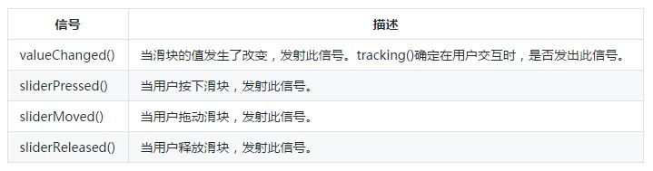

# QSlider_QProgressBar_QSpinBox_QDoubleSpinBox

## 一、QSlider
#### QSlider简介
QSlider小部件提供了一个垂直或水平滑块。

滑块是控制有界值的经典控件。它允许用户沿水平或垂直凹槽移动滑块手柄，并将手柄的位置转换为合法范围内的整数值。

QSlider拥有很少的功能，大部分的功能都在QAbstractSlider中。最有用的函数是setValue()将滑块直接设置为某个值; triggerAction()模拟点击的效果（对快捷键有用）; setSingleStep()，setPageStep()设置步骤；以及setMinimum()和setMaximum()来定义滚动条的范围。

QSlider继承了一套全面的信号：


QSlider只提供整数范围。请注意，虽然QSlider处理的数量非常大，但用户很难准确地在很大范围内使用滑块。

一个滑块接受对Tab的焦点，并提供鼠标滚轮和键盘界面。键盘接口如下：  
| 键盘       | 事件                     |
| ---------- | ------------------------ |
| Left/Right | 移动水平滑块一个步长     |
| Up/Down    | 移动垂直滑块一个步长     |
| PageUp     | 上移一页                 |
| PageDown   | 下移一页                 |
| Home       | 移动至起始位置（最小值） |
| End        | 移动至结束位置（最大值） |

更多详细的说明请见：：[QSlider Class](https://doc.qt.io/qt-5/qslider.html "QSlider Class")
```python
class QAbstractSlider(QWidget):
    """ QAbstractSlider(parent: QWidget = None) """
class QSlider(QAbstractSlider):
    """
    QSlider(parent: QWidget = None)
    QSlider(Qt.Orientation, parent: QWidget = None)
    """
```
#### 例子
实现效果：

```python
from PyQt5.QtWidgets import QWidget, QApplication, QSlider, QLabel
from PyQt5.QtCore import Qt
from PyQt5.QtGui import QPixmap
import sys

class Example(QWidget):
    def __init__(self):
        super().__init__()
        self.initUI()

    def initUI(self):
        self.resize(750, 450)
        self.setWindowTitle('小车快跑（滑动块）')

        self.sld1 = QSlider(Qt.Vertical, self)
        self.sld1.setGeometry(30, 40, 30, 100)
        self.sld1.setMinimum(0)
        self.sld1.setMaximum(99)
        self.sld1.setTickPosition(QSlider.TicksLeft)

        self.sld2 = QSlider(Qt.Horizontal, self)
        self.sld2.setGeometry(500, 350, 100, 30)
        self.sld2.setMinimum(0)
        self.sld2.setMaximum(99)

        self.sld1.valueChanged[int].connect(self.changevalue)
        self.sld2.valueChanged[int].connect(self.changevalue)

        self.label1 = QLabel(self)
        self.label1.setPixmap(QPixmap('icon/01.jpg'))
        self.label1.setGeometry(80, 150, 600, 180)

        self.label2 = QLabel('滑动块1当前值: 0 ', self)
        self.label2.move(70, 70)

        self.label3 = QLabel('滑动块2当前值: 0 ', self)
        self.label3.move(550, 390)

        self.show()

    def changevalue(self, value):
        sender = self.sender()
        if sender == self.sld1:
            self.sld2.setValue(value)
        else:
            self.sld1.setValue(value)
        self.label2.setText('滑动块1当前值:' + str(value))
        self.label3.setText('滑动块2当前值:' + str(value))
        if value == 0:
            self.label1.setPixmap(QPixmap('icon/01.jpg'))
        elif value > 0 and value <= 30:
            self.label1.setPixmap(QPixmap('icon/02.jpg'))
        elif value > 30 and value < 80:
            self.label1.setPixmap(QPixmap('icon/03.jpg'))
        else:
            self.label1.setPixmap(QPixmap('icon/04.jpg'))

if __name__ == '__main__':
    app = QApplication(sys.argv)
    ex = Example()
    sys.exit(app.exec_())
```
在我们的例子中，我们通过拖动滑块，更改标签上的图像，给人以小汽车好像在前进的感觉。
```python
self.sld1 = QSlider(Qt.Vertical,self)
self.sld2 = QSlider(Qt.Horizontal,self)
```
这里我们创建一个水平和垂直的QSlider对象。

```python
self.sld1.setGeometry(30,40,30,100)
self.sld1.setMinimum(0)
self.sld1.setMaximum(99)
```
这里我们指定了滑块1的大小和位置，同时设置了其能表示的最小值（0）和最大值（99）

```python
self.sld1.setTickPosition(QSlider.TicksLeft)
```
这里我们给滑块1设定了一个标记位置，需要注意的是滑块2我们没有设定标记位置，这样才能更好的区别。默认是没有标记位置显示的。

这个刻度线相对于滑块和用户操作的位置，它有以下几种样式：


```python
self.sld1.valueChanged[int].connect(self.changevalue)
self.sld2.valueChanged[int].connect(self.changevalue)
```
我们将valueChanged信号连接到用户定义的changevalue()方法。

```python
self.label1 = QLabel(self)
self.label1.setPixmap(QPixmap('01.jpg'))
self.label1.setGeometry(80,150,600,180)
```
我们创建一个QLabel小部件并为其设置一个初始静态图像。

为了实现两个滑块的联动，所以我们判断拖动了哪个滑块，然后设置另一个滑块的值，这样就实现两个滑块的联动了。

滑块拖动的同时我们会实时显示当前的滑块值。

根据滑块的值，我们将图像设置为标签。 在上面的代码中，如果滑块等于0，我们将01.JPG图像设置为标签。

## 二、QProgressBar
#### QProgressBar简介
QProgressBar小部件提供了一个水平或垂直的进度条。

进度条用于向用户指示操作的进度，并向他们保证应用程序仍在运行。

进度条使用steps的概念。您可以通过指定最小和最大可能的step值来设置它，并且当您稍后将当前step值赋给它时，它将显示已经完成的step的百分比。百分比是通过将进度 (value() - minimum()) / (maximum() - minimum())来计算的。

您可以使用setMinimum()和setMaximum()指定最小和最大steps。默认值是0和99。当前的step由setValue()设置。进度条可以通过reset()重新开始。

如果最小值和最大值都设置为0，那么栏会显示一个繁忙的指示符，而不是步骤的百分比。例如，在使用QNetworkAccessManager下载项目时，这是非常有用的，因为他们无法确定正在下载的项目的大小。

详见官网介绍：[QProgressBar Class](https://doc.qt.io/qt-5/qprogressbar.html "QProgressBar Class")

#### 例子
实现效果：

```python
from PyQt5.QtWidgets import QWidget, QApplication, QProgressBar, QPushButton, QMessageBox
from PyQt5.QtCore import Qt, QBasicTimer
import sys

class Example(QWidget):
    def __init__(self):
        super().__init__()
        self.initUI()
        
    def initUI(self):
        self.resize(600,480)
        self.setWindowTitle('跑马灯（进度条）')

        self.pb11 = QProgressBar(self)
        self.pb12 = QProgressBar(self)
        self.pb13 = QProgressBar(self)
        self.pb14 = QProgressBar(self)
        self.pb21 = QProgressBar(self)
        self.pb22 = QProgressBar(self)
        
        self.pb11.setOrientation(Qt.Horizontal)
        self.pb12.setOrientation(Qt.Vertical)
        self.pb13.setOrientation(Qt.Horizontal)
        self.pb14.setOrientation(Qt.Vertical)
        
        self.pb11.setGeometry(70, 40, 450, 20)
        self.pb12.setGeometry(490, 40, 20, 400)
        self.pb13.setGeometry(70, 420, 450, 20)
        self.pb14.setGeometry(70, 40, 20, 400)

        self.pb21.setGeometry(200, 100, 200, 20)
        self.pb22.setGeometry(200, 340, 200, 20)
        
        self.pb21.setFormat("%v")
        self.pb22.setInvertedAppearance(True)
        
        self.b1 = QPushButton('外圈跑马灯',self)
        self.b2 = QPushButton('内圈跑进度',self)
        
        self.b1.move(250,180)
        self.b2.move(250,250)
        
        self.show()
        
        self.timer = QBasicTimer()
        self.step = 0
        
        self.b1.clicked.connect(self.running)
        self.b2.clicked.connect(self.doaction)
        
    def timerEvent(self, e):
        if self.step >= 100:
            self.timer.stop()
            QMessageBox.information(self,'提示','内圈收工了!')
            self.b2.setText('再来一次')
            self.step = 0
            return

        self.step = self.step + 1
        self.pb21.setValue(self.step)
        self.pb22.setValue(self.step)

    def doaction(self):
        if self.timer.isActive():
            self.timer.stop()
            self.b2.setText('继续')
        else:
            self.timer.start(100, self)
            self.b2.setText('停止')
        
    def running(self):
        self.pb11.setMinimum(0)
        self.pb11.setMaximum(0)
        self.pb12.setInvertedAppearance(True)
        self.pb12.setMinimum(0)
        self.pb12.setMaximum(0)
        self.pb13.setInvertedAppearance(True)
        self.pb13.setMinimum(0)
        self.pb13.setMaximum(0)
        self.pb14.setMinimum(0)
        self.pb14.setMaximum(0)
        
if __name__ == '__main__':
    app = QApplication(sys.argv)
    ex = Example()
    sys.exit(app.exec_())
```
这个例子当中我们做了一个跑马灯，其实就是看起来像。然后中间再做了一个正常点的进度条。
```python
self.pb11.setOrientation(Qt.Horizontal)
self.pb12.setOrientation(Qt.Vertical)
self.pb13.setOrientation(Qt.Horizontal)
self.pb14.setOrientation(Qt.Vertical)
```
进度条是可以设置方向的，你可以选择垂直或是水平。这里我们通过垂直和水平方式建立了一个跑马圈。

QProgressBar.setOrientation()该属性设置了进度条的方向，方向必须是Qt.Horizontal（默认，水平）或Qt.Vertical（垂直）。
```python
self.pb21.setFormat("%v")
```

QProgressBar.setFormat()属性包含用于生成当前文本的字符串  
* ％p - 被完成的百分比取代   
* ％v - 被当前值替换   
* ％m - 被总step所取代   
* 默认值是”％p％”   
 
```python
self.pb22.setInvertedAppearance(True)
```
我们知道进度条可以向左向右前进（以水平进度条为例），这个就是通过QProgressBar.setInvertedAppearance()来设置的。如果这个属性为真，则进度条向另一个方向增长（例如从右向左）。 默认情况下，进度条从左到右（水平进度条）。


```python
self.timer = QBasicTimer()
```
要激活进度条，我们使用一个计时器对象。

**QBasicTimer简介**   
QBasicTimer类为对象提供计时器事件。

这是Qt内部使用的一个快速，轻量级和低级别的类。注意这个定时器是一个重复的定时器，除非调用stop()函数，否则它将发送后续的定时器事件。当定时器超时时，它将向QObject子类发送一个timer事件。定时器可以随时stop()。
```python
self.timer.start(100, self)
```
要启动计时器事件，我们调用它的start()方法。 这个方法有两个参数：超时时间（毫秒级）和接收事件的对象。

```python
def timerEvent(self, e):
    if self.step >= 100:
        self.timer.stop()
        QMessageBox.information(self,'提示','内圈收工了!')
        self.b2.setText('再来一次')
        self.step = 0
        return
    self.step = self.step + 1
    self.pb21.setValue(self.step)
    self.pb22.setValue(self.step)
```
每个QObject及其子类都有一个timerEvent()事件处理程序。 为了对计时器事件作出反应，我们重新实现事件处理程序。  
总step<100的话，就自加，从图形上看就是进度条再前进。  
总step>100的话，定时器停止，setp重置为0。  
QProgressBar.setValue()该属性设置进度条的当前值，value值不停地增加，进度就在增加。  

```python
def doaction(self):
    if self.timer.isActive():
        self.timer.stop()
        self.b2.setText('继续')
    else:
        self.timer.start(100, self)
        self.b2.setText('停止')
```
在doaction()方法内部，我们启动和停止定时器。isActive()如果定时器正在运行且尚未停止，则返回True；否则返回False。

因为最开始定时器是没有运行， 所以会执行self.timer.start(100,self)语句；当再次按下按钮时候，定时器已经运行，所以会执行self.timer.stop()语句，将定时器停止。自然也不会去执行timerEvent()中的内容了。

```python
def running(self):
    self.pb11.setMinimum(0)
    self.pb11.setMaximum(0)
    ...
```
就像之前讲的那样，如果最小值和最大值都设置为0，那么栏会显示一个繁忙的指示符，而不是步骤的百分比。所以就模拟成了跑马灯。

## 三、微调框QSpinBox
#### QSpinBoxr简介
QSpinBox类提供了一个微调框小部件。

QSpinBox被设计为处理整数和离散值集合（例如，月份名称）；使用QDoubleSpinBox（下棋补充讲解一下）可以作为浮点数的调整。

QSpinBox允许用户通过点击上/下按钮或按下键盘上的/下来选择一个值来增加/减少当前显示的值。用户也可以手动输入值。微调框支持整数值，但可以用与validate()，textFromValue()和valueFromText()扩展为使用不同的字符串。

每次值改变QSpinBox发出两个valueChanged()信号，一个提供一个int，另一个提供一个QString。 QString重载提供了prefix()和suffix()两个值。当前值可以通过value()获取，并通过setValue()设置。

单击向上/向下按钮或使用键盘的向上和向下箭头将按照sizeStep()的大小逐步增加或减少当前值。如果你想改变这个行为，你可以重新实现函数stepBy()。最小值和最大值以及步长可以使用其中一个构造函数来设置，稍后可以使用setMinimum()，setMaximum()和setSingleStep(True)来更改。

大多数微调框是定向的，但是QSpinBox也可以例外，即如果范围是0-99并且当前值是99，则如果wrapping()被设置为True，则单击“up”将给出0。如果你想循环行为，使用setWrapping()。

所显示的值可以预先加上任意字符串，例如表示货币或计量单位。

更多详细的介绍请见官网：[QSpinBox Class](https://doc.qt.io/qt-5/qspinbox.html "QSpinBox Class")

##### 例子
实现效果：

```python
from PyQt5.QtWidgets import QWidget, QApplication, QSpinBox, QSlider, QLabel, QMessageBox
from PyQt5.QtCore import QRegExp, Qt
import sys

class HolyShitBox(QSpinBox):
    def valueFromText(self,str):
        regExp = QRegExp("(\\d+)(\\s*[xx]\\s*\\d+)?")
        if regExp.exactMatch(str):
            return int(regExp.cap(1))
        else:
            return 0
    def textFromValue(self,num):
        return "{0} x {1}".format(num,num)
        
class Example(QWidget):
    def __init__(self):
        super().__init__()
        self.initUI()

    def initUI(self):
        self.resize(350,280)
        self.setWindowTitle('学点编程吧--微调框')
        
        lb1 = QLabel('普通微调框',self)
        lb2 = QLabel('加强微调框',self)
        lb3 = QLabel('超神微调框',self)
        
        self.sp1 = QSpinBox(self)
        self.sp2 = QSpinBox(self)
        self.sp3 = HolyShitBox(self)
        
        self.sl = QSlider(Qt.Horizontal,self)
        
        self.sp1.move(130,30)
        self.sp2.move(130,70)
        self.sp3.move(130,100)
        
        lb1.move(30,32)
        lb2.move(30,70)
        lb3.move(30,100)
        
        self.sl.move(30,150)
        
        self.sp1.setRange(-10, 200)
        self.sp1.setSingleStep(10)
        self.sp1.setWrapping(True)
        self.sp1.setValue(-10)
        
        self.sp2.setRange(0, 100)
        self.sp2.setSingleStep(10)
        self.sp2.setValue(10)
        self.sp2.setPrefix("我的帅达到 ")
        self.sp2.setSuffix(" %，正在充帅中...")
        self.sp2.setSpecialValueText('我的帅达到渣的一逼')
        
        self.sp3.setRange(10, 50)
        self.sp3.setValue(10)
        self.sp3.setWrapping(True)
        
        self.sl.setRange(-10, 200)
        self.sl.setValue(-10)
        
        self.sp1.valueChanged.connect(self.slider1_changevalue)
        self.sp2.valueChanged.connect(self.slider2_changevalue)
        self.sl.valueChanged.connect(self.spinbox_changevalue)
        self.show()

    def slider1_changevalue(self,value):
        self.sl.setValue(value)
        
    def slider2_changevalue(self,value):
        if self.sp2.value() == self.sp2.maximum():
            QMessageBox.information(self,'提示','你怎么还再充帅，你不知道你的帅已经引起了别人的嫉妒吗？')
            self.sp2.setSuffix(" %,我踏马太帅了！！")
        elif self.sp2.minimum()< self.sp2.value() < self.sp2.maximum():
            self.sp2.setSuffix(" %，正在充帅中...")
            
    def spinbox_changevalue(self,value):
        self.sp1.setValue(value)
        
if __name__ == '__main__':
    app = QApplication(sys.argv)
    ex = Example()
    sys.exit(app.exec_())
```
这个段代码实现了三个微调框的效果：   
* 普通的微调框：整数的调整    
* 加强微调框：整数的调整前后增加任意字符串，同时当微调框的值为最小值的时候会出现特定的字符串    
* 自定义微调框  

```python
self.sp1 = QSpinBox(self)
self.sp2 = QSpinBox(self)
self.sp3 = HolyShitBox(self)
```
新建三个QSpinBox对象，注意第三个，这个是我们自定义的。

```python
self.sp1.setRange(-10, 200)
self.sp1.setSingleStep(10)
self.sp1.setWrapping(True)
self.sp1.setValue(-10)
```
QSpinBox.setRange（int minimum,int maximum）这个函数能够便捷设置最小值和最大值。

setRange（minimum,maximum）相当于：setMinimum（minimum）和setMaximum（maximum）。

singleStep:int,此属性保持步骤值,当用户使用箭头来改变微调框的值时，该值将被递增/递减单步的数量。 默认值是1.设置一个小于0的singleStep值什么也不做。

QSpinBox.setWrapping()，继承了QAbstractSpinBox的属性，这个属性保持微调框是否能循环调整。

QSpinBox.setValue()，顾名思义设置当前微调框的值。

至此第一个普通的微调框已经设置完毕了。

```python
self.sp2.setPrefix("我的帅达到 ")
self.sp2.setSuffix(" %，正在充帅中...")
self.sp2.setSpecialValueText('我的帅达到渣的一逼')
```
QSpinBox.setRange.setPrefix()和QSpinBox.setRange.setSuffix()分别用于设置微调框的前后缀，典型的用法是显示度量单位或货币符号。

```python
self.sp2.setSpecialValueText('我的帅达到渣的一逼')
```
该属性包含特殊值的文本,如果设置，当当前值等于minimum()时，微调框将显示该文本而不是数字值。典型的用法是表明这个选择有一个特殊的（默认）含义。

例如，如果您的微调框允许用户选择显示图像的比例因子（或缩放级别），并且您的应用程序可以自动选择一个可以使图像完全适合显示窗口的图像，则可以设置像这样的微调框：
```python
zoomSpinBox = QSpinBox(self)
zoomSpinBox.setRange(0, 1000)
zoomSpinBox.etSingleStep(10)
zoomSpinBox.setSuffix("%")
zoomSpinBox.setSpecialValueText("Automatic")
zoomSpinBox.setValue(100)
```
用户将能够选择从1％到1000％的比例，或者选择“自动”以将其留给应用程序选择。 然后，您的代码必须将微调框值0解释为来自用户的请求，以缩放图像以适合窗口内部。

如果使用prefix(),suffix()和specialValueText()感觉还是不爽，那么你可以继承QSpinBox并重新实现valueFromText()和textFromValue()。

## 四、微调框QDoubleSpinBox
#### QDoubleSpinBox简介
大部分的总体说明和QSpinBox的差不多，这里主要把有差别的地方谈一下（三点）。  
QDoubleSpinBox会舍去数字，以便以当前精度显示。在QDoubleSpinBox小数设置为2，调用setValue(2.555)将导致value()返回2.56。
spinbox的默认精度为2位小数，但可以使用setDecimals()更改。
除了最终的前缀和后缀内容外，QDoubleSpinBox的显示值限制为18个字符。这个限制是用来保持微调时即使是非常大的值也可以使用。

更多详细的介绍请见官网：[QDoubleSpinBox Class](https://doc.qt.io/qt-5/qdoublespinbox.html "DoubleSpinBox Class")

#### 例子
实现效果：

```python
from PyQt5.QtWidgets import QWidget, QApplication, QDoubleSpinBox, QLabel, QSlider
from PyQt5.QtCore import Qt
import sys
        
class Example(QWidget):
    def __init__(self):
        super().__init__()
        self.initUI()

    def initUI(self):
        self.resize(370,190)
        self.setWindowTitle('小数微调框')
        
        self.sp = QDoubleSpinBox(self)
        self.sp.setGeometry(10,50,100,20)
        self.sp.setRange(0,20)
        self.sp.setSingleStep(0.1)
        
        self.lb = QLabel("QDoubleSpinBox精度设置为：2",self)
        self.lb.move(120,50)

        self.sl = QSlider(Qt.Vertical,self)
        self.sl.setGeometry(300,30,30,100)
        self.sl.setRange(0,9)
        self.sl.setValue(0)
        self.sl.setTickPosition(QSlider.TicksBelow)
        
        self.sl.valueChanged.connect(self.spinbox_changevalue)
        self.show()
        
    def spinbox_changevalue(self,value):
        if value <= 7:
            self.lb.setText("QDoubleSpinBox精度设置为:" + str(value+2))
            self.sp.setDecimals(value+2)

if __name__ == '__main__':
    app = QApplication(sys.argv)
    ex = Example()
    sys.exit(app.exec_())
```
这个例子我们设置了精度值，最小2，最大9，通过滑块进行调节。

