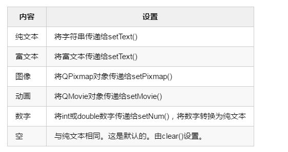
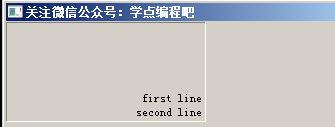
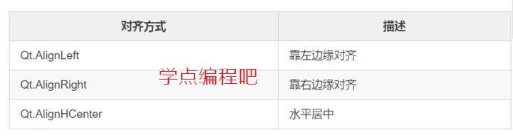
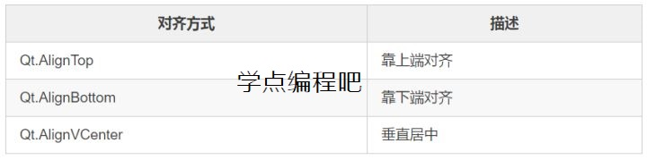
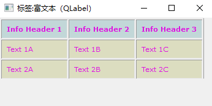
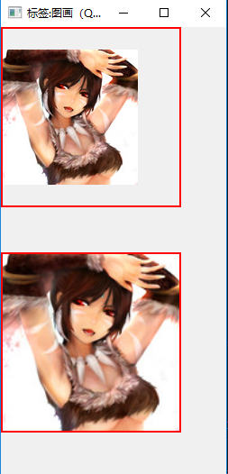
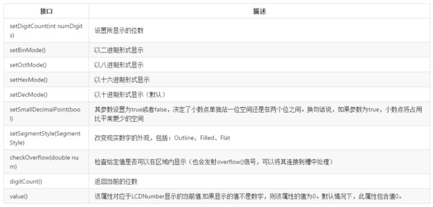
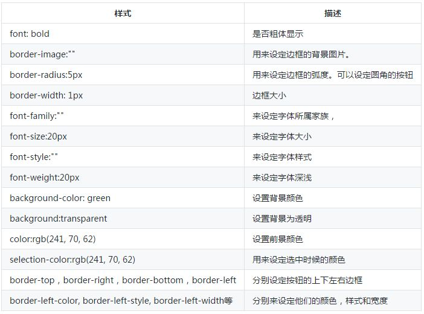

# QLabel_QLCDNumber

## 一、QLabel
#### QLabel简介
QLabel小部件提供文本或图像显示。

QLabel用于显示文本或图像。没有提供用户交互功能。标签的外观可以通过各种方式进行配置，可以用于指定另一个小部件的焦点助记键。

QLabel可以包含以下任何内容类型：


当使用任何方法改变内容时，任何先前的内容都被清除。

**警告**：当在QLabel中使用setText()设置文本内容的时候，因为QLabel会尝试猜测它是将文本显示为纯文本还是作为HTML 4标记的一部分的富文本。想明确地显示文本格式，请调用setTextFormat()，例如如果您希望文本是纯文本格式，但无法控制文本源（例如，显示从Web上加载的数据时）。

默认情况下，标签显示左对齐、垂直居中的文本和图像。QLabel的外观可以通过多种方式进行调整和微调。

可以使用setAlignment()和setIndent()来调整QLabel小部件区域内的内容定位。文本内容还可以使用setwordpwrap ()沿单词边界换行。

例如，这段代码在右下角设置了一个双行文本的凹陷面板（两行与标签的右侧齐平）：
```python
label = QLabel(self)
label.resize(200,100)
label.setFrameStyle(QFrame.Panel | QFrame.Sunken)
label.setText("first line\nsecond line")
label.setAlignment(Qt.AlignBottom | Qt.AlignRight)
```


QLabel从QFrame继承的属性和函数，也可以用来指定要用于任何给定标签的构件框架。

更多的介绍请见官网： [QLabel Class](https://doc.qt.io/qt-5/qlabel.html "QLabel Class")

#### 例子1(纯文本演示)
实现效果：

```python
from PyQt5.QtWidgets import QWidget, QApplication, QLabel, QRadioButton, QButtonGroup, QInputDialog, QPushButton
from PyQt5.QtCore import Qt
import sys

class Example(QWidget):
    def __init__(self):
        super().__init__()
        self.initUI()

    def initUI(self):
        self.resize(550,320)
        self.setWindowTitle('纯文本（QLabel）')

        self.lb1 = QLabel('学点编程吧，我爱你~！',self)
        self.lb1.setGeometry(0,0,550,50)
        
        self.lb2 = QLabel('我内容很少哦...',self)
        self.lb2.setGeometry(0,100,120,70)
        
        self.lb3 = QLabel('我内容很少哦...',self)
        self.lb3.setGeometry(0,190,120,70)
        self.lb3.setWordWrap(True)
        
        self.bt1 = QPushButton('输入内容1',self)
        self.bt1.move(0,150)
        
        self.bt2 = QPushButton('输入内容2',self)
        self.bt2.move(0,280)    
        
        self.ra1 = QRadioButton('左边',self)
        self.ra2 = QRadioButton('中间',self)
        self.ra3 = QRadioButton('右边',self)
        
        self.ra1.move(10,60)
        self.ra2.move(70,60)
        self.ra3.move(130,60)
        
        self.bg1 = QButtonGroup(self)
        self.bg1.addButton(self.ra1, 1)
        self.bg1.addButton(self.ra2, 2)
        self.bg1.addButton(self.ra3, 3)
        
        self.show()
        
        self.bg1.buttonClicked.connect(self.rbclicked)
        self.bt1.clicked.connect(self.showDialog)
        self.bt2.clicked.connect(self.showDialog)
        

    def rbclicked(self):
        if self.bg1.checkedId() == 1:
            self.lb1.setAlignment(Qt.AlignVCenter | Qt.AlignLeft)
        elif self.bg1.checkedId() == 2:
            self.lb1.setAlignment(Qt.AlignCenter)
        elif self.bg1.checkedId() == 3:
            self.lb1.setAlignment(Qt.AlignVCenter | Qt.AlignRight)
    
    def showDialog(self):
        sender = self.sender()
        if sender == self.bt1:
            text, ok = QInputDialog.getText(self, '内容1', '请输入内容1：')
            if ok:
                self.lb2.setText(text)
        elif sender == self.bt2:
            text, ok = QInputDialog.getText(self, '内容2', '请输入内容2：')
            if ok:
                self.lb3.setText(str(text))

if __name__ == '__main__':
    app = QApplication(sys.argv)
    ex = Example()
    sys.exit(app.exec_())
```
这个例子主要是实现了两个功能：  
* QLabel内容的对齐方式：这里我们给出了三个：左中、中间、右中。  
* 当QLabel内容较多的时候，里面的内容可以换行，这里通过两个输入对话框我们对比实现了。  
 
```python
self.lb3 = QLabel('我内容很少哦...',self)
self.lb3.setWordWrap(True)
```
将WordWrap的属性设置为True，实现自动换行，默认是不能自动换行的。

```python
def rbclicked(self):
    if self.bg1.checkedId() == 1:
        self.lb1.setAlignment(Qt.AlignVCenter | Qt.AlignLeft)    elif self.bg1.checkedId() == 2:
        self.lb1.setAlignment(Qt.AlignCenter)    elif self.bg1.checkedId() == 3:
        self.lb1.setAlignment(Qt.AlignVCenter | Qt.AlignRight)
```
当我们点击不同的单选按钮的时候会对QLabel的内容进行相应的对齐。默认情况下，标签的内容是左对齐和垂直居中的。其它的情况如下：
它包含水平和垂直的标志，可以结合起来产生所需的效果。

水平标志是：

垂直标志是：


一次最多可以使用一个水平和一个垂直标志。当然凡是也有例外，下面的就可以可表现出两个属性。

Qt.AlignCenter： 水平、垂直居中

#### 例子2(富文本演示)
实现效果：

```python
from PyQt5.QtWidgets import QWidget, QApplication, QLabel
import sys

class Example(QWidget):
    def __init__(self):
        super().__init__()
        self.initUI()

    def initUI(self):
        self.resize(350,150)
        self.setWindowTitle('标签:富文本（QLabel）')

        lb = QLabel(self)
        lb.resize(350,100)
        
        html = '''
                <style type="text/css">
                    table.imagetable {
                        font-family: verdana,arial,sans-serif;
                        font-size:11px;
                        color:#DE15E0;
                        border-width: 1px;
                        border-color: #999999;
                        border-collapse: collapse;
                    }
                    table.imagetable th {
                        background:#C2D7D8;
                        border-width: 1px;
                        padding: 8px;
                        border-style: solid;
                        border-color: #999999;
                    }
                    table.imagetable td {
                        background:#dcddc0;
                        border-width: 1px;
                        padding: 8px;
                        border-style: solid;
                        border-color: #999999;
                    }
                </style>

                <table class="imagetable">
                    <tr>
                        <th>Info Header 1</th><th>Info Header 2</th><th>Info Header 3</th>
                    </tr>
                    <tr>
                        <td>Text 1A</td><td>Text 1B</td><td>Text 1C</td>
                    </tr>
                    <tr>
                        <td>Text 2A</td><td>Text 2B</td><td>Text 2C</td>
                    </tr>
                </table>
            '''
        lb.setText(html)
        self.show()

if __name__ == '__main__':
    app = QApplication(sys.argv)
    ex = Example()
    sys.exit(app.exec_())
```
PyQt5的文本小部件能够显示丰富的文本，使用HTML4标记的一个子集指定，具体内容显示哪些内容，请见官方文档：https://doc.qt.io/qt-5/richtext-html-subset.html,，常用的HTML标记和CSS属性是支持的。

#### 例子3(图片演示)
实现效果：

```python
from PyQt5.QtWidgets import QWidget, QApplication, QLabel
from PyQt5.QtGui import QPixmap
import sys

class Example(QWidget):
    def __init__(self):
        super().__init__()
        self.initUI()

    def initUI(self):
        self.resize(250,500)
        self.setWindowTitle('标签:图画（QLabel）')
        
        pix = QPixmap('icon/baonv.jpg')
        
        lb1 = QLabel(self)
        lb1.setGeometry(0,0,200,200)
        lb1.setStyleSheet("border: 2px solid red")
        lb1.setPixmap(pix)
        
        lb2 = QLabel(self)
        lb2.setGeometry(0,250,200,200)
        lb2.setPixmap(pix)
        lb2.setStyleSheet("border: 2px solid red")
        lb2.setScaledContents(True)
        
        self.show()

if __name__ == '__main__':
    app = QApplication(sys.argv)
    ex = Example()
    sys.exit(app.exec_())
```
图片的演示是一个对比演示。

我们先用QPixmap()创建一个QPixmap对象，然后在两个QLabel对象中分别插入，不同的地方在于：  
* lb1我们是直接插入  
* lb2，我们启用了setScaledContents(True)，这个函数的意义就在于是否将缩放其内容以填充所有可用空间。当启用时，标签显示一个像素图，它将缩放像素图以填充可用空间。该属性的默认值是False。  

setStyleSheet()是为了便于大家查看我们设置这个标签的大小范围而已。

#### 例子4(动画演示)
实现效果：

```python
from PyQt5.QtWidgets import QWidget, QApplication, QLabel, QPushButton
from PyQt5.QtGui import QMovie, QPixmap
import sys

class Example(QWidget):
    def __init__(self):
        super().__init__()
        self.initUI()

    def initUI(self):
        self.resize(500,300)
        self.setWindowTitle('标签:动画（QLabel）')

        self.lb = QLabel(self)
        self.lb.setGeometry(100,50,300,200)
        
        self.bt1 = QPushButton('开始',self)
        self.bt2 = QPushButton('停止',self)
        
        self.bt1.move(100,20)
        self.bt2.move(280,20)
        
        self.pix = QPixmap('icon/movie.gif')
        self.lb.setPixmap(self.pix)
        self.lb.setScaledContents(True)
        
        self.bt1.clicked.connect(self.run)
        self.bt2.clicked.connect(self.run)
        
        self.show()
        
    def run(self):
        movie = QMovie("icon/movie.gif")
        self.lb.setMovie(movie)
        if self.sender() == self.bt1:
            movie.start()
        else:
            movie.stop()
            self.lb.setPixmap(self.pix)

if __name__ == '__main__':
    app = QApplication(sys.argv)
    ex = Example()
    sys.exit(app.exec_())
```
没想到吧，QLabel还有这凶残技能，放动画。。。

这段代码的关键就是QMovie的使用，简单介绍一下吧。

QMovie类是用QImageReader播放动画的便捷类。

这个类用来显示没有声音的简单的动画。如果您要显示视频和媒体内容，请改为使用Qt多媒体多媒体框架。

首先，来创建一个QMovie对象。在启动电影之前，您可以调用isValid()来检查图像数据是否有效。要启动电影，请调用start()。 QMovie将进入运行状态，并发出start()和stateChanged()。要获得电影的当前状态，请调用state()。

要在应用程序中显示电影，可以将QMovie对象传递给QLabel.setMovie()。例：
```python
label = QLabel(self)
movie = QMovie("animations/fire.gif")
label.setMovie(movie)
movie.start()
```
每当电影中有新的帧时，QMovie将发出updated()信号。如果框架的大小发生变化，则发出resized()信号。您可以调用currentImage()或currentPixmap()来获取当前帧的副本。当电影完成后，QMovie发出finished()。如果播放过程中发生错误（即图像文件损坏），QMovie将发出error()。

您可以通过调用setSpeed()来控制电影播放的速度，setSpeed()将原始速度的百分比作为参数。通过调用setPaused（True）来暂停电影。 QMovie将进入暂停状态并发出stateChanged()。如果您调用setPaused（False），QMovie将重新进入运行状态并再次启动电影。要停止电影，请使用stop()。

某些动画格式允许您设置背景颜色。你可以调用setBackgroundColor()来设置颜色，或者调用backgroundColor()来获取当前的背景颜色。

currentFrameNumber()返回当前帧的序列号。如果图像格式支持，frameCount()将返回动画中的总帧数。您可以调用loopCount()来获取电影在完成前应循环的次数。 nextFrameDelay()返回当前帧应显示的毫秒数。

可以通过调用setCacheMode()来指示QMovie缓存动画帧。

调用supportedFormats()以获取QMovie支持的格式列表。

## 二、液晶显示屏QLCDNumber
#### QLCDNumber简介
QLCDNumber小部件显示一个类似LCD的数字。

它可以显示任何大小的数字。它可以显示十进制，十六进制，八进制或二进制数字。使用display()槽连接数据源很容易，该槽被重载以获取五种参数类型中的任何一种。

还有一些槽函数可以用setMode()改变基数，用setSmallDecimalPoint()来改变小数点。

当QLCDNumber被要求显示超出范围的东西时，会发出overflow()信号。范围由setDigitCount()设置，但setSmallDecimalPoint()也影响它。如果显示设置为十六进制，八进制或二进制，则显示该值的整数等效值。

这些数字和其他符号可以显示：0/O，1，2，3，4，5/S，6，7，8，9/g，减号，小数点，A，B，C，D，E， F，h，H，L，o，P，r，u，U，Y，冒号，度数符号（在字符串中单引号）和空格。 QLCDNumber将非法字符替换为空格。

一些常用方法


更多的介绍请见官网： [QLCDNumber Class](https://doc.qt.io/qt-5/qlcdnumber.html "QLCDNumber Class")

#### 例子
实现效果：

```python
from PyQt5.QtWidgets import QWidget, QApplication, QLCDNumber, QLabel, QVBoxLayout
from PyQt5.QtCore import QTimer, QDateTime, QDate, QTime
from PyQt5.QtGui import QFont
import sys

class Example(QWidget):
    def __init__(self):
        super().__init__()
        self.initUI()

    def initUI(self):
        self.resize(370,190)
        self.setWindowTitle('LCD数字')

        self.lcd = QLCDNumber(self)
        lb = QLabel("距离2022年北京-张家口冬季奥林匹克运动会还有",self)
        ft = QFont()
        ft.setPointSize(15)
        lb.setFont(ft)
        vbox = QVBoxLayout(self)
        vbox.addWidget(lb)
        vbox.addWidget(self.lcd)

        self.lcd.setDigitCount(13)
        self.lcd.setMode(QLCDNumber.Dec)
        self.lcd.setStyleSheet("border: 2px solid black; color: red; background: silver;")

        time = QTimer(self)
        time.setInterval(1000)
        time.timeout.connect(self.refresh)
        time.start()

        self.show()

    def refresh(self):
        startDate = QDateTime.currentMSecsSinceEpoch()
        endDate = QDateTime(QDate(2022, 2, 4), QTime(0, 0, 0)).toMSecsSinceEpoch()
        interval = endDate - startDate
        if interval > 0:
            days = interval // (24 * 60 * 60 * 1000)
            hour = (interval - days * 24 * 60 * 60 * 1000) // (60 * 60 * 1000)
            min = (interval - days * 24 * 60 * 60 * 1000 - hour * 60 * 60 * 1000) // (60 * 1000)
            sec = (interval - days * 24 * 60 * 60 * 1000 - hour * 60 * 60 * 1000 - min * 60 * 1000) // 1000
            intervals = str(days) + ':' + str(hour) + ':' + str(min) + ':' + str(sec)
            self.lcd.display(intervals)

if __name__ == '__main__':
    app = QApplication(sys.argv)
    ex = Example()
    sys.exit(app.exec_())
```
代码总体不复杂，唯一需要注意的地方就是下面倒计时的计算，当然我的方法不一定最好，如果你有更好的欢迎交流。

```python
self.lcd = QLCDNumber(self)
self.lcd.setDigitCount(12)
self.lcd.setMode(QLCDNumber.Dec)
self.lcd.setStyleSheet("border: 2px solid black; color: red; background: silver;")
```
新建一个QLCDNumber对象。
将新建的QLCDNumber对象设置为12位。
setMode()该属性保存当前的显示模式（数字库）,对应于当前显示模式，即二进制、八进制、十进制（默认）和十六进制中的一种。十进制模式可以显示浮点值，其他模式显示整数等值。
setStyleSheet()设置LCD的外观，样式介绍如下：


```python
time = QTimer(self)
time.setInterval(1000)
```
QTimer类提供重复性和单次定时器。QTimer类为定时器提供高级编程接口。要使用它，请创建一个QTimer，将其timeout()信号连接到相应的插槽，然后调用start()。从此以后，它将以固定的时间间隔发出timeout()信号。

setInterval()该属性拥有以毫秒为单位的超时时间间隔。此属性的默认值为0。

因为我们设置的超时间隔是1000ms（1秒），所以每隔1秒我们就会调用refresh()这个槽函数。在这个槽函数中我们要不断的进行倒计时的计算。

QDateTime类提供日期和时间函数。QDateTime对象包含日历日期和时钟时间（“日期时间”）。它是QDate和QTime类的组合。它可以从系统时钟读取当前的日期时间。

* 首先我们计算当前时间，这里我们使用了currentMSecsSinceEpoch()将其转换成当前时间到1970-01-01T00：00：00世界协调时间以来的毫秒数。   
* 其次因为冬季奥运会的时间是2020年2月4日开始，我们假设是0:0:0开始的，我们创建一个QDatetime对象，并使用toMSecsSinceEpoch()返回2020年2月4日0:0:0自1970-01-01T00：00：00.000世界协调时间以来的毫秒数。   
* 再次我们将上面的结果进行相减，得到了当前时间到冬季奥运会开幕时的时间间隔。  
* 最后我们进行了一些列的计算，得到天数、小时数、分钟数、秒数并显示在LCD上。  