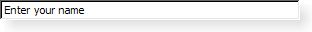
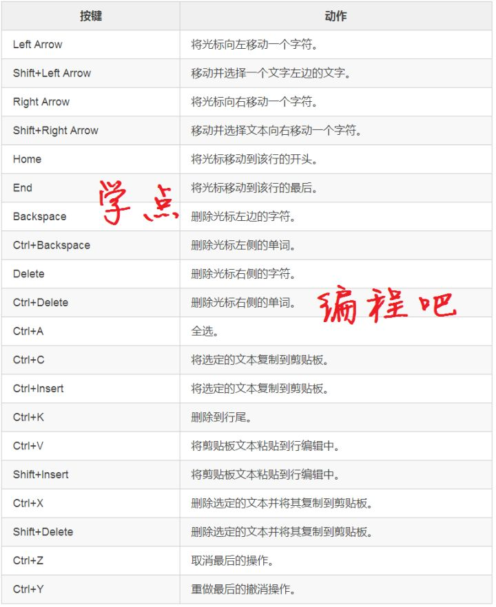
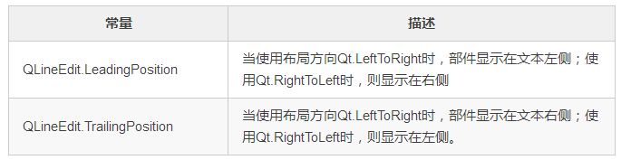
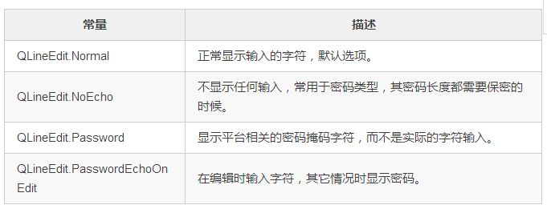
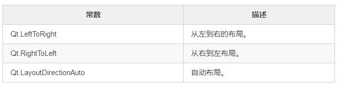
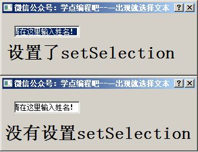
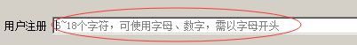
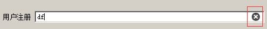
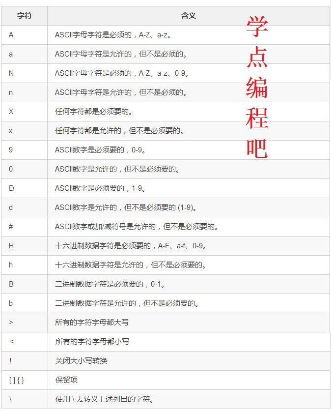
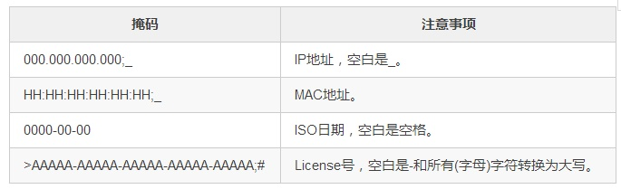

# QLineEdit
## 文本输入栏QLineEdit
#### QLineEdit总体介绍
QLineEdit小部件是一个单行文本编辑器。


行编辑允许用户使用一组有用的编辑功能输入和编辑纯文本行，包括撤消和重做，剪切和粘贴以及拖放。

通过更改行编辑的echoMode()，还可以将其用作“只写”字段，以输入密码等输入。

文本的长度可以限制为maxLength()。文本可以使用validator()或inputMask()或两者来任意约束。在同一行编辑中在验证器和输入掩码之间切换时，最好清除验证器或输入掩码以防止未定义的行为。

相关的类是QTextEdit，它允许多行，富文本编辑。

您可以使用setText()或insert()来更改文本。文本用text()检索；显示的文本（可能不同，请参阅EchoMode）使用displayText()检索。可以使用setSelection()或selectAll()选择文本，并且可以使用cut()、copy() 和paste()。文本可以与setAlignment()对齐。

当文本改变发射textChanged()信号时；当文本改变而不是通过调用setText()时，发出textEdited()信号；当光标移动时，cursorPositionChanged()信号被发射；当按下Return或Enter键时，会发出returnPressed()信号。

编辑完成后，无论是因为行编辑失去焦点还是按下了Return / Enter键，editingFinished()都会发出。

请注意，如果在行编辑中设置了验证程序，则只有在验证程序返回QValidator.Acceptable时才会发出returnPressed()/editingFinished()信号。

默认情况下，QLineEdits具有由平台样式指南指定的框架；你可以通过调用setFrame(Flase)来关闭它。

下面描述了默认的键绑定。行编辑还提供了一个上下文菜单（通常通过单击鼠标右键进行调用），它提供了其中一些编辑选项。


更多的介绍请见官网： [QLineEdit Class](https://doc.qt.io/qt-5/qlineedit.html "QLineEdit Class")

#### 常量
**QLineEdit.ActionPosition**

描述如何显示加入到输入框中的action部件。


**QLineEdit.EchoMode**

描述输入框如何显示其内容。


举个ActionPosition的小例子


这个例子当中，我们对拼写的单词进行了检查，发现计算机能够猜测出我们可能拼写错误的单词，并给出拼写建议。

单词拼写检查的代码来源互联网（感谢原作者）：
[Python写一个简洁拼写检查器](https://blog.csdn.net/sky_money/article/details/7957996 "Python写一个简洁拼写检查器")

```python
class Line(QDialog):
    def Ui(self):
        self.line = QLineEdit(self)
        self.line.move(20,20)
        action = QAction(self)
        action.setIcon(QIcon('check.ico'))
        action.triggered.connect(self.Check)
        self.line.addAction(action,QLineEdit.TrailingPosition)
    def Check(self):
        word = self.line.text()
        if correct(word) != word:
            QMessageBox.information(self,'提示信息','你或许想要表达的单词是：'+correct(word))
        else:
            QMessageBox.information(self,'提示信息','你填写的单词是：'+word)
```
需要注意的是correct()属于自定义拼写检查模块中函数，这个不是本章的重点，具体的内容请自行看源码。
```python
action = QAction(self)
action.setIcon(QIcon('check.ico'))
action.triggered.connect(self.Check)
```
新建一个QAction对象并设定它的图标同时在这个QAction对象被激活后调用Check()槽函数。

```python
self.line.addAction(action,QLineEdit.TrailingPosition)
```
这句话是对QAction对象的位置进行设定。在例子中它的位置是在右边。

话说QAction是啥？QAction使用菜单栏，工具栏或自定义键盘快捷方式执行操作的抽象，我个人理解就是一种动作、行为。


Qt.LeftToRight、Qt.RightToLeft是什么意思呢？
它指定了Qt布局和文本处理的方向。


对于某些语言，从右到左布局是必需的，特别是阿拉伯语和希伯来语。

LayoutDirectionAuto有两个用途。 当与小部件和布局一起使用时，它将暗示使用在父小部件或QApplication上设置的布局方向。 这与QWidget. unsetLayoutDirection()具有相同的效果。

当LayoutDirectionAuto与文本布局结合使用时，它将暗示文本的方向性取决于要展开的字符串内容。

#### 常用函数
一些常用接口的举例  
* QLineEdit.text()：返回输入框的当前文本。  
* QLineEdit.addAction(Action,QLineEdit.ActionPosition)：添加动作到文本输入栏，上面已经举过例子了。  
* QLineEdit.setAlignment(Qt.Alignment flag)：属性保存了输入框的对齐方式（水平和垂直方向。这个知识点在标签（QLabel）章节有过介绍。  
* QLineEdit.setCompleter() ：输入栏的自动补全就是靠这个实现的，下下章我们讲解。  
* QLineEdit.deselect() ：取消选中任何已选中的文本。  
* QLineEdit.displayText()：返回显示的文本。默认值为一个空字符串。  
如果echoMode是Normal，和text()返回的一样；如果EchoMode是Password或PasswordEchoOnEdit，会返回平台相关的密码掩码字符；如果EchoMode是NoEcho，返回一个空字符串””。  
* QLineEdit.selectedText()：返回选中的的文本。如果没有选中，返回一个空字符串。默认为一个空字符串。  
* QLineEdit.setCursorPosition(QLineEdit.cursorPosition)：设置输入框当前光标的位置。  
* QLineEdit.setMaxLength(int)：此属性包含文本的最大允许长度。如果文本太长，将从限制的位置截断。默认值为32767。  
* QLineEdit.setReadOnly(bool)：此属性保存输入框是否为只读。在只读模式下，用户仍然可以将文本复制到剪贴板，但不能编辑它，且不显示光标。  
* QLineEdit.setSelection(int start, int length) ：从位置start选择文本为length个字符，允许负长度。我们一启动程序是否设置setSelection的，效果如下：  
* QLineEdit.setValidator()：设置输入框的验证器，将限制任意可能输入的文本。我们在
密码输入框有过介绍。  
* QLineEdit.setPlaceholderText(str)：该属性包含行编辑的占位符文本。只要行编辑为空，设置此属性将使行编辑显示一个灰色的占位符文本。  
通常情况下，即使具有焦点，空行编辑也会显示占位符文本。但是，如果内容是水平居中的，则行编辑具有焦点时，占位符文本不会显示在光标下方。默认情况下，该属性包含一个空字符串。  
* QLineEdit.isClearButtonEnabled(bool) ：是否设置清除内容的按钮。  
* QLineEdit.setInputMask()：设置掩码。  

下表列出了可在一个输入掩码中使用的字符。 空格字符是空格的默认字符，对于允许但不需要字符的情况需要。


例如：

效果就是下面这个样子的：

代码：
```python
from PyQt5.QtWidgets import QLineEdit, QApplication, QDialog, QLabel, QMessageBox
import sys

class Line(QDialog):
    def __init__(self):
        super().__init__()
        self.Ui()
    
    def Ui(self):
        self.resize(300,100)
        self.setWindowTitle('掩码')
        self.line = QLineEdit(self)
        line2 = QLineEdit(self)
        line3 = QLineEdit(self)
        line4 = QLineEdit(self)

        lb = QLabel('IP地址',self)
        lb2 = QLabel('MAC地址',self)
        lb3 = QLabel('日期',self)
        lb4 = QLabel('License',self)
        
        lb.move(10,10)
        lb2.move(10,30)
        lb3.move(10,50)
        lb4.move(10,70)

        self.line.move(60,10)
        line2.move(60,30)
        line3.move(60,50)
        line4.move(60,70)
        
        self.line.editingFinished.connect(self.Action)

        self.line.setInputMask('000.000.000.000;_')
        line2.setInputMask('HH:HH:HH:HH:HH:HH;_')
        line3.setInputMask('0000-00-00')
        line4.setInputMask('>AAAAA-AAAAA-AAAAA-AAAAA-AAAAA;#')
        self.show()

    def Action(self):
        if len(self.line.text()) > 3:
            QMessageBox.information(self,'提示信息', '这行你完成了哦')

if __name__ == '__main__':
    app = QApplication(sys.argv)
    line = Line()
    sys.exit(app.exec_())
```

#### 信号Signals
常用信号：    
* selectionChanged() ：只要选择改变这个信号就会被发射。   
* cursorPositionChanged(int old, int new) ：只要光标移动，这个信号就会发射。前面的位置old，新的位置是new。   
* editingFinished()：按下返回或回车键或线条编辑失去焦点时发出此信号。   
* returnPressed()：按下返回或回车键时发出此信号。   
* textChanged(str)：只要文字发生变化就会发出此信号。文本参数是新文本。与textEdited()不同，当通过调用setText()以编程方式更改文本时，也会发出此信号。    
* textEdited(str) ：无论何时编辑文本都会发出此信号。文本参数是新文本。与textChanged()不同，当以编程方式更改文本时，不会发出此信号，例如通过调用setText()。   


#### 槽函数Public Slots
常用函数：    
* clear() ：清除输入框内容  
* copy()：如果echoMode()是Normal，将选中的文本复制到剪贴板。  
* cut() ：如果echoMode()是Normal，将所选文本复制到剪贴板并删除它。 如果当前的验证不允许删除选定的文本，cut()将复制而不删除。  
* paste() ：如果输入框不是只读的，插入剪贴板中的文本到光标所在位置，删除任何选定的文本。如果最终的结果不被当前的验证器接受，将没有任何反应。  
* redo() ：重做上次操作，如果redo可用（isRedoAvailable() ）。  
* selectAll() ：选中所有文本（即：高亮），并将光标移动到末尾。当一个默认值被插入时，这非常有用，因为如果用户在点击部件之前就输入，选中的文本将被删除。  
* setText(str) ：设置输入框显示的文本。  
* undo() ：撤消上次操作（如果撤销可用）  

#### 自定义密码框例子
实现先明后密的密码框，当我们输入密码的时候，它显示的是明文，但是由于里面有一个时间机制在里面，一定时间内它会自动将文本输入框里面的内容覆盖为“*”，所以我们填写密码的时候就好像先是有明文紧接着变成密文样的。  
实现类代码：
```python
from PyQt5.QtWidgets import QLineEdit
from PyQt5.QtCore import QTimer

class PwdLineEdit(QLineEdit):
    def __init__(self):
        super().__init__()
        self.m_LineEditText = ""
        self.m_LastCharCount = 0
        self.Action()
    
    def Action(self):
        self.cursorPositionChanged[int,int].connect(self.DisplayPasswordAfterEditSlot)
        self.textEdited[str].connect(self.GetRealTextSlot)
        self.time = QTimer(self)
        self.time.setInterval(200)
        self.time.start()
        self.show()
    
    def DisplayPasswordAfterEditSlot(self, old, new):
        print('new:',new)
        print('old:',old)
        if old >= 0 and new >= 0:
            if new > old:
                self.time.timeout.connect(self.DisplayPasswordSlot)
            else:
                self.setCursorPosition(old)                   

    def DisplayPasswordSlot(self):
        self.setText(self.GetMaskString())      

    def GetRealTextSlot(self, text):
        self.m_LastCharCount = len(self.m_LineEditText)
        
        if len(text) > self.m_LastCharCount:
            self.m_LineEditText += text[-1]
            
        elif len(text) <= self.m_LastCharCount:
            self.m_LineEditText = self.m_LineEditText[:-1]    

    def GetMaskString(self):
        mask = ""
        count = len(self.text())
        if count > 0:
            for i in range(count):
                mask += "*"
        return mask
    
    def GetPassword(self):
        return self.m_LineEditText
```
这里我们继承了QLineEdit这个类并自定义一个新类PwdLineEdit。我们定义了两个成员变量：
```python
self.m_LineEditText = ""
self.m_LastCharCount = 0
```
分别用以记录真实的密码和密码出现变化前的长度。

1、在程序中我们用到了两个信号发射：
```python
self.cursorPositionChanged[int,int].connect(self.DisplayPasswordAfterEditSlot)
self.textEdited[str].connect(self.GetRealTextSlot)
```
第一个信号是在光标发生移动时产生，返回两个整型变量并调用槽函数DisplayPasswordAfterEditSlot()，用以显示密文；
第二个信号是在文本编辑时产生，调用槽函数GetRealTextSlot()，用以记录真实的密码。

2、如何在让输入的明文自动的变成密文呢？我使用了QTimer类，设置超时时间是为200毫秒，然后自动调用DisplayPasswordSlot()。
```python
self.time = QTimer(self)
self.time.setInterval(200)
self.time.start()
def DisplayPasswordAfterEditSlot(self, old, new):
    if old >= 0 and new >= 0:
        if new > old:
            self.time.timeout.connect(self.DisplayPasswordSlot)
        else:
            self.setCursorPosition(old)
```
这里的old和new分别表示光标移动前后的位置，要是new > old，明显就是在输入密码，增加密码长度；反之就是在删除密码字符。

3、显示密文我们是怎么做到的呢？
```python
mask = ""
count = len(self.text())
if count > 0:
    for i in range(count):
     mask += "*"
```
我们判断输入的长度，然后用几个”*”覆盖掉，最后通过setText()，覆盖掉文本输入框。因为有时间延时，所以就好像每写一个就隐藏一个样的。很神奇是吧！

4、还有最关键的步骤，记录真正的密码，也就是我们输入的内容。
```python
def GetRealTextSlot(self, text):
    self.m_LastCharCount = len(self.m_LineEditText)
    if len(text) > self.m_LastCharCount:
        self.m_LineEditText += text[-1]
    elif len(text) <= self.m_LastCharCount:
        self.m_LineEditText = self.m_LineEditText[:-1]
```
当密码在输入的时候会自动的调用GetRealTextSlot()这个函数。

self.m_LastCharCount记录了当前没有变化时密码的长度。如果当前的长度大于之前记录的密码长度，很明显，密码在新增字符，所有实际密码是self.m_LineEditText += text[-1]，即将新增的字符和原有的密码进行合并。

反之，就删除最后一个字符，所以就用到了self.m_LineEditText = self.m_LineEditText[:-1]。

#### 实现文本框自动补全
若我们想用到QLineEdit自动补全的功能，必须要用到QCompleter类。

根据Qt官方文档上的介绍，QCompleter根据项目模型提供完成项。您可以使用QCompleter在任何Qt小部件中提供自动完成功能，例如QLineEdit和QComboBox。 当用户开始输入单词时，QCompleter根据单词列表提出完成单词的可能方法。 单词列表是作为QAbstractItemModel提供的。 （对于简单的应用程序，单词列表是静态的，您可以将List传递给QCompleter的构造函数。）

QCompleter的用法比较丰富，这里我们只涉及到最基本的使用。

**核心源码**
完成的最终效果是这样的：


```python
    self.m_model = QStandardItemModel(0, 1, self)
    m_completer = QCompleter(self.m_model, self)
    self.lineEdit_7.setCompleter(m_completer)
    m_completer.activated[str].connect(self.onEmailChoosed)
    
def onEmailChoosed(self, email):
    self.lineEdit_7.setText(email)
@pyqtSlot(str)
def on_lineEdit_7_textChanged(self, text):
    if '@' in self.lineEdit_7.text():
        return
    emaillist = [ "@163.com" , "@qq.com" , "@gmail.com" , "@live.com" , "@126.com", "@139.com"]
    self.m_model.removeRows(0, self.m_model.rowCount())
    for i in range(0, len(emaillist)):
        self.m_model.insertRow(0)
        self.m_model.setData(self.m_model.index(0, 0), text + emaillist[i])
```
这段代码主要分为四层意思：  
* 新建QCompleter对象；  
* 设置self.lineEdit_7.setCompleter()；  
* 选项被选择是应该如何操作：调用onEmailChoosed()槽函数；  
* 如果self.lineEdit_7文本改变时该如何响应；  

```python
self.m_model = QStandardItemModel(0, 1, self)
m_completer = QCompleter(self.m_model, self)
self.lineEdit_7.setCompleter(m_completer)
m_completer.activated[str].connect(self.onEmailChoosed)
```
这里QStandardItemModel类为存储自定义数据提供了一个通用模型。
```
QStandardItemModel可以用作标准Qt数据类型的存储库。它是模型/视图类之一，是Qt的模型/视图框架的一部分。

QStandardItemModel提供了一个经典的基于项目的方法来处理模型。 QStandardItemModel中的项目由QStandardItem提供。

QStandardItemModel实现了QAbstractItemModel接口，这意味着该模型可用于在支持该接口的任何视图（如QListView，QTableView和QTreeView以及您自己的自定义视图）中提供数据。为了提高性能和灵活性，您可能希望子类QAbstractItemModel为不同类型的数据存储库提供支持。例如，QDirModel为底层文件系统提供了一个模型接口。

当你想要一个列表或树时，你通常会创建一个空的QStandardItemModel并使用appendRow()向模型添加项目，使用item()来访问项目。如果您的模型表示一个表格，您通常会将表格的维度传递给QStandardItemModel构造函数，并使用setItem()将项目放入表格中。您还可以使用setRowCount()和setColumnCount()来更改模型的尺寸。要插入项目，请使用insertRow()或insertColumn()，并删除项目，请使用removeRow()或removeColumn()。

您可以使用setHorizontalHeaderLabels()和setVerticalHeaderLabels()来设置模型的标题标签。

您可以使用findItems()在模型中搜索项目，并通过调用sort()对模型进行排序。

调用clear()从模型中移除所有项目。
```

```python
self.m_model = QStandardItemModel(0, 1, self)
```
构造一个新的项目模型，该模型最初具有0行和1列，并且具有给定的父项。

 
```python
m_completer = QCompleter(self.m_model, self)
```
用给定的父对象构造一个完成对象，该对象提供来自指定模型的完成对象，这里就是self.m_model。

 
```python
self.lineEdit_7.setCompleter(m_completer)
```
将此行编辑设置为提供自动完成。要将QCompleter与QValidator或QLineEdit.inputMask一起使用，您需要确保提供给QCompleter的模型包含有效的条目。 您可以使用QSortFilterProxyModel来确保QCompleter的模型仅包含有效条目。

 
```python
m_completer.activated[str].connect(self.onEmailChoosed)
```
当用户激活popup()的项目时（通过点击或按下返回键），发送此信号。 该项目的文本给出。这里表示我选择了具体的邮箱地址。

 
```python
def onEmailChoosed(self, email):
    self.lineEdit_7.setText(email)
```
自动完成选项激活后，文本框内容设置为选择的电子邮件。

 
```python
@pyqtSlot(str)
def on_lineEdit_7_textChanged(self, text):
    if '@' in self.lineEdit_7.text():
        return
    emaillist = [ "@163.com" , "@qq.com" , "@gmail.com" , "@live.com" , "@126.com", "@139.com"]
    for i in range(0, len(emaillist)):
        self.m_model.insertRow(0)
        self.m_model.setData(self.m_model.index(0, 0), text + emaillist[i])
```
这里我们将响应textChanged信号的函数写在下面，注意：

 
```python
@pyqtSlot(str)
def on_lineEdit_7_textChanged(self, text):
```
这个是标准写法，不能随意改动，不同的信号响应会有不同的。这里我们会将文本栏中的内容传递过来。

 
```python
if '@' in self.lineEdit_7.text():
    return
```
如果输入栏中已经存在@了，就不会在自动补全，因为已经没有意义了。没有谁见过xxx@@.com这种邮件地址。

 
```python
emaillist = [ "@163.com" , "@qq.com" , "@gmail.com" , "@live.com" , "@126.com", "@139.com"]
```
邮件列表，我们自定义的。

 
```python
self.m_model.removeRows(0, self.m_model.rowCount())
for i in range(0, len(emaillist)):
    self.m_model.insertRow(0)
    self.m_model.setData(self.m_model.index(0, 0), text + emaillist[i])
```
我们遍历邮件的列表，然后插入在m_model当中，并将其中的内容设置成我们输入内容和电子邮箱的合并。
需要将之前已经存在的数据清空才行。
