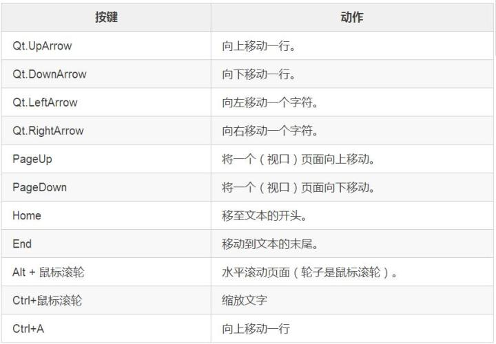
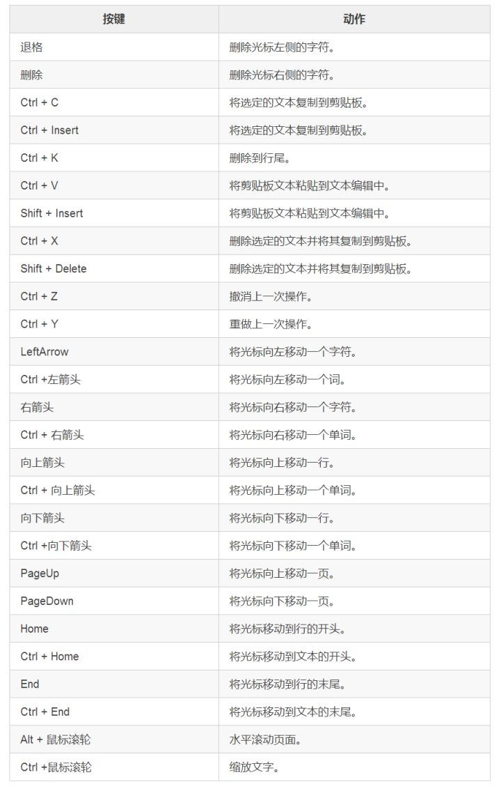

## QPlainTextEdit
介绍一下纯文本输入框（QPlainTextEdit）。好吧，这名字是我取得，是难听了点。

#### QPlainTextEdit总体介绍
QPlainTextEdit类提供了一个用于编辑和显示纯文本的小部件。

QPlainTextEdit是支持纯文本的高级查看器/编辑器。它经过优化处理大型文档并对用户输入做出快速响应。

QPlainText使用与QTextEdit相同的技术和概念，但是为纯文本处理进行了优化。

QPlainTextEdit适用于段落和字符。段落是一个格式化的字符串，它被字符包装以适应窗口小部件的宽度。默认情况下，当阅读纯文本时，一个换行符表示一个段落。文档由零个或多个段落组成。段落以强硬换行符分隔。段落中的每个字符都有其自己的属性，例如字体和颜色。

QPlainTextEdit上鼠标光标的形状默认为Qt. IBeamCursor。它可以通过viewport()的游标属性进行更改。

###### 使用QPlainTextEdit作为显示小部件
使用setPlainText()来设置或替换文本，删除现有文本并将其替换为传递给setPlainText()的文本。

可以使用QTextCursor类或函数insertPlainText()，appendPlainText()或paste()插入文本。

默认情况下，文本编辑会以空格为间隔把单词包装在文本编辑小部件中。

setLineWrapMode()函数用于指定您想要的换行类型，WidgetWidth或NoWrap（如果不需要任何换行）。如果使用WrapgetWidth WidgetWidth的自动换行，则可以使用setWordWrapMode()指定是否在空白处或任何地方断开。

find()函数可用于查找和选择文本中的给定字符串。

如果您想限制QPlainTextEdit中段落的总数，因为它在日志查看器中很有用，那么您可以使用maximumBlockCount属性。 setMaximumBlockCount()和appendPlainText()的组合将QPlainTextEdit转换为日志文本的高效查看器。使用centerOnScroll()属性可以减少滚动，使日志查看器更快。文本可以通过有限的方式进行格式化，可以使用语法高亮显示，也可以使用appendHtml()附加HTML格式的文本。尽管QPlainTextEdit不支持使用表格和浮点数进行复杂的富文本渲染，但它支持您在日志查看器中可能需要的有限段落格式。

###### 只读型键盘组合
当使用QPlainTextEdit时，只读键绑定仅限于导航，并且文本只能用鼠标选择：


###### 使用QPlainTextEdit作为编辑器
关于使用QPlainTextEdit作为显示小部件的所有信息也适用于此处。

文本的选择由QTextCursor类处理，该类提供创建选择，检索文本内容或删除选择的功能。您可以使用textCursor()方法检索与用户可见光标对应的对象。如果你想在QPlainTextEdit中设置一个选择，只需在QTextCursor对象上创建一个选择，然后使用setCursor()将该游标设置为可见光标。选择可以通过copy()复制到剪贴板，也可以用cut()剪切到剪贴板。整个文本可以使用selectAll()来选择。

QPlainTextEdit包含一个可以使用document()方法检索的QTextDocument对象。您也可以使用setDocument()设置自己的文档对象。如果文本改变，QTextDocument将发出一个textChanged()信号，并且它还提供了一个isModified()函数，如果文本自加载或自从上次调用setModified并将其作为参数调用后，将返回true。另外它提供了撤销和重做的方法。

###### 语法高亮
就像QTextEdit一样，QPlainTextEdit和QSyntaxHighlighter一起工作。

###### 可编辑键盘组合
用于编辑的键绑定列表：


###### 与QTextEdit的差异
QPlainTextEdit是一个很单一的类，通过使用QTextEdit和QTextDocument背后的大部分技术来实现。它的性能优于QTextEdit，主要是在文本文档上使用称为QPlainTextDocumentLayout的另一种简化文本布局。纯文本文档布局不支持表格或嵌入帧，并且逐行逐行滚动方式替换像素精确高度计算。这使得可以处理更大的文档，并且仍然可以实时启用换行来调整编辑器的大小。它还可以用于快速日志查看器。

**一句话对于纯文本，QPlainTextEdit更合适！**

###### 类归属
PyQt5->QtWidgets->QPlainTextEdit

继承：QAbstractScrollArea

更多详细的介绍请见官网：[QPlainTextEdit](https://doc.qt.io/qt-5/qplaintextedit.html "QPlainTextEdit")

#### 例子
本期小例子来源于github，作者：Ivan Luchko，具体网址我不记得了。

这个例子我觉得挺好的，没有必要再单独写一个了，所以本期我们一起来学习一下这个例子。为便于学习，我做了部分修改：  
* 删除了与本次知识点无关的内容  
* 修改了原作品中存在的bug  

总体的效果图如下：


在这个程序当中我们实现了：  
* 行号
* 在当前行时有黄色的标记

代码：
```python
from PyQt5.QtCore import Qt, QRect
from PyQt5.QtWidgets import QWidget, QTextEdit, QPlainTextEdit, QApplication
from PyQt5.QtGui import QColor, QPainter, QFont, QTextFormat
import sys
 
class QCodeEditor(QPlainTextEdit):
    class NumberBar(QWidget):
        def __init__(self, editor):
            QWidget.__init__(self, editor)

            self.editor = editor
            self.editor.blockCountChanged.connect(self.updateWidth)
            self.editor.updateRequest.connect(self.updateContents)
            self.font = QFont()
            self.numberBarColor = QColor("#e8e8e8")

        def paintEvent(self, event):
            painter = QPainter(self)
            painter.fillRect(event.rect(), self.numberBarColor)

            block = self.editor.firstVisibleBlock()
 
            while block.isValid():
                blockNumber = block.blockNumber()
                block_top = self.editor.blockBoundingGeometry(block).translated(self.editor.contentOffset()).top()

                if blockNumber == self.editor.textCursor().blockNumber():
                    self.font.setBold(True)
                    painter.setPen(QColor("#000000"))
                else:
                    self.font.setBold(False)
                    painter.setPen(QColor("#717171"))

                paint_rect = QRect(0, block_top, self.width(), self.editor.fontMetrics().height())
                painter.drawText(paint_rect, Qt.AlignCenter, str(blockNumber+1))
 
                block = block.next()
 
        def getWidth(self):  
            count = self.editor.blockCount()
            if 0 <= count < 99999:
                width = self.fontMetrics().width('99999') 
            else:
                width = self.fontMetrics().width(str(count))
            return width      
        
        def updateWidth(self):
            width = self.getWidth()
            self.editor.setViewportMargins(width, 0, 0, 0)

        def updateContents(self, rect, dy):
            if dy:
                self.scroll(0, dy)
            else:
                self.update(0, rect.y(), self.width(), rect.height())
            
            if rect.contains(self.editor.viewport().rect()):   
                fontSize = self.editor.currentCharFormat().font().pointSize()
                self.font.setPointSize(fontSize)
                self.font.setStyle(QFont.StyleNormal)
                self.updateWidth()
     
    def __init__(self):        
        super(QCodeEditor, self).__init__()
        self.setWindowTitle('带行号和颜色的文本框')
        
        self.setFont(QFont("Ubuntu Mono", 12))
        self.setLineWrapMode(QPlainTextEdit.NoWrap)
        self.number_bar = self.NumberBar(self)
        self.currentLineNumber = None
        self.cursorPositionChanged.connect(self.highligtCurrentLine)    
        self.setViewportMargins(40, 0, 0, 0)
        self.highligtCurrentLine()

    def resizeEvent(self, *e):
        cr = self.contentsRect()
        rec = QRect(cr.left(), cr.top(), self.number_bar.getWidth(), cr.height())
        self.number_bar.setGeometry(rec)
        
        QPlainTextEdit.resizeEvent(self, *e)

    def highligtCurrentLine(self):
        newCurrentLineNumber = self.textCursor().blockNumber()
        if newCurrentLineNumber != self.currentLineNumber:
            lineColor = QColor(Qt.yellow).lighter(160)
            self.currentLineNumber = newCurrentLineNumber
            hi_selection = QTextEdit.ExtraSelection() 
            hi_selection.format.setBackground(lineColor)
            hi_selection.format.setProperty(QTextFormat.FullWidthSelection, True)
            hi_selection.cursor = self.textCursor()
            hi_selection.cursor.clearSelection() 
            self.setExtraSelections([hi_selection])
         
if __name__ == '__main__':
    app = QApplication(sys.argv)
    editor = QCodeEditor()
    editor.resize(600,450)
    editor.show()
    sys.exit(app.exec_())
```

###### 核心代码讲解
编辑器在区域左侧的区域中显示行号进行编辑。编辑器将突出显示包含光标的行。

我们在QCodeEditor中实现了编辑器，它是一个继承QPlainTextEdit的控件。我们在QCodeEditor中保留一个单独的小部件，我们在其中绘制行号。

QPlainTextEdit从QAbstractScrollArea继承，编辑发生在其viewport()的边缘。我们通过将视口（viewport，下同）的左边距设置为绘制行号所需的大小，为我们的行号区域腾出空间。

在编辑代码时，我们比QTextEdit更喜欢QPlainTextEdit，因为它为处理纯文本而优化。

现在我们将继续学习QCodeEditor和NumberBar的定义和实现。我们从NumberBar类开始。

我们在这个小部件上绘制行号，并将它放在QCodeEditor的viewport()的左边空白处。

在绘制区域时，为了简单起见，我们在QCodeEditor类中绘制区域。我们可以直接在代码编辑器上绘制行号，并删除NumberBar类。但是，QWidget类可以帮助我们scroll() 其内容。此外，如果我们希望使用断点或其他代码编辑器功能扩展编辑器，则拥有单独的窗口小部件是正确的选择。该小部件将帮助处理鼠标事件。

so，知道我们为什么要用类中类了吧！

**QCodeEditor类**  
```python
class QCodeEditor(QPlainTextEdit):
    class NumberBar(QWidget):
        pass
    def __init__(self):        
        super(QCodeEditor, self).__init__()
        self.setWindowTitle('微信公众号：学点编程吧--带行号和颜色的文本框')
        self.setFont(QFont("Ubuntu Mono", 12))
        self.setLineWrapMode(QPlainTextEdit.NoWrap)
        self.number_bar = self.NumberBar(self)           
        self.currentLineNumber = None
        self.cursorPositionChanged.connect(self.highligtCurrentLine)    
        self.setViewportMargins(40, 0, 0, 0)
        self.highligtCurrentLine()
    def resizeEvent(self, *e):
        cr = self.contentsRect()
        rec = QRect(cr.left(), cr.top(), self.number_bar.getWidth(), cr.height())
        self.number_bar.setGeometry(rec)
    
    def highligtCurrentLine(self):
        newCurrentLineNumber = self.textCursor().blockNumber()
        if newCurrentLineNumber != self.currentLineNumber:
            lineColor = QColor(Qt.yellow).lighter(160)
            self.currentLineNumber = newCurrentLineNumber
            hi_selection = QTextEdit.ExtraSelection() 
            hi_selection.format.setBackground(lineColor)
            hi_selection.format.setProperty(QTextFormat.FullWidthSelection, True)
            hi_selection.cursor = self.textCursor()
            hi_selection.cursor.clearSelection() 
            self.setExtraSelections([hi_selection])
```
QCodeEditor继承了QPlainTextEdit类。在这个类中，我们进行了一些简单窗体属性设置，设置了视口、突出显示包含光标的行和重写了resizeEvent()事件。下面对已有的前面教程中尚未出现过的代码解释一下。
```python
self.setFont(QFont("Ubuntu Mono", 12))
```
设置当前的字体和大小，这个可以随意，无所谓的。

 
```python
self.setLineWrapMode(QPlainTextEdit.NoWrap)
```
该属性包含换行模式，默认模式是QPlainTextEdit.WidgetWidth，即类似于记事本中的自动换行，一行文字过长会换一行。文中使用QPlainTextEdit.NoWrap表明这个文件我不愿意自动换行，一行较长的文字就要在一行当中。

 
```python
self.number_bar = self.NumberBar(self)           
self.currentLineNumber = None
```
实例化我们的内部类，同时将当前需要标记的行号初始值为None。

 
```python
self.cursorPositionChanged.connect(self.highligtCurrentLine)
```
cursorPositionChanged()是QPlainTextEdit所带的信号，表明只要光标位置改变，就会发出此信号，然后我们调用对应的自定义槽函数highligtCurrentLine()，也就是把当前行标黄。

 
```python
self.setViewportMargins(40, 0, 0, 0)
self.highligtCurrentLine()
```
setViewportMargins()这个方法来源于QPlainTextEdit的父类QAbstractScrollArea，将滚动区域周围的边距设置为左侧，顶部，右侧和底部（我们这里是左侧）。 边缘空间是空白的。 将小部件放在未使用的区域。默认情况下，所有边距都为零。

为什么要增加这两句呢？
注释之后，我们在输入的时候明显的会看到两点：1、部分字母被挡着了；2、没有黄色的标记了。这其实就是原作者的bug，增加了这两句就能更加的符合使用习惯了。

```python
def resizeEvent(self, *e):
    cr = self.contentsRect()
    rec = QRect(cr.left(), cr.top(), self.number_bar.getWidth(), cr.height())
    self.number_bar.setGeometry(rec)
```
此事件处理程序可以在子类中重新实现，以接收在事件参数中传递的小部件大小调整事件。当调用resizeEvent()时，窗口小部件已经有了新的几何图形。 旧尺寸可通过QResizeEvent.oldSize()访问。

 
```python
cr = self.contentsRect()
```
返回小部件边界内的区域。

 
```python
rec = QRect(cr.left(), cr.top(), self.number_bar.getWidth(), cr.height())
self.number_bar.setGeometry(rec)
```
创建一个QRect对象，使用整数精度在平面中定义一个矩形，这里是用一组左，顶，宽和高整数来定义。矩形通常表示为左上角和大小。QRect的大小（宽度和高度）始终等同于构成其渲染基础的数学矩形。当然QRect也可以从QPoint和QSize构成。

然后我们将这个矩形应用到number_bar这个自定义小部件上，那么它的大小就确定了。

```python
def highligtCurrentLine(self):
    newCurrentLineNumber = self.textCursor().blockNumber()
    if newCurrentLineNumber != self.currentLineNumber:
        lineColor = QColor(Qt.yellow).lighter(160)
        self.currentLineNumber = newCurrentLineNumber
        hi_selection = QTextEdit.ExtraSelection() 
        hi_selection.format.setBackground(lineColor)
        hi_selection.format.setProperty(QTextFormat.FullWidthSelection, True)
        hi_selection.cursor = self.textCursor()
        hi_selection.cursor.clearSelection() 
        self.setExtraSelections([hi_selection])
```
这个函数就是用来突出显示包含光标的行。

```python
newCurrentLineNumber = self.textCursor().blockNumber()
```
返回光标所在块的编号，如果光标无效，则返回0。请注意，此功能仅适用于没有复杂对象（如表格或框架）的文档。

```python
if newCurrentLineNumber != self.currentLineNumber:
```
看到没有，这里表示光标换行了。


```python
lineColor = QColor(Qt.yellow).lighter(160)
```
这里我搞的是黄色，红色、黑色、蓝色随便你选。

```python
hi_selection = QTextEdit.ExtraSelection() 
hi_selection.format.setBackground(lineColor)
hi_selection.format.setProperty(QTextFormat.FullWidthSelection, True)
```
QTextEdit.ExtraSelection结构提供了一种为文档中已选择指定字符格式的方法。

```python
hi_selection.format.setBackground(lineColor)
```
一种格式，用于指定选区的前景或背景画笔/颜色。我这里是设定背景色。

```python
hi_selection.format.setProperty(QTextFormat.FullWidthSelection, True)
```
设定文本的整个宽度将显示为选中状态。

```python
hi_selection.cursor = self.textCursor()
hi_selection.cursor.clearSelection()
```
通过将锚点设置为光标位置来清除当前选择。请注意，它不会删除选择的文本。

```python
self.setExtraSelections([hi_selection])
```
此功能允许用指定的颜色临时标记文档中的某些区域，并将其指定为选项。 记住（）里面是列表的形式。

**NumberBar类**  
```python
class NumberBar(QWidget):
    def __init__(self, editor):
        QWidget.__init__(self, editor)
        self.editor = editor
        self.editor.blockCountChanged.connect(self.updateWidth)
        self.editor.updateRequest.connect(self.updateContents)
        self.font = QFont()
        self.numberBarColor = QColor("#e8e8e8")
    def paintEvent(self, event):
        painter = QPainter(self)
        painter.fillRect(event.rect(), self.numberBarColor)
        block = self.editor.firstVisibleBlock()
    
        while block.isValid():
            blockNumber = block.blockNumber()
            block_top = self.editor.blockBoundingGeometry(block).translated(self.editor.contentOffset()).top()
            if blockNumber == self.editor.textCursor().blockNumber():
                self.font.setBold(True)
                painter.setPen(QColor("#000000"))
            else:
                self.font.setBold(False)
                painter.setPen(QColor("#717171"))
            paint_rect = QRect(0, block_top, self.width(), self.editor.fontMetrics().height())
            painter.drawText(paint_rect, Qt.AlignCenter, str(blockNumber+1))
            block = block.next()
            
    def getWidth(self):  
        count = self.editor.blockCount()
        if 0 <= count < 99999:
            width = self.fontMetrics().width('99999') 
        else:
            width = self.fontMetrics().width(str(count))
        return width      
    def updateWidth(self):
        width = self.getWidth()
        self.editor.setViewportMargins(width, 0, 0, 0)
    
    def updateContents(self, rect, dy):
        if dy:
            self.scroll(0, dy)
        else:
            self.update(0, rect.y(), self.width(), rect.height())
        if rect.contains(self.editor.viewport().rect()):   
            fontSize = self.editor.currentCharFormat().font().pointSize()
            self.font.setPointSize(fontSize)
            self.font.setStyle(QFont.StyleNormal)
            self.updateWidth()
```
这个类也有几十行的代码了，我们把之前没有涉及到的知识点讲解一下。
```python
def __init__(self, editor):
    QWidget.__init__(self, editor)
    self.editor = editor
    self.editor.blockCountChanged.connect(self.updateWidth)
    self.editor.updateRequest.connect(self.updateContents)
    self.font = QFont()
    self.numberBarColor = QColor("#e8e8e8")
```
因为NumberBar是类中类，故我们在初始化的时候也要把外部类的对象带进来，同时它还是小部件所以继承了QWidget。

```python
self.editor.blockCountChanged.connect(self.updateWidth)
```
每当块数（段落）发生变化时都会发出该信号并调用updateWidth()函数。

```python
self.editor.updateRequest.connect(self.updateContents)
```
当文本文档需要更新指定的矩形时，会发出此信号。 如果文字滚动，矩形将覆盖整个视区。 如果文本垂直滚动，dy将携带视口滚动的像素数量（dy是信号给槽函数的参数）。

信号的目的是在纯文本编辑子类中支持额外的小部件，例如， 显示行号，断点或其他额外信息。

```python
self.font = QFont()
self.numberBarColor = QColor("#e8e8e8")
```
获取字体和设置颜色。

先说这两个函数吧。
```python
def getWidth(self):  
    count = self.editor.blockCount()
    if 0 <= count < 99999:
        width = self.fontMetrics().width('99999') 
    else:
        width = self.fontMetrics().width(str(count))
    return width
    
def updateWidth(self):
    width = self.getWidth()
    self.editor.setViewportMargins(width, 0, 0, 0)
```
最开始原作者是根据行数的多少，来自动调节显示行号小部件的宽度的。我觉很丑了。在参考了NotePad++ 、Visual Studio Code等优秀编辑器后，发现它们显示行号的宽度都是固定的，除非行数特别多。因此做了上述调整。

```python
count = self.editor.blockCount()
```
该属性保存文档中文本块的数量。

```python
if 0 <= count < 99999:
    width = self.fontMetrics().width('99999') 
else:
    width = self.fontMetrics().width(str(count))
return width
```
如果行数小于99999行，那么返回小部件当前字体的字体的宽度，这个宽度是内容’99999’的字体宽度。否则就返回实际宽度。这就保证了行数不超过一定值的时候，宽度固定，好看一些。

```python
def updateWidth(self):
    width = self.getWidth()
    self.editor.setViewportMargins(width, 0, 0, 0)
```
这个就是通过setViewportMargins设置编辑器显示行号位置的实际宽度。

```python
def updateContents(self, rect, dy):
    if dy:
        self.scroll(0, dy)
    else:
        self.update(0, rect.y(), self.width(), rect.height())
    if rect.contains(self.editor.viewport().rect()):   
        fontSize = self.editor.currentCharFormat().font().pointSize()
        self.font.setPointSize(fontSize)
        self.font.setStyle(QFont.StyleNormal)
        self.updateWidth()
```
这个函数是在updateRequest()信号产生的时候才调用的。这个信号的产生，它会将两个参数传给槽函数：QRect对象和dy像素。

```python
if dy:
    self.scroll(0, dy)
else:
    self.update(0, rect.y(), self.width(), rect.height())
```
如果存在垂直滚动，且像素dy > 0，那么将小部件向下滚动。滚动后，小部件将接收需要重新绘制区域的绘画事件。否则更新小部件内的矩形（x，y，w，h）。

```python
if rect.contains(self.editor.viewport().rect()):   
    fontSize = self.editor.currentCharFormat().font().pointSize()
    self.font.setPointSize(fontSize)
    self.font.setStyle(QFont.StyleNormal)
    self.updateWidth()
```
如果给定的矩形位于此矩形内，则返回True。 否则返回False。

如果正确，则该函数仅在矩形完全位于此矩形内（不在边上）时才返回True。我们这里就是判断编辑器视口的矩形是否在rect这个矩形内。

我们返回编辑器输入框中插入新文本时使用的字体的磅值。并将其设置为NumberBar这个小部件的字体样式。最后调用updateWidth()。

```python
def paintEvent(self, event):
    painter = QPainter(self)
    painter.fillRect(event.rect(), self.numberBarColor)
    block = self.editor.firstVisibleBlock()
    while block.isValid():
        blockNumber = block.blockNumber()
        block_top = self.editor.blockBoundingGeometry(block).translated(self.editor.contentOffset()).top()
        if blockNumber == self.editor.textCursor().blockNumber():
            self.font.setBold(True)
            painter.setPen(QColor("#000000"))
        else:
            self.font.setBold(False)
            painter.setPen(QColor("#717171"))
        paint_rect = QRect(0, block_top, self.width(), self.editor.fontMetrics().height())
        painter.drawText(paint_rect, Qt.AlignCenter, str(blockNumber+1))
        block = block.next()
```
重写小部件的绘图事件。这个函数很重要啊~！！！下面简单的介绍下这个函数，详细的请见官网：
[paintEvent](https://doc.qt.io/qt-5/qwidget.html#paintEvent "paintEvent")

绘画事件是重新绘制全部或部分小部件的请求。可能由于以下原因之一而发生：

repaint()或update()被调用，小部件被遮盖了，现在已经被发现了，或者许多其他原因。

许多小部件可以在要求时简单地重新绘制整个表面，但是一些缓慢的小部件需要通过仅绘制所请求的区域来进行优化：QPaintEvent.region()。这种速度优化不会改变结果，因为在事件处理过程中绘画被裁剪到该区域。例如，QListView和QTableView可以做到这一点。

Qt还试图通过将多个绘画事件合并为一个来加速绘画。当多次调用update()或窗口系统发送多个绘画事件时，Qt会将这些事件合并为一个具有较大区域的事件。 repaint()函数不允许这种优化，所以我们建议尽可能使用update()。

当绘画事件发生时，更新区域通常被擦除，所以您正在绘制小部件的背景。

背景可以使用setBackgroundRole()和setPalette()来设置。

注意：通常，您应该避免在paintEvent()内调用update()或repaint()

```python
painter = QPainter(self)
painter.fillRect(event.rect(), self.numberBarColor)
```
构建一个绘画设备，并用指定的颜色填充给定的矩形。这里的矩形是QPaintEvent中返回需要更新的矩形，颜色就是QColor(“#e8e8e8”)。

```python
block = self.editor.firstVisibleBlock()
```
返回第一个可见块，也就是文本块。

```python
while block.isValid():
    blockNumber = block.blockNumber()
    block_top = self.editor.blockBoundingGeometry(block).translated(self.editor.contentOffset()).top()
```
在文本块有效的情况下进入循环，返回此文本块的编号（行号），如果块无效，则返回-1。同时我们使用blockBoundingGeometry()函数以内容坐标返回文本块的边界矩形，并使用contentOffset()转义得到矩形以获得视口上的视觉坐标。这里得到top。

```python
if blockNumber == self.editor.textCursor().blockNumber():
    self.font.setBold(True)
    painter.setPen(QColor("#000000"))
else:
    self.font.setBold(False)
    painter.setPen(QColor("#717171"))
```
这段if-else语句主要是实现当鼠标移动到某一行的时候，其对应的行号会相应的变黑加粗。

```python
paint_rect = QRect(0, block_top, self.width(), self.editor.fontMetrics().height())
painter.drawText(paint_rect, Qt.AlignCenter, str(blockNumber+1))
```
行号绘画的区域是paint_rect，这里使用QRect对象实现的；居中对齐，具体的内容是str(blockNumber+1)，不加1就是0开始了。

```python
block = block.next()
```
返回此块后面的文档中的文本块，如果这是最后一个，则返回空文本块。

ok，今天的介绍就到这里吧，关于原作者的QPlainTextEdit代码讲解就结束了。当然我可能也理解不够深刻，可以自己下载下来再全面理解一下吧。


