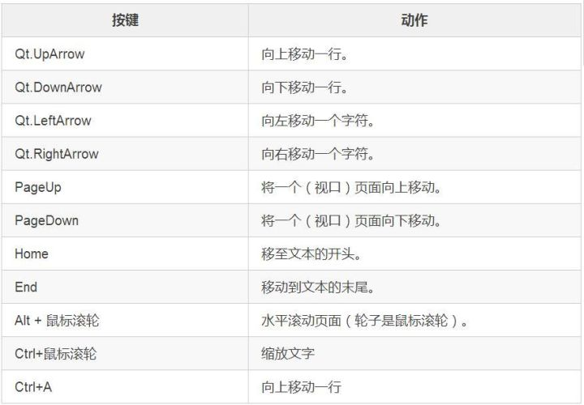
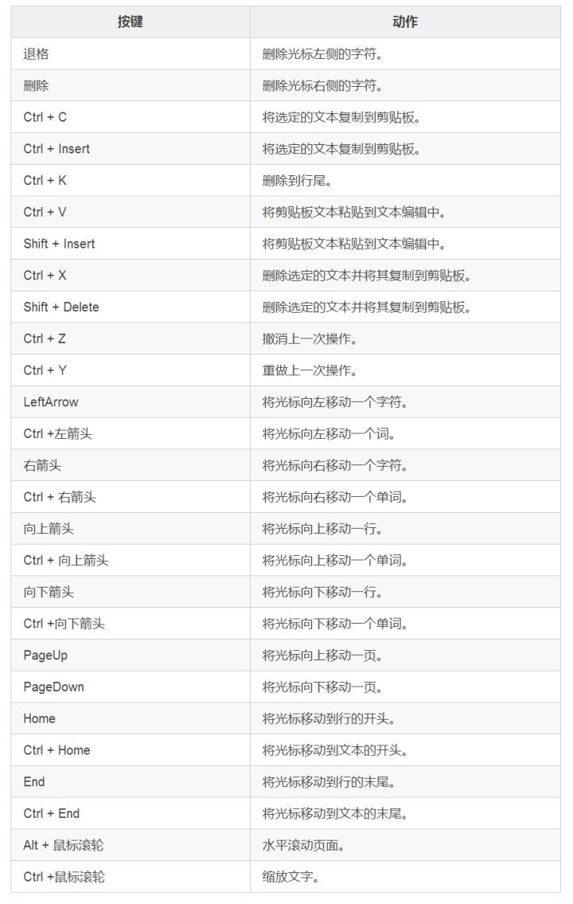
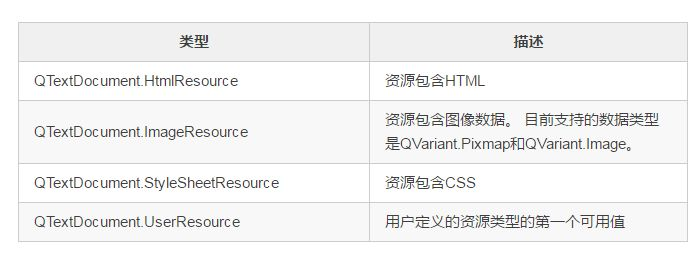

## QTextEdit
到目前为止，我们介绍了QLineEdit、QPlainTextEdit，今天仍是她们的姐妹篇，关于QTextEdit的使用。

#### QTextEdit总体介绍
QTextEdit类提供了一个用于编辑和显示纯文本和富文本的小部件。

QTextEdit是一款先进的WYSIWYG查看器/编辑器，支持使用HTML样式标签的丰富文本格式。它经过优化处理大型文档并对用户输入做出快速响应。

QTextEdit适用于段落和字符。段落是一个格式化的字符串，它被字符包装以适应窗口小部件的宽度。默认情况下，当阅读纯文本时，一个换行符表示一个段落。文档由零个或多个段落组成。该段中的文字按照该段的对齐方式进行调整。段落以硬换行符分隔。段落中的每个字符都有其自己的属性，例如字体和颜色。

QTextEdit可以显示图像，列表和表格。如果文本太大而无法在文本编辑的视口中查看，则会出现滚动条。文本编辑可以加载纯文本和富文本文件。富文本使用HTML 4标记的子集进行描述，在文本小部件中使用HTML标记。小部件自动检测HTML标记并相应地显示丰富的文本。 例如，使用字符串`”<b>Hello </ b> <i>xdbcb8！</ i>”`设置标签的文本属性将导致标签显示如下所示的文本：**Hello**xdbcb8！

**如果您只需要显示一小段富文本，请使用QLabel。**

Qt中丰富的文本支持旨在为应用程序添加合理的在线帮助功能提供快速，便携和高效的方式，并为富文本编辑器提供基础。如果您发现HTML支持不足以满足您的需求，您可以考虑使用Qt WebKit（最新版本已经没有了），它提供了一个全功能的Web浏览器小部件。

QTextEdit上鼠标光标的形状默认为Qt.IBeamCursor。它可以通过viewport()的游标属性进行更改。

#### 使用QTextEdit作为显示小部件
QTextEdit可以显示一个大的HTML子集，包括表格和图像。

使用setHtml()设置或替换文本，删除任何现有文本并将其替换为在setHtml()调用中传递的文本。如果使用传统HTML调用setHtml()，然后调用toHtml()，则返回的文本可能具有不同的标记，但呈现相同。整个文本可以用clear()删除。

可以使用QTextCursor类或使用函数insertHtml()，insertPlainText()，append()或paste()来插入文本本身。 QTextCursor还能够将表格或列表等复杂对象插入到文档中，并处理创建选择和对选定文本应用更改。

setLineWrapMode()函数用于指定您想要的换行类型，或者如果您不想要换行，则使用NoWrap。调用setLineWrapMode()以设置固定像素宽度FixedPixelWidth或字符列（例如80列）FixedColumnWidth，并使用setLineWrapColumnOrWidth()指定像素或列。如果使用WrapgetWidth WidgetWidth的自动换行，则可以使用setWordWrapMode()指定是否在空白处或任何地方断开。

find()函数可用于查找和选择文本中的给定字符串。

如果您想限制QTextEdit中段落的总数，例如在日志查看器中它通常很有用，那么您可以使用QTextDocument的maximumBlockCount属性。

**只读型键盘组合**
当使用QPlainTextEdit时，只读键绑定仅限于导航，并且文本只能用鼠标选择：


文本编辑可能能够提供一些元信息。 例如，documentTitle()函数将从`HTML<title>`标签内返回文本。

注意：只有当font-size未设置为固定大小时，才能放大到HTML文档。

#### 使用QTextEdit作为编辑器
关于使用QTextEdit作为显示小部件的所有信息也适用于此处。

通过setFontItalic()，setFontWeight()，setFontUnderline()，setFontFamily()，setFontPointSize()，setTextColor()和setCurrentFont()设置当前字符格式的属性。当前段落的对齐方式使用setAlignment()进行设置。

文本的选择由QTextCursor类处理，该类提供创建选择，检索文本内容或删除选择的功能。您可以使用textCursor()方法检索与用户可见光标对应的对象。如果要在QTextEdit中设置选择，只需在QTextCursor对象上创建一个选择，然后使用setTextCursor()将该游标设置为可见光标。选择可以通过copy()复制到剪贴板，也可以用cut()剪切到剪贴板。整个文本可以使用selectAll()来选择。

当游标移动并且底层格式属性发生变化时，会发出currentCharFormatChanged()信号以反映新光标位置处的新属性。

textChanged()信号在文本更改时发出（哪怕是由setText()设置的）。

QTextEdit包含一个可以使用document()方法检索的QTextDocument对象。您也可以使用setDocument()设置自己的文档对象。

QTextDocument提供了一个isModified()函数，如果文本在被加载后或者自从上次调用setModified以False作为参数后被修改，则该函数将返回True。另外它提供了撤销和重做的方法。

**编辑型键盘组合**
用于编辑的键绑定列表：


要选择（标记）文本，按住Shift键的同时按下其中一个移动键，例如，Shift +右箭头将选择右侧的字符，Shift + Ctrl +右箭头将选择右侧的单词等。

#### 类归属
PyQt5->QtWidgets->QTextEdit

继承关系
继承：QAbstractScrollArea

被继承：QTextBrowser

更多详细的介绍请见官网：[QTextEdit](https://doc.qt.io/qt-5/qtextedit.html "QTextEdit")

**下面给大家演示一下如何在QTextEdit中显示网络图片**：


简单的代码解析：
```python
@pyqtSlot()
def on_pushButton_clicked(self):
    response = requests.get(self.lineEdit.text())#使用requests库进行网络请求获取内容
    image1 = Image.open(BytesIO(response.content))#对得到的二进制数据进行操作
    image1.save('xxx.png')#保存网络图片到本地
    del image1#删除图片对象(虽说会自己释放)，没有这个，会出现各种问题
    image = QImage('xxx.png')
    cursor = self.textEdit.textCursor()
    document = self.textEdit.document()
    document.addResource(QTextDocument.ImageResource, QUrl("image"), image)
    cursor.insertImage("image")
```
总体思路就行读取网络图片并保存在本地，然后再读取放到QTextDocument.ImageResource。把图片放入QTextEdit的方法很多，这是其中之一，也不一定是最好的方法。

```python
image = QImage('xxx.png')
cursor = self.textEdit.textCursor()
document = self.textEdit.document()
```
新建一个QImage
返回表示当前可见光标的QTextCursor的副本。
返回编辑器的文档对象。

```python
document.addResource(QTextDocument.ImageResource, QUrl("image"), image)
```
将资源添加到资源缓存，使用类型和名称作为标识符。 类型应该是QTextDocument.ResourceType中的一个值，例如这里的QTextDocument.ImageResource。当然还包括：


```python
cursor.insertImage("image")
```
光标处插入图片。

当然还有更简单的插入方式：
```python
self.textEdit.append("")
```
#### 例子
在进行微信公众号文章编辑的时候，不少人特别喜欢使用Markdown进行书写，因为对于一些通过它能够快速实现一些常用的格式，比起用一些编辑器方便很多。

Markdown是一种可以使用普通文本编辑器编写的标记语言，通过简单的标记语法，它可以使普通文本内容具有一定的格式。Markdown的语法简洁明了、学习容易，而且功能比纯文本更强，因此有很多人用它写博客。（来源：百度百科）

今天我们就借助QLineEdit支持富文本的特性，实现简单的Markdown效果。

我们来实现一个简单的Markdown编辑器，像插入表格、加粗、标题等等都没有问题，当然和真正意义上的Markdown编辑器还是有差距的，就当测试吧。先来看看效果图：


常用的Markdown语句基本还是实现的了。

其实这个程序非常的简单！

是的，这里就不得不提到Python这个语言了。之所以Python这么深入人心，很大程度上就是第三方库比较多，能够简化编程的难度，实现程序的快速实现。

这里我们使用markdown2库用来解析markdown的语法。markdown2这个库的安装推荐使用pip方式。
pip install markdown2

我们使用markdown2用来解析markdown语法，然后将其转换成Html。然后你懂得，我们使用QTextEdit这个富文本编辑器用来显示这些Html。具体的颜色样式我们使用CSS进行标记。

核心代码如下：
```python
class Dialog_main(QMainWindow, Ui_MainWindow):
    def __init__(self, parent=None):
        super(Dialog_main, self).__init__(parent)
        self.setupUi(self)
    def md2html(self, mdstr):
        extras = ['code-friendly', 'fenced-code-blocks', 'footnotes','tables','code-color','pyshell','nofollow','cuddled-lists','header ids','nofollow']
        html = """
        <html>
        <head>
        <meta content="text/html; charset=utf-8" http-equiv="content-type" />
        <style>
            .hll { background-color: #ffffcc }
            .c { color: #0099FF; font-style: italic } /* Comment */
            .err { color: #AA0000; background-color: #FFAAAA } /* Error */
            .k { color: #006699; font-weight: bold } /* Keyword */
            .o { color: #555555 } /* Operator */
            .ch { color: #0099FF; font-style: italic } /* Comment.Hashbang */
            <!--省略一大堆的CSS样式-->
        </style>
        </head>
        <body>
            %s
        </body>
        </html>
        """
        ret = markdown2.markdown(mdstr, extras=extras)
        return html % ret 
    @pyqtSlot()
    def on_plainTextEdit_textChanged(self):
        md = self.plainTextEdit.toPlainText()
        newhtml = self.md2html(md)
        self.textEdit.setHtml(newhtml)
```
通过上面的代码我们已经看出，解析markdown语法的就一句话：
```python
markdown2.markdown(mdstr, extras=extras)
```
通过这句话我们就实现了markdown向html的解析了。extras是干嘛的呢？

查看介绍：[python-markdown2](https://github.com/trentm/python-markdown2/wiki/Extras "python-markdown2")
 
然后我们通过QTextEdit实现Html语言的展示。

QTextEdit.toHtml()以HTML格式返回文本编辑的文本。

QTextEdit.setHtml()更改文本编辑的文本。任何以前的文本都会被删除， 输入文本被解释为HTML格式的富文本。这里我们用的是这种。这个有个前提，就是在QPlainTextEdit文本内容的发生变化的时候才会执行这些操作，因为我们响应了on_plainTextEdit_textChanged这个信号。


