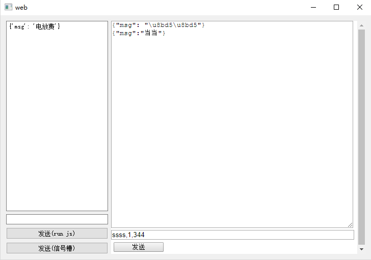

## QWebEngineView
pyqt5.12版本后qwebengine模块独立，安装请使用命令pip3 install PyQtWebEngine

#### 主要函数
| 方法                                       | 描述                                 |
| ------------------------------------------ | ------------------------------------ |
| load(QUrl url)                             | 加载指定的URL并显示                  |
| setHtml（String html）                     | 将网页视图的内容设置为指定的HTML内容 |
| QWebEnginePage.runJavaScript(str,Callable) | 调用页面JavaScript代码               |

```python
class QWebEngineView(__PyQt5_QtWidgets.QWidget):
    """ QWebEngineView(parent: QWidget = None) """
    def __init__(self, parent=None): # real signature unknown; restored from __doc__
        pass
    
    def load(self, QUrl): # real signature unknown; restored from __doc__
        """ load(self, QUrl) """
        pass
    
    def setHtml(self, p_str, baseUrl=None, *args, **kwargs): # real signature unknown; NOTE: unreliably restored from __doc__ 
        """ setHtml(self, str, baseUrl: QUrl = QUrl()) """
        pass
    
class QWebEnginePage(__PyQt5_QtCore.QObject):
    """
    QWebEnginePage(parent: QObject = None)
    QWebEnginePage(QWebEngineProfile, parent: QObject = None)
    """
    
    def runJavaScript(self, p_str, *__args): # real signature unknown; restored from __doc__ with multiple overloads
        """
        runJavaScript(self, str, int)
        runJavaScript(self, str, int, Callable[..., None])
        runJavaScript(self, str)
        runJavaScript(self, str, Callable[..., None])
        """
        pass
```
#### QWebEngineView总体介绍
QWebEngineView类提供了一个用于查看和编辑Web文档的小部件。

Web视图是Qt WebEngine Web浏览模块的主要小部件组件。它可以在各种应用程序中用于从Internet实时显示Web内容。

可以使用load()函数将Web站点加载到Web视图。 GET方法始终用于加载URL。

与所有Qt小部件一样，必须调用show()函数才能显示Web视图。下面的代码段说明了这一点：
```python
view = QWebEngineView(self)
view.load(QUrl("http://qt-project.org/"))
view.show()
```
**或者，setUrl()可用于加载网站。如果您有可用的HTML内容，则可以使用setHtml()。**

在视图开始加载时发出loadStarted()信号，并且只要Web视图的元素完成加载(例如嵌入的图像或脚本)，就会发出loadProgress()信号。完全加载视图时会发出loadFinished()信号。它的参数，是True还是Flase，表明加载是成功还是失败。

page()函数返回指向网页对象的指针。 QWebEngineView包含一个QWebEnginePage，它允许访问页面上下文中的QWebEngineHistory。

可以使用title()属性访问HTML文档的标题。此外，网站可以指定一个图标，可以使用属性iconUrl()URL或者使用icon()或其访问该图标。如果标题或图标发生变化，将发出相应的titleChanged()，iconChanged()和iconUrlChanged()信号。 zoomFactor()属性允许通过比例因子缩放网页的内容。

该小部件具有针对元素定制的上下文菜单，并包括在浏览器中有用的操作。对于自定义上下文菜单，或者在菜单或工具栏中嵌入操作，可以通过pageAction()获得各个操作。 Web视图维护返回操作的状态，但允许修改操作属性，如文本或图标。动作语义也可以通过triggerPageAction()直接触发。

如果要为允许用户打开新窗口的网站(如弹出窗口)提供支持，可以继承QWebEngineView并重新实现createWindow()函数。

下面我们演示一下通过QWebEngineView打开百度，简略的代码如下：
```python
view = QWebEngineView(self)
view.load(QUrl("http://www.baidu.com/"))
view.show()
```
我们再演示一个打开本地HTML，简略的代码如下：
```python
view = QWebEngineView(self)
view.load(QUrl("file:///D:/pycharmWork/pythonTest/pyqtTest/QWebEngineView/QWebEngineView_page.html"))
#view.load(QUrl("file:///home/lifengchao/PycharmProjects/pythonTest/pyqtTest/QWebEngineView/QWebEngineView_page.html"))
view.show()
```

类归属
PyQt5->QtWebEngine->QWebEngineView

继承关系
PyQt5->QObject and QPaintDevice->QWidget->QWebEngineView

更多详细的介绍请见官网：[QWebEngineView](https://doc.qt.io/qt-5/qwebengineview.html "QWebEngineView")

#### QWebEngine增加DEBUG模式
在 代码中加入 下列代码：
```python
import os
os.putenv("QTWEBENGINE_REMOTE_DEBUGGING", "8001")
```
以上代码的意思是改变环境变量，端口号随意
**以上代码必须在QWebEngineView初始化之前，不然无法进入调试模式**

运行程序后，看到控制台输出：
```python
Remote debugging server started successfully. Try pointing a Chromium-based browser to http://127.0.0.1:8001
```
在浏览器打开 http://127.0.0.1:8001 即可调试

#### 例子
实现效果：

核心代码：
```python
def initUi(self):
    self.view = QWebEngineView(self.widget)
    with codecs.open("pie-simple.html", "r", "utf-8") as f:
        html = f.read()
    self.view.setHtml(html)
    self.time = QTimer()
def showPi(self):
    food = self.spinBox_food.value()
    rent = self.spinBox_rent.value()
    electricity = self.spinBox_electricity.value()
    traffic = self.spinBox_traffic.value()
    relationship = self.spinBox_relationship.value()
    taobao = self.spinBox_taobao.value()
    jscode = "showPiChart({}, {}, {}, {}, {}, {});".format(food, traffic, relationship, rent, electricity, taobao)
    self.view.page().runJavaScript(jscode)
def autoShow(self):
    self.spinBox_food.setValue(random.randint(100,10000))
    self.spinBox_rent.setValue(random.randint(100,10000))
    self.spinBox_electricity.setValue(random.randint(100,1000))
    self.spinBox_traffic.setValue(random.randint(100,2000))
    self.spinBox_relationship.setValue(random.randint(100,3000))
    self.spinBox_taobao.setValue(random.randint(100,10000))
@pyqtSlot(bool)
def on_checkBox_toggled(self, flag):
    if flag:
        self.time.start(1000)
        self.time.timeout.connect(self.autoShow)
    else:
        self.time.stop()
@pyqtSlot(int)
def on_spinBox_food_valueChanged(self, n):
    self.showPi()
@pyqtSlot(int)
def on_spinBox_rent_valueChanged(self):
    self.showPi()
@pyqtSlot(int)
def on_spinBox_electricity_valueChanged(self):
    self.showPi()
@pyqtSlot(int)
def on_spinBox_traffic_valueChanged(self):
    self.showPi()
@pyqtSlot(int)
def on_spinBox_relationship_valueChanged(self):
    self.showPi()
@pyqtSlot(int)
def on_spinBox_taobao_valueChanged(self):
    self.showPi()
def __del__(self):
    self.view.deleteLater()
```
上面就是本次功能实现的一些核心代码，还有部分内容我感觉自己看就行了（包括pie-simple.html部分改写），就不讲解了。
```python
self.view = QWebEngineView(self.widget)
with codecs.open("pie-simple.html", "r", "utf-8") as f:
    html = f.read()
self.view.setHtml(html)
```
新建QWebEngineView对象，同时打开pie-simple.html文件，并将HTMl内容在QWebEngineView对象中呈现。

```python
def showPi(self):
    food = self.spinBox_food.value()
    rent = self.spinBox_rent.value()
    electricity = self.spinBox_electricity.value()
    traffic = self.spinBox_traffic.value()
    relationship = self.spinBox_relationship.value()
    taobao = self.spinBox_taobao.value()
    jscode = "showPiChart({}, {}, {}, {}, {}, {});".format(food, traffic, relationship, rent, electricity, taobao)
    self.view.page().runJavaScript(jscode)
```
food、rent、electricity、traffic、relationship、taobao分别表示伙食消费、房租租金、水电气、交通费用、人情往来、淘宝网购的费用。

jscode表示我们希望在pie-simple.html执行javascript的函数showPiChart()：
```js
function showPiChart(var0, var1, var2, var3, var4, var5){
    if (option && typeof option === "object") {
        option["series"][0]["data"][0]["value"] = var0;
        option["series"][0]["data"][1]["value"] = var1;
        option["series"][0]["data"][2]["value"] = var2;
        option["series"][0]["data"][3]["value"] = var3;
        option["series"][0]["data"][4]["value"] = var4;
        option["series"][0]["data"][5]["value"] = var5;
        myChart.setOption(option, true);
    }
}
```

我们将取得的各项开支的值传递给showPiChart()，以便调用执行。

为了便于参数的传递，我们采用format进行字符串的拼接。
 
```python
self.view.page().runJavaScript(jscode)
```
使用runJavaScript()去执行相应的JavaScript代码，重新生成我们新的饼形图。

```python
def autoShow(self):
    self.spinBox_food.setValue(random.randint(100,10000))
    self.spinBox_rent.setValue(random.randint(100,10000))
    self.spinBox_electricity.setValue(random.randint(100,1000))
    self.spinBox_traffic.setValue(random.randint(100,2000))
    self.spinBox_relationship.setValue(random.randint(100,3000))
    self.spinBox_taobao.setValue(random.randint(100,10000))
```
autoShow()旨在设置微调框的值，这个是QTimer对象超时时调用槽函数。

```python
@pyqtSlot(bool)
def on_checkBox_toggled(self, flag):
    if flag:
        self.time.start(1000)
        self.time.timeout.connect(self.autoShow)
    else:
        self.time.stop()
```
我们把自动演示勾上的时候，定时器启动，每隔1秒自动调用autoShow()。否则就取消定时器。

```python
@pyqtSlot(int)
def on_spinBox_food_valueChanged(self, n):
    self.showPi()
```
当微调框的数值发生变化的时候就会调用showPi()，这个就能理解为什么我们改变数值的时候饼形图会发生变化了。其他的类似。

```python
def __del__(self):
    self.view.deleteLater()
```
为什么要加上这句呢？我们以前写的时候很少加上这句啊。因为在执行程序的时候，可能会出现关闭程序QWebEngineView崩溃的情况，加上这句就是让系统加快释放这部分内存，避免QWebEngineView崩溃的情况。

## QWebChannel
#### 总体介绍
QWebChannel填补了C++应用程序（这里是针对Qt，PyQt5是Python）和HTML / JavaScript应用程序之间的空白。通过将QObject派生对象发布到QWebChannel并在HTML端使用qwebchannel.js，可以透明地访问QObject的属性和公共函数和方法。不需要手动消息传递和数据序列化，Python端的属性更新和信号发射会自动传输到可能远程运行的HTML客户端。在客户端，将为任何已发布的QObject创建JavaScript对象。它反映了对象的API，因此直观易用。

QWebChannel API可以与任何可以在本地甚至远程计算机上运行的HTML客户端进行通信。唯一的限制是HTML客户端支持qwebchannel.js使用的JavaScript功能。因此，人们可以与基本上任何现代HTML浏览器或独立JavaScript运行时进行交互，例如node.js。

**要点**  
* 创建交互对象, 基于QObject, 定义信息槽  
* 创建QWebChannel, 在channel中注册交互对象  
* 设置页面WebChannel  
* 定义网页在网页中包含qwebchannel.js 在DomReady时, 创建js QWebChannel, 连接到本地对象  

**使用步骤**：  
1）发布QObject的衍生对象到QWebChannel，JS端通过使用qwebchannel.js可透明地获取该对象的共有函数与属性；  
2）C++端的属性根性和信号发射都自动发射到可能运行的JS端，JS端将创建相应的JS对象，直接使用C++对象中的API；  

**特性**  
1.使用Object标签可嵌入QT Widget组件；  
2.JS可直接访问C++对象（共有函数与属性）；  
3.QT中能触发JS中的事件；  
4.可共享客户端存储的数据。  

#### QObjects交互
一旦调用传递给QWebChannel对象的回调，通道就完成了初始化，并且HTML客户端可以通过channel.objects属性访问所有已发布的对象。因此，假设一个对象是使用标识符“foo”发布的，那么我们可以与它进行交互，如下例所示。请注意，HTML客户端和QML / C ++服务器之间的所有通信都是异步的。属性缓存在HTML端。此外，请记住，只有可以转换为JSON的QML / C ++数据类型才能正确地(反)序列化，从而可以被HTML客户端访问。

**QObjects交互的使用总结**：页面上可以访问QObjects对象的属性和方法，但是方法必须是槽函数。Qt向页面发送信息：可以通过runJavaScript调用页面js代码，可以通过QObjects发射信号调用页面注册的槽函数连接。页面向Qt发送信息：可以调用QObjects对象的槽函数，函数返回值通过回调函数接受；可以访问QObjects对象的属性，通过魔法方法实现信息传递。Qt与页面之间的参数传递只支持str、int、list等一部分不支持dict，可能是c++的原因吧。

官网html建立连接代码：
```python
new QWebChannel(yourTransport, function(channel) {
    // 连接信号:
    channel.objects.foo.mySignal.connect(function() {
    //只要在C ++ / QML端发出信号，就会调用此回调。
        console.log(arguments);
    }); 
    
    //要使对象全局知道，请将其赋值给window对象，即：
    window.foo = channel.objects.foo;
    
    //调用方法：
    foo.myMethod(arg1, arg2, function(returnValue) {
         //当myMethod有返回值时，将调用此回调。
        //通信是异步的，因此需要这个回调。
        console.log(returnValue);
    });
         
    //读取在客户端缓存的属性值：
    console.log(foo.myProperty);
    
    //编写属性将立即更新客户端缓存。
    //将异步通知远程端有关更改的信息
    foo.myProperty = "Hello World!"; 
    
    //要获得有关远程属性更改的通知，
    //只需连接到相应的通知信号：
    foo.onMyPropertyChanged.connect(function(newValue) {
            console.log(newValue);
    });
            
    //也可以访问标有Q_ENUM的枚举：
    console.log(foo.MyEnum.MyEnumerator);
});
```

小示例：
html
```html
<!DOCTYPE html>
<html lang="en" xmlns="http://www.w3.org/1999/xhtml">
<head>
    <meta charset="utf-8" />
    <script type="text/javascript" src="qwebchannel.js"></script>
    <title>QWebChannel测试</title>
    <script>
        window.onload = function () {
            new QWebChannel(qt.webChannelTransport, function (channel) {
                window.pyjs = channel.objects.pyjs;
                pyjs.myHello(alert);
            });
        }
    </script>
</head>
<body>
<div id="test">
    this is test !
</div>
<div onclick="qt5test();">测试</div>

<script>
    function qt5test() {
       pyjs.myTest('这是测试传参的',function (res) {
            alert(res);
        });
    }
    function uptext(msg) {
        document.getElementById('test').innerHTML=msg;
    }
</script>
</body>
</html>
```
python
```python
import sys
from PyQt5.QtWidgets import QApplication
from PyQt5.QtCore import QObject, pyqtSlot, QUrl
from PyQt5.QtWebChannel import QWebChannel
from PyQt5.QtWebEngineWidgets import QWebEngineView

class CallHandler(QObject):
    @pyqtSlot(result = str)
    def myHello(self):
        view.page().runJavaScript('uptext("hello, Python");')
        print('call received')
        return 'hello, Python'
    
   @pyqtSlot(str,result=str)
    def myTest(self,test):
        return test

if __name__ == '__main__':
    app = QApplication(sys.argv)
    view = QWebEngineView()
    channel = QWebChannel()
    handler = CallHandler()
    channel.registerObject('pyjs', handler)
    view.page().setWebChannel(channel)
    url_string = "file:///D:/testPyQt5/html/index.html"
    view.load(QUrl(url_string))
    view.show()
    sys.exit(app.exec_())
```

#### 例子
效果：

python端：
```python
from PyQt5 import QtCore, QtWidgets
from PyQt5.QtWebEngineWidgets import QWebEngineView
from PyQt5.QtCore import QObject, pyqtSlot, QUrl,pyqtSignal
from PyQt5.QtWebChannel import QWebChannel
import os
import json

class Ui_Form(object):
    def setupUi(self, Form):
        Form.setObjectName("Form")
        Form.resize(728, 480)
        self.horizontalLayout = QtWidgets.QHBoxLayout(Form)
        self.horizontalLayout.setObjectName("horizontalLayout")
        self.verticalLayout = QtWidgets.QVBoxLayout()
        self.verticalLayout.setObjectName("verticalLayout")
        self.label = QtWidgets.QPlainTextEdit(Form)
        self.label.setMinimumSize(QtCore.QSize(80, 0))
        self.label.setReadOnly(True)
        self.label.appendPlainText("")
        self.label.setObjectName("label")
        self.verticalLayout.addWidget(self.label)
        self.pushButton = QtWidgets.QPushButton(Form)
        self.pushButton.setObjectName("pushButton")
        self.pushButton1 = QtWidgets.QPushButton(Form)
        self.pushButton1.setObjectName("pushButton1")
        self.lineEdit = QtWidgets.QLineEdit(Form)
        self.lineEdit.setMinimumSize(QtCore.QSize(80, 0))
        self.lineEdit.setObjectName("lineEdit")
        self.verticalLayout.addWidget(self.lineEdit)
        self.verticalLayout.addWidget(self.pushButton)
        self.verticalLayout.addWidget(self.pushButton1)
        self.horizontalLayout.addLayout(self.verticalLayout)
        self.webView = QWebEngineView(Form)
        #self.webView.setUrl(QtCore.QUrl("about:blank"))
        self.webView.setObjectName("webView")
        self.webView.setMinimumSize(QtCore.QSize(500, 0))
        self.horizontalLayout.addWidget(self.webView)

        self.retranslateUi(Form)
        QtCore.QMetaObject.connectSlotsByName(Form)

    def retranslateUi(self, Form):
        _translate = QtCore.QCoreApplication.translate
        Form.setWindowTitle(_translate("Form", "web"))
        self.pushButton.setText(_translate("Form", "发送(run js)"))
        self.pushButton1.setText(_translate("Form", "发送(信号槽)"))

class JsConnect(QObject):
    signalFromJS = pyqtSignal(dict)
    signalToJS = pyqtSignal(str)

    def sendMessageToJS(self, msg):
        self.signalToJS.emit(msg)

    @pyqtSlot(str)
    def sendMessageFromJS(self, msg):
        print('sendMessageFromJS:{}'.format(msg))
        self.signalFromJS.emit(json.loads(msg))

    @pyqtSlot(list,result=str)
    def publicFunction(self, msg):
        print('sendMessageFromJS2:{}'.format(msg[0]))
        return msg[0]

    @pyqtSlot(str,result=list)
    def publicFun(self,msg):
        print('sendMessageFromJS3{}'.format(msg))
        #return "ssss"
        return ["ssss",1,"344"]

class Ui_Main(QtWidgets.QWidget,Ui_Form):
    def __init__(self,*args, **kwargs):
        super().__init__(*args, **kwargs)
        self.setupUi(self)
        #self.init()

    def init(self):
        channel = QWebChannel()
        jsConnect = JsConnect()
        channel.registerObject('connect', jsConnect)
        self.webView.page().setWebChannel(channel)

        jsConnect.signalFromJS.connect(self.onReceiveMessageFromJS)
        self.jsConnect = jsConnect

        if True:
            print( "file:///{}".format(os.path.abspath("QWebEngineView_page.html")) )
            self.webView.load(QUrl("file:///D:/pycharmWork/pythonTest/pyqtTest/QWebEngineView/QWebEngineView_page.html"))
        else:
            with open("./QWebEngineView_page.html") as fp:
                html = fp.read()
                self.webView.setHtml(html)

        self.pushButton.clicked.connect(self.sendMessageToJS)
        self.pushButton1.clicked.connect(self.sendMessageByRunJavaScript)

    def aa(self):
        self.webView.load(
            QUrl("file:///D:/pycharmWork/pythonTest/pyqtTest/QWebEngineView/QWebEngineView_page.html"))

        self.pushButton.clicked.connect(self.sendMessageToJS)
        self.pushButton1.clicked.connect(self.sendMessageByRunJavaScript)

    def sendMessageToJS(self):
        msg = self.lineEdit.text()
        self.jsConnect.sendMessageToJS(json.dumps({"msg":msg}))
        self.lineEdit.setText("")

    def onReceiveMessageFromJS(self,msg):
        self.label.appendPlainText(str(msg))

    def sendMessageByRunJavaScript(self):
        msg = self.lineEdit.text()
        self.webView.page().runJavaScript("""receiveMsg(JSON.stringify({}));""".format(json.dumps({"msg":msg})))
        self.lineEdit.setText("")

if __name__ == "__main__":
    import sys
    app = QtWidgets.QApplication(sys.argv)
    widget = Ui_Main()
    widget.show()

    widget.aa()

    channel = QWebChannel()
    jsConnect = JsConnect()
    channel.registerObject('connect', jsConnect)
    widget.webView.page().setWebChannel(channel)

    jsConnect.signalFromJS.connect(widget.onReceiveMessageFromJS)
    widget.jsConnect = jsConnect

    sys.exit(app.exec_())

```
html端：
```html
<!DOCTYPE html>
<html lang="en">
<head>
    <meta charset="UTF-8">
    <title>Title</title>
</head>
<script type="text/javascript" src="qwebchannel.js"></script>
<style type="text/css">
    *{
      margin: 0;
      padding: 0;
    }
    html {
        height: 98%;
        width: 100%;
    }
    #input {
        width: 98%;
    }
    #send {
        width: 98px;
        margin:5px;
    }
    #output {
        width: 98%;
        height: 405px;
    }
</style>
<script type="text/javascript">
document.addEventListener("DOMContentLoaded", function () {
    new QWebChannel( qt.webChannelTransport, function(channel) {
        var input = document.getElementById("input");
        input.value = 11;
        window.connect = channel.objects.connect;

        ////Web connect the Qt signal, then Qt can call callback function
        connect.signalToJS.connect(function(msg){
            var output = document.getElementById("output");
            output.innerHTML = output.innerHTML + msg + "\n";
        });
    });
});

function receiveMsg(msg) {
    var output = document.getElementById("output");
    output.innerHTML = output.innerHTML + msg + "\n";
}
function sendMsg() {
    var input = document.getElementById("input");
    var msg = input.value;
    connect.sendMessageFromJS(JSON.stringify({"msg":msg}))
    connect.publicFunction([msg,1])
    connect.publicFun(msg,function(data){
        input.value = data;
    });
}
</script>
<body>
    <textarea id="output" readonly="readonly"></textarea><br />
    <input id="input" />
    <input type="submit" id="send" value="发送" onclick="sendMsg();" />
</body>
</html>
```
基本所有的通信方法都有测试方法，不错。

不知道为啥注册QWebChannel的代码写到Ui_Main的方法（init）里页面就无法建立连接，放到外面就行，妈的。
