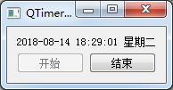
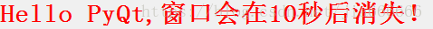

## QTimer
如果在应用程序中周期性地进行某项操作，比如周期性的检测主机的cpu值，则需要用到QTimer定时器，QTimer类提供了重复和单次的定时器，要使用定时器，需要先创建一个QTimer实例，将其Timeout信号连接到槽函数，并调用start（），然后，定时器，会以恒定的间隔发出timeout信号 ，当窗口的控件收到Timeout信号后，他就会停止这个定时器，这是在图形用户界面中实现复杂工作的一个典型用法，随着技术的进步，多线程在越来越多的平台上被使用，QTimer对象会被替代掉

#### QTimer类中的常用方法
| 方法                | 描述                                                                                                                     |
| ------------------- | ------------------------------------------------------------------------------------------------------------------------ |
| start(milliseconds) | 启动或重新启动定时器，时间间隔为毫秒，如果定时器已经运行，他将停止并重新启动，如果singleSlot信号为真，定时器仅被激活一次 |
| Stop()              | 停止定时器                                                                                                               |

#### QTimer类中常用的信号
| 信号       | 描述                                         |
| ---------- | -------------------------------------------- |
| singleShot | 在给定的时间间隔后调用一个槽函数时发射此信号 |
| timeout    | 当定时器超时时发射此信号                     |

start，timeout是周期性的信号
```python
self.timer=QTimer(self)
self.timer.start(1000)#设置时间间隔并启动定时器
self.timer.timeout.connect(self.showTime)#定时更新时间
```
singleShot是延时的信号，一次只触发一次
```python
QTimer.singleShot(10000,app.quit)#10秒后关闭程序
```

#### 例子
###### QTimer周期性例子
效果：

```python
import sys
from PyQt5.QtWidgets import QWidget,QPushButton,QApplication,QListWidget,QGridLayout,QLabel
from PyQt5.QtCore import QTimer,QDateTime

class WinForm(QWidget):
    def __init__(self,parent=None):
        super(WinForm, self).__init__(parent)
        #设置标题
        self.setWindowTitle('QTimer demo')

        #实例化一些控件
        self.listFile=QListWidget()
        self.lable=QLabel('显示当前时间')
        self.startBtn=QPushButton('开始')
        self.endBtn=QPushButton('结束')

        #栅格布局
        layout=QGridLayout()

        #初始化一个定时器
        self.timer=QTimer()
        #定时器结束，触发showTime方法
        self.timer.timeout.connect(self.showTime)

        #添加控件到栅格指定位置
        layout.addWidget(self.lable,0,0,1,2)
        layout.addWidget(self.startBtn,1,0)
        layout.addWidget(self.endBtn,1,1)

        #开始结束按钮点击触发相应的槽函数
        self.startBtn.clicked.connect(self.startTimer)
        self.endBtn.clicked.connect(self.endTimer)

        #设置布局方式
        self.setLayout(layout)
    def showTime(self):
        #获取系统当前时间
        time=QDateTime.currentDateTime()
        #设置系统时间的显示格式
        timeDisplay=time.toString('yyyy-MM-dd hh:mm:ss dddd')
        #在标签上显示时间
        self.lable.setText(timeDisplay)
    def startTimer(self):
        #设置时间间隔并启动定时器
        self.timer.start(1000)
        #设置开始按钮不可点击，结束按钮可点击
        self.startBtn.setEnabled(False)
        self.endBtn.setEnabled(True)

    def endTimer(self):
        #停止定时器
        self.timer.stop()
        #结束按钮不可点击，开始按钮可以点击
        self.startBtn.setEnabled(True)
        self.endBtn.setEnabled(False)
if __name__ == '__main__':
    app=QApplication(sys.argv)
    form=WinForm()
    form.show()
    sys.exit(app.exec_())
```

###### QTimer延时例子
效果：

```python
import sys
from PyQt5.QtWidgets import *
from PyQt5.QtCore import *
from PyQt5.QtGui import *

if __name__ == '__main__':
    app=QApplication(sys.argv)
    #设置标签以及文本内容
    label=QLabel('<font color=red size=128><b>Hello PyQt,窗口会在10秒后消失！</b></font>')
    #设置无边框窗口
    label.setWindowFlags(Qt.SplashScreen|Qt.FramelessWindowHint)

    label.show()

    #设置10秒后自动退出
    QTimer.singleShot(10000,app.quit)

    sys.exit(app.exec_())
```