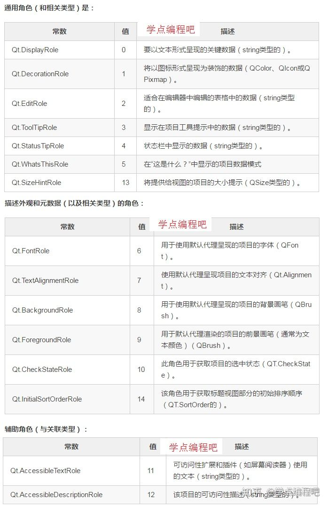

## QListView
QlistView类用于展示数据，它的子类是QListWIdget。QListView是基于模型（Model）的，需要程序来建立模型，然后再保存数据 

QListWidget是一个升级版本的QListView，它已经建立了一个数据储存模型（QListWidgetItem），直接调用addItem（）函数，就可以添加条目（Item）

QListView是基于Model，而QListWidget是基于Item。
#### QListView类中常用的方法
| 方法           | 描述                                                               |
| -------------- | ------------------------------------------------------------------ |
| setModel()     | 用来设置View所关联的Model，可以使用Python原生的list作为数据源Model |
| selectedItem() | 选中Model的条目                                                    |
| isSelected()   | 判断Model中的某条目是否被选中                                      |

#### QListView的常用信号
| 信号          | 含义                     |
| ------------- | ------------------------ |
| clicked       | 当单击某项时，信号被发射 |
| doubleClicked | 当双击某项时，信号被发射 |

#### 实例：QListView的使用
###### QStringListView的使用：
```python
from PyQt5.QtWidgets import   QMessageBox,QListView, QStatusBar,  QMenuBar,QMenu,QAction,QLineEdit,QStyle,QFormLayout,   QVBoxLayout,QWidget,QApplication ,QHBoxLayout, QPushButton,QMainWindow,QGridLayout,QLabel
from PyQt5.QtGui import QIcon,QPixmap,QStandardItem,QStandardItemModel
from PyQt5.QtCore import QStringListModel,QAbstractListModel,QModelIndex,QSize
import sys

class WindowClass(QMainWindow):
    def __init__(self,parent=None):
        super(WindowClass, self).__init__(parent)
        self.layout=QVBoxLayout()
        self.resize(200,300)
        listModel=QStringListModel()
        listView=QListView()
        items=["张三","李四","小明","JONES"]
        
        listModel.setStringList(items)
        listView.setModel(listModel)
        
        listView.clicked.connect(self.checkItem)

        self.layout.addWidget(listView)
        widget = QWidget()
        widget.setLayout(self.layout)
        self.setCentralWidget(widget)

    def  checkItem(self,index):
         QMessageBox.information(self,"ListView","选择项是：%d"%(index.row()))

if __name__=="__main__":
    app=QApplication(sys.argv)
    win=WindowClass()
    win.show()
    sys.exit(app.exec_())
```


###### QIconListView的使用：
```python
from PyQt5.QtWidgets import   QMessageBox,QListView, QStatusBar,  QMenuBar,QMenu,QAction,QLineEdit,QStyle,QFormLayout,   QVBoxLayout,QWidget,QApplication ,QHBoxLayout, QPushButton,QMainWindow,QGridLayout,QLabel
from PyQt5.QtGui import QIcon,QPixmap,QStandardItem,QStandardItemModel
from PyQt5.QtCore import QStringListModel,QAbstractListModel,QModelIndex,QSize
import sys

class WindowClass(QMainWindow):
    def __init__(self,parent=None):
        super(WindowClass, self).__init__(parent)
        self.layout=QVBoxLayout()
        self.resize(200,300)
        listView=QListView()
        listView.setViewMode(QListView.ListMode)#或者使用QListView.IconMode  QListView.ListMode
        #listView.setMovement(QListView.Static)
        listView.setIconSize(QSize(20,20))#图标的大小（原始图标大小如果100,100，此时设置草果原始大小则失效）
        listView.setGridSize(QSize(60,40))#每个选项所在网格大小（每个选项外层grid宽高）
        listView.setMaximumHeight(200)#listView整体最大高度
        #listView.setMinimumSize(QSize(200,200))#listView最小面积（一般如果设置最大高和宽属性后就不设置这个属性了）
        #listView.setMaximumSize(QSize(500,500))#listVIew最大面积（一般如果设置最大高和宽属性后就不设置这个属性了）
        listView.setMinimumHeight(120)#listView最小高度

        listView.setResizeMode(QListView.Adjust)
        #listView.setMovement(QListView.Static)#设置图标可不可以移动，默认是可移动的，但可以改成静态的：

        self.item_1=QStandardItem(QIcon("./image/save.ico"), "普通员工A");
        self.item_2 = QStandardItem(QIcon("./image/save.ico"), "普通员工B");

        model=QStandardItemModel()
        model.appendRow(self.item_1)
        model.appendRow(self.item_2)
        listView.setModel(model)

        listView.clicked.connect(self.checkItem)

        self.layout.addWidget(listView)
        widget = QWidget()
        widget.setLayout(self.layout)
        self.setCentralWidget(widget)


    def  checkItem(self,index):
         QMessageBox.information(self,"ListView","选择项是：%d"%(index.row()))

if __name__=="__main__":
    app=QApplication(sys.argv)
    win=WindowClass()
    win.show()
    sys.exit(app.exec_())
```


## 自定义实现QListView
#### 总体介绍
QListView类为模型提供了一个列表或图标视图。


QListView呈现存储在模型（Model）中的项目，可以是简单的非层次列表，也可以是图标集合。该类用于提供以前由QListBox和QIconView类提供的列表和图标视图，但是使用Qt的模型/视图体系结构提供的更灵活的方法。

**注：模型/视图体系结构是PyQt5中一个十分重要的概念。**

QListView类是模型/视图类之一，是Qt的模型/视图框架的一部分。

该视图不显示水平或垂直标题；要显示带有水平标题的项目列表，请改为使用QTreeView。

QListView实现由QAbstractItemView类定义的接口，以允许其显示由QAbstractItemModel类派生的模型提供的数据。

列表视图中的项目可以使用以下两种视图模式之一显示：在ListMode中，项目以简单列表的形式显示；在IconMode中，列表视图采用图标视图的形式，在图标视图中，项目通过文件管理器中的文件等图标显示。默认情况下，列表视图在ListMode中。要更改视图模式，请使用setViewMode()函数，并确定当前视图模式，请使用viewMode()。

这些视图中的项目按列表视图的flow()指定的方向布置。根据视图的movement()状态，这些项目可能会固定或允许移动。

如果模型中的项目不能在流动方向上完全布置，则可以将其分割在视图窗口的边界处；这取决于isWrapping()。当图标视图表示项目时，此属性非常有用。

“如果模型中的项目不能在流动方向上完全布置”，这句话是什么意思？

如果flow()为LeftToRight，则项目将从左至右排列。 如果isWrapping属性为True，则布局将在到达可见区域的右侧时进行换行。 如果此属性为TopToBottom，则项目将从可见区域的顶部进行布局，并在到达底部时进行分割。

resizeMode()和layoutMode()控制项目布局的方式和时间。项目根据其 gridSize()进行间隔，并且可以存在于由gridSize()指定的大小的名义网格内。这些项目可以根据它们的iconSize()而呈现为大图标或小图标。

**成员类型文档**:


**类归属**
PyQt5->QtWidgets->QListView

**继承关系**
继承：QAbstractItemView

被继承：QHelpIndexWidget、QListWidget 和 QUndoView

更多详细的介绍请见官网：[QListView](https://doc.qt.io/qt-5/qlistview.html "QListView")

#### 实现例子详细讲解
实现的小例子是模拟一个QQ用户列表的界面，还有4项小功能：  
1、新增分组，默认是“我的好友”，你可以增加陌生人或者是黑名单等等  
2、删除联系人  
3、联系人转移分组，把“我的好友转移到黑名单”当中。  
4、联系人的名字和图标显示都是随机的  

下面是具体的效果图：


实现这个程序主要是靠3个自定义类：ListModel、ListView、QQ，它们又被别继承了QAbstractListModel、QListView、QToolBox。其中QQ是程序的框架，主要用于显示分组，ListView主要是用于显示每个分组里面的联系人，ListModel用于保存联系人数据。

我们QListView的讲解也主要是分这三点用来讲解的。

#####  ListModel的实现
首先来讲讲数据保存这块。正式讲解代码之前先简单的讲讲模型/视图体系结构（Model/View架构）。

Model/View框架的核心思想是模型（数据）与视图（显示）相分离，模型对外提供标准接口存取数据，不关心数据如何显示，视图自定义数据的显示方式，不关心数据如何组织存储。

Model/View框架中数据与显示的分离，可以允许使用不同界面显示同一数据，也能够在不改变数据的情况下添加新的显示界面。

模型必须为每一个数据提供独一无二的索引，视图通过索引访问模型中的数据。模型与数据源进行交互，为框架中其它组件提供接口。交互的本质在于数据源的类型以及模型的实现方式。视图从模型获取模型索引，通过将模型索引反向传给模型，视图又可以从数据源获取数据。在标准视图中，委托渲染数据项；在需要编辑数据时，委托使用直接模型索引直接与模型进行交互。

我们这个QQ模拟程序基本上就是按照这个思路来实现的。这里我们使用的数据模型是： QAbstractListModel

###### QAbstractListModel介绍
QAbstractListModel类提供了一个抽象模型，可以通过子模型创建一维列表模型。

QAbstractListModel为模型提供了一个标准接口，将其数据表示为一个简单的非分层项目序列。它不是直接使用，而是必须子类化。

由于该模型提供了比QAbstractItemModel更专用的界面，因此它不适用于树视图；如果要为此目的提供模型，则需要继承QAbstractItemModel。如果您需要使用多个列表模型来管理数据，那么改为继承QAbstractTableModel可能更合适。

通过继承这个类并实现所需功能的最小数量，可以创建简单的模型。例如，我们可以实现一个简单的基于List的只读模型，它向QListView小部件提供一个字符串列表。在这种情况下，我们只需要实现rowCount()函数以返回列表中的项目数，并使用data()函数从列表中检索项目。

由于模型表示一维结构，因此rowCount()函数返回模型中项目的总数。 columnCount()函数实现了与各种视图的互操作性，但默认情况下通知视图模型只包含一列。

**子类化** 
在继承QAbstractListModel时，您必须提供rowCount()和data()函数的实现。表现良好的模型也提供了headerData()实现。

对于可编辑的列表模型，还必须提供setData()的实现，并实现flags()函数，以便返回包含Qt.ItemIsEditable的值。

请注意：QAbstractListModel提供了columnCount()的默认实现，它通知视图在此模型中只有一列项目。

更多详细的介绍请见官网：[QAbstractItemModel](https://doc.qt.io/qt-5/qabstractitemmodel.html "QAbstractItemModel")

#####  ListModel代码详解
ListModel核心代码：
```python
from PyQt5.QtCore import QAbstractListModel, Qt, QModelIndex, QVariant, QSize
from PyQt5.QtGui import QIcon, QFont
import Random_Name, random

class ListModel(QAbstractListModel):
    def __init__(self):
        super().__init__()     
        self.ListItemData = []
        self.Data_init()
       
    def data(self, index, role):
        if index.isValid() or (0 <= index.row() < len(self.ListItemData)):
            if role == Qt.DisplayRole:
                return QVariant(self.ListItemData[index.row()]['name'])
            elif role == Qt.DecorationRole:
                return QVariant(QIcon(self.ListItemData[index.row()]['iconPath']))
            elif role == Qt.SizeHintRole:
                return QVariant(QSize(70,80))
            elif role == Qt.TextAlignmentRole:
                return QVariant(int(Qt.AlignHCenter|Qt.AlignVCenter))
            elif role == Qt.FontRole:
                font = QFont()
                font.setPixelSize(20)
                return QVariant(font)
        else:            
            return QVariant()

    def rowCount(self, parent = QModelIndex()):
        return len(self.ListItemData)

    def Data_init(self):
        randomnum = random.sample(range(26), 10)
        for i in randomnum:
            randname = Random_Name.getname()
            ItemData = {'name':'', 'iconPath':''}
            ItemData['name'] = randname
            ItemData['iconPath'] = "./res/"+ str(i) + ".jpg"
            self.ListItemData.append(ItemData)

    def addItem(self, itemData):
        if itemData: 
            self.beginInsertRows(QModelIndex(), len(self.ListItemData), len(self.ListItemData) + 1)
            self.ListItemData.append(itemData)
            self.endInsertRows()

    def deleteItem(self, index):
        del self.ListItemData[index]

    def getItem(self, index):
        if index > -1 and index < len(self.ListItemData):
            return self.ListItemData[index]
```
上面的代码大致分成如下几个部分:

1、子类化QAbstractListModel后，必须实现的data()和rowCount()函数

2、数据初始化函数Data_init()

3、增加、删除以及获得相关数据的函数：addItem()、deleteItem()、getItem()

首先我们来看看一个联系人所要展示出来的信息，如下图：


没错，就是图标和姓名。所以，我们首先就要规划好，单个数据用什么样的数据类型来表示呢，既要能存储图标路径又能存储姓名信息？在这里我选择了字典这一Python中较为强大的数据类型。具体定义的格式如下：
```python
ItemData = {'name':'', 'iconPath':''}
```
同时为了存储这些字典，我们又构建了一个列表：
```python
self.ListItemData = []
```

好了，现在开始正式讲解函数。
```python
def data(self, index, role):
    if index.isValid() or (0 <= index.row() < len(self.ListItemData)):
        if role == Qt.DisplayRole:
            return QVariant(self.ListItemData[index.row()]['name'])
        elif role == Qt.DecorationRole:
            return QVariant(QIcon(self.ListItemData[index.row()]['iconPath']))
        elif role == Qt.SizeHintRole:
            return QVariant(QSize(70,80))
        elif role == Qt.TextAlignmentRole:            
            return QVariant(int(Qt.AlignHCenter|Qt.AlignVCenter))
        elif role == Qt.FontRole:
            font = QFont()
            font.setPixelSize(20)
            return QVariant(font)
    else:            
        return QVariant()
```
这个函数是子类化QAbstractListModel必须要实现的函数，主要作用就是返回index所引用项目的给定role下存储的数据。通俗的说就是你想让数据返回什么样的格式或者说样式。其中参数：index、role是必须的。
```python
if index.isValid() or (0 <= index.row() < len(self.ListItemData)):
        #相关代码
    else:            
        return QVariant()
```
索引必须是存在的，或者说此模型索引引用的行不在正确的范围内，我们返回 QVariant()（如果没有要返回的值，请返回无效的QVariant而不是返回0）。反之就正确的返回我们需要的数据格式。

话说QVariant()这个是什么东东？

QVariant类作为一个最为普遍的PyQt5数据类型的联合。

是因为c++禁止没有构造函数和析构函数的联合体，许多继承的PyQt类不能够在联合体当中使用。（联合体当中的变量共用一个存储区），没有了联合变量，我们在物体属性以及数据库的工作等方面受到很多的困扰。

一个QVariant对象在一个时间内只保留一种类型的值。我们可以使用canConvert来查询是否能够转换当前的类型。
```python
if role == Qt.DisplayRole:
    return QVariant(self.ListItemData[index.row()]['name'])
elif role == Qt.DecorationRole:
    return QVariant(QIcon(self.ListItemData[index.row()]['iconPath']))
elif role == Qt.SizeHintRole:
    return QVariant(QSize(70,80))
elif role == Qt.TextAlignmentRole:
    return QVariant(int(Qt.AlignHCenter|Qt.AlignVCenter))
elif role == Qt.FontRole:
    font = QFont()
    font.setPixelSize(20)
    return QVariant(font)
```
模型中的每个项目都有一组与其关联的数据元素，每个元素都有其自己的角色（role）。 视图（View）使用角色向模型（Model）指示它需要哪种类型的数据。 自定义模型应该返回这些类型的数据。


通过上面这些表格我们已经清楚了，模型中每个项目是联系人的姓名、图标、项目的尺寸、对齐方式、以及字体的大小。
```python
def rowCount(self, parent = QModelIndex()):
    return len(self.ListItemData)
```
返回行数，在这里就是数据列表的大小。

```python
def addItem(self, itemData):
    if itemData: 
        self.beginInsertRows(QModelIndex(), len(self.ListItemData), len(self.ListItemData) + 1)
        self.ListItemData.append(itemData)
        self.endInsertRows()
```
因为我们在模型中要实现增删操作，故我们这里把新增的操作实现。这里我们确定了插入数据的位置。

```python
def deleteItem(self, index):
    del self.ListItemData[index]
```
这里是把指定索引的数据从数据列表中删除

 
```python
def getItem(self, index):
    if index > -1 and index < len(self.ListItemData):
        return self.ListItemData[index]
```
获得相应的项目数据，这里的前提条件是索引是正常范围的。
 
```python
def Data_init(self):
    randomnum = random.sample(range(26), 10)
    for i in randomnum:
        randname = Random_Name.getname()
        ItemData = {'name':'', 'iconPath':''}
        ItemData['name'] = randname
        ItemData['iconPath'] = "./res/"+ str(i) + ".jpg"
        self.ListItemData.append(ItemData)
```
这个函数就是数据初始化的。其中使用random.sample(range(26), 10)函数，即从0-25个数字中随机的抽取10个不重复的数字组成一个列表randomnum。这列表中的10个数据，就是我们的项目了。

然后遍历这个列表randomnum，其中联系人的姓名我是随机生成的，这里用到了一个随机姓名生成函数（是从网上找的），随机的生成图标的路径，这里我的图标名称都是数字的，如：“1.jpg”，把姓名和图标路径添加到字典当中，然后append到数据列表里面。

#####  ListView的实现
以上我们介绍了QAbstractListModel子类化之后，我们模型（Model）的实现，下来我们介绍一下QListView的使用，这里的使用也是自定义一个类，当然是继承了QListView。
###### ListView代码详解
ListView核心代码
```python
from PyQt5.QtWidgets import QListView, QMenu, QAction, QMessageBox
from PyQt5.QtCore import QSize
from ListModel import ListModel

class ListView(QListView):

    map_listview = []

    def __init__(self):
        super().__init__()
        self.m_pModel = ListModel()  
        self.setModel(self.m_pModel)
        
    def contextMenuEvent(self, event):
        hitIndex = self.indexAt(event.pos()).column()
        if hitIndex > -1:
            pmenu = QMenu(self)
            pDeleteAct = QAction("删除",pmenu)
            pmenu.addAction(pDeleteAct)
            pDeleteAct.triggered.connect(self.deleteItemSlot)
            pSubMenu = QMenu("转移联系人至" ,pmenu)
            pmenu.addMenu(pSubMenu)
            for item_dic in self.map_listview:
                pMoveAct = QAction(item_dic['groupname'] ,pmenu)
                pSubMenu.addAction(pMoveAct)
                pMoveAct.triggered.connect(self.move)
            pmenu.popup(self.mapToGlobal(event.pos()))
    
    def deleteItemSlot(self):
        index = self.currentIndex().row()
        if index > -1:
            self.m_pModel.deleteItem(index)

    def setListMap(self, listview):
        self.map_listview.append(listview)

    def addItem(self, pitem):
        self.m_pModel.addItem(pitem)

    def move(self):
        tolistview = self.find(self.sender().text())
        if tolistview is self:
            prelistview = self.sender().text()
            QMessageBox.warning(self, "警告", "该联系人就在{}，还怎么移动啊！".format(prelistview))
        else:
            index = self.currentIndex().row()
            pItem = self.m_pModel.getItem(index)
            tolistview.addItem(pItem)
            self.m_pModel.deleteItem(index)

    def find(self, pmenuname):
        for item_dic in self.map_listview:
            if item_dic['groupname'] == pmenuname:
                return item_dic['listview']
```

这段代码分为两大部分：自定义右键菜单（上下文菜单）和增删移的操作。

```python
map_listview = []
```
map_listview是一个类变量，那么这个类变量与实例变量有什么区别呢？

类变量为所有实例共享的，而实例变量则是每个实例独有的。
我们要利用map_listview保存QListView对象和分组名称的对应关系。因为这样我们就能靠分组名称找到对应的QListView对象，根据QListView对象就行调用对应的QAbstractListModel的子类了。

```python
self.m_pModel = ListModel()  
self.setModel(self.m_pModel)
```
设置要呈现的视图的模型，这里我们用的是自定义的ListModel类。

```python
def contextMenuEvent(self, event):
    hitIndex = self.indexAt(event.pos()).column()
    if hitIndex > -1:
        pmenu = QMenu(self)
        pDeleteAct = QAction("删除",pmenu)
        pmenu.addAction(pDeleteAct)
        pDeleteAct.triggered.connect(self.deleteItemSlot)
        pSubMenu = QMenu("转移联系人至" ,pmenu)
        pmenu.addMenu(pSubMenu)
        for item_dic in self.map_listview:
            pMoveAct = QAction(item_dic['groupname'] ,pmenu)
            pSubMenu.addAction(pMoveAct)
            pMoveAct.triggered.connect(self.move)
        pmenu.popup(self.mapToGlobal(event.pos()))
```
这个函数主要是实现上下文菜单的，也就是传说中的单击右键菜单。如下图：


```python
hitIndex = self.indexAt(event.pos()).column()
```
这个函数是说返回鼠标指针相对于接收事件的小部件的位置，然后我们根据这个位置的坐标返回视口坐标点处的项目的模型索引，最后根据索引返回此模型索引引用的列（感觉说得好绕口啊~！）。

```python
pmenu.popup(self.mapToGlobal(event.pos()))
```
显示菜单，以便动作QAction对象在指定的全局位置p处。这里的全局位置p是根据小部件的本地坐标转换为全局坐标的，故使用QWidget.mapToGlobal()。

```python
def deleteItemSlot(self):
    index = self.currentIndex().row()
    if index > -1:
        self.m_pModel.deleteItem(index)
``` 
返回当前项目的模型索引，并根据索引返回此模型索引引用的行，然后到模型里面删除相应的数据。

```python
def move(self):
    tolistview = self.find(self.sender().text())
    if tolistview is self:
        prelistview = self.sender().text()
        QMessageBox.warning(self, "警告", "该联系人就在{}，还怎么移动啊！".format(prelistview))
    else:
        index = self.currentIndex().row()
        pItem = self.m_pModel.getItem(index)
        tolistview.addItem(pItem)
        self.m_pModel.deleteItem(index)
``` 
这个函数是实现联系人转移的。

```python
tolistview = self.find(self.sender().text())
``` 
我们根据点击的分组名称找到对应的QListView对象。find函数是自定义的。

```python
if tolistview is self:
    prelistview = self.sender().text()
    QMessageBox.warning(self, "警告", "该联系人就在{}，还怎么移动啊！".format(prelistview))
``` 
假设联系人就在将转移的分组，那我们就没有必要转移了。

```python
else:
    index = self.currentIndex().row()
    pItem = self.m_pModel.getItem(index)
    tolistview.addItem(pItem)
    self.m_pModel.deleteItem(index)
``` 
否则我们首先要获得这个联系人，然后在将转移的分组中将这个联系人加上，原分组联系人删除就行了。

#### 程序框架（QToolBox）的实现
前两期我们介绍了模型（Model）/视图（View）框架中的Model与View，本期是最后一期，介绍程序框架，也就是最后一个类QQ。

核心代码:
```python
from PyQt5.QtWidgets import QApplication, QToolBox, QListView, QMenu, QAction, QInputDialog, QMessageBox
from PyQt5.QtCore import Qt
from ListView import ListView
from PyQt5.QtGui import QIcon
import sys

class QQ(QToolBox):
    def __init__(self):
        super().__init__()
        self.setWindowTitle('公众号：学点编程吧--QQ')
        self.setWindowFlags(Qt.Dialog)
        self.setMinimumSize(200,600)
        self.setWhatsThis('这个一个模拟QQ软件')
        self.setWindowIcon(QIcon('./res/log.ico'))
        pListView = ListView() 
        pListView.setViewMode(QListView.ListMode)
        pListView.setStyleSheet("QListView{icon-size:70px}")
        dic_list = {'listview':pListView, 'groupname':"我的好友"}
        pListView.setListMap(dic_list)
        self.addItem(pListView, "我的好友") 
        self.show()
    
    def contextMenuEvent(self, event):
        pmenu = QMenu(self)
        pAddGroupAct = QAction("添加分组", pmenu)
        pmenu.addAction(pAddGroupAct) 
        pAddGroupAct.triggered.connect(self.addGroupSlot)  
        pmenu.popup(self.mapToGlobal(event.pos()))
    
    def addGroupSlot(self):
        groupname = QInputDialog.getText(self, "输入分组名", "")
        if groupname[0] and groupname[1]: 
            pListView1 = ListView()
            pListView1.setViewMode(QListView.ListMode)
            pListView1.setStyleSheet("QListView{icon-size:70px}")
            self.addItem(pListView1, groupname[0])
            dic_list = {'listview':pListView1, 'groupname':groupname[0]}
            pListView1.setListMap(dic_list)
        elif groupname[0] == '' and groupname[1]:
            QMessageBox.warning(self, "警告", "我说你没有填写分组名哦~！")
    
app = QApplication(sys.argv)
qq = QQ()
sys.exit(app.exec_())
``` 
QQ这个自定义类我们继承了QToolBox，

```python
pListView = ListView() 
pListView.setViewMode(QListView.ListMode)
pListView.setStyleSheet("QListView{icon-size:70px}")
``` 
这段代码新建了一个ListView对象，然后设置成QListView.ListMode然后我们设置QListView图标的大小70像素。

```python
dic_list = {'listview':pListView, 'groupname':"我的好友"}
pListView.setListMap(dic_list)
self.addItem(pListView, "我的好友")
``` 
因为我们默认是有“我的好友”这个分组的，故将当前listview对象和分组名称放入到一个字典当中，然后通过setListMap()将这个字典放入到map_listview这个列表中。

利用QQ的addItem函数增加“我的好友”这个项目。

```python
def contextMenuEvent(self, event):
    pmenu = QMenu(self)
    pAddGroupAct = QAction("添加分组", pmenu)
    pmenu.addAction(pAddGroupAct) 
    pAddGroupAct.triggered.connect(self.addGroupSlot)  
    pmenu.popup(self.mapToGlobal(event.pos()))
``` 
自定义上下文菜单。

```python
def addGroupSlot(self):
    groupname = QInputDialog.getText(self, "输入分组名", "")
    if groupname[0] and groupname[1]: 
        pListView1 = ListView()
        pListView1.setViewMode(QListView.ListMode)
        pListView1.setStyleSheet("QListView{icon-size:70px}")
        self.addItem(pListView1, groupname[0])
        dic_list = {'listview':pListView1, 'groupname':groupname[0]}
        pListView1.setListMap(dic_list)
    elif groupname[0] == '' and groupname[1]:
        QMessageBox.warning(self, "警告", "我说你没有填写分组名哦~！")
``` 
groupname这里返回的是一个元组，其中第0个元素是分组名，第1个元素返回是否按了确定键（True or False）若按了确定键并且输入了分组名则新建一个ListView对象并将其与分组名称添加到字典当中，然后通过setListMap()将这个字典放入到map_listview这个列表中。当然QQ类也要新增一个联系人项目。

没有填写分组名又按了确定键的话，就报错。

