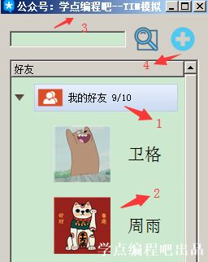
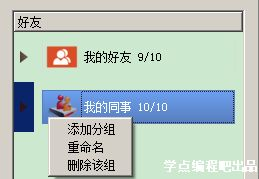
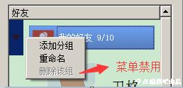
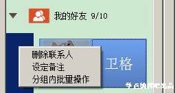
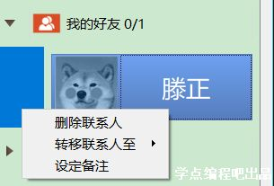
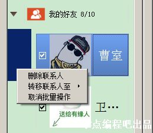
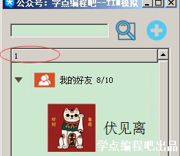
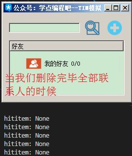
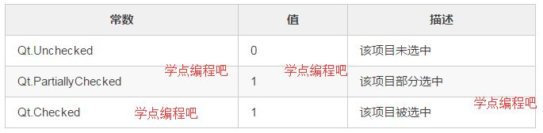

## QTreeWidget
和 QTableWidget类似，一般步骤是先创建一个 QTreeWidget实例，然后设置列数，然后再添加 。

#### QTreeWidget类中的常用方法
| 方法                                 | 描述                                                              |
| ------------------------------------ | ----------------------------------------------------------------- |
| setColumnWidth(int column,int width) | 将指定列的宽度设置为给定的值；Column：指定的列，width：指定的宽度 |
| insertTopLevelItems()                | 在视图的顶层索引中引入项目的列表                                  |
| expandAll()                          | 展开所有节点的树形节点                                            |
| invisibleRootItem()                  | 返回树形控件中不可见的根选项（Root Item）                         |
| selectionItems()                     | 返回所有选定的非隐藏项目的列表内                                  |

#### QTreeWidgetItem类中常用的方法
| 方法                        | 描述                                           |
| --------------------------- | ---------------------------------------------- |
| addChild()                  | 将子项追加到子列表中                           |
| setText()                   | 设置显示的节点文本                             |
| Text()                      | 返回显示的节点文本                             |
| setCheckState(column.state) | 设置指定列的选中状态：Qt.Checked、Qt.Unchecked |
| setIcon(column,icon)        | 在指定的列中显示图标                           |

如下是 pyqt5 的 QTreeWidget 工具调用节点的部分命令，备用：
```python
self.tree = QTreeWidget()

self.tree.topLevelItem(0)；最顶级节点，指定第1个顶级节点；节点编号从0开始。

self.tree.currentItem()；当前节点

self.tree.selectedItems()；鼠标选中的当前节点

self.tree.topLevelItemCount()；最顶级节点的总数

self.tree.topLevelItem(0).child(0)；第1个最顶级节点的第1个子节点

self.tree.topLevelItem(0).child(0).child(0)；第1个最顶级节点的第1个子节点的第1个子节点

self.tree.currentItem().parent()；鼠标选中的当前节点的父节点

self.tree.currentItem().child(0)；鼠标选中的当前节点的第1个子节点

self.tree.currentItem().parent().childCount()；鼠标选中的当前节点的同级节点的总数量

self.tree.expandItem(self.tree.topLevelItem(0))；展开指定节点，指定展开第1个顶级节点

self.tree.collapseItem(self.tree.topLevelItem(0))；收起指定节点，指定收起第1个顶级节点
```

#### 总体介绍
QTreeWidget类提供了一个使用预定义树模型的树视图。

QTreeWidget类是一个十方方便使用的类，它提供了一个标准的Tree小部件，如下图所示的界面。该类基于Qt的Model / View架构，并使用默认模型来保存项目，每一个都是一个QTreeWidgetItem。

不需要Model / View框架灵活性的开发人员可以使用此类轻松创建简单的分层列表。更灵活的方法是将QTreeView与标准项目模型相结合。这允许将数据的存储与其表示分开。

在其最简单的形式中，可以通过以下方式构建树小部件：
```python
treeWidget = QTreeWidget(self)
treeWidget.setColumnCount(1)
root = QTreeWidgetItem(treeWidget)
for i in range(10):
    item = QTreeWidgetItem(root)
    item.setText(0, str(i))
    root.addChild(item)
```
在将项目添加到树部件之前，必须使用setColumnCount()设置列的数量。这允许每个物品具有一个或多个标签或其他装饰。使用的列数可以通过columnCount()函数找到。

该树可以包含一个标题，其中包含控件中每个列的部分。通过使用setHeaderLabels()提供字符串列表来设置每个部分的标签是最容易的，但是可以使用QTreeWidgetItem构造自定义标头并使用setHeaderItem()函数将其插入树中。

树中的项目可以根据预定义的排序顺序按列排序。如果启用排序，则用户可以通过单击列标题来排序项目。可以通过调用setSortingEnabled()来启用或禁用排序。 isSortingEnabled()函数指示是否启用排序。

**类归属**
PyQt5->QtWidgets->QTreeWidget

**继承关系**
PyQt5->QtWidgets->QWidget->QFrame->QAbstractScrollArea->QAbstractItemView->QTreeView->QTreeWidget

更多详细的介绍请见官网：[QTreeWidget](https://doc.qt.io/qt-5/qtreewidget.html "QTreeWidget")

#### 实例
###### QTreeWidget最简单的例子
实现效果：

```python
import sys
from PyQt4.QtGui import *

class TreeWidget(QMainWindow):
    def __init__(self):
        super(TreeWidget, self).__init__()
        self.setWindowTitle('TreeWidget')
        self.tree = QTreeWidget()  # 实例化一个TreeWidget对象
        self.tree.setColumnCount(2)  # 设置部件的列数为2
        self.tree.setHeaderLabels(['Key', 'Value'])  # 设置头部信息对应列的标识符

        # 设置root为self.tree的子树，故root是根节点
        root = QTreeWidgetItem(self.tree)
        root.setText(0, 'root')  # 设置根节点的名称

        # 为root节点设置子结点
        child1 = QTreeWidgetItem(root)
        child1.setText(0, 'child1')
        child1.setText(1, 'name1')
        child2 = QTreeWidgetItem(root)
        child2.setText(0, 'child2')
        child2.setText(1, 'name2')
        child3 = QTreeWidgetItem(root)
        child3.setText(0, 'child3')
        child4 = QTreeWidgetItem(child3)
        child4.setText(0, 'child4')
        child4.setText(1, 'name4')

        self.tree.addTopLevelItem(root)
        self.setCentralWidget(self.tree)  # 将tree部件设置为该窗口的核心框架

app = QApplication(sys.argv)
app.aboutToQuit.connect(app.deleteLater)
tp = TreeWidget()
tp.show()
app.exec_()
```

###### QTreeWidget带图标与样式的例子
代码：
```python
import sys
from PyQt5.QtWidgets import *
from PyQt5.QtGui import QIcon, QBrush, QColor
from PyQt5.QtCore import Qt

class TreeWidgetDemo(QMainWindow):
    def __init__(self, parent=None):
        super(TreeWidgetDemo, self).__init__(parent)
        self.setWindowTitle('TreeWidget 例子')

        self.tree=QTreeWidget()
        #设置列数
        self.tree.setColumnCount(2)
        #设置树形控件头部的标题
        self.tree.setHeaderLabels(['Key','Value'])

        #设置根节点
        root=QTreeWidgetItem(self.tree)
        root.setText(0,'Root')
        root.setIcon(0,QIcon('./images/root.png'))

        # todo 优化2 设置根节点的背景颜色
        brush_red=QBrush(Qt.red)
        root.setBackground(0,brush_red)
        brush_blue=QBrush(Qt.blue)
        root.setBackground(1,brush_blue)

        #设置树形控件的列的宽度
        self.tree.setColumnWidth(0,150)

        #设置子节点1
        child1=QTreeWidgetItem()
        child1.setText(0,'child1')
        child1.setText(1,'ios')
        child1.setIcon(0,QIcon('./images/IOS.png'))

        #todo 优化1 设置节点的状态
        child1.setCheckState(0,Qt.Checked)

        root.addChild(child1)

        #设置子节点2
        child2=QTreeWidgetItem(root)
        child2.setText(0,'child2')
        child2.setText(1,'')
        child2.setIcon(0,QIcon('./images/android.png'))

        #设置子节点3
        child3=QTreeWidgetItem(child2)
        child3.setText(0,'child3')
        child3.setText(1,'android')
        child3.setIcon(0,QIcon('./images/music.png'))

        #加载根节点的所有属性与子控件
        self.tree.addTopLevelItem(root)

        #TODO 优化3 给节点添加响应事件
        self.tree.clicked.connect(self.onClicked)

        #节点全部展开
        self.tree.expandAll()
        self.setCentralWidget(self.tree)

    def onClicked(self,qmodeLindex):
        item=self.tree.currentItem()
        print('Key=%s,value=%s'%(item.text(0),item.text(1)))

if __name__ == '__main__':
    app = QApplication(sys.argv)
    tree = TreeWidgetDemo()
    tree.show()
    sys.exit(app.exec_())
```
初始运行图如下 


优化一：设置节点的状态
这里添加了child1的选中状态
```python
child1.setCheckState(0,Qt.Checked)
```


优化二：设置节点的背景颜色
这里设置了根节点的背景颜色
```python
brush_red=QBrush(Qt.red)
        root.setBackground(0,brush_red)
        brush_blue=QBrush(Qt.blue)
        root.setBackground(1,brush_blue)
```


优化三：给节点添加响应事件
点击，会在控制台输出当前地key值与value值
```python
self.tree.clicked.connect(self.onClicked)
def onClicked(self,qmodeLindex):
        item=self.tree.currentItem()
        print('Key=%s,value=%s'%(item.text(0),item.text(1)))
```

###### QTreeView显示文件系统盘的树列表
在上面的例子中，QTreeWidgetItem类的节点是一个个添加上去的，这样有时很不方便，特别是窗口产生比较复杂的树形结构时，一般都是通过QTreeView类来实现的，而不是QTreeWidget类，QTreeView和QTreeWidget类最大的区别就是，QTreeView类可以使用操作系统提供的定制模式，比如文件系统盘的树列表
```python
import sys
from PyQt5.QtWidgets import *
from PyQt5.QtGui import *

if __name__ == '__main__':
    app=QApplication(sys.argv)

    #window系统提供的模式
    model=QDirModel()
    #创建一个QTreeView的控件
    tree=QTreeView()
    #为控件添加模式
    tree.setModel(model)

    tree.setWindowTitle('QTreeView例子')
    tree.resize(640,480)

    tree.show()
    sys.exit(app.exec_())
```


##### TIM模拟
同之前的QQ模拟相比较，其有如下特点（相关的功能不展示）：

1、分组、联系人采用树型展示（感觉像废话），以往的是抽屉式的。

2、从分组上来看具有如下特点：

2.1、分组名称带上了联系人的数量统计（含在线人数）

2.2、分组可以重命名、删除

3、从联系人上看具有如下特点：

3.1、新增隐身或者离线属性（随机生成）

3.2、设定备注（重命名联系人）

3.3、批量操作新增复选框的选择方式，之前是Ctrl多选的。

4、增加联系人查找功能

5、新增联系人可以选择分组

###### 实现思路
**功能方面**  
从下图中我们可以看出该程序具体涉及到下面4个方面的功能：


1、分组

2、联系人

3、搜索

4、新增联系人

首先来看分组，分组菜单上是有三个功能的：添加分组、重命名、删除分组，分组这边就需要实现这个3个功能，如下图：


其次看联系人，有删除联系人、转移联系人、设定备注、分组内批量操作几个功能，如下图：


再来看搜索，这个比较简单，唯一有特点的是之前教程中涉及到的自动补全功能；

最后就是新增联系人，和之前相比较就是多了分组选择功能。

so，程序实现的重点就是分组和联系人了。

**逻辑方面**  
这里面还有一些逻辑关系我们还需要注意：

1、第一个分组保留，要是一个分组没有（TIM也是这种设计理念），这个程序就没有意义了，如下图：


2、只有存在两个以上分组的时候，才会出现转移联系人菜单，否则转移没有意义（之前的设计也是这样的），如下图：


3、只有分组中存在两个及以上联系人的时候，才会出现分组内批量操作菜单，否则批量操作没有意义，而且使用太繁琐（我觉得），如下图：


4、批量操作开启后，无设定备注功能。你给谁设定备注呢？如下图：


5、分组内批量操作和取消批量操作的转换，需要区分具体的时机，即究竟在什么情况下出现，避免出现一些不知所云的菜单项目。

**公共功能**  
举个例子，我们在重命名分组、新增分组、新增联系人的时候，都会涉及到分组名称中数量的统计功能，要是在每个功能上都重新把统计功能写一遍，感觉太过繁琐，所以还是抽象成一个函数更好一些。

以上是我在设计上的一点个人想法，可能还有不足，希望大家讨论，提升代码的性能。

###### 核心代码解析
**数据存储**  
一般情况下，分组信息、联系人信息都是存储在数据库上的，为了简便操作，我们用列表来表示。

我们在程序中构建了三个列表：

grouplist = []
userslist = []
tmpuseritem = []
grouplist我们是用于存放分组信息的，每个grouplist的元素是一个字典，具体如下：

groupdic = {'group':group, 'groupname':groupname,'childcount':0,'childishide':0}
这个字典中包括了分组对象、分组的名称、分组下面的联系人数量和分组下面隐身（离线）数量。

userslist我们是用于存放联系人信息的，每个userslist的元素是一个字典，具体如下：

userdic = {'user':child, 'username':randname,'ishide':0}
这个字典中包括了联系人对象、名称以及是否隐身（离线）这一属性。

tmpuseritem则是临时保存一下批量操作是我们选中的联系人对象。

**程序的界面我是用Qt设计师实现的界面，下面的代码一部分是自动生成的。**

**界面、样式和其它**  
```python
class TIM(QWidget, Ui_Form):
    grouplist = []
    userslist = []
    tmpuseritem = []
    def __init__(self, parent=None):
        super(TIM, self).__init__(parent)
        self.setupUi(self)
        self.Ui_init()
    
    def Ui_init(self):
        self.treeWidget.setColumnCount(1)
        self.treeWidget.setColumnWidth(0,50)
        self.treeWidget.setHeaderLabels(["好友"])
        self.treeWidget.setIconSize(QSize(70,70))
        self.treeWidget.setSelectionMode(QAbstractItemView.ExtendedSelection)
        with codecs.open('./res/treewidget.qss','r','utf-8') as f:
            styleSheet = f.readlines()
        style = '\r\n'.join(styleSheet)
        self.treeWidget.setStyleSheet(style)
        root = self.creategroup('我的好友')
        root.setExpanded(True)
    
    def creategroup(self, groupname):
        hidernum = 0
        group= QTreeWidgetItem(self.treeWidget)
        groupdic = {'group':group, 'groupname':groupname,'childcount':0,'childishide':0}
        icon = self.searchicon(groupname)
        group.setIcon(0, icon)
        randomnum = random.sample(range(26), 10)
        for i in randomnum:  
            child = QTreeWidgetItem()
            randname, randicon, font, isvip, ishider = self.createusers(i)
            userdic = {'user':child, 'username':randname,'ishide':0}
            self.userslist.append(userdic)
            child.setText(0, randname)
            child.setFont(0, font)
            child.setIcon(0, randicon)
            child.setTextAlignment(0, Qt.AlignHCenter|Qt.AlignVCenter)
            if isvip == 1:
                child.setForeground(0, QBrush(Qt.red))
                child.setToolTip(0, '会员红名尊享')
            if ishider == 1:
                hidernum += 1
                userdic['ishide'] = 1
            group.addChild(child)
        childnum = group.childCount()
        lastchildnum = childnum - hidernum
        groupdic['childcount'] = childnum
        groupdic['childishide'] = hidernum
        groupname += ' ' + str(lastchildnum) + '/' + str(childnum)
        group.setText(0,groupname)
        self.grouplist.append(groupdic)
        return group
        
    def createusers(self, num):
        randname = Random_Name.getname()
        randicon = QIcon("./res/user/"+ str(num) + ".jpg")
        font = QFont()
        font.setPointSize(16)
        isvip = random.randint(0, 5)
        ishider = random.randint(0, 5)
        if ishider == 1:
            randicon = QIcon("./res/user/"+ str(num) + "h.jpg")
        return randname, randicon, font, isvip, ishider
    
    def searchicon(self, gpname2):
        if gpname2.find('好友') >= 0:
            return QIcon('./res/group/buddy.ico')
        elif gpname2.find('同事') >= 0:
            return QIcon('./res/group/partner.ico')
        elif gpname2.find('黑名单') >= 0:
            return QIcon('./res/group/blacklist.ico')
        else:
            return QIcon('./res/group/buddy_default.ico')
```
这段代码描述了我们第一次运行时出现的界面，有一个我的好友分组，这个分组下面有一些联系人（有会员或者隐身）。分组的创建、联系人的创建我们采用了函数的形式。下面具体来了解一下。

```python
self.treeWidget.setColumnCount(1)
self.treeWidget.setColumnWidth(0,50)
```
该属性保存树小部件中显示的列数。默认情况下，此属性的值为1。这里我们显示调用是为了给大家演示一下。
给指定列设置为指定的宽度。

```python
self.treeWidget.setHeaderLabels(["好友"])
```
在标题列表中的每个项目的标题中添加一列，并为每列设置标签。若我们不写这句，效果是这样的：


```python
self.treeWidget.setIconSize(QSize(70,70))
self.treeWidget.setSelectionMode(QAbstractItemView.ExtendedSelection)
```
这个之前的章节说过，设置图标大小的，同时设置多选的方式。

```python
with codecs.open('./res/treewidget.qss','r','utf-8') as f:
    styleSheet = f.readlines()
style = '\r\n'.join(styleSheet)
self.treeWidget.setStyleSheet(style)
```
这里我们是读取QSS样式（不做讲解，自己看吧，有时间的话专题）。我比较喜欢用codecs.open()来打开文件，这样可以指定编码。

codecs.open()的函数格式如下：
```python
codecs.open（filename，mode ='r'，encoding = None，errors ='strict'，buffering = 1）
```
使用给定模式打开编码文件并返回StreamReaderWriter的实例，提供透明的编码/解码。 

```python
root = self.creategroup('我的好友')
root.setExpanded(True)
```
这里我们创建我的好友分组，这个分组一开始的时候就是展开的。这里使用setExpanded(True)实现。

```python
def creategroup(self, groupname):
    hidernum = 0
    group= QTreeWidgetItem(self.treeWidget)
    groupdic = {'group':group, 'groupname':groupname,'childcount':0,'childishide':0}
    icon = self.searchicon(groupname)
    group.setIcon(0, icon)
    randomnum = random.sample(range(26), 10)
    for i in randomnum:  
        child = QTreeWidgetItem()
        randname, randicon, font, isvip, ishider = self.createusers(i)
        userdic = {'user':child, 'username':randname,'ishide':0}
        self.userslist.append(userdic)
        child.setText(0, randname)
        child.setFont(0, font)
        child.setIcon(0, randicon)
        child.setTextAlignment(0, Qt.AlignHCenter|Qt.AlignVCenter)
        if isvip == 1:
            child.setForeground(0, QBrush(Qt.red))
            child.setToolTip(0, '会员红名尊享')
        if ishider == 1:
            hidernum += 1
            userdic['ishide'] = 1
        group.addChild(child)
    childnum = group.childCount()
    lastchildnum = childnum - hidernum
    groupdic['childcount'] = childnum
    groupdic['childishide'] = hidernum
    groupname += ' ' + str(lastchildnum) + '/' + str(childnum)
    group.setText(0,groupname)
    self.grouplist.append(groupdic)
    return group
```

下面我们来看看分组创建的函数，上面介绍过的内容就不重复了，节约篇幅。
```python
hidernum = 0
```
统计隐身联系人的。

```python
group= QTreeWidgetItem(self.treeWidget)
```
构造指定类型的树构件项目并将其附加到给定父项中（self.treeWidget），说白了就是新增一个分组（QTreeWidgetItem类型），这个分组是挂在self.treeWidget下的。

```python
icon = self.searchicon(groupname)
group.setIcon(0, icon)
def searchicon(self, gpname2):
    if gpname2.find('好友') >= 0:
        return QIcon('./res/group/buddy.ico')
    elif gpname2.find('同事') >= 0:
        return QIcon('./res/group/partner.ico')
    elif gpname2.find('黑名单') >= 0:
        return QIcon('./res/group/blacklist.ico')
    else:
        return QIcon('./res/group/buddy_default.ico')
```
给这个分组给定列设置图标，因为这里我只有一列，所以是0。有些是有好几列的，这个数字就要改了。这个图标是怎么来的呢？从searchicon()函数来，我们根据分组名称做了判断，不同的内容返回不同QIcon对象。

字符串的find()表示什么意思呢？要是找到指定的字符串，返回该字符串的第一个索引。例如：
```python
>>> str = '12345'
>>> str.find('2')
1
>>> str.find('3')
2
>>> str.find('6')
-1
```

分组有了接下来就是创建联系人啦。联系人也是QTreeWidgetItem()创建的。而每个联系人的属性则是通过createusers()实现的。
```python
def createusers(self, num):
    randname = Random_Name.getname()
    randicon = QIcon("./res/user/"+ str(num) + ".jpg")
    font = QFont()
    font.setPointSize(16)
    isvip = random.randint(0, 5)
    ishider = random.randint(0, 5)
    if ishider == 1:
        randicon = QIcon("./res/user/"+ str(num) + "h.jpg")
    return randname, randicon, font, isvip, ishider
```
隐身、会员属性什么的，基本靠天意。将相应的属性返回：姓名、图标、字体、是否会员、是否隐身。
```python
group.addChild(child)
```
我们将每个联系人增加先前创建的group分组当中。
```python
if ishider == 1:
    hidernum += 1
    userdic['ishide'] = 1
```
统计隐身联系人的数量，同时给每个联系人字典里面的是否隐身这一属性更新一下。

```python
childnum = group.childCount()
lastchildnum = childnum - hidernum
groupdic['childcount'] = childnum
groupdic['childishide'] = hidernum
groupname += ' ' + str(lastchildnum) + '/' + str(childnum)
group.setText(0,groupname)
```
统计每个分组下联系人的数量。

减去隐身的数量就是在线联系人的数量了。

更新groupdic中的数据。

将当前groupname设置成类似：我的好友 8/10 的样式。

```python
group.setText(0,groupname)
```
将给定列中显示的文本设置为给定文本，如：我的好友 8/10

```python
self.grouplist.append(groupdic)
self.userslist.append(userdic)
```
我们在每创建一个联系人或者分组的时候都需要存储在我们的自定义列表变量当中：grouplist、userslist（这个象征数据库）

```python
return group
```
最后返回分组对象。


**上面我们介绍了如何创建组、如何创建联系人，接着我们探讨一下在分组上单击右键实现的菜单功能。**

分组右键菜单代码介绍
```python
def contextMenuEvent(self, event):
    hititem = self.treeWidget.currentItem()
    if hititem:
        root = hititem.parent()
        if root is None:
            pgroupmenu = QMenu(self)
            pAddgroupAct = QAction('添加分组',self.treeWidget)
            pRenameAct = QAction('重命名',self.treeWidget)
            pDeleteAct = QAction('删除该组',self.treeWidget)
            pgroupmenu.addAction(pAddgroupAct)
            pgroupmenu.addAction(pRenameAct)
            pgroupmenu.addAction(pDeleteAct)
            pAddgroupAct.triggered.connect(self.addgroup)
            pRenameAct.triggered.connect(self.renamegroup)
            if self.treeWidget.itemAbove(hititem) is None:
                pDeleteAct.setEnabled(False)
            else:
                pDeleteAct.triggered.connect(self.deletegroup)
            pgroupmenu.popup(self.mapToGlobal(event.pos()))
        ……
def addgroup(self):
    gname, ok = QInputDialog.getText(self,'提示信息','请输入分组名称')
    if ok: 
        if len(gname) == 0:
            QMessageBox.information(self,'提示','分组名称不能为空哦')
        else:
            self.creategroup(gname)
        
def renamegroup(self):
    hitgroup = self.treeWidget.currentItem()
    gnewname, ok = QInputDialog.getText(self,'提示信息','请输入分组的新名称')
    if ok:
        if len(gnewname) == 0:
            QMessageBox.information(self,'提示','分组名称不能为空哦')
        else:
            hitgroup.setText(0, gnewname)
            newicon = self.searchicon(hitgroup.text(0))
            hitgroup.setIcon(0, newicon)
            gindex = self.searchgroup(hitgroup)
            self.grouplist[gindex]['groupname'] = gnewname
            self.treeWidget.setCurrentItem(hitgroup.child(0))
            
def deletegroup(self):
    hitgroup = self.treeWidget.currentItem()
    gindex = self.searchgroup(hitgroup)
    reply = QMessageBox.question(self,'警告','确定要删除这个分组及其联系人吗？', QMessageBox.Yes | QMessageBox.No , QMessageBox.No)
    if reply == QMessageBox.Yes:
        self.treeWidget.takeTopLevelItem(gindex)
        del self.grouplist[gindex]
        
def searchgroup(self, hitgroup):
    if isinstance(hitgroup,str):
        for i,g in enumerate(self.grouplist):
            if g['groupname'] == hitgroup:
                return i
    else:
        for i,g in enumerate(self.grouplist):
            if g['group'] == hitgroup:
                return i
```
我们重写了右键菜单的函数。

 
```python
hititem = self.treeWidget.currentItem()
```
返回树小部件中的当前项目，这里可以是分组也可以是联系人。

```python
if hititem:
    root = hititem.parent()
    if root is None:
            ...
```
这里有一个逻辑关系在这里面，首先返回的项目必须存在（分组或者联系人），有不存在的情况吗？当然有啊，当我们删除全部联系人的时候，如下图：


hititem.parent()就是要看看这个项目是否有上一节点，有的话就是联系人没有的话就是分组了。所以我们根据这点来判断究竟是在分组上单击右键还是在联系人上单击右键。

下面就好说了，都是一些常规操作，生成菜单之类的，然后单击菜单就能调用相应的槽函数，这里不做讲解了，之前的章节都有介绍。具体的槽函数我介绍一下。

```python
def addgroup(self):
    gname, ok = QInputDialog.getText(self,'提示信息','请输入分组名称')
    if ok:
        if len(gname) == 0:
            QMessageBox.information(self,'提示','分组名称不能为空哦')
        else:
            self.creategroup(gname)
```
当我们点击增加分组的时候（如下图），会提示输入名称，名称不能为空，符合要求的话就创建分组。


```python
def renamegroup(self):
    hitgroup = self.treeWidget.currentItem()
    gnewname, ok = QInputDialog.getText(self,'提示信息','请输入分组的新名称')
    if ok:
        if len(gnewname) == 0:
            QMessageBox.information(self,'提示','分组名称不能为空哦')
        else:
            hitgroup.setText(0, gnewname)
            newicon = self.searchicon(hitgroup.text(0))
            hitgroup.setIcon(0, newicon)
            gindex = self.searchgroup(hitgroup)
            self.grouplist[gindex]['groupname'] = gnewname
            self.treeWidget.setCurrentItem(hitgroup.child(0))
```
这个函数首先要获取分组对象。然后我们根据新的名称给这个分组对象设置分组名称setText()、图标setIcon()，更新用于存储数据的列表self.grouplist。这里提一下self.searchgroup(hitgroup)函数。

```python
def searchgroup(self, hitgroup):
    if isinstance(hitgroup,str): 
        for i,g in enumerate(self.grouplist): 
            if g['groupname'] == hitgroup:
                return i
    else:
        for i,g in enumerate(self.grouplist):
            if g['group'] == hitgroup:
                return i
```

这里我们是可以根据分组的名称或者对象找到数据存储列表中相应分组字典的索引并返回。为什么这样操作呢？因为我们不仅仅需要知道分组对象和名称，我们还需要知道其对应的其它属性，如隐身联系人数量等等啊。这些数据本可以从数据库中直接取出，这里也是为了简化知识点，不涉及数据库知识。

其实在QTreeWidget类中，有函数是涉及找Item的：
```python
findItems(self, str, Union[Qt.MatchFlags, Qt.MatchFlag], column: int = 0)
```
根据给定文本返回给定列中使用给定标志的匹配项目列表（因为有可能同名，所以返回是列表）。

因为我觉得该程序中不仅仅涉及分组对象和名称还有其他属性，用这个函数不够用，所有我采用折中的办法来找。个人观点，仅供参考。

 
```python
def renamegroup(self):
……
            self.treeWidget.setCurrentItem(hitgroup.child(0))
```
在renamegroup()函数中为什么还要增加以上这句话呢？设置当前的项目（这里表示分组中的第一个联系人）。

因为我们在程序最前面有这样一句：
```python
self.treeWidget.currentItemChanged.connect(self.restatistic)
```
当前项目发生变化的时候，我们自动调用restatistic()函数。话说这个restatistic()又是个什么玩意？

我们在上一章节的时候说过，在重命名分组、新增分组、新增联系人的时候，都会涉及到分组名称中数量的统计功能，要是在每个功能上都重新把统计功能写一遍，感觉太过繁琐，所以还是抽象成一个函数更好一些。这个restatistic()就是针对分组的统计函数。

currentItemChanged()信号发射的时候，会自动传入两个参数，当前项目和改变前的项目（QTreeWidgetItem）。

```python
def restatistic(self, item, preitem):
    if item:
        fathergroup = item.parent() 
        if fathergroup:
            self.restatistic_op(fathergroup)
        else:
            self.restatistic_op(item)
    elif preitem.parent().childCount() == 1:
        lastgroupname = preitem.parent().text(0).split()[0] + ' 0/0'
        preitem.parent().setText(0, lastgroupname)
        self.menuflag = 1
def restatistic_op(self, itemorgroup):
    gindex = self.searchgroup(itemorgroup)
    totalcount = self.grouplist[gindex]['childcount']
    hidecount = self.grouplist[gindex]['childishide']
    fathergroupname = self.grouplist[gindex]['groupname']
    fathergroupname += ' ' + str(totalcount - hidecount) + '/' + str(totalcount)    
    itemorgroup.setText(0, fathergroupname)
```
故以上这两个函数表示分组数量重新统计。

我们首先判断当前项目（QTreeWidgetItem）究竟是分组还是联系人（item.parent()判断），然后在带入restatistic_op()进行计算。

如果改变前项目节点的子节点数量为1（改变前分组只有一个人了），我们直接设定这个分组的名称是这样的：我的好友 0/0，并将self.menuflag = 1。为什么要设置为1，我们在批量操作哪里再说，嘿嘿。

restatistic_op()这个函数很好理解，根据分组对象我们在self.grouplist取到相应的联系人数量、隐身联系人的数量，然后再设置分组名称，如 我的好友 8/10。

现在我们再回到删除分组这个函数。
```python
def deletegroup(self):
    hitgroup = self.treeWidget.currentItem()
    gindex = self.searchgroup(hitgroup)
    reply = QMessageBox.question(self,'警告','确定要删除这个分组及其联系人吗？', QMessageBox.Yes | QMessageBox.No , QMessageBox.No)
    if reply == QMessageBox.Yes:
        self.treeWidget.takeTopLevelItem(gindex)
        del self.grouplist[gindex]
```
我们确认删除前弹出对话框，要求用户确认是否能够删除。

```python
self.treeWidget.takeTopLevelItem(gindex)
```
删除树中给定索引处的顶级项目并返回它，否则返回0；这里的分组索引其实和我们在self.grouplist中索引是一致的。当然我们最后也要把在self.grouplist的数据也要删除，否则就会造成数据不一致啦。

 
```python
if self.treeWidget.itemAbove(hititem) is None:
    pDeleteAct.setEnabled(False)
else:
    pDeleteAct.triggered.connect(self.deletegroup)
pgroupmenu.popup(self.mapToGlobal(event.pos()))
```
这里表示最顶端的分组（它的上面是有没分组的），pDeleteAct设置为禁用。否则是可以执行的。

```python
pgroupmenu.popup(self.mapToGlobal(event.pos()))
```
没有这句话菜单是不会出现的，相关知识点之前已经介绍过了。

**分组上的菜单功能已经完成了，现在考虑一下联系人上的右键菜单。**

联系人右键菜单代码介绍
```python
self.menuflag = 1
def contextMenuEvent(self, event):
    hititem = self.treeWidget.currentItem()
    if hititem:
        …… 
        elif root.childCount() > 0:
            pItemmenu = QMenu(self)       
            pDeleteItemAct = QAction('删除联系人',pItemmenu)
            pItemmenu.addAction(pDeleteItemAct)            
            pDeleteItemAct.triggered.connect(self.delete)
            if len(self.grouplist) > 1:
                pSubMenu = QMenu('转移联系人至' ,pItemmenu)
                pItemmenu.addMenu(pSubMenu)
                for item_dic in self.grouplist:
                    if item_dic['group'] is not root:
                        pMoveAct = QAction(item_dic['groupname'] ,pItemmenu)
                        pSubMenu.addAction(pMoveAct)
                        pMoveAct.triggered.connect(self.moveItem)
                if len(self.getListitems(self.menuflag)) == 1:
                    pRenameItemAct = QAction('设定备注',pItemmenu)
                    pItemmenu.addAction(pRenameItemAct)            
                    pRenameItemAct.triggered.connect(self.renameItem)
                if self.menuflag > 0 and root.childCount() > 1:
                    pBatchAct = QAction('分组内批量操作',pItemmenu)
                    pItemmenu.addAction(pBatchAct)
                    pBatchAct.triggered.connect(self.Batchoperation) 
                elif self.menuflag < 0:
                    pCancelBatchAct = QAction('取消批量操作',pItemmenu)
                    pItemmenu.addAction(pCancelBatchAct)
                    pCancelBatchAct.triggered.connect(self.CancelBatchoperation)
            pItemmenu.popup(self.mapToGlobal(event.pos()))
def moveItem(self):
    movelist = self.getListitems(self.menuflag)
    togroupname = self.sender().text()
    mindex = self.searchgroup(togroupname)
    togroup = self.grouplist[mindex]['group']
    self.deleteItems(movelist, flag = 0)
    self.add(togroup, movelist)
    self.tmpuseritem.clear()def delete(self):
    delitems = self.getListitems(self.menuflag)
    self.deleteItems(delitems)
    self.tmpuseritem.clear()
def deleteItems(self, items, flag = 1):
    for delitem in items:
        delitem.setData(0, Qt.CheckStateRole, QVariant())
        pindex = delitem.parent().indexOfChild(delitem)
        dindex = self.searchuser(delitem)
        ishide = self.userslist[dindex]['ishide']
        if flag == 1:           
            del self.userslist[dindex]
        fathergroup = delitem.parent()
        findex = self.searchgroup(fathergroup)
        if ishide == 1:
            self.grouplist[findex]['childishide'] -= 1
            self.grouplist[findex]['childcount'] -= 1
        else:
            self.grouplist[findex]['childcount'] -= 1
        delitem.parent().takeChild(pindex)
        
def add(self, group, items):
    gindex = self.searchgroup(group)
    for item in items:
        aindex = self.searchuser(item)
        ishide = self.userslist[aindex]['ishide']
        if ishide == 1:
            self.grouplist[gindex]['childishide'] += 1
            self.grouplist[gindex]['childcount'] += 1
        else:
            self.grouplist[gindex]['childcount'] += 1
        group.addChild(item)
        self.treeWidget.setCurrentItem(item)
        
def Batchoperation(self):
    self.menuflag *= -1
    group = self.getListitems()[0].parent()
    childnum = group.childCount()
    for c in range(childnum):
        child = group.child(c)
        child.setCheckState(0, Qt.Unchecked)
    
def CancelBatchoperation(self):
    self.menuflag *= -1
    group = self.getListitems()[0].parent()
    childnum = group.childCount()
    for c in range(childnum):
        child = group.child(c)
        child.setData(0, Qt.CheckStateRole, QVariant())
    
def isclick(self, item):
    if item.checkState(0) == Qt.Checked:
        if self.tmpuseritem.count(item) == 0:
            self.tmpuseritem.append(item)
    else:
        if len(self.tmpuseritem) > 0:
            if self.tmpuseritem.count(item) != 0:
                i = self.tmpuseritem.index(item)
                del self.tmpuseritem[i]
                
def renameItem(self):
    hituser = self.treeWidget.currentItem()
    uindex = self.searchuser(hituser)
    unewname, ok = QInputDialog.getText(self,'提示信息','请输入备注名称')
    if ok:
        if len(unewname) == 0:
            QMessageBox.information(self,'提示','备注名称不能为空哦')
        else:
            hituser.setText(0,unewname)
            self.userslist[uindex]['username'] = unewname
        
def searchuser(self, hituser):
    if isinstance(hituser, str):
        for i,u in enumerate(self.userslist):
            if u['username'] == hituser:
                return i
    else:
        for i,u in enumerate(self.userslist):
            if u['user'] == hituser:
                return i
                
def getListitems(self, flag = 1):
    if flag > 0:
        return self.treeWidget.selectedItems()
    else:
        return self.tmpuseritem
```
一共115行代码，感觉有点多，看起来可能比较繁琐，但是请保持耐心，我们一起来学习！


```python
self.menuflag = 1
```
这个是是否进行批量操作的标志变量，我们会在涉及到的菜单再说。默认是1，表示不进行批量操作。

```python
elif root.childCount() > 0:
    pItemmenu = QMenu(self)       
    pDeleteItemAct = QAction('删除联系人',pItemmenu)
    pItemmenu.addAction(pDeleteItemAct)            
    pDeleteItemAct.triggered.connect(self.delete)
    if len(self.grouplist) > 1:
        pSubMenu = QMenu('转移联系人至' ,pItemmenu)
        pItemmenu.addMenu(pSubMenu)
        for item_dic in self.grouplist:
            if item_dic['group'] is not root:
                pMoveAct = QAction(item_dic['groupname'] ,pItemmenu)
                pSubMenu.addAction(pMoveAct)
                pMoveAct.triggered.connect(self.moveItem)
```

**一些逻辑关系：**  
当分组下面有联系人的时候我们才会显示右键菜单。删除联系人是联系到delete()函数的。

当分组的数量大于1时才会出现转移联系人至菜单，当然是不可能出现当前联系人所在分组的（if item_dic[‘group’] is not root）。转移联系人至是联系到moveItem()函数的。
```python
if len(self.getListitems(self.menuflag)) == 1:
    pRenameItemAct = QAction('设定备注',pItemmenu)
    pItemmenu.addAction(pRenameItemAct)            
    pRenameItemAct.triggered.connect(self.renameItem)
def getListitems(self, flag = 1):
    if flag > 0:
        return self.treeWidget.selectedItems()
    else:
        return self.tmpuseritem
```
首先我们选定的联系人数量只能为1的时候，才能设定备注，这个是联系到renameItem()函数的。我们这里用getListitems()获取我们选择的联系人。当批量操作标志大于0的时候，这里返回的是self.treeWidget.selectedItems()，即返回所有选定的非隐藏项目的列表。要是批量操作标志小于0的时候，我们返回临时存储批量操作的联系人项目。

好了，我们这里把上面涉及到的几个槽函数看一下。

**先看删除联系人这部分**    
```python
def delete(self):
    delitems = self.getListitems(self.menuflag)
    self.deleteItems(delitems)
    self.tmpuseritem.clear()
def deleteItems(self, items, flag = 1):
    for delitem in items:
        delitem.setData(0, Qt.CheckStateRole, QVariant())
        pindex = delitem.parent().indexOfChild(delitem)
        dindex = self.searchuser(delitem)
        ishide = self.userslist[dindex]['ishide']
        if flag == 1:
            del self.userslist[dindex]
        fathergroup = delitem.parent()
        findex = self.searchgroup(fathergroup)
        if ishide == 1:
            self.grouplist[findex]['childishide'] -= 1
            self.grouplist[findex]['childcount'] -= 1
        else:
            self.grouplist[findex]['childcount'] -= 1
        delitem.parent().takeChild(pindex)
```
这两段代码在一起完成删除联系人的操作。

searchuser()这个函数和上一章searchgroup()的功能差不多这里不做讲解了。

获取已选的联系人然后用函数删除，tmpuseritem.clear()这个必须要做，批量操作时就会出现未知错误。
```python
delitem.setData(0, Qt.CheckStateRole, QVariant())
```
清除联系人的复选框的状态，这句不写，批量操作时联系人转移过去后还是带复选框的。

```python
pindex = delitem.parent().indexOfChild(delitem)
dindex = self.searchuser(delitem)
ishide = self.userslist[dindex]['ishide']
```
取得我们联系人在当前分组下的索引。找到这个联系人在userslist列表中的索引以及是否隐身信息。

```python
if flag == 1:
    del self.userslist[dindex]
```
若不是批量操作状态下，则直接删除这些存储在userslist的对象。为什么批量操作状态下，不这样呢？因为我们后面可能还要用到。

```python
fathergroup = delitem.parent()
findex = self.searchgroup(fathergroup)
if ishide == 1:
    self.grouplist[findex]['childishide'] -= 1
    self.grouplist[findex]['childcount'] -= 1
else:
    self.grouplist[findex]['childcount'] -= 1
delitem.parent().takeChild(pindex)
```
要是这个联系人状态是隐身的，我们把grouplist相应的group字典信息修改：总数 - 1，隐身数量 - 1，否则只有：总数 - 1

最后删除分组下的联系人。


**增加联系人**    
```python
def add(self, group, items):
    gindex = self.searchgroup(group)
    for item in items:
        aindex = self.searchuser(item)
        ishide = self.userslist[aindex]['ishide']
        if ishide == 1:
            self.grouplist[gindex]['childishide'] += 1
            self.grouplist[gindex]['childcount'] += 1
        else:
            self.grouplist[gindex]['childcount'] += 1
        group.addChild(item)
        self.treeWidget.setCurrentItem(item)
```
增加联系人我们使用group.addChild(item)来增加，这个很好理解的。
```python
self.treeWidget.setCurrentItem(item)
```
写这个也是为了触发itemSelectionChanged信号，让分组上的数量再次更新一下。
```python
gindex = self.searchgroup(group)
    for item in items:
        aindex = self.searchuser(item)
        ishide = self.userslist[aindex]['ishide']
        if ishide == 1:
            self.grouplist[gindex]['childishide'] += 1
            self.grouplist[gindex]['childcount'] += 1
        else:
            self.grouplist[gindex]['childcount'] += 1
```
这些语句是为了更新grouplist中的相应信息和实际情况一致。


**移动联系人**    
```python
def moveItem(self):
    movelist = self.getListitems(self.menuflag)
    togroupname = self.sender().text()
    mindex = self.searchgroup(togroupname)
    togroup = self.grouplist[mindex]['group']
    self.deleteItems(movelist, flag = 0)
    self.add(togroup, movelist)
    self.tmpuseritem.clear()
```
移动联系人函数。所谓的移动就是在原分组删除然后再在新的分组增加联系人。

```python
togroupname = self.sender().text()
mindex = self.searchgroup(togroupname)
togroup = self.grouplist[mindex]['group']
```
得到新的分组对象。

```python
self.deleteItems(movelist, flag = 0)
self.add(togroup, movelist)
self.tmpuseritem.clear()
```
分组的联系人删除、增加。


**批量菜单的显现**    
```python
if self.menuflag > 0 and root.childCount() > 1:
    pBatchAct = QAction('分组内批量操作',pItemmenu)
    pItemmenu.addAction(pBatchAct)
    pBatchAct.triggered.connect(self.Batchoperation)
elif self.menuflag < 0:
    pCancelBatchAct = QAction('取消批量操作',pItemmenu)
    pItemmenu.addAction(pCancelBatchAct)
    pCancelBatchAct.triggered.connect(self.CancelBatchoperation)
```
如果批量操作标志大于0且该分组下面的联系人多余1人，菜单分组内批量操作出现，这个联系到Batchoperation()函数。否则批量操作标志小于0，我们就显示取消批量操作按钮，这个联系到CancelBatchoperation()函数。

 

**设定备注**    
```python
def renameItem(self):
    hituser = self.treeWidget.currentItem()
    uindex = self.searchuser(hituser)
    unewname, ok = QInputDialog.getText(self,'提示信息','请输入备注名称')
    if ok:
        if len(unewname) == 0:
            QMessageBox.information(self,'提示','备注名称不能为空哦')
        else:
            hituser.setText(0,unewname)
            self.userslist[uindex]['username'] = unewname
```
这个函数是用于联系人重命名的和之前的分组重命名是一样的。

 

**批量操作**    
```python
def Batchoperation(self):
    self.menuflag *= -1
    group = self.getListitems()[0].parent()
    childnum = group.childCount()
    for c in range(childnum):
        child = group.child(c)
        child.setCheckState(0, Qt.Unchecked)
    
def CancelBatchoperation(self):
    self.menuflag *= -1
    group = self.getListitems()[0].parent()
    childnum = group.childCount()
    for c in range(childnum):
        child = group.child(c)
        child.setData(0, Qt.CheckStateRole, QVariant())
```
这两段代码就是批量操作、取消操作的代码。他们的标志是什么呢？就是self.menuflag，它默认是1的。每一次操作我们就给它*-1，所以就变成1， -1， 1， -1， 1， -1……

so，就可以由批量操作、取消批量操作、批量操作……这样玩了。

```python
group = self.getListitems()[0].parent()
childnum = group.childCount()
for c in range(childnum):
    child = group.child(c)
    child.setCheckState(0, Qt.Unchecked)
```
我们遍历分组下的所有联系人，给它们加上checkState。

```python
child.setCheckState(0, Qt.Unchecked)
```
初始设置是未选状态的。其实还能半选、已选。如下表：


```python
def CancelBatchoperation(self):
    self.menuflag *= -1
    group = self.getListitems()[0].parent()
    childnum = group.childCount()
    for c in range(childnum):
        child = group.child(c)
        child.setData(0, Qt.CheckStateRole, QVariant())
```
遍历函数然后把分组联系人的复选框信息全部清除。

判断联系人的复选框被选中
我怎么知道联系人复选框被选中了呢？

```python
self.treeWidget.itemClicked.connect(self.isclick)
def isclick(self, item):
    if item.checkState(0) == Qt.Checked:
        if self.tmpuseritem.count(item) == 0:
            self.tmpuseritem.append(item)
        else:
            if len(self.tmpuseritem) > 0:
                if self.tmpuseritem.count(item) != 0:
                    i = self.tmpuseritem.index(item)
                    del self.tmpuseritem[i]
```
itemClicked()，是我们点击联系人时触发的信号，会调用isclick()函数。

```python
if item.checkState(0) == Qt.Checked:
    if self.tmpuseritem.count(item) == 0:
        self.tmpuseritem.append(item)
    else:
        if len(self.tmpuseritem) > 0:
            if self.tmpuseritem.count(item) != 0:
                i = self.tmpuseritem.index(item)
                del self.tmpuseritem[i]
```
如果联系人的状态是Qt.Checked（被选中），记住，我们一定要先在tmpuseritem列表查查我们点击的联系人对象是不是已经存在了，count()函数判断就行了。存在的话就不要在存储了，否则就会有大量垃圾数据在里面，大家可以试试。

如果tmpuseritem列表有联系人的话，取消选中的时候，我们还是要判断一下这个联系人在列表中存在吗？存在的话，获取它的索引，然后将它从列表中删除。


接下来我们主要是实现联系人的搜索和新增联系人部分。其实这两部分都是炒冷饭，相关知识点都是以前涉及到的。

**联系人搜索**    
```python
self.m_model = QStandardItemModel(0, 1, self)
m_completer = QCompleter(self.m_model, self)
self.lineEdit.setCompleter(m_completer)
m_completer.activated[str].connect(self.onUsernameChoosed)
def onUsernameChoosed(self, name):
    self.lineEdit.setText(name)
@pyqtSlot(str)
def on_lineEdit_textChanged(self, text):
    namelist = []
    for itm in self.userslist:
        username = itm['username']
        if username.find(text) >= 0:
            namelist.append(itm['username'])
    self.m_model.removeRows(0, self.m_model.rowCount())
    
    for i in range(0, len(namelist)):
        self.m_model.insertRow(0)
        self.m_model.setData(self.m_model.index(0, 0), namelist[i])
```
大致思路：

1、我们选择了QStandardItemModel作为数据存储模型，然后自动补全类QCompleter匹配这个模型，文本输入栏匹配这个自动补全类对象。当自动补全对象被激活时，设置文本框的内容（联系人的姓名）。

2、当文本输入栏内容变化的时候，我们去找输入的内容是否可以在userslist中的username找到，要是能找到就临时放到namelist这个列表中，然后我们往数据模型中不断的增加内容就行了。

3、记得每次调用的时候需要先将数据模型的内容清空，否则你可以看看效果如何 。

这块详细的介绍可以参考: 文本输入栏（QLineEdit）


**新增联系人**    

新增联系人我们在之前的QQ模拟中已经涉及到了，唯一需要了解的应该就是如何将这个联系人和分组进行匹配了，效果如下图：


核心代码：
```python
@pyqtSlot()
def on_bt_adduser_clicked(self):
    adduser = Dialog_additem()
    for g in self.grouplist:
        adduser.comboBox.addItem(g['groupname'])
    r = adduser.exec_()
    if r > 0:
        newitem = QTreeWidgetItem()
        newname = adduser.lineEdit.text()
        newicon = adduser.geticonpath()
        font = QFont()
        font.setPointSize(16)
        newitem.setFont(0, font)
        newitem.setText(0, newname)
        newitem.setTextAlignment(0, Qt.AlignHCenter|Qt.AlignVCenter)
        newitem.setIcon(0, QIcon(newicon))
        comboxinfo = adduser.comboBox.currentText()
        cindex = self.searchgroup(comboxinfo)
        group = self.grouplist[cindex]['group']
        self.grouplist[cindex]['childcount'] += 1
        userdic = {'user':newitem, 'username':newname,'ishide':0}
        self.userslist.append(userdic)
        group.addChild(newitem)
        self.treeWidget.setCurrentItem(newitem)
```
上面就是我们获取到对话框中的内容后如何将分组和联系人匹配的。

```python
comboxinfo = adduser.comboBox.currentText()
```
这个就是我们操作下拉框后选择具体的分组后获得的内容。

```python
cindex = self.searchgroup(comboxinfo)
group = self.grouplist[cindex]['group']
self.grouplist[cindex]['childcount'] += 1
userdic = {'user':newitem, 'username':newname,'ishide':0}
self.userslist.append(userdic)
group.addChild(newitem)
```
我们找到分组的内容后去反查分组对象，然后根据新增的联系人对象去增加，group.addChild(newitem)你懂得。

```python
self.treeWidget.setCurrentItem(newitem)
```
触发currentItemChanged()信号，让分组的数量更新一下。

好了，TIM模拟的内容到此就完了。

###### open、io.open、codecs.open之间的区别？
最早的时候，只有open。
你知道的，Python 2的编码多么蛋疼，所以，就有了codecs.open.

至于io.open，其实是因为Python 2的open实际上是file模块提供的，而Python 3的open是io模块提供的。然后，Python 2.6引入了这个Python 3的特性，叫做io.open，以便和原来的open相区分。

但是，这个Python 2.6的io.open是有问题的，在一些情况下表现很怪异。Python 2.7的io.open就正常了。


个人建议：

Python3直接用open。
Python2.x下用codecs.open，特别是有中文的情况，然后也可以避免踩到2.6下面io.open的坑。
如果希望代码同时兼容Python2和Python3，那么推荐用codecs.open。