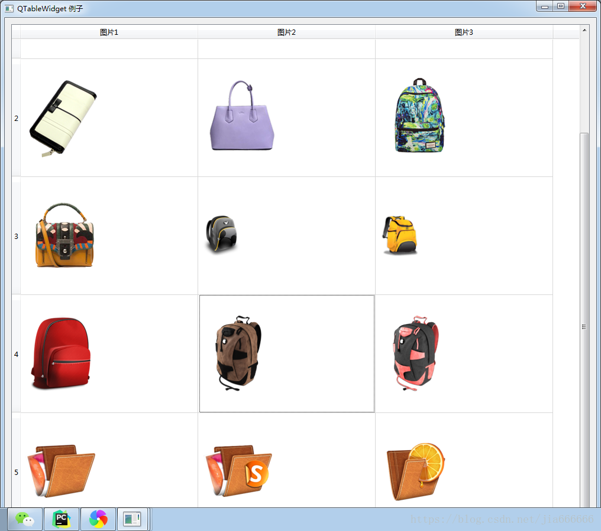

## QTableWidget
QTableWidget是Qt程序中常用的显示数据表格的控件，类似于c#中的DataGrid。QTableWidget是QTableView的子类，它使用标准的数据模型，并且其单元数据是通过QTableWidgetItem对象来实现的，使用QTableWidget时就需要QTableWidgetItem。用来表示表格中的一个单元格，整个表格就是用各个单元格构建起来的

QTableWidget是继承于QTableView，QTableWidget是QT程序中常用的显示数据表格的空间；它跟QTableView的主要区别是QTableView可以使用自定义的数据模型来显示内容(也就是先要通过setModel来绑定数据源)，而QTableWidget则只能使用标准的数据模型，并且其单元格数据是通过QTableWidgetItem的对象来实现的（也就是不需要数据源，将逐个单元格的信息填好即可。这主要是因为QTableView内的setModel成员函数在QTableWidget类中成了私有成员，所以QTableWidget只能依赖于QTableWidgetItem。QTableWidgetItem用来填充表格中的一个单元格，整个表格都需要逐个单元格逐个单元格地构建起来。

#### QTableWidget类中的常用方法
###### QTableWidget类中的常用方法
| 方法                                                             | 描述                                                                                     |
| ---------------------------------------------------------------- | ---------------------------------------------------------------------------------------- |
| setROwCount(int row)                                             | 设置QTableWidget表格控件的行数                                                           |
| setColumnCount(int col)                                          | 设置QTableWidget表格控件的列数                                                           |
| setHorizontalHeaderLabels()                                      | 设置QTableWidget表格控件的水平标签                                                       |
| setVerticalHeaderLabels()                                        | 设置QTableWidget表格控件的垂直标签                                                       |
| setItem(int ,int ,QTableWidgetItem)                              | 在QTableWidget表格控件的每个选项的单元控件内添加控件                                     |
| horizontalHeader()                                               | 获得QTableWidget表格控件的表格头，以便执行隐藏                                           |
| rowCount()                                                       | 获得QTableWidget表格控件的行数                                                           |
| columnCount()                                                    | 获得QTableWidget表格控件的列数                                                           |
| setEditTriggers(EditTriggers triggers)                           | 设置表格是否可以编辑，设置表格的枚举值                                                   |
| setSelectionBehavior                                             | 设置表格的选择行为                                                                       |
| setTextAlignment()                                               | 设置单元格内文本的对齐方式                                                               |
| setSpan(int row,int column,int rowSpanCount,int columnSpanCount) | 合并单元格，要改变单元格的第row行，column列，要合并rowSpancount行数和columnSpanCount列数 |
| setShowGrid()                                                    | 在默认情况下表格的显示是有网格的，可以设置True或False用于是否显示，默认True              |
| setColumnWidth(int column,int width)                             | 设置单元格行的宽度                                                                       |
| setRowHeight(int row,int height)                                 | 设置单元格列的高度                                                                       |

###### 编辑规则的枚举值类型
| 选项                                       | 值  | 描述                         |
| ------------------------------------------ | --- | ---------------------------- |
| QAbstractItemView.NoEditTriggers0No        | 0   | 不能对表格内容进行修改       |
| QAbstractItemView.CurrentChanged1Editing   | 1   | 任何时候都能对单元格进行修改 |
| QAbstractItemView.DoubleClicked2Editing    | 2   | 双击单元格                   |
| QAbstractItemView.SelectedClicked4Editing  | 4   | 单击已经选中的内容           |
| QAbstractItemView.EditKeyPressed8Editing   | 8   | 当修改键按下时修改单元格     |
| QAbstractItemView.AnyKeyPressed16Editing   | 16  | 按任意键修改单元格           |
| QAbstractItemView.AllEditTriggers31Editing | 31  | 包括以上所有条件             |

###### 表格选择行为的枚举值
| 选择                                      | 值  | 描述           |
| ----------------------------------------- | --- | -------------- |
| QAbstractItemView.SelectItems0Selecting   | 0   | 选中单个单元格 |
| QAbstractItemView.SelectRows1Selecting    | 1   | 选中一行       |
| QAbstractItemView.SelectColumns2Selecting | 2   | 选中一列       |

###### 单元格文本水平对齐方式
| 选项            | 描述                                 |
| --------------- | ------------------------------------ |
| Qt.AlignLeft    | 将单元格内的内容沿单元格的左边缘对齐 |
| Qt.AlignRight   | 将单元格内的内容沿单元格的右边缘对齐 |
| Qt.AlignHCenter | 在可用空间中，居中显示在水平方向上   |
| Qt.AlignJustify | 将文本在可用空间内对齐，默认从左到右 |

###### 单元格文本垂直对齐方式
| 选项             | 描述                               |
| ---------------- | ---------------------------------- |
| Qt.AlignTop      | 与顶部对齐                         |
| Qt.AlignBottom   | 与底部对齐                         |
| Qt.AlignVCenter  | 在可用空间中，居中显示在垂直方向上 |
| Qt.AlignBaseline | 与基线对齐                         |

#### 总体介绍
QTableWidget类使用默认模型提供基于项目的表格视图，如下图所示：


表格小部件为应用程序提供标准的表格显示。 QTableWidget中的项目由QTableWidgetItem提供。

如果你想要一个使用你自己的数据模型的表，你应该使用QTableView而不是这个类。

表格小部件可以用所需数量的行和列来构建：
```python
tableWidget = QTableWidget(12，3，self)
```

或者，可以在没有给定大小的情况下构建表并在稍后调整大小：
```python
tableWidget = QTableWidget(self)
tableWidget.setRowCount(3)
tableWidget.setColumnCount(2)
```

项目在表格外创建(没有父窗口小部件)，并使用setItem()插入到表格中，如下图：

```python
newItem = QTableWidgetItem("新单元格")
tableWidget.setItem(0, 0, newItem)
```

如果要在表格窗口小部件中启用排序，请在填充项目后再进行排序，否则排序可能会干扰插入顺序。

表可以给出水平和垂直标题。创建标题的最简单方法是向setHorizontalHeaderLabels()和setVerticalHeaderLabels()函数提供一个字符串列表。这些将为表的列和行提供简单的文本标题。也可以创建更复杂的标题。例如，我们可以构建一个带有图标和对齐文本的表项，并将其用作特定列的标题：
```python
cubesHeaderItem = QTableWidgetItem("Cubes"))
cubesHeaderItem.setIcon(QIcon(QPixmap("./Images/cubed.png")))
cubesHeaderItem.setTextAlignment(Qt.AlignVCenter)
```
表中的行数、列数可以通过rowCount()和columnCount()找到。

该表可以用clear()函数清除（含表头），clearContents()清除内容（不含表头）。

我们再来介绍一下QTableWidgetItem类。

QTableWidgetItem类提供了一个用于QTableWidget类的项目。

表项用于保存表格窗口小部件的信息。项目通常包含文本，图标或复选框。

顶级项目的构建没有父级，然后插入到由一对行号和列号指定的位置：
```python
newItem = QTableWidgetItem("新单元格")
tableWidget.setItem(0, 0, newItem)
```

每个项目都可以有自己的背景画笔，并使用setBackground()函数进行设置。当前的背景画笔可以通过background()找到。每个项目的文本标签可以使用自己的字体和画笔进行渲染。这些通过setFont()和setForeground()函数指定，并使用font()和foreground()读取。

默认情况下，项目是启用的，可编辑的，可选择的，可勾选的，并且既可以用作拖放操作的来源，也可以用作放置目标。每个项目的标志都可以通过setFlags()用适当的值调用来改变（参见Qt.ItemFlags）。使用setCheckState()函数可以勾选和取消选中可勾选的项目。相应的checkState()函数指示当前是否为可勾选项目。

**类归属**  
PyQt5->QtWidgets->QTableWidget

PyQt5->QtWidgets->QTableWidgetItem

**继承关系**  
PyQt5->QObject and QPaintDevice->QWidget->QFrame->QAbstractScrollArea->QAbstractItemView->QTableView->QTableWidget

更多详细的介绍，请参见官网：
[QTableWidget](https://doc.qt.io/qt-5/qtablewidget.html "QTableWidget")
[QTableWidgetItem](https://doc.qt.io/qt-5/qtablewidgetitem.html "QTableWidgetItem")

#### 实例
###### 实例：QTableWidget的基本用法
```python
import sys
from PyQt5.QtWidgets import *

class Table(QWidget):
    def __init__(self):
        super(Table, self).__init__()
        self.initUI()
    def initUI(self):
        self.setWindowTitle("QTableWidget例子")
        self.resize(400,300)
        layout=QHBoxLayout()

        #实现的效果是一样的，四行三列，所以要灵活运用函数，这里只是示范一下如何单独设置行列
        TableWidget=QTableWidget(4,3)

        # TableWidget = QTableWidget()
        # TableWidget.setRowCount(4)
        # TableWidget.setColumnCount(3)

        #设置水平方向的表头标签与垂直方向上的表头标签，注意必须在初始化行列之后进行，否则，没有效果
        TableWidget.setHorizontalHeaderLabels(['姓名','性别','体重（kg）'])
        #Todo 优化1 设置垂直方向的表头标签
        #TableWidget.setVerticalHeaderLabels(['行1', '行2', '行3', '行4'])

        #TODO 优化 2 设置水平方向表格为自适应的伸缩模式
        ##TableWidget.horizontalHeader().setSectionResizeMode(QHeaderView.Stretch)

        #TODO 优化3 将表格变为禁止编辑
        #TableWidget.setEditTriggers(QAbstractItemView.NoEditTriggers)

        #TODO 优化 4 设置表格整行选中
        #TableWidget.setSelectionBehavior(QAbstractItemView.SelectRows)

        #TODO 优化 5 将行与列的高度设置为所显示的内容的宽度高度匹配
        #QTableWidget.resizeColumnsToContents(TableWidget)
        #QTableWidget.resizeRowsToContents(TableWidget)

        #TODO 优化 6 表格头的显示与隐藏
        #TableWidget.verticalHeader().setVisible(False)
        #TableWidget.horizontalHeader().setVisible(False)

        #TOdo 优化7 在单元格内放置控件
        # comBox=QComboBox()
        # comBox.addItems(['男','女'])
        # comBox.addItem('未知')
        # comBox.setStyleSheet('QComboBox{margin:3px}')
        # TableWidget.setCellWidget(0,1,comBox)
        #
        # searchBtn=QPushButton('修改')
        # searchBtn.setDown(True)
        # searchBtn.setStyleSheet('QPushButton{margin:3px}')
        # TableWidget.setCellWidget(0,2,searchBtn)

        #添加数据
        newItem=QTableWidgetItem('张三')
        TableWidget.setItem(0,0,newItem)

        newItem=QTableWidgetItem('男')
        TableWidget.setItem(0,1,newItem)

        newItem=QTableWidgetItem('160')
        TableWidget.setItem(0,2,newItem)

        layout.addWidget(TableWidget)

        self.setLayout(layout)
if __name__ == '__main__':
    app=QApplication(sys.argv)
    win=Table()
    win.show()
    sys.exit(app.exec_())
```
初始运行程序，显示效果如下 


代码分析

构造一个QTableWidget对象，设置表格为4行3列
```python
TableWidget=QTableWidget(4,3)
```

设置表格头
```python
TableWidget.setHorizontalHeaderLabels(['姓名','性别','体重（kg）'])
```

生成一个QTableWidgetItem对象，并添加到表格的0行0列处
```python
newItem=QTableWidgetItem('张三')
TableWidget.setItem(0,0,newItem)
```

**优化1：设置垂直方向表格头标签**    
```python
TableWidget.setVerticalHeaderLabels(['行1', '行2', '行3', '行4'])
```


**优化2：设置表格头为伸缩模式**     
使用QTableWidget对象的horizontalHeader（）函数，设置表格为自适应的伸缩模式，即可根据窗口的大小来改变网格的大小
```python
TableWidget.horizontalHeader().setSectionResizeMode(QHeaderView.Stretch)
```


**优化3：将表格设置为禁止编辑**     
在默认情况下，表格中的字符是可以更改的，比如双击一个单元格，就可以修改原来的内容，如果想禁止这种操作，让表格对用户只是只读，则可以编辑一下代码
```python
TableWidget.setEditTriggers(QAbstractItemView.NoEditTriggers)
```


**优化4：表格整行选中**     
表格默认选择的是单个单元格，通过以下代码可以设置整行选中
```python
TableWidget.setSelectionBehavior(QAbstractItemView.SelectRows)
```


**优化5：将行与列的宽度高度与文本内容的宽高相匹配**     
```python
QTableWidget.resizeColumnsToContents(TableWidget)
QTableWidget.resizeRowsToContents(TableWidget)
```

**优化6：表格头的显示与隐藏**     
```python
TableWidget.verticalHeader().setVisible(False)
TableWidget.horizontalHeader().setVisible(False)
```


**优化7：在单元格内放置控件**     
QTableWidget不仅允许往单元格内放置文字，还允许放置控件，通过QTableWidget.setItem()来添加PyQt的基本控件 
这里把一个下拉列表框和一个按钮加入单元格中，设置控件与单元格的边距，如为3px像素，代码如下
```python
comBox=QComboBox()
comBox.addItems(['男','女'])
comBox.addItem('未知')
comBox.setStyleSheet('QComboBox{margin:3px}')
TableWidget.setCellWidget(0,1,comBox)

searchBtn=QPushButton('修改')
searchBtn.setDown(True)
searchBtn.setStyleSheet('QPushButton{margin:3px}')
TableWidget.setCellWidget(0,2,searchBtn)
```


#### 实例二：在表格中快速定位到指定行
```python
import sys
from PyQt5.QtWidgets import *
from PyQt5.QtGui import *
from PyQt5.QtCore import *

class Table(QWidget):
    def __init__(self):
        super(Table, self).__init__()
        self.initUI()
    def initUI(self):
        #设置标题与初始大小
        self.setWindowTitle('QTableWidget例子')
        self.resize(600,800)

        ##水平布局
        layout=QHBoxLayout()
        #实例化表格视图（30*4）
        tablewidget=QTableWidget(30,4)
        layout.addWidget(tablewidget)

        for i in range(30):
            for j in range(4):
                itemContent='(%d,%d)'%(i,j)
                #为每个表格内添加数据
                tablewidget.setItem(i,j,QTableWidgetItem(itemContent))

        self.setLayout(layout)

        #遍历表格查找对应项
        text='(10,1)'
        items=tablewidget.findItems(text,Qt.MatchExactly)
        item=items[0]
        #选中单元格
        item.setSelected(True)
        #设置单元格的背脊颜色为红
        item.setForeground(QBrush(QColor(255,0,0)))

        row=item.row()
        #通过鼠标滚轮定位，快速定位到第十一行
        tablewidget.verticalScrollBar().setSliderPosition(row)
if __name__ == '__main__':
    app=QApplication(sys.argv)
    table=Table()
    table.show()
    sys.exit(app.exec_())
```


#### 实例三：QTableWidget的高级用法
```python
import sys
from PyQt5.QtWidgets import (QWidget, QTableWidget, QHBoxLayout, QApplication, QTableWidgetItem)
from PyQt5.QtGui import QBrush, QColor, QFont
from PyQt5.QtCore import Qt

class Table(QWidget):
    def __init__(self):
        super().__init__()
        self.initUI()

    def initUI(self):
        #设置标题与初始大小
        self.setWindowTitle("QTableWidget 例子")
        self.resize(430, 230)

        #水平布局，初始表格为（4*3），添加到布局中
        conLayout = QHBoxLayout()
        tableWidget = QTableWidget(5,3)
        conLayout.addWidget(tableWidget)

        #设置水平头标签
        tableWidget.setHorizontalHeaderLabels(['姓名', '性别', '体重(kg)'])

        #创建新条目，设置背景颜色，添加到表格指定行列中
        newItem = QTableWidgetItem("张三")
        #newItem.setForeground(QBrush(QColor(255, 0, 0)))
        tableWidget.setItem(0, 0, newItem)

        # 创建新条目，设置背景颜色，添加到表格指定行列中
        newItem = QTableWidgetItem("男")
        #newItem.setForeground(QBrush(QColor(255, 0, 0)))
        tableWidget.setItem(0, 1, newItem)

        # 创建新条目，设置背景颜色，添加到表格指定行列中
        newItem = QTableWidgetItem("160")
        #newItem.setForeground(QBrush(QColor(255, 0, 0)))
        tableWidget.setItem(0, 2, newItem)

        # newItem = QTableWidgetItem("李四")
        # #将字体加粗，黑色字体
        # newItem.setFont(QFont('Times',12,QFont.Black))
        # tableWidget.setItem(1, 0, newItem)
        #
        # # 创建新条目，设置背景颜色，添加到表格指定行列中
        # newItem = QTableWidgetItem("男")
        # newItem.setFont(QFont('Times', 12, QFont.Black))
        # tableWidget.setItem(1, 1, newItem)
        #
        # # 创建新条目，设置背景颜色，添加到表格指定行列中
        # newItem = QTableWidgetItem("150")
        # newItem.setFont(QFont('Times', 12, QFont.Black))
        # tableWidget.setItem(1, 2, newItem)
        #
        # newItem = QTableWidgetItem("王五")
        # #将字体加粗，黑色字体
        # newItem.setFont(QFont('Times',12,QFont.Black))
        # tableWidget.setItem(2, 0, newItem)
        #
        # # 创建新条目，设置背景颜色，添加到表格指定行列中
        # newItem = QTableWidgetItem("女")
        # newItem.setFont(QFont('Times', 12, QFont.Black))
        # tableWidget.setItem(2, 1, newItem)
        #
        # # 创建新条目，设置背景颜色，添加到表格指定行列中
        # newItem = QTableWidgetItem("175")
        # newItem.setFont(QFont('Times', 12, QFont.Black))

        # 设置单元格文本的对齐方式
        #newItem.setTextAlignment(Qt.AlignRight|Qt.AlignBottom)
        #tableWidget.setItem(2, 2, newItem)


        #按照体重排序
        #Qt.DescendingOrder降序
        #Qt.AscEndingOrder升序
        #tableWidget.sortItems(2,Qt.DescendingOrder)

        #合并单元格
        #tableWidget.setSpan(2,0,4,1)

        #设置单元格的大小
        #将第一列的单元宽度设置为150
        #tableWidget.setColumnWidth(0,150)
        #将第一行的单元格高度的设置为120
        #tableWidget.setRowHeight(0,120)

        #表格中不显示分割线
        #tableWidget.setShowGrid(False)

        #隐藏垂直头标签
        #tableWidget.verticalHeader().setVisible(False)

        self.setLayout(conLayout)

if __name__ == '__main__':
    app = QApplication(sys.argv)
    example = Table()
    example.show()
    sys.exit(app.exec_())
```
初始运行，效果如下 


**优化1：设置单元格的文本颜色，将第一行中的三个文本颜色设置为红色**    
```python
newItem.setForeground(QBrush(QColor(255, 0, 0)))
```


**优化2：将字体加粗**    
```python
#设置字体类型，大小号，颜色
newItem.setFont(QFont('Times',12,QFont.Black))
```

 
**优化3：设置单元格的排序方式**    
```python
from PyQt5.QtCore import Qt
#按照体重排序
#Qt.DescendingOrder降序
#Qt.AscEndingOrder升序
tableWidget.sortItems(2,Qt.DescendingOrder)
```

 
**优化4：单元格的文本对齐方式**    
这里更改了王五体重的文本对齐方式为右下角处
```python
 # 设置单元格文本的对齐方式(右下)
        newItem.setTextAlignment(Qt.AlignRight|Qt.AlignBottom)
        tableWidget.setItem(2, 2, newItem)
```

 
**优化5：合并单元格**     
将表格中第一行第一列的单元格，更改为占据5行1列
```python
#合并单元格
tableWidget.setSpan(2,0,5,1)
```

 
**优化6：设置单元格的大小**     
这里将第一行宽度设置为150，高度设置为120
```python
#将第一列的单元宽度设置为150
tableWidget.setColumnWidth(0,150)
#将第一行的单元格高度的设置为120
tableWidget.setRowHeight(0,120)
```

 
**优化7：在表格中不显示分割线**     
QTableWidget类的setShowGrid（）函数是从QTableView类继承的，用来设置是否显示表格的分割线，默认显示分割线
```python
 #表格中不显示分割线
tableWidget.setShowGrid(False)
```


**优化8：为单元格添加图片**     
还可以在单元格内添加图片并显示图片描述信息，代码如下 
这里图片放置在王五体重的单元格内
```python
#添加图片
newItem = QTableWidgetItem(QIcon("./images/bao1.png"), "背包")
tableWidget.setItem(2, 2, newItem)
```


#### 实例四：单元格内图片的显示
```python
import sys
from PyQt5.QtWidgets import *
from PyQt5.QtGui import *
from PyQt5.QtCore  import *

class Table(QWidget):
    def __init__(self):
        super().__init__()
        self.initUI()

    def initUI(self):
        #设置标题与初始大小
        self.setWindowTitle("QTableWidget 例子")
        self.resize(1000 ,900);
        #设置布局，初始表格5*3
        conLayout = QHBoxLayout()
        table= QTableWidget(5,3)

        #设置表格水平头标签
        table.setHorizontalHeaderLabels(['图片1' ,'图片2' ,'图片3'])
        #设置不可编辑模式
        table.setEditTriggers( QAbstractItemView.NoEditTriggers)
        #设置图片的大小
        table.setIconSize(QSize(300 ,200))

        #设置所有行列宽高数值与图片大小相同
        for i in range(3):   # 让列宽和图片相同
            table.setColumnWidth(i , 300)
        for i in range(5):   # 让行高和图片相同
            table.setRowHeight(i , 200)

        for k in range(15):
            i = k/ 3
            j = k % 3

            #实例化表格窗口条目
            item = QTableWidgetItem()
            #用户点击表格时，图片被选中
            item.setFlags(Qt.ItemIsEnabled)
            #图片路径设置与图片加载
            icon = QIcon(r'.\images\bao%d.png' % k)
            item.setIcon(QIcon(icon))
            #输出当前进行的条目序号
            print('e/icons/%d.png i=%d  j=%d' % (k, i, j))
            #将条目加载到相应行列中
            table.setItem(i, j, item)

        conLayout.addWidget(table)
        self.setLayout(conLayout)

if __name__ == '__main__':
    app = QApplication(sys.argv)
    example = Table()
    example.show()
    sys.exit(app.exec_())
```


#### 实例五：支持右键菜单
```python
import sys
from PyQt5.QtWidgets import *
from PyQt5.QtCore import *
from PyQt5.QtGui import *

class Table(QWidget):
    def __init__(self):
        super(Table, self).__init__()
        self.initUI()

    def initUI(self):
        # 设置标题与初始大小
        self.setWindowTitle('QTableWidget demo')
        self.resize(500, 300)

        # 水平布局，初始表格5*3，添加到布局
        layout = QHBoxLayout()
        self.tableWidget = QTableWidget(5, 3)
        layout.addWidget(self.tableWidget)

        # 设置表格水平方向的头标签
        self.tableWidget.setHorizontalHeaderLabels([ '姓名', '性别', '体重' ])

        # 设置水平方向自动伸缩填满窗口
        self.tableWidget.horizontalHeader().setSectionResizeMode(QHeaderView.Stretch)

        # 添加数据到指定行列
        newItem = QTableWidgetItem("张三")
        self.tableWidget.setItem(0, 0, newItem)

        newItem = QTableWidgetItem("男")
        self.tableWidget.setItem(0, 1, newItem)

        newItem = QTableWidgetItem("160")
        self.tableWidget.setItem(0, 2, newItem)

        newItem = QTableWidgetItem("李四")
        self.tableWidget.setItem(1, 0, newItem)

        newItem = QTableWidgetItem("女")
        self.tableWidget.setItem(1, 1, newItem)

        newItem = QTableWidgetItem("120")
        self.tableWidget.setItem(1, 2, newItem)

        # 允许右键产生菜单
        self.tableWidget.setContextMenuPolicy(Qt.CustomContextMenu)
        # 将右键菜单绑定到槽函数generateMenu
        self.tableWidget.customContextMenuRequested.connect(self.generateMenu)

        self.setLayout(layout)

    def generateMenu(self, pos):
        # 计算有多少条数据，默认-1,
        row_num = -1
        for i in self.tableWidget.selectionModel().selection().indexes():
            row_num = i.row()

        # 表格中只有两条有效数据，所以只在前两行支持右键弹出菜单
        if row_num < 2:
            menu = QMenu()
            item1 = menu.addAction(u'选项一')
            item2 = menu.addAction(u'选项二')
            item3 = menu.addAction(u'选项三')
            action = menu.exec_(self.tableWidget.mapToGlobal(pos))
            # 显示选中行的数据文本
            if action == item1:
                print('你选了选项一，当前行文字内容是：', self.tableWidget.item(row_num, 0).text(),
                      self.tableWidget.item(row_num, 1).text(),
                      self.tableWidget.item(row_num, 2).text())
            if action == item2:
                print('你选了选项二，当前行文字内容是：', self.tableWidget.item(row_num, 0).text(),
                      self.tableWidget.item(row_num, 1).text(),
                      self.tableWidget.item(row_num, 2).text())
            if action == item3:
                print('你选了选项三，当前行文字内容是：', self.tableWidget.item(row_num, 0).text(),
                      self.tableWidget.item(row_num, 1).text(),
                      self.tableWidget.item(row_num, 2).text())

if __name__ == '__main__':
    app = QApplication(sys.argv)
    example = Table()
    example.show()
    sys.exit(app.exec_())
```
