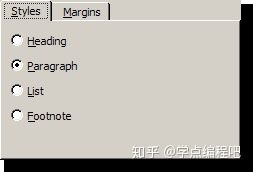
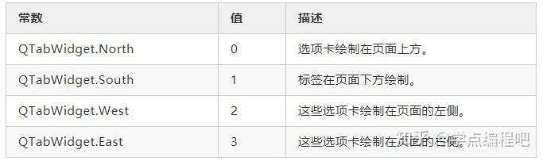
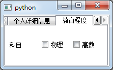
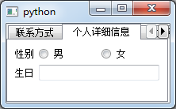
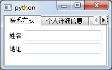

## QTabWidget
QTabWidget控件提供了一个选项卡和一个页面区域，默认显示第一个选项卡的页面，通过单击各选项卡可以查看对应的界面，如果在一个窗口中显示的输入字段很多，则可以对这些字段进行拆分，分别放置在不同界面的选项卡中

#### QTabWidget常用的方法
###### QTabWidget类中常用的方法
| 方法               | 描述                                                                                   |
| ------------------ | -------------------------------------------------------------------------------------- |
| addTab()           | 将一个控件添加到Tab控件的选项卡中                                                      |
| insertTab()        | 将一个Tab控件的选项卡插入到指定的位置                                                  |
| removeTab()        | 根据指定的索引删除Tab控件                                                              |
| setCurrentIndex()  | 设置当前可见的选项卡所在的索引                                                         |
| setCurrentWidget() | 设置当前可见的界面                                                                     |
| setTabBar()        | 设置选项卡栏的小控件                                                                   |
| setTabPosition()   | 设置选项卡的位置：QTabWidget.North，QTabWidget.South，QTabWidget.West，QTabWidget.East |
| setTabText()       | 定义Tab选项卡的显示值                                                                  |

###### QTabWidget类中的常用信号
| 信号           | 描述                     |
| -------------- | ------------------------ |
| currentChanged | 切换当前页面时发射该信号 |

#### 总体介绍
QTabWidget类提供了一堆标签式小部件。


选项卡小部件提供一个选项卡栏（请参阅QTabBar）和一个用于显示与每个选项卡相关的页面的“页面区域”。默认情况下，标签栏显示在页面区域上方，但有不同的配置可用（请参见TabPosition）。每个选项卡都与一个不同的小部件（称为页面）相关联。只有当前页面显示在页面区域中 ；所有其他页面都隐藏起来。用户可以通过单击其选项卡或按Alt +字母快捷键（如果有）来显示不同的页面。

使用QTabWidget的正常方法是执行以下操作：

1、创建一个QTabWidget。

2、为选项卡对话框中的每个页面创建一个QWidget，但不要为它们指定父窗口小部件。

3、将子窗口小部件插入到页面窗口小部件中，使用布局为其定位。

4、调用addTab()或insertTab()将页面小部件放入选项卡小部件，为每个选项卡提供一个带有可选键盘快捷键的合适标签。

选项卡的位置由tabPosition定义，它们的形状由tabShape定义。

信号currentChanged()是在用户选择页面时发出的。

当前页面索引可使用currentIndex()获得，当前页面小部件可使用currentWidget()获得。您可以使用widget()检索指向给定索引的页面小部件，并可以使用indexOf()来查找小部件的索引位置。使用setCurrentWidget()或setCurrentIndex()来显示特定的页面。

您可以使用setTabText()或setTabIcon()更改选项卡的文本和图标。可以使用removeTab()删除选项卡及其关联的页面。

每个选项卡可以在任何时间启用或禁用（请参阅setTabEnabled()）。如果启用选项卡，标签文本将正常绘制，用户可以选择该选项卡。如果它被禁用，则选项卡以不同的方式绘制，并且用户不能选择该选项卡。

选项卡小部件可以是分离复杂对话框的一种非常好的方法。另一种方法是使用QStackedWidget，为其提供一些页面之间的导航方式，例如QToolBar或QListWidget。

QTabWidget中的大部分功能都由QTabBar（位于顶部，提供选项卡）和QStackedWidget（大部分区域，组织各个页面）提供。

QTabWidget.TabPosition举例
定义了QTabWidget在哪里绘制标签行



QTabWidget.TabShape举例
定义了选项卡的形状：


**类归属**    
PyQt5->QtWidgets->QTabWidget

**继承关系**    
PyQt5->QObject and QPaintDevice->QWidget->QTabWidget

更多详细的介绍，请参见官网：
[QTabWidget Class​](https://doc.qt.io/qt-5/qtabwidget.html "QTabWidget Class​")
 
#### 实例
```python
QTabWidget的使用
import sys
from PyQt5.QtCore import *
from PyQt5.QtGui import *
from PyQt5.QtWidgets import *

class TabDemo(QTabWidget):
    def __init__(self,parent=None):
        super(TabDemo, self).__init__(parent)

        #创建3个选项卡小控件窗口
        self.tab1=QWidget()
        self.tab2=QWidget()
        self.tab3=QWidget()

        #将三个选项卡添加到顶层窗口中
        self.addTab(self.tab1, "Tab 1")
        self.addTab(self.tab2, "Tab 2")
        self.addTab(self.tab3, "Tab 3")

        #每个选项卡自定义的内容
        self.tab1UI()
        self.tab2UI()
        self.tab3UI()

    def tab1UI(self):
        #表单布局
        layout=QFormLayout()
        #添加姓名，地址的单行文本输入框
        layout.addRow('姓名',QLineEdit())
        layout.addRow('地址',QLineEdit())
        #设置选项卡的小标题与布局方式
        self.setTabText(0,'联系方式')
        self.tab1.setLayout(layout)

    def tab2UI(self):
        #zhu表单布局，次水平布局
        layout=QFormLayout()
        sex=QHBoxLayout()

        #水平布局添加单选按钮
        sex.addWidget(QRadioButton('男'))
        sex.addWidget(QRadioButton('女'))

        #表单布局添加控件
        layout.addRow(QLabel('性别'),sex)
        layout.addRow('生日',QLineEdit())

        #设置标题与布局
        self.setTabText(1,'个人详细信息')
        self.tab2.setLayout(layout)

    def tab3UI(self):
        #水平布局
        layout=QHBoxLayout()

        #添加控件到布局中
        layout.addWidget(QLabel('科目'))
        layout.addWidget(QCheckBox('物理'))
        layout.addWidget(QCheckBox('高数'))

        #设置小标题与布局方式
        self.setTabText(2,'教育程度')
        self.tab3.setLayout(layout)
if __name__ == '__main__':
    app=QApplication(sys.argv)
    demo=TabDemo()
    demo.show()
    sys.exit(app.exec_())
```
运行效果图如下 




在这个例子中，一个表单的内容分为3组，每一组小控件都显示在不同的选项卡中，顶层窗口是一个QTabWidget控件，将三个选项卡添加进去

使用表单布局管理器，每个选项卡显示子表单的内容
