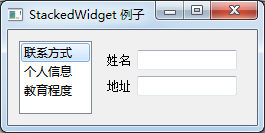
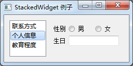
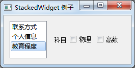

## QStackedWidget
QTackedWidget是一个堆栈窗口控件，可以填充一些小控件，但是同一时间只有一个小控件可以显示，QStackedWidget使用QStackedLayout布局。QSTackedWidget控件与QTabWidget类似，可以有效的显示窗口的控件

#### 总体介绍
QStackedWidget类提供了一堆小部件，其中一次只能看到一个小部件。

QStackedWidget可以用来创建一个类似于QTabWidget提供的用户界面。这是一个构建在QStackedLayout类之上的便利布局小部件。

像QStackedLayout一样，QStackedWidget可以被构建并填充一些子部件(“pages”)：
```python
firstPageWidget = QWidget()
secondPageWidget = QWidget()
thirdPageWidget = QWidget()
stackedWidget = QStackedWidget()
stackedWidget.addWidget(firstPageWidget)
stackedWidget.addWidget(secondPageWidget)
stackedWidget.addWidget(thirdPageWidget)
layout = QVBoxLayout()
layout.addWidget(stackedWidget)
self.setLayout(layout)
```

QStackedWidget不提供用户切换页面的内在手段。这通常是通过QComboBox或QListWidget完成的，例如：
```python
pageComboBox = QComboBox()
pageComboBox.addItem("Page 1")
pageComboBox.addItem("Page 2")
pageComboBox.addItem("Page 3")
pageComboBox.activated[int].connect(stackedWidget.setCurrentIndex)
```

在填充堆叠小部件时，小部件将添加到内部列表中。indexOf()函数返回该列表中的小部件的索引。这些小部件可以使用addWidget()函数添加到列表的末尾，也可以使用insertWidget()函数插入到给定的索引处。

removeWidget()函数从堆叠的小部件中移除一个小部件。使用count()函数可以获得堆叠窗口小部件中包含的窗口小部件的数量。

widget()函数返回给定索引位置的小部件。屏幕上显示的小部件的索引由currentIndex()给出，并且可以使用setCurrentIndex()更改。以类似的方式，当前显示的小部件可以使用currentWidget()函数进行检索，并使用setCurrentWidget()函数进行更改。

每当堆叠窗口小部件中的当前窗口小部件发生更改或从堆叠窗口小部件中移除窗口小部件时，将分别发出currentChanged()和widgetRemoved()信号。

**类归属**    
PyQt5->QtWidgets->QTabWidget

**继承关系**    
PyQt5->QObject and QPaintDevice->QWidget->QFrame->QStackedWidget

更多详细的介绍，请参见官网：
[QStackedWidget](https://doc.qt.io/qt-5/qstackedwidget.html "QStackedWidget")
 
#### 实例
QStackedWidget的基本使用
```python
import sys
from PyQt5.QtGui import *
from PyQt5.QtCore import *
from PyQt5.QtWidgets import *

class StackedExample(QWidget):
    def __init__(self):
        super(StackedExample, self).__init__()
        #设置窗口初始位置和大小
        self.setGeometry(300,50,10,10)
        self.setWindowTitle('StackedWidget 例子')

        #创建列表窗口，添加条目
        self.leftlist=QListWidget()
        self.leftlist.insertItem(0,'联系方式')
        self.leftlist.insertItem(1,'个人信息')
        self.leftlist.insertItem(2,'教育程度')

        #创建三个小控件
        self.stack1=QWidget()
        self.stack2=QWidget()
        self.stack3=QWidget()

        self.stack1UI()
        self.stack2UI()
        self.stack3UI()

        #在QStackedWidget对象中填充了三个子控件
        self.stack=QStackedWidget(self)

        self.stack.addWidget(self.stack1)
        self.stack.addWidget(self.stack2)
        self.stack.addWidget(self.stack3)

        #水平布局，添加部件到布局中
        HBox=QHBoxLayout()
        HBox.addWidget(self.leftlist)
        HBox.addWidget(self.stack)

        self.setLayout(HBox)

        self.leftlist.currentRowChanged.connect(self.display)
    def stack1UI(self):
        layout=QFormLayout()
        layout.addRow('姓名',QLineEdit())
        layout.addRow('地址',QLineEdit())
        self.stack1.setLayout(layout)

    def stack2UI(self):
        # zhu表单布局，次水平布局
        layout = QFormLayout()
        sex = QHBoxLayout()

        # 水平布局添加单选按钮
        sex.addWidget(QRadioButton('男'))
        sex.addWidget(QRadioButton('女'))

        # 表单布局添加控件
        layout.addRow(QLabel('性别'), sex)
        layout.addRow('生日', QLineEdit())

        self.stack2.setLayout(layout)

    def stack3UI(self):
        # 水平布局
        layout = QHBoxLayout()

        # 添加控件到布局中
        layout.addWidget(QLabel('科目'))
        layout.addWidget(QCheckBox('物理'))
        layout.addWidget(QCheckBox('高数'))

        self.stack3.setLayout(layout)
    def display(self,i):
        #设置当前可见的选项卡的索引
        self.stack.setCurrentIndex(i)
        
if __name__ == '__main__':
    app=QApplication(sys.argv)
    demo=StackedExample()
    demo.show()
    sys.exit(app.exec_())
```


