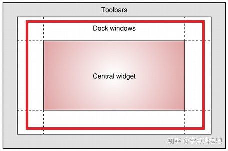
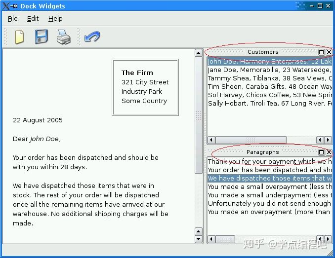
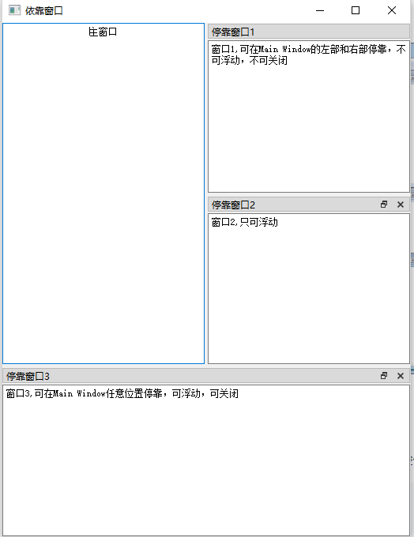

## QDockWidget
QDockWidget是一个可以停靠在QMainWindow内的窗口控件，它可以保持在浮动状态或者在指定位置作为子窗口附加到主窗口中，QMainWindow类的主窗口对象保留有一个用于停靠窗口的区域，这个区域在控件的中央周围

#### QDoCKWidget常用方法
###### QDoCKWidget类中的常用方法
| 方法               | 描述                                                                                                                                                                                                                                                             |
| ------------------ | ------------- |
| setWidget()        | 在Dock窗口区域设置QWidget           |
| setFloating()      | 设置Dock窗口是否可以浮动，如果设置为True，则表示可以浮动                 |
| setAlllowedAreas() | 设置窗口可以停靠的区域：LeftDockWidgetArea:左侧停靠区域，RightDockWidgetArea:右侧停靠区域，TopDockWidgetArea:顶部停靠区域，BottomDockWidgetArea:底部停靠区域，NoDockWidgetArea:不显示Widget                                                                      |
| setFearures()      | 设置停靠窗口的功能属性：DockWidgetClosable:可关闭，DockWidgetMovable：可移动，DockWidgetFloatable：可漂浮，DockWidgetVerticalTitleBar：在左边显示垂直的标签栏，AllDockWidgetFeatures:具有前三种属性的所有功能，NoDockWidgetFeatures:无法关闭，不能悬浮，不能移动 |

#### 总体介绍
QDockWidget类提供了一个可以停靠在QMainWindow中或作为桌面上的顶级窗口浮动的小部件。

QDockWidget提供了Dock小部件的概念，也称为工具调色板或实用程序窗口。停靠窗口是放置在QMainWindow中的中央窗口小部件周围的停靠窗口小部件区域中的次要窗口。


停靠窗口可以在其当前区域内移动（红线的地方），移动到新区域并且由最终用户确定是否浮动。 QDockWidget API允许程序员限制浮动窗口小部件移动，浮动和关闭的能力以及它们可以放置的区域。

**外观**    
QDockWidget由一个标题栏和内容区域组成。标题栏显示浮动窗口小部件窗口标题，浮动按钮和关闭按钮。根据QDockWidget的状态，float和close按钮可能被禁用或根本不显示。

标题栏和按钮的视觉外观取决于使用的样式。

QDockWidget充当它的子部件的包含，使用setWidget()进行设置。自定义尺寸提示，最小和最大尺寸和尺寸策略应该在子部件中实现。 QDockWidget会尊重他们，调整自己的约束以包含框架和标题。大小限制不应该在QDockWidget本身上设置，因为它们根据是否停靠而改变；停靠的QDockWidget没有框架和更小的标题栏。

下图画圈的地方就是典型的QDockWidget例子，是可以浮动、移动甚至关闭的。


**类归属**   
PyQt5->QtWidgets->QDockWidget

**继承关系**   
PyQt5->QObject and QPaintDevice->QWidget->QDockWidget

更多详细的介绍，请参见官网：
[QDockWidget](https://doc.qt.io/qt-5.11/qdockWidget.html "QDockWidget")

#### 实例
QDoCKWidget例子：
```python
from PyQt5.QtCore import *
from PyQt5.QtWidgets import *
import sys

class MainWidget(QMainWindow):
    def __init__(self, parent=None):
        super(MainWidget, self).__init__(parent)
        self.setWindowTitle(self.tr("依靠窗口"))

        te = QTextEdit("主窗口")
        te.setAlignment(Qt.AlignCenter)
        self.setCentralWidget(te)

        # 停靠窗口1
        dock1 = QDockWidget("停靠窗口1", self)
        dock1.setFeatures(QDockWidget.DockWidgetMovable)
        dock1.setAllowedAreas(Qt.LeftDockWidgetArea | Qt.RightDockWidgetArea)
        te1 = QTextEdit("窗口1,可在Main Window的左部和右部停靠，不可浮动，不可关闭")
        dock1.setWidget(te1)
        self.addDockWidget(Qt.RightDockWidgetArea, dock1)

        # 停靠窗口2
        dock2 = QDockWidget("停靠窗口2", self)
        dock2.setFeatures(QDockWidget.DockWidgetFloatable | QDockWidget.DockWidgetClosable)
        te2 = QTextEdit("窗口2,只可浮动")
        dock2.setWidget(te2)
        self.addDockWidget(Qt.RightDockWidgetArea, dock2)

        # 停靠窗口3
        dock3 = QDockWidget("停靠窗口3", self)
        dock3.setFeatures(QDockWidget.AllDockWidgetFeatures)
        te3 = QTextEdit("窗口3,可在Main Window任意位置停靠，可浮动，可关闭")
        dock3.setWidget(te3)
        self.addDockWidget(Qt.BottomDockWidgetArea, dock3)

app = QApplication(sys.argv)
main = MainWidget()
main.show()
app.exec_()
```

