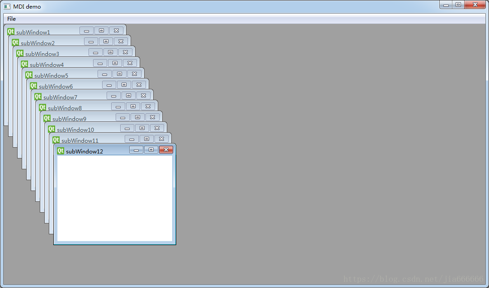
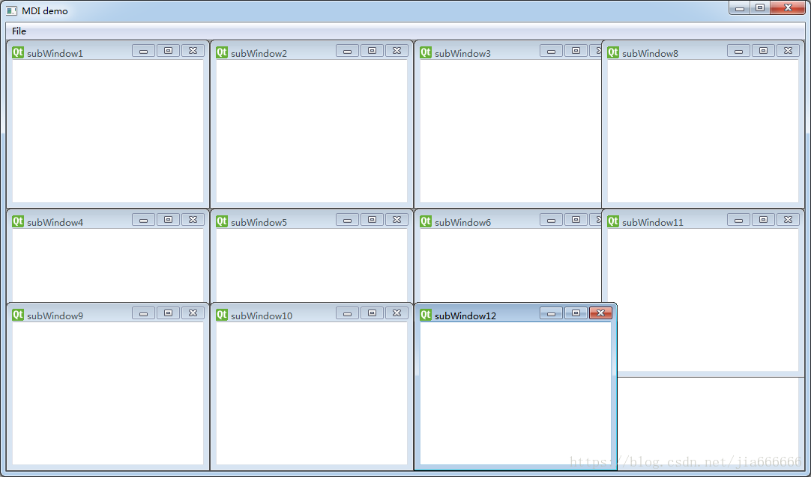
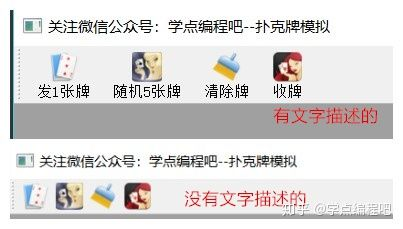
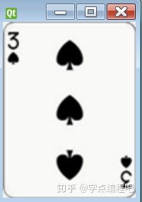

## QMidArea
一种同时显示多个窗口的方法是，创建多个独立的窗口，这些独立的窗口被称为SDI（Single Document Interface 单文档界面），每个窗口都有自己的菜单系统，工具栏等，这需要占用很多资源 

MDI（Multiple Document Interface 多文档界面）应用程序占用较少的内存资源，子窗口可以放在主窗口的容器中，这个容器控件被称为QMidArea 

QMidArea控件通常占据在QMainWindow对象的中央位置，子窗口在这个区域是QMdiSubWindow类的实例，可以设置任何QWidget作为子窗口对象的内部控件，子窗口在MDI区域进行级联排列布局

#### QMidArea类和QMdiSubWindow类中的常用方法
QMidArea类和QMdiSubWindow类中的常用方法
| 方法                   | 描述                                              |
| ---------------------- | ------------------------------------------------- |
| addSubWindow()         | 将一个小控件添加在MDI区域作为一个新的子窗口       |
| removeSubWindow()      | 删除一个子窗口的小控件                            |
| setActiveSubWindow()   | 激活一个子窗口                                    |
| cascadeSubWindows()    | 安排子窗口在MDI区域级联显示                       |
| tileSubWindows()       | 安装子窗口在MDI区域平铺显示                       |
| closeActiveSubWindow() | 关闭活动的子窗口                                  |
| subWindowList()        | 返回MDI区域的子窗口列表                           |
| setWidget()            | 设置一个小控件作为QMdiSubWindow实例对象的内部控件 |

#### 总体介绍
QMdiArea小部件提供了一个显示MDI窗口的区域（就像Windows在一个屏幕上维护多个应用程序窗口一样，MDI应用程序在一个显示区域内维护多个文件窗口）

QMdiArea功能基本上就像MDI窗口的窗口管理器一样。例如，它绘制它自己管理的窗口，并将它们安排在级联或平铺模式中。 QMdiArea通常用作QMainWindow中的中心小部件来创建MDI应用程序，但也可以放置在任何布局中。以下代码将一个区域添加到主窗口中：
```python
mainWindow = QMainWindow()
mainWindow.setCentralWidget(mdiArea)
```
QMdiArea中的子窗口是QMdiSubWindow的实例。通过addSubWindow()将它们添加到MDI区域。通常将QWidget作为内部窗口部件传递给此函数，但也可以直接传递QMdiSubWindow。该类继承QWidget，并且可以使用与正常顶层相同的API编程时窗口。

子窗口在获得键盘焦点或调用setFocus()时变为活动状态。用户通过以通常方式移动焦点来激活窗口。当活动窗口改变时，MDI区域发出subWindowActivated()信号，而activeSubWindow()函数返回活动子窗口。

函数subWindowList()返回所有子窗口的列表。例如，该信息可用于包含窗口列表的弹出式菜单中。

子窗口按当前WindowOrder排序。这用于subWindowList()和activateNextSubWindow()和activatePreviousSubWindow()。此外，它在使用cascadeSubWindows()和tileSubWindows()级联或平铺窗口时使用。

QMdiArea为子窗口提供了两种内置的布局策略：cascadeSubWindows()和tileSubWindows()。两者都是槽函数，可轻松连接到菜单条目。

**类归属**    
PyQt5->QtWidgets->QMdiArea

**继承关系**    
PyQt5->QObject and QPaintDevice->QWidget->QFrame->QAbstractScrollArea->QMdiArea

更多详细的介绍，请参见官网：
[QMdiArea](https://doc.qt.io/qt-5.11/QMdiArea.html "QMdiArea")

#### 实例
###### QMdiArea简单例子
```python
import sys
from PyQt5.QtWidgets import *
from PyQt5.QtCore import *
from PyQt5.QtGui import *

class MainWindow(QMainWindow):
    count=0
    def __init__(self,parent=None):
        super(MainWindow, self).__init__(parent)
        #实例化Qmidarea区域
        self.mdi=QMdiArea()
        #设置为中间控件
        self.setCentralWidget(self.mdi)

        #实例化菜单栏
        bar=self.menuBar()
        #添加主菜单
        file=bar.addMenu('File')
        #添加子菜单
        file.addAction('New')
        file.addAction('cascade')
        file.addAction('Tiled')

        #点击QAction绑定自定义的槽函数（传递有值【QAction】）
        file.triggered[QAction].connect(self.windowaction)
        #设置主窗口的标题
        self.setWindowTitle("MDI demo")
    def windowaction(self,q):
        print('Triggered')

        if q.text()=='New':
            #子窗口增加一个
            MainWindow.count=MainWindow.count+1

            #实例化多文档界面对象
            sub=QMdiSubWindow()
            #向sub内添加内部控件
            sub.setWidget(QTextEdit())
            #设置新建子窗口的标题
            sub.setWindowTitle('subWindow'+str(MainWindow.count))

            #将子窗口添加到Mdi区域
            self.mdi.addSubWindow(sub)

            #子窗口显示
            sub.show()
        if q.text()=='cascade':
            #cascadeSubWindows()：安排子窗口在Mdi区域级联显示
            self.mdi.cascadeSubWindows()
        if q.text()=='Tiled':
            #tileSubWindow():安排子窗口在Mdi区域平铺显示
            self.mdi.tileSubWindow()
if __name__ == '__main__':
    app=QApplication(sys.argv)
    demo=MainWindow()
    demo.show()
    sys.exit(app.exec_())
```
级联显示


平铺显示 


###### 模拟一下发放扑克牌

因为QMdiArea的主要作用是为了实现多窗口，因此我通过自定义QLabel类，让每个自定义QLabel对象，随机带上素材库中扑克牌。把每一个自定义的QLabel视为一个QWidget，这样通过QMdiArea的相关函数，就实现发牌，收牌和清空操作了。

代码：
```python
from PyQt5.QtWidgets import QApplication, QMainWindow, QLabel,QAction, QMdiArea, QMdiSubWindow
from PyQt5.QtGui import QIcon,QPixmap
from PyQt5.QtCore import Qt
import sys
import random

class Card(QLabel):
    def __init__(self, num = ""):
        super().__init__()
        if num == "":
            self.num = "2"
        else:
            self.num = num
        self.initui()

    def initui(self):
        path = "./res/pokercards/" + self.num + ".png"
        pixmap = QPixmap(path)
        self.setPixmap(pixmap)
        self.setScaledContents(True)

class Example(QMainWindow):
    def __init__(self):
        super().__init__()
        self.InitUI()

    def InitUI(self):
        self.setWindowTitle('扑克牌模拟')

        self.mid = QMdiArea()
        self.setCentralWidget(self.mid)

        sendOnecardAct = QAction(QIcon('./res/sendOnecard.ico'), '发1张牌', self)
        sendOnecardAct.triggered.connect(self.sendOnecard)

        sendFivecardsAct = QAction(QIcon('./res/sendFivecard.ico'), '随机5张牌', self)
        sendFivecardsAct.triggered.connect(self.sendFivecards)

        clearcardAct = QAction(QIcon('./res/clear.ico'), '清除牌', self)
        clearcardAct.triggered.connect(self.clearCards)

        foldcardAct = QAction(QIcon('./res/fold.ico'), '收牌', self)
        foldcardAct.triggered.connect(self.foldCards)

        toolbar = self.addToolBar('工具栏')
        toolbar.addAction(sendOnecardAct)
        toolbar.addAction(sendFivecardsAct)
        toolbar.addAction(clearcardAct)
        toolbar.addAction(foldcardAct)
        toolbar.setToolButtonStyle(Qt.ToolButtonTextUnderIcon)
    
    def sendOnecard(self):
        randomflag = self.randomsend(1)
        subcard = QMdiSubWindow()
        subcard.setWidget(Card(randomflag))
        self.mid.addSubWindow(subcard)
        subcard.setWindowFlags(Qt.WindowMinimizeButtonHint)
        subcard.show()
    
    def sendFivecards(self):
        randomflag = self.randomsend(5)
        for card in randomflag:
            subcard = QMdiSubWindow()
            subcard.setWidget(Card(card))
            self.mid.addSubWindow(subcard)
            subcard.setWindowFlags(Qt.WindowMinimizeButtonHint)
            subcard.show()
        
    def clearCards(self):
        self.mid.closeAllSubWindows()

    def foldCards(self):
        self.mid.cascadeSubWindows()
    
    def randomsend(self, num):
        cardlist = ["2", "3", "4", "5", "6", "7", "8", "9", "10", "a", "j", "joker", "k", "q"]
        if num == 1:
            return random.choice(cardlist)
        elif num == 5:
            return random.sample(cardlist, 5)

if __name__ == '__main__':
    app = QApplication(sys.argv)
    ex = Example()
    ex.show()
    sys.exit(app.exec_())
```
这里再说明一下，如果你希望在工具栏的按钮上面，出现相关文字，请加入以下代码：
```python
toolbar.setToolButtonStyle(Qt.ToolButtonTextUnderIcon)
```
否则是这样的：


```python
subcard = QMdiSubWindow()
subcard.setWidget(Card(randomflag))
self.mid.addSubWindow(subcard)
```
QMdiSubWindow类为QMdiArea提供了一个子窗口类。

QMdiSubWindow表示QMdiArea中的顶级窗口，包含带窗口装饰的标题栏，内部窗口小部件和（取决于当前样式）窗口框架和尺寸夹点。 QMdiSubWindow有它自己的布局，它由标题栏和内部小部件的中心区域组成。

构建QMdiSubWindow的最常用方法是使用内部小部件作为参数调用QMdiArea.addSubWindow()。 您也可以自己创建子窗口，并通过调用setWidget()来设置内部窗口小部件。

与使用常规顶级窗口一样使用子窗口进行编程时，您可以使用相同的API（例如，您可以调用诸如show()，hide()，showMaximized()和setWindowTitle()之类的函数。

在上述代码中，调用setWidget()将自定义的QLabel类Card作为内部窗口小部件，并通过addSubWindow()添加子窗口。

```python
subcard.setWindowFlags(Qt.WindowMinimizeButtonHint)
subcard.resize(150,200)
subcard.show()
```
一般情况下，子窗口样子是这样的，有最小化、最大化、关闭按钮。


因为显示的扑克牌，通过设置setWindowFlags(Qt.WindowMinimizeButtonHint)，让其只显示最小化按钮。
