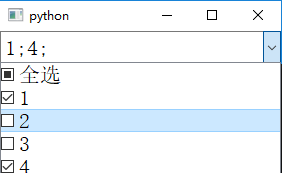
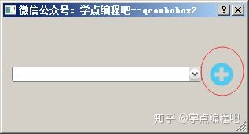

## QComboBox
QComboBox是一个集按钮和下拉选项于一体的控件，也称做下拉列表框

#### QComboBox常用方法
###### QComboBox类中的常用方法
| 方法                        | 描述                         |
| --------------------------- | ---------------------------- |
| addItem()                   | 添加一个下拉选项             |
| addItems()                  | 从列表中添加下拉选项         |
| Clear()                     | 删除下拉选项集合中的所有选项 |
| count()                     | 返回下拉选项集合中的数目     |
| currentText()               | 返回选中选项的文本           |
| itemText(i)                 | 获取索引为i的item的选项文本  |
| currentIndex()              | 返回选中项的索引             |
| setItemText(int index,text) | 改变序列号为index的文本      |

###### QComboBox类中的常用信号
| 信号                | 含义                                       |
| ------------------- | ------------------------------------------ |
| Activated           | 当用户选中一个下拉选项时发射该信号         |
| currentIndexChanged | 当下拉选项的索引发生改变时发射该信号       |
| highlighted         | 当选中一个已经选中的下拉选项时，发射该信号 |

#### 总体介绍
QComboBox小部件是一个组合的按钮和弹出列表。

QComboBox提供了一种向用户呈现选项列表的方式，其占用最小量的屏幕空间。

组合框是一个显示当前项目的选择小部件，可以弹出可选项目列表。组合框可以是可编辑的，允许用户修改列表中的每个项目。

组合框可以包含图像以及字符串； 当然insertItem()和setItemText()函数需要适当重载。对于可编辑组合框，提供了函数clearEditText()，以清除显示的字符串而不更改组合框的内容。

如果组合框的当前项目发生更改，则会发出两个信号currentIndexChanged()和activated()。无论以编程方式或通过用户交互完成更改，currentIndexChanged()总是被发射，而只有当更改是由用户交互引起时才activated() 。highlighted()信号在用户突出显示组合框弹出列表中的项目时发出。所有三个信号都有两个版本，一个带有str参数，另一个带有int参数。如果用户选择或突出显示一个图像，则只会发出int信号。每当可编辑组合框的文本发生改变时，editTextChanged()信号就会发出。

当用户在可编辑的组合框中输入一个新的字符串时，该小部件可能会插入它，也可能不会插入它，并且可以将它插入到多个位置。默认策略是InsertAtBottom，但您可以使用setInsertPolicy()更改它。

可以使用QValidator将输入约束为可编辑的组合框；请参阅setValidator()。默认情况下，接受任何输入。

例如，可以使用插入函数insertItem()和insertItems()来填充组合框。可以使用setItemText()更改项目。一个项目可以使用removeItem()来移除，所有项目都可以使用clear()来移除。当前项目的文本由currentText()返回，项目的文本编号使用text()返回。当前项目可以使用setCurrentIndex()来设置。 count()返回组合框中的项目数；可以用setMaxCount()设置项目的最大数量。您可以允许使用setEditable()进行编辑。对于可编辑组合框，您可以使用setCompleter()设置自动完成，并且用户是否可以添加重复项由setDuplicatesEnabled()进行设置。

QComboBox为其弹出列表使用模型/视图框架并存储其项目。默认情况下，QStandardItemModel存储项目，QListView子类显示弹出列表。您可以直接访问模型和视图（使用model()和view()），但QComboBox还提供了设置和获取项目数据的函数（例如，setItemData()和itemText()）。您还可以设置新的模型和视图（使用setModel()和setView()）。对于组合框标签中的文本和图标，将使用具有Qt.DisplayRole和Qt.DecorationRole的模型中的数据。请注意，您不能通过使用setSelectionMode()来更改view()的SelectionMode。

类归属
PyQt5->QtWidgets->QComboBox

继承关系
PyQt5->QObject and QPaintDevice->QWidget->QFontComboBox->QComboBox

更多详细的介绍，请参见官网：
[QComboBox Class](https://doc.qt.io/qt-5/qcombobox.html "QComboBox Class")
 
#### 实例
###### QComboBox基本使用例子

```python
from PyQt5.QtWidgets import QApplication, QComboBox, QWidget, QVBoxLayout, QHBoxLayout, QLabel
import sys

class ExComboBox(QWidget):
    def __init__(self):
        super().__init__()
        self.init_ui()

    def init_ui(self):
        self.resize(400, 100)
        self.setWindowTitle("下拉框")
        self.show()

        label1 = QLabel("你可以选择", self)
        combox = QComboBox(self)
        self.combox = combox
        self.label2 = QLabel("a", self)
        self.label3 = QLabel("b", self)

        hlayout1 = QHBoxLayout()
        hlayout1.addStretch(1)
        hlayout1.addWidget(label1)
        hlayout1.addStretch(1)
        hlayout1.addWidget(combox)
        hlayout1.addStretch(1)

        hlayout2 = QHBoxLayout()
        hlayout2.addStretch(1)
        hlayout2.addWidget(self.label2)
        hlayout2.addStretch(1)
        hlayout2.addWidget(self.label3)
        hlayout2.addStretch(1)

        vlayout = QVBoxLayout()
        vlayout.addLayout(hlayout1)
        vlayout.addLayout(hlayout2)

        self.setLayout(vlayout)

        infomation = ["我想静静", "我要开始学习了", "我要开始睡觉了", "我要开始装B了"]

        combox.addItems(infomation)

        combox.currentIndexChanged.connect(self.selectionchange)
        combox.activated[str].connect(self.activated)

    def activated(self, text):
        self.label3.setText(text)

    def selectionchange(self,index):
        print(index)
        self.label2.setText(self.combox.currentText())

        for count in range(self.combox.count()):
            print('Item' + str(count) + '=' + self.combox.itemText(count))

        print('current index', self.combox.currentIndex(),
              'selection changed', self.combox.currentText())

if __name__ == '__main__':
    app = QApplication(sys.argv)
    ex = ExComboBox()
    sys.exit(app.exec_())
```

###### QComboBox中插入 check box 实现多选功能
使用代理思想实现

```python
from PyQt5.QtWidgets import QApplication,QComboBox, QLineEdit, QListWidget, QCheckBox, QListWidgetItem
from PyQt5 import QtCore

class ComboCheckBox(QComboBox):
    def __init__(self, parent=None):
        super(ComboCheckBox, self).__init__(parent)
        self.fn_init_data(["全选","1","2","3","4"])
        self.fn_init_event()

    def fn_init_data(self, list_items, text="全选"):

        self.setGeometry(QtCore.QRect(930, 50, 281, 31))
        self.setStyleSheet("font: 16pt \"Agency FB\";")

        self.items = list_items
        self.row_num = len(self.items)
        self.selected_row_num = 0
        self.qCheckBox = []
        self.qLineEdit = QLineEdit()
        self.qLineEdit.setReadOnly(True)
        self.qListWidget = QListWidget()

        for i in range(0, self.row_num):
            self.addQCheckBox(i)
            self.qCheckBox[i].setChecked(True)

        self.list_selected_item = list_items[1:]

        self.setModel(self.qListWidget.model())
        self.setView(self.qListWidget)
        self.setLineEdit(self.qLineEdit)
        self.qLineEdit.setText(text)

    def fn_init_table(self):
        self.setGeometry(QtCore.QRect(930, 50, 281, 31))
        self.setStyleSheet("font: 16pt \"Agency FB\";")
        self.qLineEdit = QLineEdit()
        self.qLineEdit.setReadOnly(True)
        self.setLineEdit(self.qLineEdit)
        self.qLineEdit.setText("请选择")

    def fn_init_event(self):
        self.qCheckBox[0].stateChanged.connect(self.fn_check_all)
        for i in range(1, self.row_num):
            self.qCheckBox[i].stateChanged.connect(self.fn_check_multi_single)

    def addQCheckBox(self, i):
        self.qCheckBox.append(QCheckBox())
        qItem = QListWidgetItem(self.qListWidget)
        self.qCheckBox[i].setText(self.items[i])
        self.qListWidget.setItemWidget(qItem, self.qCheckBox[i])

    def fn_check_multi_single(self):
        show = ''
        Outputlist = []
        for i in range(1, self.row_num):
            if self.qCheckBox[i].isChecked() == True:
                Outputlist.append(self.qCheckBox[i].text())
        self.selected_row_num = len(Outputlist)
        self.list_selected_item = Outputlist
        #print(Outputlist)

        self.qLineEdit.setReadOnly(False)
        self.qLineEdit.clear()
        for i in Outputlist:
            show += i + ';'
        if self.selected_row_num == 0:
            self.qCheckBox[0].setCheckState(0)
            show = '请选择'
        elif self.selected_row_num == self.row_num - 1:
            self.qCheckBox[0].setCheckState(2)
            show = '全选'
        else:
            self.qCheckBox[0].setCheckState(1)
        self.qLineEdit.setText(show)
        self.qLineEdit.setReadOnly(True)

    def fn_check_all(self, status):
        if status == 2:         #全选
            for i in range(1, self.row_num):
                self.qCheckBox[i].setChecked(True)
        elif status == 1:       #不全选
            if self.selected_row_num == 0:
                self.qCheckBox[0].setCheckState(2)
        elif status == 0:       #全不选
            self.fn_clear()

    def fn_clear(self):
        for i in range(self.row_num):
            self.qCheckBox[i].setChecked(False)
if __name__ == '__main__':
    import sys
    app = QApplication(sys.argv)
    main = ComboCheckBox()
    main.show()
    app.exec_()
```
1. 初始化各控件

checkbox（用于勾选）
LineEdit（用于显示勾选内容）
ListWidget（用于存放 checkbox)

```python
    self.qCheckBox = []
    self.qLineEdit = QLineEdit()
    self.qLineEdit.setReadOnly(True)
    self.qListWidget = QListWidget()
```

2. 向 ListWidget 中循环插入 checkbox 并使之保持可选状态
```python
    for i in range(0, self.row_num):
        self.addQCheckBox(i)
        self.qCheckBox[i].setChecked(True)
def addQCheckBox(self, i):
    self.qCheckBox.append(QCheckBox())
    qItem = QListWidgetItem(self.qListWidget)
    self.qCheckBox[i].setText(self.items[i])
    self.qListWidget.setItemWidget(qItem, self.qCheckBox[i])
```
3. 绑定事件
如果勾选/取消勾选 checkbox，即 checkbox 状态发生改变，则返回所有的勾选内容列表。
```python
    for i in range(1, self.row_num):
            self.qCheckBox[i].stateChanged.connect(self.fn_check_multi_single)
```

#### 像QQ一样选择好友（QComboBox的使用）
效果如下：


原来下拉框还可以这样玩啊！嗯，就是这么吊！

好，我们先来看下具体的实现思路！

###### 实现思路
**新的概念**    
在上面的总体介绍中我们知道了：“QComboBox为其弹出列表使用模型/视图框架并存储其项目。默认情况下，QStandardItemModel存储项目，QListView子类显示弹出列表。您可以直接访问模型和视图（使用model()和view()），但QComboBox还提供了设置和获取项目数据的函数（例如，setItemData()和itemText()）。您还可以设置新的模型和视图（使用setModel()和setView()）”。

也就是说，使用模型和视图（model()和view()）可以较为方便的自定义下拉框。

这个貌似理解起来还是有点难啊！

我们再增加一个概念吧！程序设计当中有一个设计模式叫做MVC（Model-View-Controller）设计模式，即模型-视图-控制。这是一种非常典型的设计模式，用一种业务逻辑、数据、界面显示分离的方法组织代码，将业务逻辑聚集到一个部件里面，在改进和个性化定制界面及用户交互的同时，不需要重新编写业务逻辑。

* Model（模型）是应用程序中用于处理应用程序数据逻辑的部分。通常模型对象负责在数据库中存取数据。  
* View（视图）是应用程序中处理数据显示的部分。通常视图是依据模型数据创建的。  
* Controller（控制器）是应用程序中处理用户交互的部分。通常控制器负责从视图读取数据，控制用户输入，并向模型发送数据。
部分来源：百度百科  

在PyQt中将视图与控制结合在一起，同时添加了代理delegate能够自定义数据条目item的显示与编辑方式。这仍然将数据存储的方式与呈现给用户的方式分开，但是基于相同的原则提供了更简单的框架。

这种分离使得可以在几个不同的视图中显示相同的数据，并实现新类型的视图，而无需更改基础数据结构。 为了灵活处理用户输入，我们引入了delegate（代理或者叫委托，下面统一称为委托）的概念。

在这个框架中拥有一个委托的好处是，它允许对数据项目的呈现和编辑进行自定义。整体体系结构如下：


该模型与数据源通信，为架构中的其他组件提供接口。 通信的性质取决于数据源的类型以及模型的实施方式。

该视图从模型中获得模型索引；这些是对数据项的引用。 通过向模型提供模型索引，视图可以从数据源中检索数据项。

在标准视图中，委托呈现数据项。 编辑项目时，委托使用模型索引直接与模型进行通信。

所以，我们在本次的设计中，我们使用setItemDelegate()函数为QCombobox弹出列表视图设置项目委托，设置属于我们自己的个性化下拉框列表。具体思路如下：

* **1、新建一个QListWidget对象。QListWidget设置为QComboBox的View，QListWidget的Model设置为QComboBox的Model。**

* **2、自定义View类中的Item。继承QWidget，形成一个子类，这个子类就是我们希望出现的下拉框列表中的一项。**

具体的实现，我们等会来看下代码。

其它
我们在了解了下拉框的实现方式之后，我们还用Qt设计师设计了一个新增用户的对话框（这个比较简单），以及当我们点击下拉框列表中×的时候，我们可以将其从中予以删除。这个我们是通过事件过滤器来实现的，这个知识点我们之前也介绍过的。

###### 核心代码讲解
**QCombobox部分**
```python
class ChooseUser(QDialog, Ui_Dialog):
    storage_qq = []
    def __init__(self, parent=None):
        super(ChooseUser, self).__init__(parent)
        self.setupUi(self)
        self.setmode()
    
    def setmode(self):
        with codecs.open("../res/qcombobox.qss", "r", "utf-8") as f:
            styleSheet = f.readlines()
        style = '\r\n'.join(styleSheet)
        self.comboBox.setStyleSheet(style)
        self.listw = QListWidget()
        self.comboBox.setModel(self.listw.model())
        self.comboBox.setView(self.listw)
    
    @pyqtSlot()
    def on_toolButton_clicked(self):
        user = DialogAddUser()
        r = user.exec_()
        if r > 0:
            qq, username, user_icon = user.get_userinfo()
            item =  ComboBoxItem(qq, username, user_icon)
            item.itemOpSignal.connect(self.itemOp)
            self.storage_qq.append(qq)
            self.listwitem = QListWidgetItem(self.listw)
            self.listw.setItemWidget(self.listwitem, item)
    
    def itemOp(self, qq):
        indexqq = self.storage_qq.index(qq)
        self.listw.takeItem(indexqq)
        del self.storage_qq[indexqq]
        
    @pyqtSlot(int)
    def on_comboBox_activated(self, p0):
        qq = self.storage_qq[p0]
        self.comboBox.setEditText(qq)
```
这个代码一看就是eric6生成的对话框代码，我们主要来看看具体的实现部分，其它部分大家可以自己下载源码查看。
```python
storage_qq = []
```
这个列表我们是存储每个联系人QQ号的。

```python
def setmode(self):
    with codecs.open("../res/qcombobox.qss", "r", "utf-8") as f:
        styleSheet = f.readlines()
    style = '\r\n'.join(styleSheet)
    self.comboBox.setStyleSheet(style)
    self.listw = QListWidget()
    self.comboBox.setModel(self.listw.model())
    self.comboBox.setView(self.listw)
```
这个表明我们首先要导入样式，给下拉框设置一些好看的样式，如鼠标移动的时候变蓝色、QQ号和姓名变成白色，这些都是通过样式来实现的。

其中有个样式要注意下：
```python
QComboBox QAbstractItemView::item{
    min-height: 60px;
    min-width: 60px;
    outline:0px;
}
```
这个是用来设置下拉框项目大小的，没有这个样式可能就是这样的，如下图：

很丑，是不是！

```python
self.listw = QListWidget()
self.comboBox.setModel(self.listw.model())
self.comboBox.setView(self.listw)
```
这个就是我们上面说的：QListWidget设置为QComboBox的View，QListWidget的Model设置为QComboBox的Model

```python
@pyqtSlot()
def on_toolButton_clicked(self):
    user = DialogAddUser()
    r = user.exec_()
    if r > 0:
        qq, username, user_icon = user.get_userinfo()
        item =  ComboBoxItem(qq, username, user_icon)
        item.itemOpSignal.connect(self.itemOp)
        self.storage_qq.append(qq)
        self.listwitem = QListWidgetItem(self.listw)
        self.listw.setItemWidget(self.listwitem, item)
```
这个函数是我们点击增加好友时响应的操作，如下图：


```python
user = DialogAddUser()
```
DialogAddUser()是我们自定义的对话框，用于添加一些好友属性：姓名、图标。如下图：


这个对话框的代码很简单，这里不做讲解了，和之前QQ模拟、TIM模拟的差不多。
```python
r = user.exec_()
if r > 0:
    qq, username, user_icon = user.get_userinfo()
    item =  ComboBoxItem(qq, username, user_icon)
    item.itemOpSignal.connect(self.itemOp)
    self.storage_qq.append(qq)
    self.listwitem = QListWidgetItem(self.listw)
    self.listw.setItemWidget(self.listwitem, item)
```
* 当我们点击了对话框联系人的时候，我们从对话框中得到QQ号、姓名、图标，分别存入qq, username, user_icon三个变量中。  
* 然后我们创建一个ComboBoxItem对象，这个ComboBoxItem类是我们自定义的，也就是上面说的自定义View类中的Item（具体代码我们等会再说）。  
* 当ComboBoxItem对象发出itemOpSignal信号的时候，我们将其连接到槽函数itemOp()上，itemOpSignal信号也是我们自定义的（具体代码我们等会再说）。  
* 我们把得到的QQ号存储在storage_qq列表中。  

```python
self.listwitem = QListWidgetItem(self.listw)
```
用给定的父项(self.listw)构造指定类型的空列表项目。

```python
self.listw.setItemWidget(self.listwitem, item)
```
将小部件设置为在给定项目中显示。也就是将我们自定义的Item显示在self.listwitem中。这样就能看到我们自己设定的好友信息啦！

```python
@pyqtSlot(int)
def on_comboBox_activated(self, p0):
    qq = self.storage_qq[p0]
    self.comboBox.setEditText(qq)
```
当我们选择好友的时候，我们在下拉框的文本框中显示该该好友的QQ号。

**ComboBoxItem部分**
是时候来看看我们自定义下拉框列表中的项目Item了。
```python
class ComboBoxItem(QWidget):
    itemOpSignal = pyqtSignal(str)
    def __init__(self, qq, username, user_icon):
        super().__init__()
        self.username = username
        self.qq = qq
        self.user_icon = user_icon
        self. initUi()
    
    def initUi(self):
        lb_username = QLabel(self.username, self)
        lb_qq = QLabel(self.qq, self)
        lb_icon = QLabel(self)
        lb_icon.setPixmap(QPixmap(self.user_icon))
        self.bt_close = QToolButton(self)
        self.bt_close.setIcon(QIcon("../res/close.png"))
        self.bt_close.setAutoRaise(True)
        #布局内容省略
        self.bt_close.installEventFilter(self)
        self.installEventFilter(self)
        
    def eventFilter(self, object, event):
        if object is self:
            if event.type() == QEvent.Enter:
                self.setStyleSheet("QWidget{color:white}")
            elif event.type() == QEvent.Leave:
                self.setStyleSheet("QWidget{color:black}")
        elif object is self.bt_close:
            if event.type() == QEvent.MouseButtonPress:
                self.itemOpSignal.emit(self.qq)
        return QWidget.eventFilter(self, object, event)
```
其实这类主要知识点就是在自定义信号和事件过滤器。

```python
itemOpSignal = pyqtSignal(str)
```
PyQt5自动为所有Qt的内置信号定义信号。可以使用pyqtSignal()工厂将新信号定义为类属性。事实上，采用这种方式可以很方便的为我们通过信号传递参数。

```python
self.bt_close.installEventFilter(self)
 self.installEventFilter(self)
def eventFilter(self, object, event):
 if object is self:
     if event.type() == QEvent.Enter:
         self.setStyleSheet("QWidget{color:white}")
     elif event.type() == QEvent.Leave:
         self.setStyleSheet("QWidget{color:black}")
 elif object is self.bt_close:
     if event.type() == QEvent.MouseButtonPress:  
         self.itemOpSignal.emit(self.qq)
 return QWidget.eventFilter(self, object, event)
```
为bt_close按钮和ComboBoxItem自身安装事件过滤器。当我们鼠标移入下拉框列表项目中的时候，字体变成白色；鼠标移走的时候，字体变成黑色。

而点击bt_close按钮的时候，发射itemOpSignal信号，这会带上QQ号的哦。


现在我们再看下itemOpSignal信号连接到的槽函数。
```python
def itemOp(self, qq):
 indexqq = self.storage_qq.index(qq)
 self.listw.takeItem(indexqq)
 del self.storage_qq[indexqq]
```
我们根据得到的QQ号得到相应的索引，然后根据索引删除self.listw的项目以及storage_qq列表中存储的数据完成最后的删除操作。

**总结**  
今天我们学习了以下几个知识点：

QComboBox小部件
delegate（代理或者叫委托）的概念
复习了事件过滤器这个知识点
