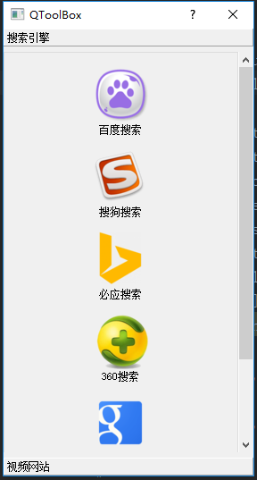

## QToolBox
#### 总体介绍
QToolBox类提供了一列选项卡的小部件（选项卡内含项目）。

工具箱是一个小部件，它将选项卡一个一个的显示，当前项目显示在当前选项卡下方。每个选项卡在选项卡列中都有一个索引位置。一个选项卡的项目是一个QWidget。

每个项目都有一个itemText()，一个可选的itemIcon()，一个可选的itemToolTip()和一个widget()。项目的属性可以通过setItemText()，setItemIcon()和setItemToolTip()来改变。每个项目都可以使用setItemEnabled()单独启用或禁用。

项目使用addItem()添加，或使用insertItem()插入特定位置。项目总数由count()给出。可以删除项目，或使用removeItem()从工具箱中删除项目。通过组合removeItem()和insertItem()，您可以将项目移动到不同的位置。

当前项目小部件的索引由currentIndex()返回，并用setCurrentIndex()设置。可以使用indexOf()来找到特定项目的索引，并且item()返回给定索引处的项目。

currentChanged()信号在当前项目改变时发出。

**类的归属**    
PyQt5->QtWidgets->QToolBox

继承：
QFrame

#### 实例
###### QToolBox例子
效果：

代码：
```python
from PyQt5.QtWidgets import QToolBox, QApplication, QToolButton, QGroupBox, QVBoxLayout
from PyQt5.QtCore import Qt, QSize
from PyQt5.QtGui import QIcon
import sys, webbrowser

class Example(QToolBox):
    def __init__(self):
        super().__init__()
        self.initUI()

    def initUI(self):
        self.resize(280,500)
        self.setWindowTitle('QToolBox')
        self.setWindowFlags(Qt.Dialog)

        favorites =[
                        [
                            {'des':'百度搜索', 'pic':'image/se/baidu.ico'},
                            {'des':'搜狗搜索', 'pic':'image/se/sougo.ico'},
                            {'des':'必应搜索', 'pic':'image/se/bing.ico'},
                            {'des':'360搜索', 'pic':'image/se/360.ico'},
                            {'des':'谷歌搜索', 'pic':'image/se/google.ico'},
                            {'des':'雅虎搜索', 'pic':'image/se/yahoo.ico'}
                        ],
                        [
                            {'des':'腾讯视频', 'pic':'image/v/tengxun.ico'},
                            {'des':'搜狐视频', 'pic':'image/v/sohuvideo.ico'},
                            {'des':'优酷视频', 'pic':'image/v/youku.ico'},
                            {'des':'土豆视频', 'pic':'image/v/tudou.ico'},
                            {'des':'AcFun弹幕', 'pic':'image/v/acfun.ico'},
                            {'des':'哔哩哔哩', 'pic':'image/v/bilibili.ico'}
                        ]
        ]

        for item in favorites:
            groupbox = QGroupBox()
            vlayout = QVBoxLayout(groupbox)
            vlayout.setAlignment(Qt.AlignCenter)
            for category in item:
                toolButton = QToolButton()
                toolButton.setText(category['des'])
                toolButton.setIcon(QIcon(category['pic']))
                toolButton.setIconSize(QSize(64, 64))
                toolButton.setAutoRaise(True)
                toolButton.setToolButtonStyle(Qt.ToolButtonTextUnderIcon)
                vlayout.addWidget(toolButton)
                name = category['des']  
                toolButton.clicked.connect(self.run)
            if name == '雅虎搜索':
                self.addItem(groupbox,'搜索引擎')
            else:
                self.addItem(groupbox,'视频网站')

        self.show()
    
    def run(self):
        if self.sender().text() == '百度搜索':
            webbrowser.open('https://www.baidu.com')
        elif self.sender().text() == '搜狗搜索':
            webbrowser.open('https://www.sogou.com/')
        elif self.sender().text() == '必应搜索':
            webbrowser.open('http://cn.bing.com/')
        elif self.sender().text() == '360搜索':
            webbrowser.open('https://www.so.com/')
        elif self.sender().text() == '谷歌搜索':
            webbrowser.open('https://www.google.com/')
        elif self.sender().text() == '雅虎搜索':
            webbrowser.open('https://www.yahoo.com/')
        elif self.sender().text() == '腾讯视频':
            webbrowser.open('https://v.qq.com/')
        elif self.sender().text() == '搜狐视频':
            webbrowser.open('https://film.sohu.com')
        elif self.sender().text() == '优酷视频':
            webbrowser.open('http://www.youku.com/')
        elif self.sender().text() == '土豆视频':
            webbrowser.open('http://www.tudou.com/')
        elif self.sender().text() == 'AcFun弹幕':
            webbrowser.open('http://www.acfun.cn/')
        elif self.sender().text() == '哔哩哔哩':
            webbrowser.open('https://www.bilibili.com/')

if __name__ == '__main__':
    app = QApplication(sys.argv)
    ex = Example()
    sys.exit(app.exec_())
```
在这个例子当中我们实现了以下的功能：  
* 将按钮分类搜索和视频两类，并分别集合到不同选项卡中。  
* 点击按钮会打开对应的网址  

```python
for item in favorites:
```
将favorites列表中的item进行遍历，每个item代表一个众多按钮的集合，也就是QToolBox的选项卡。

```python
groupbox = QGroupBox()
vlayout = QVBoxLayout(groupbox)
vlayout.setAlignment(Qt.AlignCenter)
```
我们新建一个组合框，并对其进行垂直布局，布局方式为居中。

QGroupBox小部件提供了一个带有标题的组合框。一个组合框提供了一个框架，顶部的标题，一个键盘快捷键，并显示其内部的各种其他小部件（这点就是我们用到的）。

```python
for category in item:
    toolButton = QToolButton()
    toolButton.setText(category['des'])
    toolButton.setIcon(QIcon(category['pic']))
    toolButton.setIconSize(QSize(64, 64))
    toolButton.setAutoRaise(True)
    toolButton.setToolButtonStyle(Qt.ToolButtonTextUnderIcon)
    vlayout.addWidget(toolButton)
```
这里我们对每个按钮集合中项目进行遍历。新建QToolBox对象，并设置其相应的属性：显示的名称（是“优酷”还是“哔哩哔哩”）、图标及大小、按钮是否自动浮起、让按钮显示的名称在按钮下方，同时将这个按钮增加到垂直布局当中。

```python
name = category['des']
if name == '雅虎搜索':
    self.addItem(groupbox,'搜索引擎')
else:
    self.addItem(groupbox,'视频网站')
```
当我们遍历完一个按钮集合的时候，此时我们判断最后一个按钮显示的文字是“搜索引擎”还是“视频网站”，并将这一系列的按钮增加到一个选项卡中。

```python
toolButton.clicked.connect(self.run)
def run(self):
    if self.sender().text() == '百度搜索':
        webbrowser.open('https://www.baidu.com')
    elif self.sender().text() == '搜狗搜索':
        webbrowser.open('https://www.sogou.com/')
    #...下面的代码和上面差不多，不在描述
```
这个就是一个常规的信号与槽函数的调用，当我们点击按钮的时候会打开相应的网站。
