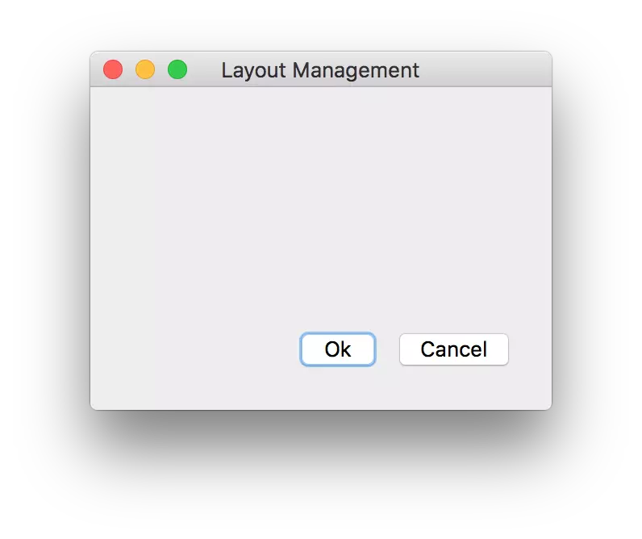

#### addStrtch的作用

这里会用到两个基本的布局类，QVBoxLayout和QHBoxLayout，V代表Vertical，H代表Horizontal，分别控制竖向和横向的布局。

```python
import sys
from PyQt5.QtWidgets import QApplication, QWidget, QPushButton, QHBoxLayout, QVBoxLayout

class Exp(QWidget):

    def __init__(self):
        super().__init__()

        self.initUI()

    def initUI(self):

        okbutton = QPushButton('Ok')
        cancelbutton = QPushButton('Cancel')

        hbox = QHBoxLayout()
        hbox.addStretch()
        hbox.addWidget(okbutton)
        hbox.addWidget(cancelbutton)

        vbox = QVBoxLayout()
        vbox.addStretch()
        vbox.addLayout(hbox)

        self.setLayout(vbox)

        self.setGeometry(300, 300, 300, 200)
        self.setWindowTitle('Layout Management')
        self.show()

if __name__ == '__main__':
    app = QApplication(sys.argv)
    ex = Exp()
    sys.exit(app.exec_())
```
通过以上的代码，我们将两个按钮放置在了窗口的右下角，即使我们调整窗口的大小，他们相对于窗口的位置还是右下角，这相对于设置绝对位置而言更具优势和灵活性。

```python
hbox = QHBoxLayout()
hbox.addStretch()
hbox.addWidget(okbutton)
hbox.addWidget(cancelbutton)
```
以上的代码，我们先创建了一个水平布局，然后把okbutton,cancelbutton放置在这个布局里面，这里还添加了一个addStrtch()，它的作用是在布局中添加空白，并把非空白内容顶到布局的尾部（对于QHBoxLayout()而言是右边，对于QVBoxLayout()而言是底部），这也是按钮始终能够在窗口右下角的原因。

```python
vbox = QVBoxLayout()
vbox.addStretch()
vbox.addLayout(hbox)
```
这里创建了一个竖向的布局，把之前创建的水平向布局作为竖向布局的一个部件（在这里也是唯一的部件）添加进来，同样用到了addStretch()。

```python
self.setLayout(vbox)
```
我们之前创建了两个布局，但这两个布局不是平等的，而是包含关系，水平布局只是竖向布局的一个部件，所以竖向布局是这个界面的总布局，我们通过setLayout(bbox)来应用竖向布局。

#### setStretch的作用
函数QHBoxLayout::setStretch(int index, int stretch)，可以将水平布局添加的控件按照比例进行伸缩。比如在QHBoxLayout水平布局上添加了两个控件，当写如下语句时，
```
    //初始化
    QHBoxLayout *m_VBoxLayout = new QHBoxLayout(this);
    QTreeView *m_TreeView = new QTreeView;
    QTableView *m_TableView = new QTableView;
    
    //添加控件
    m_VBoxLayout->addWidget(m_TreeView);        
    m_VBoxLayout->addWidget(m_TableView);
    
     //设置拉伸比例
    m_VBoxLayout->setStretch(0,1);             
    m_VBoxLayout->setStretch(1,4);
```
表明该垂直布局添加的两个控件索引0和索引1，分别按照1:4比例进行伸缩！

总结：该函数同样适用于垂直布局管理器，用法跟水平布局管理器一样。

PS:  
现在相对一个horizontalLayout中的两个QTextEdit控件按2:3的比例扩大，找了很多资料没有找到哪个参数可以配置，后来去一个国外的网站去找，终于找到了配置方法。

具体方法：

把horizontalLayout中的layoutstretch属性设置为2,3即可，layoutstretch属性的意思是horizontalLayout里面的两个控件按2：3的宽度显示。

同理如果horizontalLayout里面放了三个控件，layoutstretch里面的初始值为0,0,0，意思是三个控件的比例是1：1：1。

其他控件中的layoutstretch也是这个意思。

