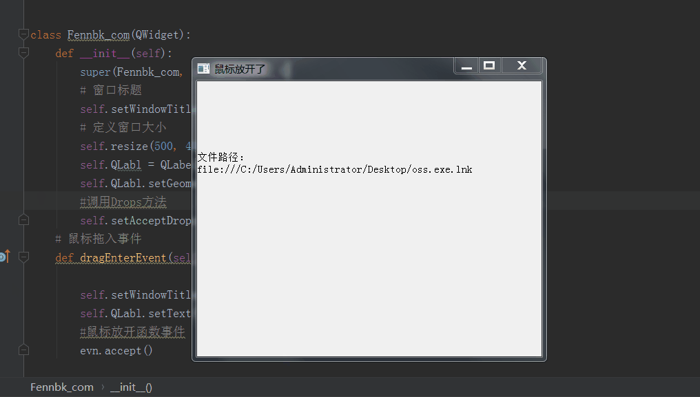

## Pyqt5 之 拖拽文件到窗口

### 属性：
setAcceptDrops()方法从QWidget继承而来，如果打算创建一个可以支持放下操作与支持拖动的窗口部件，只需要简单调用setAcceptDrops(True)并重新实现dragEnterEvent()、dragMoveEvent()、dropEvent()。

```python
#调用Drops方法
    self.setAcceptDrops(True)
# 鼠标拖入事件
    dragEnterEvent(self, evn):
# 鼠标放开执行
    dropEvent(self, evn):   
# 鼠标移入移出
    def dragMoveEvent(self,evn):
# 获取文件路径
    evn.mimeData().text()
```

### 一个小例子
**代码示例：**
```python
# 爱尚博客——fennbk.com
# By：Fenn
import sys
from PyQt5.QtWidgets import *
from PyQt5.QtCore import *
from PyQt5.QtGui import *
 
 
class Fennbk_com(QWidget):
    def __init__(self):
        super(Fennbk_com, self).__init__()
        # 窗口标题
        self.setWindowTitle('爱尚博客')
        # 定义窗口大小
        self.resize(500, 400)
        self.QLabl = QLabel(self)
        self.QLabl.setGeometry(0,100,4000,38)
        #调用Drops方法
        self.setAcceptDrops(True)
    # 鼠标拖入事件
    def dragEnterEvent(self, evn):
 
        self.setWindowTitle('鼠标拖入窗口了')
        self.QLabl.setText('文件路径：\n'+evn.mimeData().text())
        #鼠标放开函数事件
        evn.accept()
 
    # 鼠标放开执行
    def dropEvent(self, evn):
        self.setWindowTitle('鼠标放开了')
    def dragMoveEvent(self,evn):
        print('鼠标移入')
if __name__ == "__main__":
    app = QApplication(sys.argv)
    fennbk = Fennbk_com()
    fennbk.show()
    sys.exit(app.exec_())
```

**演示：**



