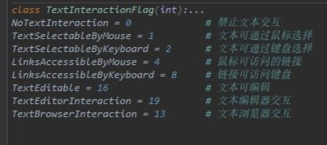

## PyQt5-QLabel 如何设置标签的文本交互形式
所谓的文本交互：包括文本的选择，编辑，鼠标点击等动作。

创建顶层窗口。标签子控件（QLabel）

设置文本的交互形式：

①使用 setTextInteractionFlags(Qt.TextInteractionFlags/Qt.TextInteractionFlag)方法来设置文本的交互形式。

②参数是 Qt.TextInteractionFlag  的枚举类型；

③查看TextInteractionFlag类的说明文档有所有标记。（如图）

默认情况下，标签文本是不能选中和修改的，那么就看看默认的文本交互形式：

①使用 textInteractionFlags()方法返回文本交互的标记对象。

②再使用对象的__int__()方法返回对象的数字代码。

③可以看到默认的交互标记的数字代码是4。

①数字代码4，即LinksAccessibleByMouse ，意思是可以通过鼠标接通连接。

②在标签文本内加入一句html文档，进行验证。

③可以看到鼠标的外形显示为可点击图标，此时设置setOpenExternalLinks(True)即可打开外部链接。

④由此看，默认情况下标签文本是不能被选中，不能编辑，但有外部链接时是可以打开时是可用的。

禁止文本交互；文本的一切交互动作被禁止：

setTextInteractionFlags(Qt.NoTextInteraction)

或参数Qt.TextInteractionFlag(0)

设置为可用鼠标选中：setTextInteractionFlags(Qt.TextSelectableByMouse)

可以看到。文本被选中后可使用右键菜单；

设置为键盘选中：setTextInteractionFlags(Qt.TextSelectableByKeyboard)

可使用方向键移动光标，shift+方向键选中,ctrl+c复制，等操作；

如要鼠标键盘均可操作，将上面两步参数按位或即可：

setTextInteractionFlags(Qt.TextSelectableByKeyboard | Qt.TextSelectableByMouse)

