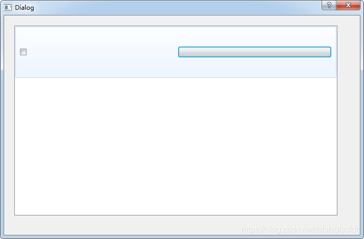
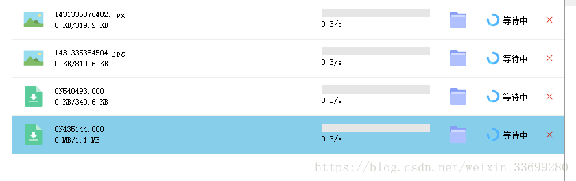

## QlistWidget自定义item

### QListWidgetItem自定义添加控件
最近在做一个小的项目，其中想使用qlistwidget实现自定义数据的显示，自定义行要求有图片列，文字列，按钮列等，于是研究了一下qlistwidget的使用。

要想实现上述要求，必须按如下顺序实现

1、这里重点是ui->listWidget->addItem(item);的使用，必须先将QListWidgetItem对象加入qlistwidget。
```c++
QListWidgetItem *item=new QListWidgetItem;
 
item->setSizeHint(QSize(10,100));
ui->listWidget->addItem(item);
```

2、定义完如上，接下来就是下面这个函数的使用

void QListWidget::setItemWidget(QListWidgetItem * item, QWidget * widget)

这个函数实际上是将QWidget对象与QListWidgetItem对象进行绑定，具体操作如下：
```c++
QWidget *w = new QWidget;
QHBoxLayout *layout=new QHBoxLayout;
QPushButton *pushButton=new QPushButton(w);
QCheckBox *checkBox=new QCheckBox(w);
layout->addWidget(checkBox);
layout->addWidget(pushButton);
w->setLayout(layout); 
ui->listWidget->setItemWidget(item,w);
```

基本效果如下，当然你也可以在ui界面设计QWidget对象，使其布局达到自己需求的样式。


### QlistWidget自定义item
```c++
QWidget *widget = new QWidget(ui.listWidget);
 
//创建自定义的item
widget->setStyleSheet("background:transparent;");
 
QLabel *TypeLabel = new QLabel(widget);
QPixmap myPix(qexeFullPath + QStringLiteral("/../res/DataBase/Common/") + GetFileType(filename) + ".png");
TypeLabel->setFixedSize(62, 32);
TypeLabel->setPixmap(myPix);
TypeLabel->setScaledContents(true);
TypeLabel->setStyleSheet("QLabel{padding-left:15px;padding-right:15px;}");
 
QWidget *frontArea = new QWidget(widget);
frontArea->setFixedHeight(32);
 
QLabel *TextLabel = new QLabel(frontArea);
TextLabel->setText(filename);
 
QLabel *TotalCopyLabel = new QLabel(frontArea);
TotalCopyLabel->setText("0 KB/0 KB");
 
QWidget *backArea = new QWidget(widget);
backArea->setFixedSize(158, 32);
 
QProgressBar *ProgressBar = new QProgressBar(backArea);
ProgressBar->setTextVisible(false);
ProgressBar->setFixedHeight(12);
ProgressBar->setStyleSheet("QProgressBar{ border:none; background:rgb(230, 230, 230); border-radius:0px; text-align:center; color:gray }\
                        QProgressBar::chunk{ background:rgb(71, 137, 250); border-radius:0px; }");
 
QLabel *SpeedLabel = new QLabel(backArea);
SpeedLabel->setText("0 B/s");
 
QPushButton *OpenFolderButton = new QPushButton(widget);
OpenFolderButton->setToolTip(QStringLiteral("打开文件夹"));
OpenFolderButton->setFixedSize(82, 32);
QIcon icon3(qexeFullPath + QStringLiteral("/../res/DataBase/Common/文件夹.png"));
OpenFolderButton->setIcon(icon3);
OpenFolderButton->setIconSize(QSize(24, 24));
OpenFolderButton->setProperty("index", QString::number(currentIndex));
OpenFolderButton->setStyleSheet("QPushButton{ margin-left:25px;margin-right:25px;border:none; color:white; background:none; }QPushButton:hover{color:#FFFFFF; background:qlineargradient(spread:pad, x1:0, y1:0, x2:1, y2:1, stop:0 rgba(255, 255, 255, 0% ), stop:1 rgba(200, 200, 200, 60% )); }\
                                                            QPushButton:pressed{ color:white; background:qlineargradient(spread:pad, x1:0, y1:0, x2:1, y2:1, stop:0 rgba(255, 255, 255, 0% ), stop:1 rgba(200, 200, 200, 80% )); }");
connect(OpenFolderButton, SIGNAL(clicked()), this, SLOT(OpenFolder()));
 
QLabel *TipIconLabel = new QLabel(widget);
QPixmap myPix2(qexeFullPath + QStringLiteral("/../res/DataBase/Common/等待.png"));
TipIconLabel->setFixedSize(25, 20);
TipIconLabel->setPixmap(myPix2);
TipIconLabel->setScaledContents(true);
TipIconLabel->setStyleSheet("QLabel{padding-left:0px;padding-right:5px;}");
 
QLabel *TipTextLabel = new QLabel(widget);
TipTextLabel->setText(QStringLiteral("等待中"));
TipTextLabel->setStyleSheet("QLabel{padding-left:0px;padding-right:0px;}");
TipTextLabel->setFixedWidth(55);
 
QPushButton *CloseButton = new QPushButton(widget);
CloseButton->setToolTip(QStringLiteral("取消下载"));
CloseButton->setFixedSize(34, 24);
QIcon icon4(qexeFullPath + QStringLiteral("/../res/DataBase/Common/关闭.png"));
CloseButton->setIcon(icon4);
CloseButton->setIconSize(QSize(12, 12));
CloseButton->setProperty("index", QString::number(currentIndex));
CloseButton->setStyleSheet("QPushButton{ margin-left:0px;margin-right:10px;border:none; color:white; background:none; }QPushButton:hover{color:#FFFFFF; background:qlineargradient(spread:pad, x1:0, y1:0, x2:1, y2:1, stop:0 rgba(255, 255, 255, 0% ), stop:1 rgba(200, 200, 200, 60% )); }\
                        QPushButton:pressed{ color:white; background:qlineargradient(spread:pad, x1:0, y1:0, x2:1, y2:1, stop:0 rgba(255, 255, 255, 0% ), stop:1 rgba(200, 200, 200, 80% )); }");
connect(CloseButton, SIGNAL(clicked()), this, SLOT(HideItem()));
 
QVBoxLayout *verLayout = new QVBoxLayout;
verLayout->setContentsMargins(0, 0, 0, 0);
verLayout->setMargin(0);
verLayout->setSpacing(0);
verLayout->addWidget(TextLabel);
verLayout->addWidget(TotalCopyLabel);
frontArea->setLayout(verLayout);
 
QVBoxLayout *verLayout2 = new QVBoxLayout;
verLayout2->setContentsMargins(0, 0, 0, 0);
verLayout2->setMargin(0);
verLayout2->setSpacing(0);
verLayout2->addWidget(ProgressBar);
verLayout2->addWidget(SpeedLabel);
backArea->setLayout(verLayout2);
 
QHBoxLayout *horLayout = new QHBoxLayout;
horLayout->setContentsMargins(0, 0, 0, 0);
horLayout->setMargin(0);
horLayout->setSpacing(0);
horLayout->addWidget(TypeLabel);
horLayout->addWidget(frontArea);
horLayout->addWidget(backArea);
horLayout->addWidget(OpenFolderButton);
horLayout->addWidget(TipIconLabel);
horLayout->addWidget(TipTextLabel);
horLayout->addWidget(CloseButton);
widget->setLayout(horLayout);
 
//将widget作为列表的item
QListWidgetItem *ITEM = new QListWidgetItem();
QSize size = ITEM->sizeHint();
ITEM->setSizeHint(QSize(size.width(), 56));
ui.listWidget->addItem(ITEM);
widget->setSizeIncrement(size.width(), 56);
ui.listWidget->setItemWidget(ITEM, widget);
```

效果：



