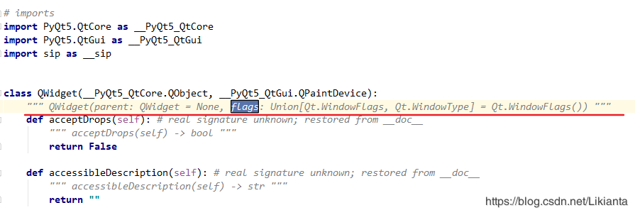

# 关于使用pyqt5出现 "parameter 'flags' unfilled" 的警告信息
`https://blog.csdn.net/Likianta/article/details/85959431`

出现警告的代码如下:
```python
import sys
from PyQt5.QtWidgets import QApplication, QWidget

if __name__ == '__main__':
    app = QApplication(sys.argv)

    w = QWidget()  # <-- 这里是出现黄色警告地方, 警告信息: "parameter 'flags' unfilled"
    w.resize(250, 150)
    w.move(300, 300)
    w.setWindowTitle('Simple')
    w.show()
    
    sys.exit(app.exec_())
```

虽然运行不会有问题, 但是作为有强迫症的人想要消除这个警告. 那么先找到它的原因.

按 ctrl + b 定位源码, 长这个样子:
```python
def __init__(self, parent=None, flags, Qt_WindowFlags=None, Qt_WindowType=None, *args, **kwargs): # real signature unknown; NOTE: unreliably restored from __doc__
    pass
```

从参数上来看, parent 是有默认参数的, flags 却没有, 很明显是 “错误” 的写法, pyqt 官方会出现这种错误吗?

从 <a href="https://stackoverflow.com/questions/40835014/pyqt5-non-default-parameter-after-default-parameter" rel="nofollow">这个回答</a> 来看, 这里的正确写法应该是:
```python
def __init__(self, parent:QWidget = None, flags:Union[Qt.WindowFlags, Qt.WindowType]=Qt.WindowFlags()):
    pass
```
也就是说初始化中只有 parent 和 flags 两个参数, 问题是出在这个注释上: `# real signature unknown; NOTE: unreliably restored from __doc__`

这个注释的作用是, 将从 `__doc__` 中恢复正常的传参. 在源码文件中也确实能够找到正确的写法:


也就是说, 官方的写法并没有错, 只是在运行时才会被正确地生成, 至少排除了官方失误这种低级问题. 反过来说就是 pycharm 在 “智能检测” 功能上做得还不够完善.

那么如何消除这个黄色警告, 就只好从 ide 上入手了.

方法1是设置本项目忽略这个错误情况 (好处是该屏蔽规则只在本项目有效, 坏处是如果本项目的其他地方, 特别是自己写的类如果忘了传参就只能等运行时报错了), 方法2是只忽略本行代码的报错, 即在这行前面加一个suppress:
```python
import sys
from PyQt5.QtWidgets import QApplication, QWidget

if __name__ == '__main__':
    app = QApplication(sys.argv)

    # 加一个suppress规则:
    # noinspection PyArgumentList
    w = QWidget()  # 这样这里的警告就消失了
    w.resize(250, 150)
    w.move(300, 300)
    w.setWindowTitle('Simple')
    w.show()
    
    sys.exit(app.exec_())
```


```python

```


