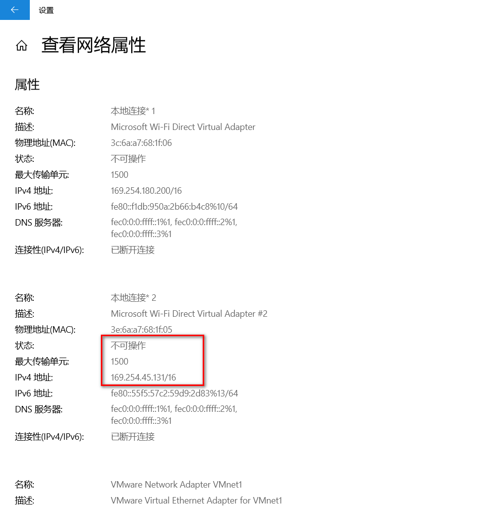
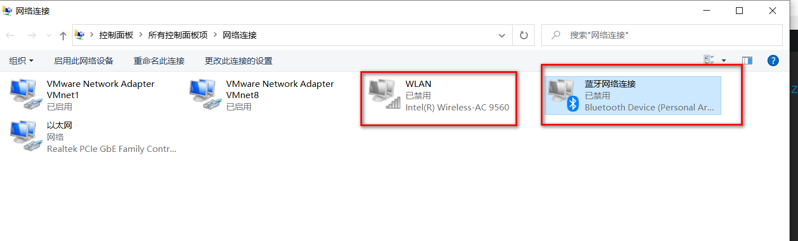

## Zeppelin的安装
Zeppelin具有很好的平台适应性，既可以部署在Linux上，多用于企业生产环境，也可以部署在Windows上，多用于学习研究。Windows上部署Zeppelin具有启停快速、联网方便等特点。

### 环境要求
jdk1.7以上，最好1.8

### 下载Zeppelin
到官网下载最新的安装包
https://zeppelin.apache.org/download.html


这里，有2种选择，其一，可以下载原文件，自行编译安装。其二，直接下载二进制文件进行安装。这里，为了方便，笔者直接使用二进制文件进行安装使用。这里有些参数需要进行配置，为了保证系统正常启动，确保的 zeppelin.server.port 属性的端口不被占用，默认是8080。

### 解压


这就好了，里面上门jar包都有

### 从命令行启动Apache Zeppelin
在所有unix类平台上：
```
bin/zeppelin-daemon.sh start
```

如果你在Windows上：
```
bin\zeppelin.cmd
```
Zeppelin成功启动后，使用Web浏览器访问http：// localhost：8080。

在所有unix类平台上停止：
```
bin/zeppelin-daemon.sh stop
```

### 在windows上启动Apache Zeppelin遇到的问题
运行zeppelin.cmd毫无反应


百度了一下，有人说Windows不支持单行过长命令，common.cmd中78行过长导致
解决方式：删除common.cmd中74-80行的以下内容


确实是这样，妈了个巴子的，不知道为啥什么都不提示，在注释的部分之前加上调试`echo 1`，只输出一个1，确实是这几行代码的原因，先注释了吧。

### 浏览器访问Apache Zeppelin
http://127.0.0.1:8080


Zeppelin参考：
https://cloud.tencent.com/developer/information/Zeppelin

### 启动安装的几个问题
用来测试flink，windows就不能用。

虚拟机是可以的，配合了flink_home就行了。

win10子系统也不行：访问flink的解释器的ip取的应该是某个访问不到的网卡：
```
INFO [2020-08-08 22:50:08,007] ({main} ZeppelinConfiguration.java[create]:173) - Server Host: 127.0.0.1
INFO [2020-08-08 22:50:08,007] ({main} ZeppelinConfiguration.java[create]:175) - Server Port: 8080
INFO [2020-08-08 22:50:08,007] ({main} ZeppelinConfiguration.java[create]:179) - Context Path: /
INFO [2020-08-08 22:50:08,011] ({main} ZeppelinConfiguration.java[create]:180) - Zeppelin Version: 0.9.0-preview2
INFO [2020-08-08 22:50:08,013] ({main} RemoteInterpreterServer.java[<init>]:170) - Starting remote interpreter server on port 0, intpEventServerAddress: 169.254.45.131:63172
INFO [2020-08-08 22:50:08,176] ({main} RemoteInterpreterServer.java[<init>]:194) - Launching ThriftServer at 169.254.45.131:63173
INFO [2020-08-08 22:50:08,190] ({Thread-2} RemoteInterpreterServer.java[run]:232) - Registering interpreter process
ERROR [2020-08-08 22:50:08,198] ({Thread-2} RemoteInterpreterServer.java[run]:236) - Error while registering interpreter: RegisterInfo(host:169.254.45.131, port:63173, interpreterGroupId:md-shared_process)
java.lang.RuntimeException: java.io.IOException: org.apache.zeppelin.shaded.org.apache.thrift.transport.TTransportException: java.net.SocketException: Network is unreachable (connect failed)
   at org.apache.zeppelin.interpreter.remote.PooledRemoteClient.callRemoteFunction(PooledRemoteClient.java:88)
   at org.apache.zeppelin.interpreter.remote.RemoteInterpreterEventClient.callRemoteFunction(RemoteInterpreterEventClient.java:80)
   at org.apache.zeppelin.interpreter.remote.RemoteInterpreterEventClient.registerInterpreterProcess(RemoteInterpreterEventClient.java:88)
   at org.apache.zeppelin.interpreter.remote.RemoteInterpreterServer$1.run(RemoteInterpreterServer.java:233)
   at java.lang.Thread.run(Thread.java:748)
Caused by: java.io.IOException: org.apache.zeppelin.shaded.org.apache.thrift.transport.TTransportException: java.net.SocketException: Network is unreachable (connect failed)
   at org.apache.zeppelin.interpreter.remote.RemoteInterpreterEventClient.lambda$new$0(RemoteInterpreterEventClient.java:72)
   at org.apache.zeppelin.interpreter.remote.RemoteClientFactory.create(RemoteClientFactory.java:54)
   at org.apache.zeppelin.interpreter.remote.RemoteClientFactory.create(RemoteClientFactory.java:34)
   at org.apache.zeppelin.shaded.org.apache.commons.pool2.BasePooledObjectFactory.makeObject(BasePooledObjectFactory.java:60)
   at org.apache.zeppelin.shaded.org.apache.commons.pool2.impl.GenericObjectPool.create(GenericObjectPool.java:861)
   at org.apache.zeppelin.shaded.org.apache.commons.pool2.impl.GenericObjectPool.borrowObject(GenericObjectPool.java:435)
   at org.apache.zeppelin.interpreter.remote.PooledRemoteClient.getClient(PooledRemoteClient.java:45)
   at org.apache.zeppelin.interpreter.remote.PooledRemoteClient.callRemoteFunction(PooledRemoteClient.java:80)
   ... 4 more
```


禁用了，就可以启动了。但还是有问题，任务卡在那了，估计Ubuntu子系统的问题。只能用虚拟机了现在。


### 访问其他电脑的Zeppelin
默认只能本机访问，这样虚拟机启动时没用的，

拷贝zeppelin-site.xml.template到zeppelin-site.xml，修改绑定的服务ip为：
```xml
<property>
  <name>zeppelin.server.addr</name>
  <value>0.0.0.0</value>
  <description>Server binding address</description>
</property>
```


