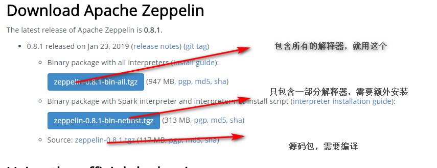

## Zeppelin的安装
Zeppelin具有很好的平台适应性，既可以部署在Linux上，多用于企业生产环境，也可以部署在Windows上，多用于学习研究。Windows上部署Zeppelin具有启停快速、联网方便等特点。

### 环境要求
jdk1.7以上，最好1.8

### 下载Zeppelin
到官网下载最新的安装包
https://zeppelin.apache.org/download.html


这里，有2种选择，其一，可以下载原文件，自行编译安装。其二，直接下载二进制文件进行安装。这里，为了方便，笔者直接使用二进制文件进行安装使用。这里有些参数需要进行配置，为了保证系统正常启动，确保的 zeppelin.server.port 属性的端口不被占用，默认是8080。

### 解压


这就好了，里面上门jar包都有

### 从命令行启动Apache Zeppelin
在所有unix类平台上：
```
bin/zeppelin-daemon.sh start
```

如果你在Windows上：
```
bin\zeppelin.cmd
```
Zeppelin成功启动后，使用Web浏览器访问http：// localhost：8080。

在所有unix类平台上停止：
```
bin/zeppelin-daemon.sh stop
```

### 在windows上启动Apache Zeppelin遇到的问题
运行zeppelin.cmd毫无反应


百度了一下，有人说Windows不支持单行过长命令，common.cmd中78行过长导致
解决方式：删除common.cmd中74-80行的以下内容


确实是这样，妈了个巴子的，不知道为啥什么都不提示，在注释的部分之前加上调试`echo 1`，只输出一个1，确实是这几行代码的原因，先注释了吧。

### 浏览器访问Apache Zeppelin
http://127.0.0.1:8080


Zeppelin参考：
https://cloud.tencent.com/developer/information/Zeppelin


