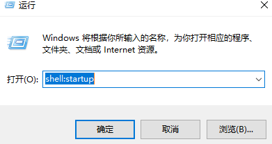
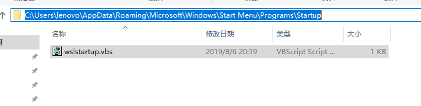

## 一、Win10 wsl linux子系统ssh服务自启动设置（摘抄自网络）
简略说一下方法：
```
Win10 wsl linux版本：Ubuntu 18.04
```

创建并编辑 /etc/init.wsl，加入如下内容：
```
#! /bin/sh
/etc/init.d/ssh $1
```

添加执行权限
```
sudo chmod +x /etc/init.wsl
```

编辑sudoers，避免输入密码
```
sudo visudo
```
or
```
sudo nano /etc/sudoers
```

添加一行
```
%sudo ALL=NOPASSWD: /etc/init.wsl
```

创建一个startservice.vbs脚本，内容为：
```
Set ws = WScript.CreateObject("WScript.Shell")
ws.run "ubuntu run sudo /etc/init.wsl start", vbhide
```

win10的开始-运行里面输入shell:startup打开启动文件夹，把startservice.vbs脚本放进去，重启系统，搞定。

评论：
```
zozo25117： 脚本直接运行不了，改成 ws.run "wsl sudo /etc/init.wsl start", vbhide就可以了。

楚石： 不用这么麻烦，直接： wsl -d ubuntu -u root /etc/init.d/ssh start

mrsonko： 有效果，不过有点问题， ws.run "ubuntu run sudo /etc/init.wsl start", vbhide 我用这行脚本运行有误，提示找不到文件，
改成ws.run "C:\Windows\System32\bash.exe -c 'sudo /etc/init.wsl",0可以了
```

## 二、Windows10 开机自启动 Linux 子系统和 ssh 服务（摘抄自网络）
win10 中的 Linux 子系统默认无法开机自启动，并且 ssh 服务也需要每次启动 bash 后手动启动，这里使用两个脚本来让 Linux 子系统在系统启动时也自行启动，并且将 ssh 服务打开。

### win10 配置
创建一个批处理脚本wslstartup.bat，写入如下内容：
```sh
powershell.exe -WindowStyle Hidden -c "bash /init.sh "
```

这里表示隐藏窗口启动 Linux 子系统，并执行/init.shshell 脚本。 
 
打开运行，输入shell:startup回车，打开 windows 启动文件夹，将创建的批处理脚本移动进去。  

### Linux 子系统配置
在根目录创建init.shshell 脚本，写入以下内容：
```sh
#!/bin/bash
pn=$(ps aux | grep -v grep |grep sshd|wc -l)
if [ "${pn}" != "0" ]; then
    pid=$(ps aux|grep -v grep|grep /usr/sbin/sshd|awk '{print $2}')
    echo "123456" | sudo -S kill $pid
fi
echo "123456" | sudo -S /usr/sbin/service ssh start
```

其中echo的内容为默认登陆用户的登陆密码。

更改脚本权限，和更改属主和属组为默认用户：
```
# chmod 755 /init.sh
# chown user:user /init.sh
```

配置完成后，下次开机就可以自启动 Linux 子系统，并且将 ssh 服务启动，我们就可以在 xshell 等软件中登陆子系统了。

## 三、Win10 wsl linux子系统ssh服务自启动设置（自己的实现）
**win10脚本**
```
Set ws = WScript.CreateObject("WScript.Shell")
ws.run "wsl -d ubuntu -u hadoop sh ~/init_sh/start_ssh.sh", vbhide
```

**linux脚本**
```sh
#!/bin/bash
echo "123456" | sudo -S /etc/init.d/ssh start
```

**win10脚本放入启动文件夹**

打开运行，输入**shell:startup**回车，打开 windows 启动文件夹，将创建的批处理脚本移动进去。  


C:\Users\lenovo\AppData\Roaming\Microsoft\Windows\Start Menu\Programs\Startup


